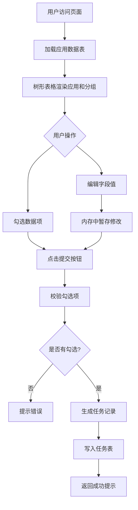
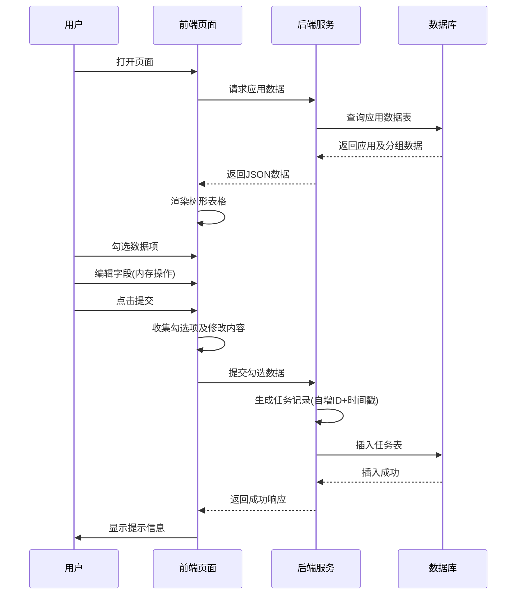
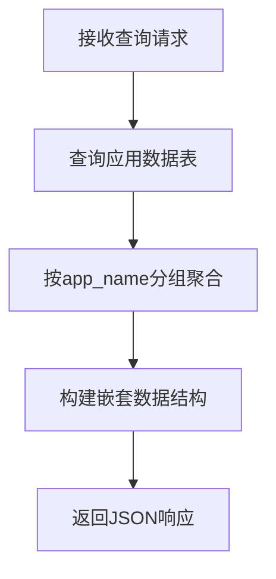
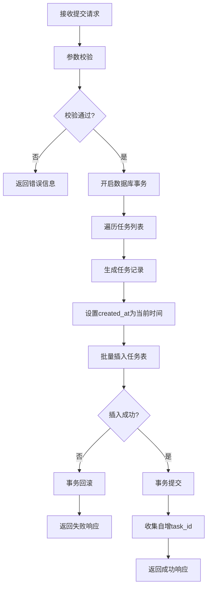
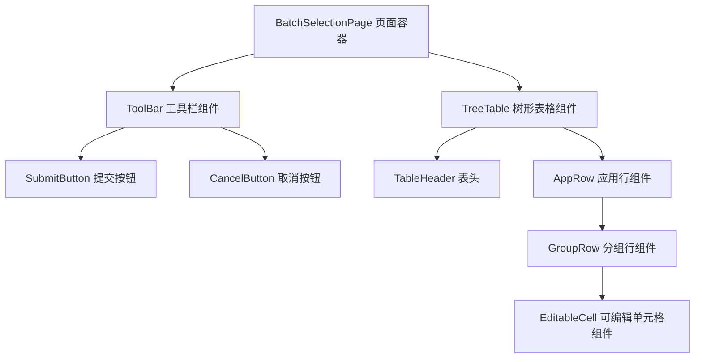

# 批量勾选信息页面设计文档

## 一、功能概述

构建一个支持批量勾选和编辑的信息管理页面，以树形表格形式展示应用及其下属分组信息。用户可勾选所需数据项并进行编辑，点击提交后将选中的数据写入任务表。

## 二、核心业务流程

### 2.1 整体流程



### 2.2 数据流转



## 三、数据模型设计

### 3.1 应用数据表 (app_info)

存储应用及分组的基础信息。

| 字段名称 | 数据类型 | 必填 | 说明 | 示例值 |
|---------|---------|------|------|--------|
| id | 整数 | 是 | 主键，自增 | 1 |
| app_name | 字符串(64) | 是 | 应用名称 | app1 |
| group_name | 字符串(64) | 是 | 分组名称 | group1 |
| gray_group_name | 字符串(64) | 否 | 灰度分组名称 | gray-group1 |
| idc | 字符串(32) | 是 | 机房 | 固安 |
| zone | 字符串(32) | 是 | 分区 | zone-a |
| spec | 字符串(64) | 是 | 参数规格 | 4C8G |
| disk_size | 整数 | 是 | 硬盘大小(GB) | 100 |
| pod_count | 整数 | 是 | Pod数量 | 5 |
| created_at | 时间戳 | 是 | 创建时间 | 2024-01-01 10:00:00 |
| updated_at | 时间戳 | 是 | 更新时间 | 2024-01-15 14:30:00 |

**索引设计**：
- 主键索引：id
- 联合索引：(app_name, group_name) - 用于按应用分组查询

### 3.2 任务表 (task_info)

存储用户提交的勾选任务数据。

| 字段名称 | 数据类型 | 必填 | 说明 | 示例值 |
|---------|---------|------|------|--------|
| task_id | 整数 | 是 | 主键，自增 | 1001 |
| app_name | 字符串(64) | 是 | 应用名称 | app1 |
| group_name | 字符串(64) | 是 | 分组名称 | group1 |
| gray_group_name | 字符串(64) | 否 | 灰度分组名称 | gray-group1 |
| idc | 字符串(32) | 是 | 机房 | 固安 |
| zone | 字符串(32) | 是 | 分区 | zone-a |
| spec | 字符串(64) | 是 | 参数规格 | 4C8G |
| disk_size | 整数 | 是 | 硬盘大小(GB) | 100 |
| pod_count | 整数 | 是 | Pod数量 | 5 |
| created_at | 时间戳 | 是 | 任务创建时间(提交时间) | 2024-01-16 09:20:15 |

**索引设计**：
- 主键索引：task_id
- 普通索引：created_at - 用于按时间查询任务

**说明**：
- task_id 为自增主键，由数据库自动生成
- created_at 在插入时自动记录当前时间戳
- 任务表中的字段值来源于用户勾选并可能修改过的数据

## 四、页面结构设计

### 4.1 页面布局

```mermaid
graph TB
    subgraph 页面容器
        A[标题栏: 批量勾选信息管理]
        B[操作栏: 提交按钮 | 取消按钮]
        C[树形表格区域]
    end
    
    C --> D[表头行]
    C --> E[数据行区域]
    
    E --> F[应用行 - 可展开/折叠]
    F --> G[分组行1 - 可勾选/编辑]
    F --> H[分组行2 - 可勾选/编辑]
    F --> I[分组行N - 可勾选/编辑]
```

### 4.2 树形表格列定义

| 列名 | 宽度权重 | 是否可编辑 | 说明 |
|------|---------|-----------|------|
| 勾选框 | 固定60px | - | 应用级复选框(全选子分组)、分组级复选框 |
| 应用名 | 1 | 否 | 应用行显示，分组行为空或缩进显示 |
| 分组名 | 1 | 是 | 分组行可编辑 |
| 灰度分组名 | 1 | 是 | 分组行可编辑 |
| 机房 | 0.8 | 是 | 分组行可编辑 |
| 分区 | 0.8 | 是 | 分组行可编辑 |
| 参数规格 | 1 | 是 | 分组行可编辑 |
| 硬盘大小(GB) | 1 | 是 | 分组行可编辑，仅允许数字 |
| Pod数量 | 0.8 | 是 | 分组行可编辑，仅允许整数 |

### 4.3 交互行为

#### 4.3.1 勾选行为

- **应用级勾选**：勾选应用行时，自动勾选该应用下所有分组；取消勾选应用时，取消所有子分组勾选
- **分组级勾选**：可单独勾选或取消分组；当所有分组被勾选时，应用级复选框显示为全选状态；部分勾选时显示为半选状态
- **勾选状态持久化**：勾选状态仅保存在前端内存中，刷新页面后重置

#### 4.3.2 编辑行为

- **触发方式**：双击单元格或点击编辑图标进入编辑模式
- **输入验证**：
  - 硬盘大小：仅允许正整数
  - Pod数量：仅允许正整数
  - 其他字段：允许字母、数字、中文、短横线
- **保存时机**：失焦或按回车键时保存到前端内存，不立即提交到后端
- **取消编辑**：按ESC键取消编辑，恢复原始值

#### 4.3.3 提交行为

- **前置校验**：
  - 必须至少勾选一个分组
  - 所有勾选项的必填字段不能为空
  - 数值字段必须符合格式要求
- **提交内容**：收集所有勾选的分组数据(包括用户修改后的值)
- **成功后处理**：显示成功提示，可选择清空勾选状态或保持当前状态

## 五、API 接口设计

### 5.1 查询应用数据接口

**接口路径**：GET /api/applications

**请求参数**：无

**响应数据结构**：

| 字段路径 | 类型 | 说明 |
|---------|------|------|
| code | 整数 | 状态码，200表示成功 |
| message | 字符串 | 响应消息 |
| data | 数组 | 应用列表 |
| data[].appName | 字符串 | 应用名称 |
| data[].groups | 数组 | 该应用下的分组列表 |
| data[].groups[].id | 整数 | 分组记录ID |
| data[].groups[].groupName | 字符串 | 分组名称 |
| data[].groups[].grayGroupName | 字符串 | 灰度分组名称 |
| data[].groups[].idc | 字符串 | 机房 |
| data[].groups[].zone | 字符串 | 分区 |
| data[].groups[].spec | 字符串 | 参数规格 |
| data[].groups[].diskSize | 整数 | 硬盘大小 |
| data[].groups[].podCount | 整数 | Pod数量 |

**响应示例结构**：
```
应用列表
└─ 应用对象
   ├─ appName: "app1"
   └─ groups: [分组对象列表]
      └─ 分组对象
         ├─ id: 1
         ├─ groupName: "group1"
         ├─ grayGroupName: "gray-group1"
         ├─ idc: "固安"
         ├─ zone: "zone-a"
         ├─ spec: "4C8G"
         ├─ diskSize: 100
         └─ podCount: 5
```

### 5.2 提交任务接口

**接口路径**：POST /api/tasks/submit

**请求参数**：

| 字段路径 | 类型 | 必填 | 说明 |
|---------|------|------|------|
| tasks | 数组 | 是 | 任务数据列表 |
| tasks[].appName | 字符串 | 是 | 应用名称 |
| tasks[].groupName | 字符串 | 是 | 分组名称 |
| tasks[].grayGroupName | 字符串 | 否 | 灰度分组名称 |
| tasks[].idc | 字符串 | 是 | 机房 |
| tasks[].zone | 字符串 | 是 | 分区 |
| tasks[].spec | 字符串 | 是 | 参数规格 |
| tasks[].diskSize | 整数 | 是 | 硬盘大小 |
| tasks[].podCount | 整数 | 是 | Pod数量 |

**响应数据结构**：

| 字段路径 | 类型 | 说明 |
|---------|------|------|
| code | 整数 | 状态码，200表示成功 |
| message | 字符串 | 响应消息 |
| data | 对象 | 响应数据 |
| data.taskIds | 数组 | 生成的任务ID列表 |
| data.count | 整数 | 成功创建的任务数量 |

## 六、后端业务逻辑设计

### 6.1 查询应用数据逻辑



**处理步骤**：
1. 从应用数据表查询所有记录
2. 按 app_name 字段分组
3. 将每个应用下的记录组织为 groups 数组
4. 返回包含应用和分组层级的JSON数据

### 6.2 提交任务逻辑



**处理步骤**：
1. 校验请求参数(非空、数据类型、数值范围)
2. 开启数据库事务
3. 遍历tasks数组，为每条记录：
   - 设置 created_at 为服务器当前时间
   - task_id 由数据库自增生成
4. 批量插入任务表
5. 提交事务，返回生成的任务ID列表

**异常处理**：
- 参数校验失败：返回400错误，提示具体校验失败字段
- 数据库插入失败：回滚事务，返回500错误
- 空任务列表：返回400错误，提示至少需要一条任务数据

## 七、前端技术方案

### 7.1 技术选型

- **前端框架**：React
- **UI组件库**：支持树形表格的组件库(如 Ant Design Table 或 Element UI Table)
- **状态管理**：React Hooks (useState, useEffect)
- **HTTP客户端**：Axios

### 7.2 组件结构



### 7.3 状态管理

**页面级状态**：

| 状态变量 | 类型 | 说明 |
|---------|------|------|
| treeData | 数组 | 树形表格数据源 |
| selectedKeys | 集合 | 已勾选的分组ID集合 |
| editedData | 映射 | 记录被编辑过的字段值，键为分组ID |
| loading | 布尔值 | 加载状态 |
| submitting | 布尔值 | 提交中状态 |

**数据流转**：
1. 页面加载时调用查询接口，更新 treeData
2. 用户勾选时更新 selectedKeys
3. 用户编辑时更新 editedData
4. 提交时合并 treeData 和 editedData，过滤出 selectedKeys 对应的记录

## 八、非功能性需求

### 8.1 性能要求

- 页面初始加载时间不超过2秒
- 单次提交支持最多1000条任务记录
- 树形表格渲染优化：虚拟滚动(数据超过100行时)

### 8.2 用户体验

- 提交按钮在无勾选项时置灰不可点击
- 提交过程中显示加载动画，按钮禁用防止重复提交
- 提交成功后显示明确的成功提示，包含任务数量
- 编辑时高亮当前编辑的单元格

### 8.3 数据一致性

- 提交操作使用数据库事务保证原子性
- 前端显示的数据不会自动同步到应用数据表
- 任务表中的数据为用户提交时的快照

### 8.4 安全性

- 后端需对输入参数进行严格校验和过滤
- 防止SQL注入：使用参数化查询
- 限制单次提交的任务数量，防止恶意请求

## 九、扩展性考虑

### 9.1 预留扩展点

- 支持导出勾选的数据为Excel文件
- 支持从Excel批量导入数据到应用数据表
- 支持查询历史提交的任务记录
- 支持任务状态跟踪(待执行、执行中、已完成)

### 9.2 权限控制预留

- 查询接口可扩展为按用户权限过滤应用列表
- 提交接口可增加用户身份验证和操作日志记录- 查询接口可扩展为按用户权限过滤应用列表
