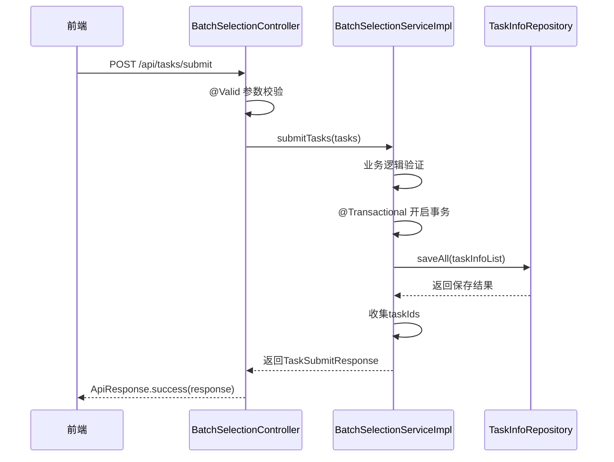

# 提交任务接口

<cite>
**Referenced Files in This Document**   
- [BatchSelectionController.java](file://backend/src/main/java/com/example/batchselection/controller/BatchSelectionController.java)
- [BatchTaskSubmitRequest.java](file://backend/src/main/java/com/example/batchselection/dto/BatchTaskSubmitRequest.java)
- [TaskSubmitDTO.java](file://backend/src/main/java/com/example/batchselection/dto/TaskSubmitDTO.java)
- [BatchSelectionServiceImpl.java](file://backend/src/main/java/com/example/batchselection/service/impl/BatchSelectionServiceImpl.java)
- [TaskSubmitResponse.java](file://backend/src/main/java/com/example/batchselection/dto/TaskSubmitResponse.java)
- [ApiResponse.java](file://backend/src/main/java/com/example/batchselection/dto/ApiResponse.java)
- [index.js](file://frontend/src/api/index.js)
</cite>

## 目录
1. [接口概述](#接口概述)
2. [请求详情](#请求详情)
3. [响应说明](#响应说明)
4. [参数校验规则](#参数校验规则)
5. [后端实现](#后端实现)
6. [前端调用](#前端调用)
7. [示例](#示例)

## 接口概述

POST /api/tasks/submit 接口用于批量提交用户勾选的任务数据。该接口采用标准的RESTful设计，通过JSON格式传输数据，确保了良好的跨平台兼容性和可读性。

**Section sources**
- [BatchSelectionController.java](file://backend/src/main/java/com/example/batchselection/controller/BatchSelectionController.java#L45-L62)

## 请求详情

### 基本信息
- **HTTP方法**: POST
- **接口路径**: /api/tasks/submit
- **Content-Type**: application/json
- **认证要求**: 无（当前配置允许跨域访问）

### 请求体结构

请求体为 `BatchTaskSubmitRequest` 对象，包含一个任务列表。

```json
{
  "tasks": [
    {
      "appName": "string",
      "groupName": "string",
      "grayGroupName": "string",
      "idc": "string",
      "zone": "string",
      "spec": "string",
      "diskSize": 0,
      "podCount": 0
    }
  ]
}
```

**Section sources**
- [BatchTaskSubmitRequest.java](file://backend/src/main/java/com/example/batchselection/dto/BatchTaskSubmitRequest.java#L7-L16)
- [TaskSubmitDTO.java](file://backend/src/main/java/com/example/batchselection/dto/TaskSubmitDTO.java#L7-L37)

## 响应说明

### 成功响应
- **HTTP状态码**: 200 OK
- **响应体**: 包含任务提交结果的 `ApiResponse` 对象

```json
{
  "code": 200,
  "message": "success",
  "data": {
    "taskIds": [1, 2, 3],
    "count": 3
  }
}
```

### 失败响应
- **参数错误**: 400 Bad Request
- **服务器错误**: 500 Internal Server Error

```json
{
  "code": 400,
  "message": "任务列表不能为空",
  "data": null
}
```

**Section sources**
- [ApiResponse.java](file://backend/src/main/java/com/example/batchselection/dto/ApiResponse.java#L6-L33)
- [TaskSubmitResponse.java](file://backend/src/main/java/com/example/batchselection/dto/TaskSubmitResponse.java#L7-L17)

## 参数校验规则

### 批量请求对象 (BatchTaskSubmitRequest)
- **tasks**: 任务列表，不能为空
  - 最小长度: 1
  - 校验注解: `@NotEmpty`

### 单个任务对象 (TaskSubmitDTO)
- **appName**: 应用名称
  - 数据类型: string
  - 是否必填: 是
  - 校验规则: `@NotBlank`
- **groupName**: 分组名称
  - 数据类型: string
  - 是否必填: 是
  - 校验规则: `@NotBlank`
- **grayGroupName**: 灰度分组名称
  - 数据类型: string
  - 是否必填: 否
- **idc**: 机房
  - 数据类型: string
  - 是否必填: 是
  - 校验规则: `@NotBlank`
- **zone**: 分区
  - 数据类型: string
  - 是否必填: 是
  - 校验规则: `@NotBlank`
- **spec**: 参数规格
  - 数据类型: string
  - 是否必填: 是
  - 校验规则: `@NotBlank`
- **diskSize**: 硬盘大小
  - 数据类型: integer
  - 是否必填: 是
  - 校验规则: `@NotNull` 且 `@Positive`（必须为正整数）
- **podCount**: Pod数量
  - 数据类型: integer
  - 是否必填: 是
  - 校验规则: `@NotNull` 且 `@Positive`（必须为正整数）

**Section sources**
- [TaskSubmitDTO.java](file://backend/src/main/java/com/example/batchselection/dto/TaskSubmitDTO.java#L14-L37)
- [BatchTaskSubmitRequest.java](file://backend/src/main/java/com/example/batchselection/dto/BatchTaskSubmitRequest.java#L14-L16)

## 后端实现

### 控制器层
`BatchSelectionController` 中的 `submitTasks` 方法处理POST请求，使用 `@Valid` 注解触发参数校验，并调用服务层处理业务逻辑。

### 服务层
`BatchSelectionServiceImpl` 实现了事务性写入，确保数据一致性：
- 使用 `@Transactional` 注解保证事务完整性
- 单次提交限制为1000条任务
- 将DTO对象转换为实体对象后批量保存
- 返回包含生成任务ID列表的响应



**Diagram sources**
- [BatchSelectionController.java](file://backend/src/main/java/com/example/batchselection/controller/BatchSelectionController.java#L45-L62)
- [BatchSelectionServiceImpl.java](file://backend/src/main/java/com/example/batchselection/service/impl/BatchSelectionServiceImpl.java#L64-L93)

**Section sources**
- [BatchSelectionServiceImpl.java](file://backend/src/main/java/com/example/batchselection/service/impl/BatchSelectionServiceImpl.java#L22-L126)

## 前端调用

前端通过 `api/index.js` 中封装的 `submitTasks` 函数调用该接口：

```javascript
import { submitTasks } from '@/api/index.js';

// 调用示例
const tasks = [
  {
    appName: '应用1',
    groupName: '分组A',
    idc: '机房1',
    zone: '分区1',
    spec: '规格1',
    diskSize: 100,
    podCount: 3
  }
];

submitTasks(tasks)
  .then(response => {
    console.log('任务提交成功:', response);
  })
  .catch(error => {
    console.error('任务提交失败:', error);
  });
```

**Section sources**
- [index.js](file://frontend/src/api/index.js#L28-L34)

## 示例

### 完整请求示例
```json
POST /api/tasks/submit HTTP/1.1
Content-Type: application/json

{
  "tasks": [
    {
      "appName": "订单服务",
      "groupName": "生产组",
      "grayGroupName": "灰度组1",
      "idc": "北京机房",
      "zone": "可用区A",
      "spec": "medium",
      "diskSize": 200,
      "podCount": 5
    },
    {
      "appName": "用户服务",
      "groupName": "测试组",
      "idc": "上海机房",
      "zone": "可用区B",
      "spec": "small",
      "diskSize": 100,
      "podCount": 3
    }
  ]
}
```

### 成功响应示例
```json
{
  "code": 200,
  "message": "任务提交成功",
  "data": {
    "taskIds": [1001, 1002],
    "count": 2
  }
}
```

### 错误响应示例
```json
{
  "code": 400,
  "message": "任务列表不能为空",
  "data": null
}
```

**Section sources**
- [BatchSelectionController.java](file://backend/src/main/java/com/example/batchselection/controller/BatchSelectionController.java#L45-L62)
- [BatchSelectionServiceImpl.java](file://backend/src/main/java/com/example/batchselection/service/impl/BatchSelectionServiceImpl.java#L64-L93)
- [ApiResponse.java](file://backend/src/main/java/com/example/batchselection/dto/ApiResponse.java#L6-L33)