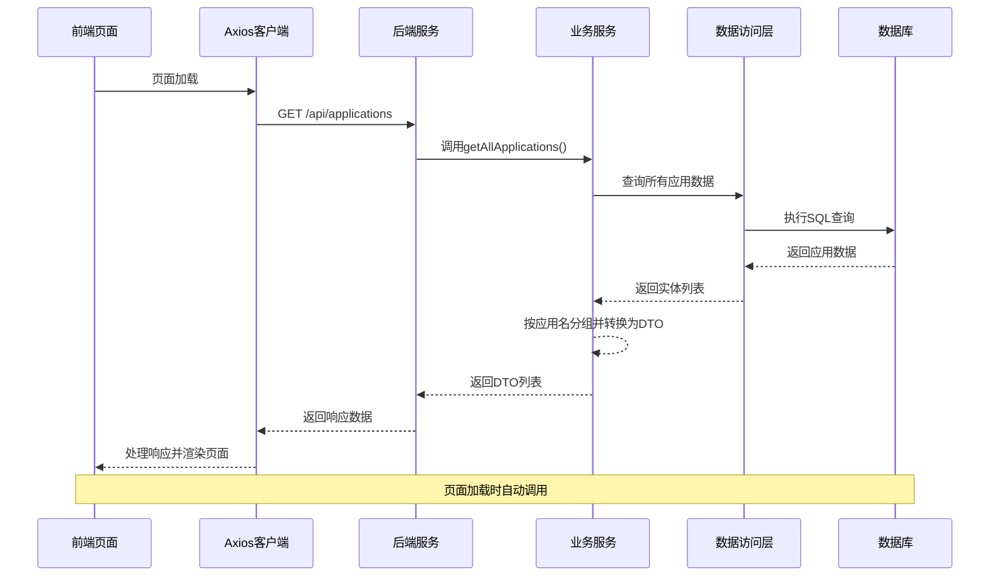
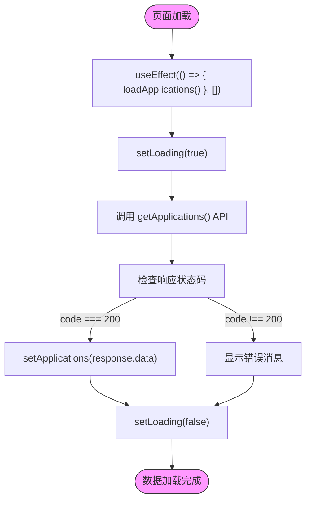
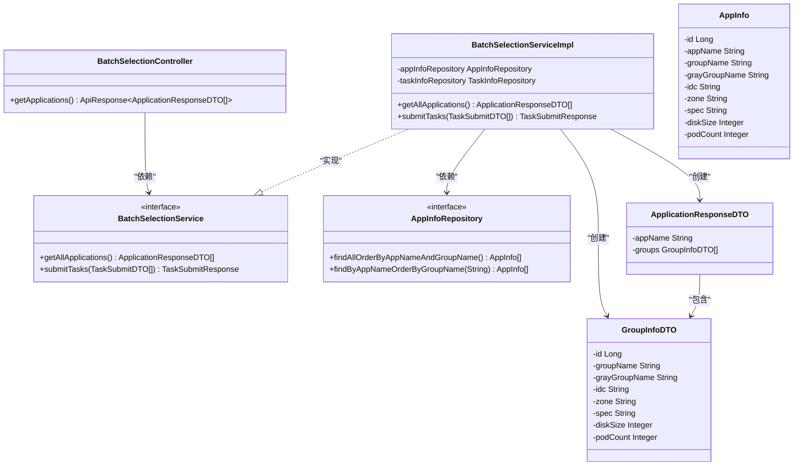
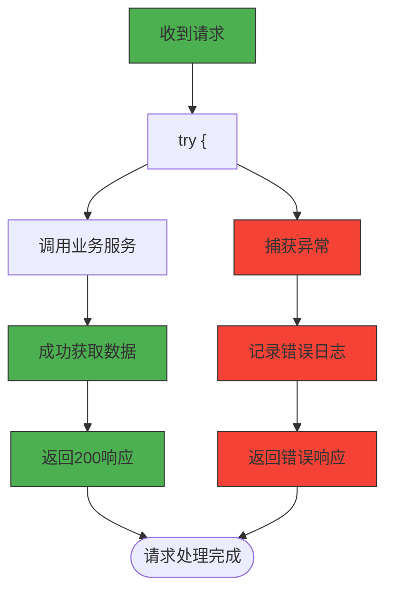
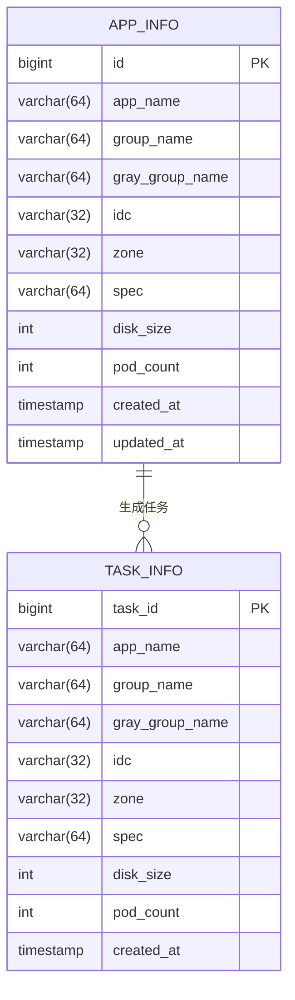

# 查询应用数据接口

<cite>
**Referenced Files in This Document**   
- [BatchSelectionController.java](file://backend/src/main/java/com/example/batchselection/controller/BatchSelectionController.java)
- [ApplicationResponseDTO.java](file://backend/src/main/java/com/example/batchselection/dto/ApplicationResponseDTO.java)
- [BatchSelectionPage.jsx](file://frontend/src/components/BatchSelectionPage.jsx)
- [index.js](file://frontend/src/api/index.js)
- [schema.sql](file://backend/src/main/resources/schema.sql)
- [test-data.sql](file://backend/src/main/resources/test-data.sql)
- [BatchSelectionServiceImpl.java](file://backend/src/main/java/com/example/batchselection/service/impl/BatchSelectionServiceImpl.java)
- [AppInfoRepository.java](file://backend/src/main/java/com/example/batchselection/repository/AppInfoRepository.java)
</cite>

## 目录
1. [接口概述](#接口概述)
2. [接口详细说明](#接口详细说明)
3. [响应数据结构](#响应数据结构)
4. [前端调用流程](#前端调用流程)
5. [后端实现逻辑](#后端实现逻辑)
6. [错误处理机制](#错误处理机制)
7. [常见问题排查](#常见问题排查)
8. [数据初始化](#数据初始化)

## 接口概述

`GET /api/applications` 接口用于获取应用及分组的树形结构数据，是批量勾选信息管理页面的核心数据接口。该接口在页面加载时由前端自动调用，返回所有应用及其分组信息的嵌套结构。

**Section sources**
- [BatchSelectionController.java](file://backend/src/main/java/com/example/batchselection/controller/BatchSelectionController.java#L32-L42)
- [BatchSelectionPage.jsx](file://frontend/src/components/BatchSelectionPage.jsx#L24-L37)

## 接口详细说明

### 基本信息
- **HTTP方法**: GET
- **请求路径**: `/api/applications`
- **请求参数**: 无
- **成功状态码**: 200
- **跨域支持**: 通过 `@CrossOrigin(origins = "*")` 注解支持跨域访问

### 功能描述
该接口查询数据库中的所有应用数据，按应用名称分组，并返回包含应用名称和其下分组列表的树形结构数据。接口设计为幂等操作，每次调用都会返回当前数据库中的完整数据集。



**Diagram sources**
- [BatchSelectionController.java](file://backend/src/main/java/com/example/batchselection/controller/BatchSelectionController.java#L32-L42)
- [BatchSelectionServiceImpl.java](file://backend/src/main/java/com/example/batchselection/service/impl/BatchSelectionServiceImpl.java#L34-L62)
- [AppInfoRepository.java](file://backend/src/main/java/com/example/batchselection/repository/AppInfoRepository.java#L18-L19)

**Section sources**
- [BatchSelectionController.java](file://backend/src/main/java/com/example/batchselection/controller/BatchSelectionController.java#L15-L24)
- [BatchSelectionServiceImpl.java](file://backend/src/main/java/com/example/batchselection/service/impl/BatchSelectionServiceImpl.java#L22-L33)

## 响应数据结构

### 响应体格式
响应体为 `ApiResponse<List<ApplicationResponseDTO>>` 对象，其中 `ApiResponse` 是统一的响应包装类，`ApplicationResponseDTO` 是应用响应数据传输对象。

#### ApplicationResponseDTO 结构
```java
@Data
public class ApplicationResponseDTO {
    private String appName;
    private List<GroupInfoDTO> groups;
}
```

#### GroupInfoDTO 结构
```java
@Data
public class GroupInfoDTO {
    private Long id;
    private String groupName;
    private String grayGroupName;
    private String idc;
    private String zone;
    private String spec;
    private Integer diskSize;
    private Integer podCount;
}
```

### 实际返回JSON示例
```json
{
  "code": 200,
  "message": "success",
  "data": [
    {
      "appName": "app1",
      "groups": [
        {
          "id": 1,
          "groupName": "group1",
          "grayGroupName": "gray-group1",
          "idc": "固安",
          "zone": "zone-a",
          "spec": "4C8G",
          "diskSize": 100,
          "podCount": 5
        },
        {
          "id": 2,
          "groupName": "group2",
          "grayGroupName": "gray-group2",
          "idc": "固安",
          "zone": "zone-b",
          "spec": "8C16G",
          "diskSize": 200,
          "podCount": 10
        }
      ]
    },
    {
      "appName": "app2",
      "groups": [
        {
          "id": 4,
          "groupName": "group1",
          "grayGroupName": "gray-group1",
          "idc": "上海",
          "zone": "zone-a",
          "spec": "2C4G",
          "diskSize": 80,
          "podCount": 3
        }
      ]
    }
  ]
}
```

**Section sources**
- [ApplicationResponseDTO.java](file://backend/src/main/java/com/example/batchselection/dto/ApplicationResponseDTO.java#L9-L13)
- [GroupInfoDTO.java](file://backend/src/main/java/com/example/batchselection/dto/GroupInfoDTO.java#L7-L18)

## 前端调用流程

### 调用时机
该接口在 `BatchSelectionPage.jsx` 组件的 `useEffect` 钩子中被调用，确保页面加载时自动获取最新数据。



**Diagram sources**
- [BatchSelectionPage.jsx](file://frontend/src/components/BatchSelectionPage.jsx#L20-L37)
- [index.js](file://frontend/src/api/index.js#L24-L26)

**Section sources**
- [BatchSelectionPage.jsx](file://frontend/src/components/BatchSelectionPage.jsx#L20-L37)
- [index.js](file://frontend/src/api/index.js#L21-L26)

## 后端实现逻辑

### 控制层实现
`BatchSelectionController` 中的 `getApplications()` 方法处理HTTP请求，调用服务层获取数据，并通过 `ApiResponse` 包装返回结果。

### 服务层实现
`BatchSelectionServiceImpl` 的 `getAllApplications()` 方法实现核心业务逻辑：
1. 调用 `AppInfoRepository.findAllOrderByAppNameAndGroupName()` 查询所有应用数据
2. 按应用名称分组
3. 将 `AppInfo` 实体转换为 `ApplicationResponseDTO` 和 `GroupInfoDTO` DTO对象
4. 返回树形结构数据

### 数据访问层实现
`AppInfoRepository` 使用JPA定义数据访问接口，通过自定义JPQL查询按应用名和分组名排序获取数据。



**Diagram sources**
- [BatchSelectionController.java](file://backend/src/main/java/com/example/batchselection/controller/BatchSelectionController.java#L15-L27)
- [BatchSelectionService.java](file://backend/src/main/java/com/example/batchselection/service/BatchSelectionService.java#L7-L24)
- [BatchSelectionServiceImpl.java](file://backend/src/main/java/com/example/batchselection/service/impl/BatchSelectionServiceImpl.java#L22-L32)
- [AppInfoRepository.java](file://backend/src/main/java/com/example/batchselection/repository/AppInfoRepository.java#L12-L13)
- [ApplicationResponseDTO.java](file://backend/src/main/java/com/example/batchselection/dto/ApplicationResponseDTO.java#L10-L13)
- [GroupInfoDTO.java](file://backend/src/main/java/com/example/batchselection/dto/GroupInfoDTO.java#L7-L18)
- [AppInfo.java](file://backend/src/main/java/com/example/batchselection/entity/AppInfo.java)

**Section sources**
- [BatchSelectionServiceImpl.java](file://backend/src/main/java/com/example/batchselection/service/impl/BatchSelectionServiceImpl.java#L34-L62)
- [AppInfoRepository.java](file://backend/src/main/java/com/example/batchselection/repository/AppInfoRepository.java#L18-L19)

## 错误处理机制

### 异常处理策略
接口实现了全面的异常处理机制，确保系统稳定性和用户体验：



### 具体错误处理
- **正常情况**: 返回状态码200，包含数据的响应体
- **服务异常**: 捕获所有异常，记录错误日志，并返回状态码500的错误响应
- **日志记录**: 使用 `log.info()` 记录正常请求，`log.error()` 记录异常情况

**Section sources**
- [BatchSelectionController.java](file://backend/src/main/java/com/example/batchselection/controller/BatchSelectionController.java#L35-L41)

## 常见问题排查

### 数据未正确加载
当页面数据未正确加载时，可按以下路径排查：

1. **前端检查**
   - 确认浏览器控制台是否有网络错误
   - 检查API请求是否发送成功
   - 验证响应数据格式是否正确

2. **后端检查**
   - 检查后端服务是否正常运行
   - 查看日志文件中的错误信息
   - 验证数据库连接是否正常

3. **数据库检查**
   - 确认数据库服务是否启动
   - 检查 `batch_selection` 数据库是否存在
   - 验证 `app_info` 表是否有数据

### 排查命令示例
```bash
# 检查数据库连接
mysql -u root -p -e "SHOW DATABASES LIKE 'batch_selection';"

# 检查表数据
mysql -u root -p -e "USE batch_selection; SELECT COUNT(*) FROM app_info;"

# 查看后端日志
tail -f backend/logs/application.log | grep "查询应用数据"
```

**Section sources**
- [BatchSelectionController.java](file://backend/src/main/java/com/example/batchselection/controller/BatchSelectionController.java#L35-L41)
- [schema.sql](file://backend/src/main/resources/schema.sql)
- [test-data.sql](file://backend/src/main/resources/test-data.sql)

## 数据初始化

### 数据库结构
系统使用MySQL数据库，主要包含两个表：



### 初始化脚本
系统通过 `schema.sql` 和 `test-data.sql` 脚本初始化数据库：

- **schema.sql**: 创建数据库和表结构
- **test-data.sql**: 插入测试数据

**Section sources**
- [schema.sql](file://backend/src/main/resources/schema.sql)
- [test-data.sql](file://backend/src/main/resources/test-data.sql)
- [AppInfoRepository.java](file://backend/src/main/java/com/example/batchselection/repository/AppInfoRepository.java)