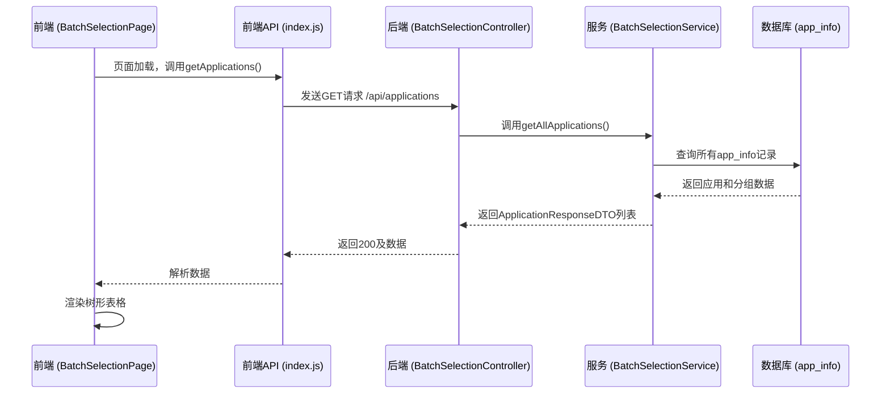
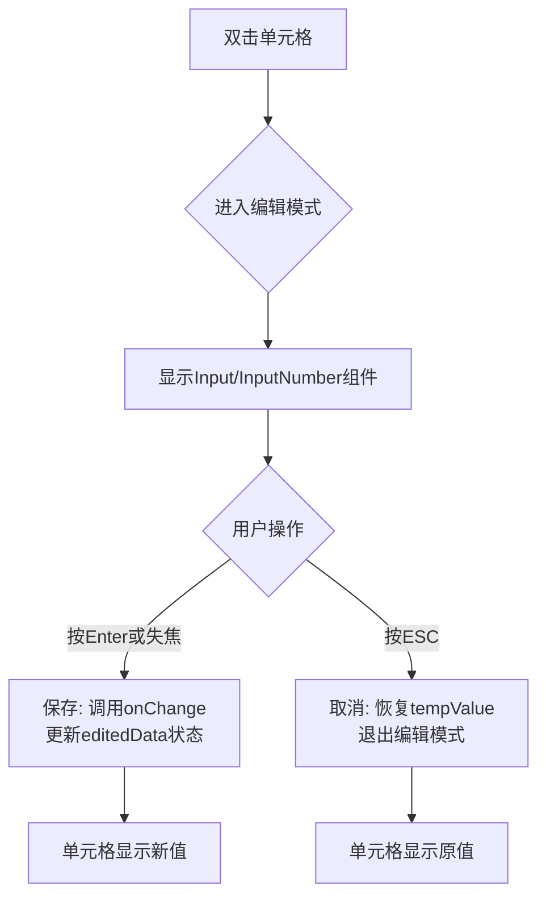
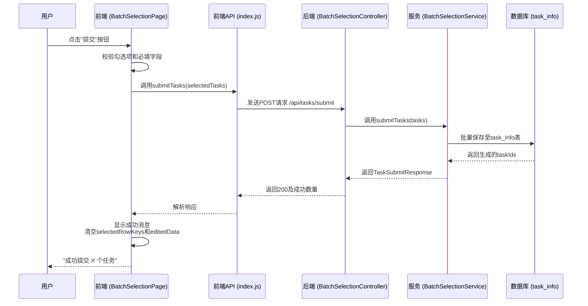

# 使用说明

<cite>
**本文档引用文件**  
- [BatchSelectionPage.jsx](file://frontend/src/components/BatchSelectionPage.jsx)
- [EditableCell.jsx](file://frontend/src/components/EditableCell.jsx)
- [index.js](file://frontend/src/api/index.js)
- [BatchSelectionController.java](file://backend/src/main/java/com/example/batchselection/controller/BatchSelectionController.java)
- [BatchSelectionServiceImpl.java](file://backend/src/main/java/com/example/batchselection/service/impl/BatchSelectionServiceImpl.java)
- [AppInfo.java](file://backend/src/main/java/com/example/batchselection/entity/AppInfo.java)
- [TaskInfo.java](file://backend/src/main/java/com/example/batchselection/entity/TaskInfo.java)
</cite>

## 目录
1. [查看数据](#查看数据)
2. [勾选数据](#勾选数据)
3. [编辑数据](#编辑数据)
4. [提交任务](#提交任务)
5. [取消操作](#取消操作)
6. [注意事项](#注意事项)

## 查看数据

系统页面加载完成后，会自动从后端获取所有应用及其分组信息，并以树形结构表格形式展示。应用作为父节点，其下属的分组作为子节点排列。所有节点默认处于展开状态，用户可点击行前的折叠图标手动展开或折叠应用节点，以便于浏览和管理大量数据。

数据加载过程由前端组件 `BatchSelectionPage` 中的 `useEffect` 钩子触发，调用 `getApplications` API 从后端获取数据。后端通过 `BatchSelectionController` 的 `getApplications` 接口响应请求，从 `app_info` 数据库表中查询所有记录并按应用名和分组名排序后返回。

**图示来源**
- [BatchSelectionPage.jsx](file://frontend/src/components/BatchSelectionPage.jsx#L19-L38)
- [index.js](file://frontend/src/api/index.js#L24-L26)
- [BatchSelectionController.java](file://backend/src/main/java/com/example/batchselection/controller/BatchSelectionController.java#L33-L43)
- [BatchSelectionServiceImpl.java](file://backend/src/main/java/com/example/batchselection/service/impl/BatchSelectionServiceImpl.java#L35-L63)

## 勾选数据

用户可以通过点击行前的复选框来选择需要处理的分组。系统支持以下勾选操作：
- **单个选择**：点击任意分组行的复选框进行选择或取消。
- **全选/取消全选**：点击表头的复选框可一次性选择或取消所有分组。
- **批量选择**：点击应用行的复选框，会自动勾选或取消该应用下的所有分组。

选中的行数会实时显示在“提交”按钮的括号中。当没有勾选项时，提交按钮将置灰不可用。

此功能由 `BatchSelectionPage` 组件中的 `rowSelection` 配置实现，通过 `onSelect` 和 `onSelectAll` 回调函数处理父子节点的联动逻辑。

**本节来源**
- [BatchSelectionPage.jsx](file://frontend/src/components/BatchSelectionPage.jsx#L214-L248)

## 编辑数据

用户可以对表格中的分组数据进行编辑。操作方式如下：
1. **进入编辑**：双击任意可编辑单元格（分组名、灰度分组名、机房、分区、参数规格、硬盘大小、Pod数量）。
2. **输入内容**：单元格将变为输入框，支持文本和数字输入。对于数字字段（硬盘大小、Pod数量），系统会限制输入为正整数。
3. **保存更改**：输入完成后，按下回车键（Enter）或点击单元格外的任意位置，更改将被保存。
4. **取消编辑**：在编辑过程中，按下 ESC 键可放弃本次修改，恢复原值。

**重要提示**：所有编辑操作仅在浏览器内存中生效，数据尚未写入数据库。

此功能由 `EditableCell` 子组件实现，它通过双击事件 (`onDoubleClick`) 进入编辑模式，并利用 `Input` 和 `InputNumber` 组件处理输入，通过 `onBlur` 和 `onKeyDown` 事件处理保存和取消逻辑。

**图示来源**
- [EditableCell.jsx](file://frontend/src/components/EditableCell.jsx#L20-L59)
- [BatchSelectionPage.jsx](file://frontend/src/components/BatchSelectionPage.jsx#L78-L86)

## 提交任务

当用户完成数据勾选和编辑后，可点击工具栏上的“提交”按钮将选中的任务写入数据库。
1. 系统首先校验所有勾选项的必填字段（应用名、分组名、机房、分区、参数规格）是否为空，以及硬盘大小和Pod数量是否为正整数。
2. 校验通过后，前端将收集所有勾选分组的最新数据（包括编辑过的值），通过 `submitTasks` API 发送给后端。
3. 后端接收到请求后，将数据批量插入 `task_info` 表。
4. 操作成功后，前端会显示成功提示，告知用户成功提交的任务数量，同时清空当前的勾选和编辑状态。

如果未勾选任何分组，系统会弹出警告提示。若校验失败或提交出错，会显示相应的错误信息。

**图示来源**
- [BatchSelectionPage.jsx](file://frontend/src/components/BatchSelectionPage.jsx#L251-L303)
- [index.js](file://frontend/src/api/index.js#L32-L34)
- [BatchSelectionController.java](file://backend/src/main/java/com/example/batchselection/controller/BatchSelectionController.java#L49-L62)
- [BatchSelectionServiceImpl.java](file://backend/src/main/java/com/example/batchselection/service/impl/BatchSelectionServiceImpl.java#L64-L93)

## 取消操作

用户可以点击工具栏上的“取消”按钮，清空当前所有的勾选状态和编辑内容。此操作会将页面恢复到初始状态，但不会影响数据库中的数据。系统会弹出提示信息“已清空勾选和编辑内容”。

该功能由 `BatchSelectionPage` 组件中的 `handleCancel` 函数实现，通过将 `selectedRowKeys` 和 `editedData` 状态重置为空来完成。

**本节来源**
- [BatchSelectionPage.jsx](file://frontend/src/components/BatchSelectionPage.jsx#L306-L310)

## 注意事项

1. **前端编辑的临时性**：在表格中进行的所有编辑操作都只保存在浏览器的内存中。如果用户在提交前刷新页面或关闭浏览器，所有未提交的编辑内容将会丢失。
2. **数据持久化时机**：只有在成功点击“提交”按钮后，勾选和编辑的数据才会被写入后端数据库的 `task_info` 表。
3. **数据源**：页面展示的原始数据来源于 `app_info` 表。提交操作会将选中的数据复制到 `task_info` 表中，而不会修改 `app_info` 表中的原始数据。
4. **必填字段**：分组名、机房、分区、参数规格为必填项，提交时若为空将导致失败。
5. **数值校验**：硬盘大小和Pod数量必须为正整数，否则无法提交。

请用户务必在完成所有编辑后，及时点击“提交”按钮以确保数据被持久化。

**本节来源**
- [BatchSelectionPage.jsx](file://frontend/src/components/BatchSelectionPage.jsx#L277-L285)
- [TaskSubmitDTO.java](file://backend/src/main/java/com/example/batchselection/dto/TaskSubmitDTO.java#L14-L37)
- [AppInfo.java](file://backend/src/main/java/com/example/batchselection/entity/AppInfo.java)
- [TaskInfo.java](file://backend/src/main/java/com/example/batchselection/entity/TaskInfo.java)