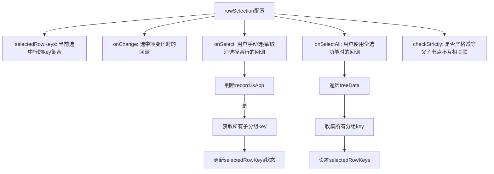
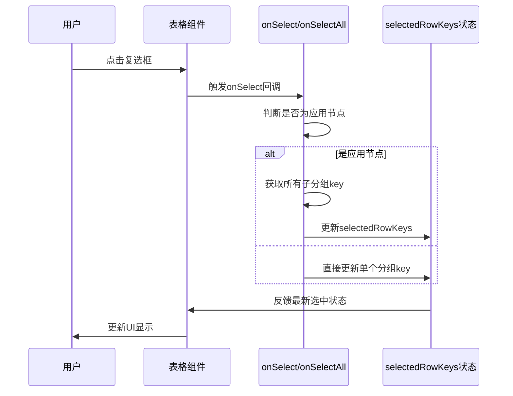
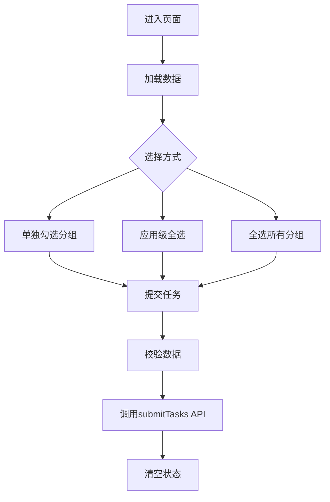

# 勾选数据

<cite>
**本文档引用文件**  
- [BatchSelectionPage.jsx](file://frontend/src/components/BatchSelectionPage.jsx)
- [EditableCell.jsx](file://frontend/src/components/EditableCell.jsx)
- [index.js](file://frontend/src/api/index.js)
- [BatchSelectionController.java](file://backend/src/main/java/com/example/batchselection/controller/BatchSelectionController.java)
- [BatchSelectionServiceImpl.java](file://backend/src/main/java/com/example/batchselection/service/impl/BatchSelectionServiceImpl.java)
</cite>

## 目录
1. [简介](#简介)
2. [勾选操作方式](#勾选操作方式)
3. [rowSelection配置详解](#rowselection配置详解)
4. [半选状态的视觉表现与业务含义](#半选状态的视觉表现与业务含义)
5. [前端状态管理机制](#前端状态管理机制)
6. [使用示例](#使用示例)
7. [常见问题及解决方案](#常见问题及解决方案)
8. [总结](#总结)

## 简介
本系统提供了一套完整的批量勾选信息管理功能，支持分组级单独勾选、应用级全选其下所有分组以及全选按钮选择全部分组。通过Ant Design Table组件实现树形数据结构的展示和交互，结合后端Spring Boot服务完成数据查询与任务提交。该功能主要用于批量任务提交场景，用户可对多个应用及其下属分组进行灵活选择并提交操作。

**Section sources**
- [BatchSelectionPage.jsx](file://frontend/src/components/BatchSelectionPage.jsx#L11-L347)

## 勾选操作方式
系统支持三种层级的勾选操作：

1. **分组级单独勾选**：用户可以点击任意分组行前的复选框，单独选择该分组。每个分组作为独立的数据单元存在，勾选状态互不影响。

2. **应用级全选子分组**：当用户勾选某个应用行时，系统会自动将其下所有子分组全部选中；取消勾选时则清除所有子分组的选择状态。这种机制通过`onSelect`回调中的逻辑判断实现，识别`isApp`字段来区分应用节点和分组节点。

3. **全选按钮选择全部分组**：页面提供的全选功能仅选择所有分组行，不包含应用行本身。这是为了避免在提交任务时误将应用行作为任务数据处理。全选操作通过遍历`treeData`结构收集所有分组的`key`值实现。

以上操作均实时反映在界面上，并通过`selectedRowKeys`状态统一管理当前选中的行键集合。

**Section sources**
- [BatchSelectionPage.jsx](file://frontend/src/components/BatchSelectionPage.jsx#L213-L247)

## rowSelection配置详解
`rowSelection`是Ant Design Table的核心配置之一，用于控制表格行的选择行为。本系统中的配置包含以下关键属性：



**Diagram sources**
- [BatchSelectionPage.jsx](file://frontend/src/components/BatchSelectionPage.jsx#L213-L247)

### onSelect回调逻辑
`onSelect`回调在用户手动选择或取消选择某一行时触发。其核心逻辑如下：
- 判断当前操作的记录是否为应用节点（通过`record.isApp`字段）
- 如果是应用节点，则获取其所有子分组的`key`值
- 根据`selected`参数的布尔值决定是添加还是移除这些子分组的`key`
- 使用函数式更新确保状态更新基于最新状态

该机制实现了应用节点与其子分组之间的联动选择，提升了用户体验。

### onSelectAll回调逻辑
`onSelectAll`回调在用户点击全选复选框时触发。与默认行为不同，本系统重写了该逻辑：
- 全选时只选择所有分组行，不包括应用行
- 遍历`treeData`结构，收集每个应用下所有分组的`key`
- 将这些`key`赋值给`selectedRowKeys`状态
- 取消全选时清空`selectedRowKeys`

这样设计的目的是确保提交的任务数据只包含具体的分组信息，避免无效数据提交。

**Section sources**
- [BatchSelectionPage.jsx](file://frontend/src/components/BatchSelectionPage.jsx#L219-L243)

## 半选状态的视觉表现与业务含义
虽然当前实现中未显式使用`checkStrictly: true`来启用严格的父子节点关联模式，但半选状态的概念仍然存在于业务逻辑中。

### 视觉表现
在Ant Design Table中，当`checkStrictly`为`false`（默认值）时，父节点会根据子节点的选择情况自动呈现三种状态：
- **未选中**：所有子节点都未被选中
- **半选中**：部分子节点被选中
- **全选中**：所有子节点都被选中

半选状态通常以"-"符号显示在复选框内，区别于勾选的"√"和未选中的空白状态。

### 业务含义
在本系统中，半选状态具有明确的业务意义：
- 表示该应用下的分组只有部分被选中参与任务提交
- 提示用户当前操作是非完整的批量操作
- 在数据校验阶段可用于快速识别部分选中的应用

尽管前端未完全利用这一特性进行特殊处理，但它为未来扩展提供了基础支持，例如可以增加"仅提交半选应用"等高级功能。

**Section sources**
- [BatchSelectionPage.jsx](file://frontend/src/components/BatchSelectionPage.jsx#L244)

## 前端状态管理机制
系统采用React Hooks进行状态管理，核心是`selectedRowKeys`状态变量。

### 状态定义
```jsx
const [selectedRowKeys, setSelectedRowKeys] = useState([]);
```
该状态存储当前选中行的唯一标识`key`数组，由Ant Design Table自动维护并与UI同步。

### 状态更新流程


**Diagram sources**
- [BatchSelectionPage.jsx](file://frontend/src/components/BatchSelectionPage.jsx#L15)
- [BatchSelectionPage.jsx](file://frontend/src/components/BatchSelectionPage.jsx#L213-L247)

### 状态同步机制
- `onChange`回调监听选中项变化，直接更新`selectedRowKeys`
- `onSelect`和`onSelectAll`回调在特定条件下干预选择逻辑
- `treeData`使用`useMemo`优化，确保数据转换高效执行
- 提交任务时基于`selectedRowKeys`从`treeData`中提取实际数据

这种设计保证了状态的一致性和可预测性，同时避免了不必要的重新渲染。

**Section sources**
- [BatchSelectionPage.jsx](file://frontend/src/components/BatchSelectionPage.jsx#L15)
- [BatchSelectionPage.jsx](file://frontend/src/components/BatchSelectionPage.jsx#L40-L74)
- [BatchSelectionPage.jsx](file://frontend/src/components/BatchSelectionPage.jsx#L215-L218)

## 使用示例
以下是一个典型的使用场景：

1. 用户进入批量勾选信息管理页面
2. 系统自动加载应用数据并构建树形结构
3. 用户可以选择：
   - 单独勾选若干分组
   - 勾选某个应用以选中其所有分组
   - 点击全选按钮选择所有分组
4. 点击"提交"按钮，系统执行以下操作：
   - 检查`selectedRowKeys`是否为空
   - 从`treeData`中提取对应分组数据
   - 校验必填字段完整性
   - 调用API提交任务
5. 提交成功后清空选中状态



**Diagram sources**
- [BatchSelectionPage.jsx](file://frontend/src/components/BatchSelectionPage.jsx#L250-L302)
- [index.js](file://frontend/src/api/index.js#L31-L33)

**Section sources**
- [BatchSelectionPage.jsx](file://frontend/src/components/BatchSelectionPage.jsx#L250-L302)

## 常见问题及解决方案
### 勾选无反应
**问题描述**：点击复选框没有任何反应，无法选择行。

**可能原因及解决方案**：
1. **数据未正确加载**：检查网络请求是否成功，确认`applications`状态是否有数据
   - 解决方案：查看浏览器开发者工具的Network面板，确认`/api/applications`请求是否返回200状态码

2. **key值重复或缺失**：Ant Design Table要求每行必须有唯一的`key`属性
   - 解决方案：检查`treeData`生成逻辑，确保每个节点的`key`唯一且不为空

3. **rowSelection配置错误**：`rowSelection`对象未正确传递给Table组件
   - 解决方案：确认`<Table rowSelection={rowSelection} />`写法正确

4. **状态更新阻塞**：`setSelectedRowKeys`被意外阻止执行
   - 解决方案：检查是否有异常抛出导致更新中断

### 提交按钮始终禁用
**问题描述**：即使已勾选分组，提交按钮仍处于禁用状态。

**解决方案**：
- 检查`selectedRowKeys`状态是否真正更新
- 确认`disabled={selectedRowKeys.length === 0}`条件判断正确
- 查看控制台是否有错误信息影响状态更新

### 编辑后数据丢失
**问题描述**：编辑分组信息后提交，发现使用的是原始数据而非编辑后的数据。

**解决方案**：
- 确保`editedData`状态正确收集编辑内容
- 检查`treeData`生成时是否合并了`editedData`（通过`...editedData[group.id]`）
- 验证提交时从`treeData`而非原始`applications`获取数据

**Section sources**
- [BatchSelectionPage.jsx](file://frontend/src/components/BatchSelectionPage.jsx#L305-L309)
- [BatchSelectionPage.jsx](file://frontend/src/components/BatchSelectionPage.jsx#L77-L85)

## 总结
本文详细说明了批量勾选系统的操作方式和实现机制。系统通过Ant Design Table的`rowSelection`配置实现了分组级、应用级和全局三个层次的勾选功能，利用`onSelect`和`onSelectAll`回调实现了智能的父子节点联动选择。前端通过`selectedRowKeys`状态统一管理选中项，结合`treeData`结构实现数据提取与提交。整个设计兼顾了用户体验和业务需求，为批量任务处理提供了高效的操作界面。

**Section sources**
- [BatchSelectionPage.jsx](file://frontend/src/components/BatchSelectionPage.jsx#L11-L347)