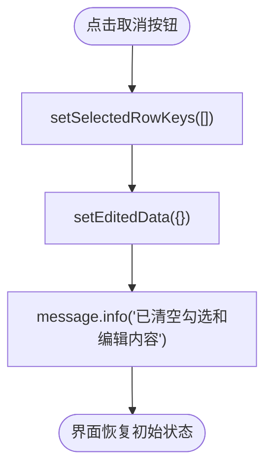

# 取消操作

<cite>
**本文档中引用的文件**   
- [BatchSelectionPage.jsx](file://frontend/src/components/BatchSelectionPage.jsx)
- [EditableCell.jsx](file://frontend/src/components/EditableCell.jsx)
</cite>

## 目录
1. [取消按钮功能说明](#取消按钮功能说明)
2. [handleCancel函数实现机制](#handlecancel函数实现机制)
3. [状态重置与UI重新渲染](#状态重置与ui重新渲染)
4. [客户端与服务器数据隔离](#客户端与服务器数据隔离)
5. [使用场景示例](#使用场景示例)
6. [用户体验提示](#用户体验提示)

## 取消按钮功能说明

“取消”按钮的核心功能是清空当前所有勾选项（`selectedRowKeys`）和已编辑但未提交的数据（`editedData`），将表格恢复至初始状态。该操作允许用户在误操作或需要重新开始时，快速重置界面状态，而不影响后端数据。

**Section sources**
- [BatchSelectionPage.jsx](file://frontend/src/components/BatchSelectionPage.jsx#L305-L309)

## handleCancel函数实现机制

`handleCancel` 函数通过调用两个状态更新函数来实现清空操作：
- `setSelectedRowKeys([])`：清空所有已勾选的行键（即取消所有勾选状态）
- `setEditedData({})`：清空所有已编辑但未提交的数据对象

此函数定义于 `BatchSelectionPage.jsx` 文件中，是批量勾选页面组件的一部分，专门用于处理用户点击“取消”按钮后的逻辑。

**Diagram sources**
- [BatchSelectionPage.jsx](file://frontend/src/components/BatchSelectionPage.jsx#L305-L309)

**Section sources**
- [BatchSelectionPage.jsx](file://frontend/src/components/BatchSelectionPage.jsx#L305-L309)

## 状态重置与UI重新渲染

当 `setSelectedRowKeys` 和 `setEditedData` 被调用时，React 的状态管理机制会触发组件的重新渲染。由于 `treeData` 使用了 `useMemo` 依赖于 `editedData`，因此编辑数据的清空会立即反映在表格中。同时，行选择状态的清空会使所有复选框恢复未选中状态，从而实现整个表格的视觉重置。

**Section sources**
- [BatchSelectionPage.jsx](file://frontend/src/components/BatchSelectionPage.jsx#L15-L16)
- [BatchSelectionPage.jsx](file://frontend/src/components/BatchSelectionPage.jsx#L77-L75)

## 客户端与服务器数据隔离

该取消操作仅影响客户端内存中的状态，不会向服务器发送任何请求，也不会修改数据库中的数据。所有更改都局限于浏览器内存，确保了操作的安全性和可逆性。即使用户刷新页面，原始数据仍从 API 重新加载，保持数据一致性。

**Section sources**
- [BatchSelectionPage.jsx](file://frontend/src/components/BatchSelectionPage.jsx#L24-L38)
- [api/index.js](file://frontend/src/api/index.js#L24-L25)

## 使用场景示例

典型使用场景包括：
- 用户误勾选了多个分组，希望重新选择
- 在编辑多个字段后发现输入错误，决定放弃当前修改
- 提交前审查时发现需要完全重新配置任务参数

在此类场景下，用户可点击“取消”按钮，迅速回到初始状态，避免手动逐项取消勾选或重置编辑内容。

**Section sources**
- [BatchSelectionPage.jsx](file://frontend/src/components/BatchSelectionPage.jsx#L328-L330)

## 用户体验提示

为提升用户体验，`handleCancel` 函数在执行完状态重置后，会调用 `message.info('已清空勾选和编辑内容')` 向用户展示一条轻量级提示消息。该反馈机制让用户明确知晓操作已生效，增强了界面的响应感和可预测性。

**Section sources**
- [BatchSelectionPage.jsx](file://frontend/src/components/BatchSelectionPage.jsx#L309)
- [README.md](file://README.md#L250-L251)