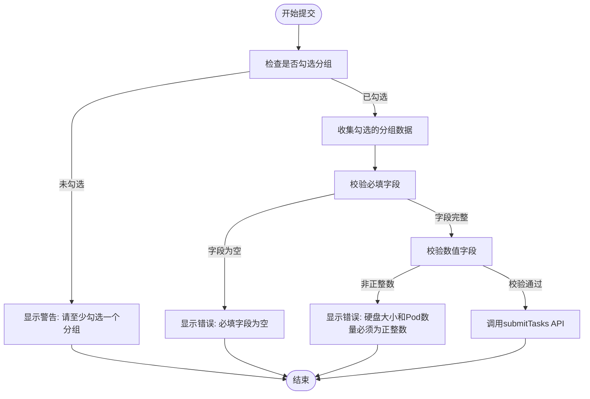
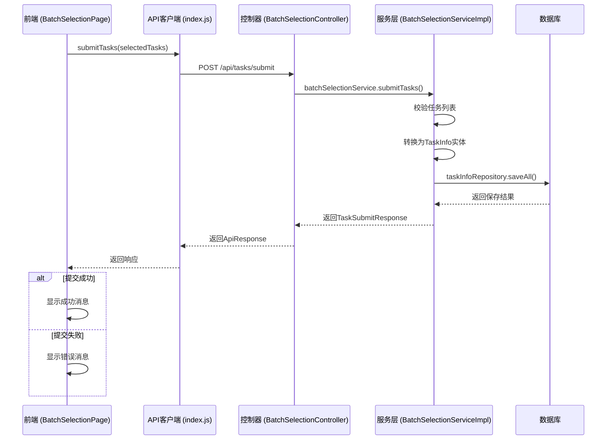

# 提交任务

<cite>
**Referenced Files in This Document**   
- [BatchSelectionPage.jsx](file://frontend/src/components/BatchSelectionPage.jsx)
- [index.js](file://frontend/src/api/index.js)
- [BatchSelectionController.java](file://backend/src/main/java/com/example/batchselection/controller/BatchSelectionController.java)
- [BatchSelectionServiceImpl.java](file://backend/src/main/java/com/example/batchselection/service/impl/BatchSelectionServiceImpl.java)
- [TaskSubmitDTO.java](file://backend/src/main/java/com/example/batchselection/dto/TaskSubmitDTO.java)
- [TaskSubmitResponse.java](file://backend/src/main/java/com/example/batchselection/dto/TaskSubmitResponse.java)
</cite>

## Table of Contents
1. [任务提交流程概述](#任务提交流程概述)
2. [前端数据处理与校验](#前端数据处理与校验)
3. [API调用与后端处理](#api调用与后端处理)
4. [错误处理与用户反馈](#错误处理与用户反馈)
5. [数据持久化与副作用](#数据持久化与副作用)

## 任务提交流程概述

当用户点击“提交”按钮时，系统启动任务提交流程。该流程从前端组件 `BatchSelectionPage` 开始，通过遍历 `treeData` 中的数据，根据 `selectedRowKeys` 匹配用户勾选的分组数据，构造出待提交的任务列表。整个流程包含前端校验、API调用、后端业务处理和数据持久化等多个环节，确保数据的完整性和一致性。

**Section sources**
- [BatchSelectionPage.jsx](file://frontend/src/components/BatchSelectionPage.jsx#L250-L303)

## 前端数据处理与校验

在提交任务前，前端会执行双重校验机制以确保数据质量。首先，系统会检查必填字段（应用名、分组名、机房、分区、参数规格）是否为空。其次，对数值字段（硬盘大小、Pod数量）进行正整数校验。这些校验逻辑在 `handleSubmit` 函数中实现，通过遍历 `selectedTasks` 数组逐一验证每个任务的数据完整性。

**Diagram sources**
- [BatchSelectionPage.jsx](file://frontend/src/components/BatchSelectionPage.jsx#L250-L286)

**Section sources**
- [BatchSelectionPage.jsx](file://frontend/src/components/BatchSelectionPage.jsx#L250-L286)

## API调用与后端处理

前端通过 `submitTasks` API 函数向后端发起 POST 请求，请求地址为 `/api/tasks/submit`。后端由 `BatchSelectionController` 接收请求，并调用 `BatchSelectionServiceImpl` 中的 `submitTasks` 方法进行业务处理。后端服务会对任务列表进行空值检查和数量限制（不超过1000条），然后将 `TaskSubmitDTO` 转换为 `TaskInfo` 实体并批量保存到数据库。

**Diagram sources**
- [index.js](file://frontend/src/api/index.js#L31-L33)
- [BatchSelectionController.java](file://backend/src/main/java/com/example/batchselection/controller/BatchSelectionController.java#L48-L61)
- [BatchSelectionServiceImpl.java](file://backend/src/main/java/com/example/batchselection/service/impl/BatchSelectionServiceImpl.java#L64-L93)

**Section sources**
- [index.js](file://frontend/src/api/index.js#L31-L33)
- [BatchSelectionController.java](file://backend/src/main/java/com/example/batchselection/controller/BatchSelectionController.java#L48-L61)
- [BatchSelectionServiceImpl.java](file://backend/src/main/java/com/example/batchselection/service/impl/BatchSelectionServiceImpl.java#L64-L93)

## 错误处理与用户反馈

系统采用 Ant Design 的 `message` 组件提供用户反馈。当校验失败或提交异常时，会显示相应的错误提示；提交成功后则显示成功反馈。前端在 `handleSubmit` 函数中使用 `message.error` 和 `message.success` 方法，后端在 `BatchSelectionController` 中通过 `ApiResponse.error` 和 `ApiResponse.success` 返回标准化的响应格式，确保前后端错误处理的一致性。

**Section sources**
- [BatchSelectionPage.jsx](file://frontend/src/components/BatchSelectionPage.jsx#L253-L254)
- [BatchSelectionPage.jsx](file://frontend/src/components/BatchSelectionPage.jsx#L279-L284)
- [BatchSelectionPage.jsx](file://frontend/src/components/BatchSelectionPage.jsx#L292-L297)
- [BatchSelectionController.java](file://backend/src/main/java/com/example/batchselection/controller/BatchSelectionController.java#L56-L60)

## 数据持久化与副作用

任务提交成功后，数据将被持久化存储到数据库中，此操作不可逆。前端在收到成功响应后，会执行副作用操作：清空 `selectedRowKeys` 数组和 `editedData` 对象，重置用户界面状态。这一设计确保了用户在成功提交后不会误操作重复提交相同数据，同时提供了清晰的界面反馈。

**Section sources**
- [BatchSelectionPage.jsx](file://frontend/src/components/BatchSelectionPage.jsx#L293-L294)
- [BatchSelectionServiceImpl.java](file://backend/src/main/java/com/example/batchselection/service/impl/BatchSelectionServiceImpl.java#L84-L89)