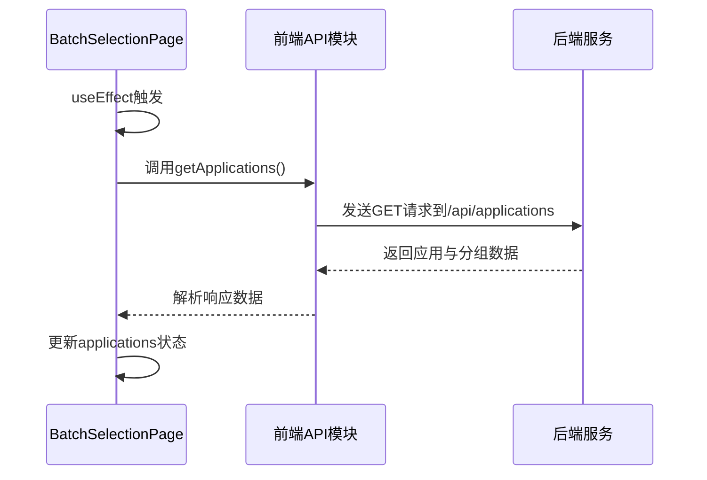
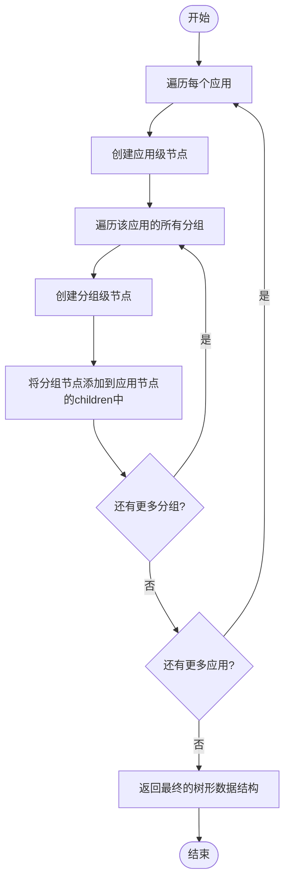
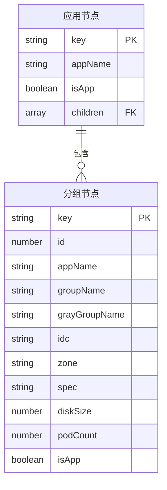

# 查看数据

<cite>
**Referenced Files in This Document**   
- [BatchSelectionPage.jsx](file://frontend/src/components/BatchSelectionPage.jsx)
- [index.js](file://frontend/src/api/index.js)
- [BatchSelectionController.java](file://backend/src/main/java/com/example/batchselection/controller/BatchSelectionController.java)
</cite>

## 目录
1. [数据加载机制](#数据加载机制)
2. [数据结构转换](#数据结构转换)
3. [树形表格展示](#树形表格展示)
4. [应用与分组识别](#应用与分组识别)
5. [常见问题排查](#常见问题排查)

## 数据加载机制

页面加载后，通过 `useEffect` 钩子在组件挂载时自动触发数据加载过程。该钩子在依赖数组为空的情况下仅执行一次，确保数据只在组件初始化时获取。

数据加载流程如下：
1. 调用 `getApplications` API 接口
2. 处理响应结果
3. 将数据存储到组件状态中

**Diagram sources**
- [BatchSelectionPage.jsx](file://frontend/src/components/BatchSelectionPage.jsx#L19-L37)
- [index.js](file://frontend/src/api/index.js#L23-L25)
- [BatchSelectionController.java](file://backend/src/main/java/com/example/batchselection/controller/BatchSelectionController.java#L32-L42)

**Section sources**
- [BatchSelectionPage.jsx](file://frontend/src/components/BatchSelectionPage.jsx#L19-L37)

## 数据结构转换

从API获取的原始数据需要转换为Ant Design TreeTable组件所需的树形结构。这一转换过程通过 `useMemo` 钩子实现，确保只有在依赖数据变化时才重新计算，优化了渲染性能。

转换逻辑将扁平化的应用与分组数据重组为树形结构：
- 每个应用作为父节点
- 其下属分组作为子节点

**Diagram sources**
- [BatchSelectionPage.jsx](file://frontend/src/components/BatchSelectionPage.jsx#L40-L74)

**Section sources**
- [BatchSelectionPage.jsx](file://frontend/src/components/BatchSelectionPage.jsx#L40-L74)

## 树形表格展示

转换后的树形数据通过Ant Design的Table组件以树形表格形式展示，实现了应用-分组两级数据的层次化呈现。

关键配置包括：
- `dataSource={treeData}`：绑定转换后的树形数据
- `defaultExpandAllRows`：默认展开所有节点
- `rowSelection`：支持行选择功能

表格具有以下特性：
- 支持横向和纵向滚动
- 无分页（`pagination={false}`）
- 显示边框（`bordered`）
- 自动展开所有行

**Diagram sources**
- [BatchSelectionPage.jsx](file://frontend/src/components/BatchSelectionPage.jsx#L334-L344)

**Section sources**
- [BatchSelectionPage.jsx](file://frontend/src/components/BatchSelectionPage.jsx#L334-L344)

## 应用与分组识别

在树形表格中，应用级和分组级数据通过视觉差异进行区分，便于用户识别：

### 应用级数据特征
- **加粗显示**：应用名称以加粗字体呈现
- 无复选框：应用行不显示复选框（仅作为分组容器）
- 层级位置：作为树形结构的父节点

### 分组级数据特征
- 普通字体：分组名称以正常字体显示
- 可编辑字段：大部分字段为可编辑的输入框
- 可选择性：每行都有复选框，支持勾选操作

应用级数据的加粗显示通过列定义中的 `render` 函数实现，当记录的 `isApp` 字段为 `true` 时，使用 `<strong>` 标签包裹文本。

**Section sources**
- [BatchSelectionPage.jsx](file://frontend/src/components/BatchSelectionPage.jsx#L90-L100)

## 常见问题排查

当数据加载失败时，可按照以下步骤进行排查：

### 网络连接检查
1. 打开浏览器开发者工具
2. 查看Network（网络）标签页
3. 确认 `/api/applications` 请求是否存在
4. 检查请求状态码（正常应为200）

### 后端服务状态
1. 确认后端服务是否正常运行
2. 检查后端日志是否有错误信息
3. 验证数据库连接是否正常
4. 确保相关API端点可访问

### 常见错误及解决方案
| 问题现象 | 可能原因 | 解决方案 |
|---------|--------|---------|
| 加载失败提示 | 网络连接问题 | 检查网络连接，刷新页面 |
| 空白页面 | 后端服务未启动 | 启动后端Spring Boot应用 |
| 数据不完整 | 数据库查询错误 | 检查后端日志和数据库状态 |
| CORS错误 | 跨域配置问题 | 确认后端CORS配置正确 |

**Section sources**
- [BatchSelectionPage.jsx](file://frontend/src/components/BatchSelectionPage.jsx#L27-L36)
- [BatchSelectionController.java](file://backend/src/main/java/com/example/batchselection/controller/BatchSelectionController.java#L35-L41)