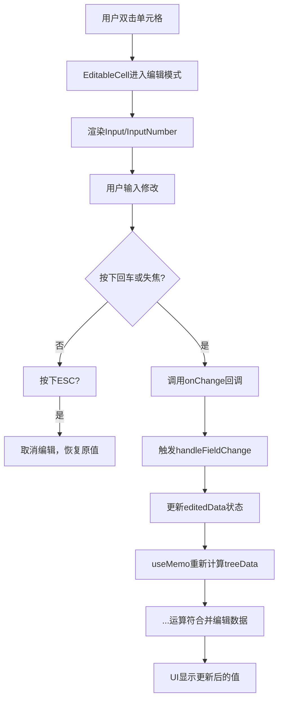

# 编辑数据

<cite>
**本文档引用的文件**
- [EditableCell.jsx](file://frontend/src/components/EditableCell.jsx)
- [BatchSelectionPage.jsx](file://frontend/src/components/BatchSelectionPage.jsx)
- [README.md](file://README.md)
</cite>

## 目录
1. [在线编辑功能概述](#在线编辑功能概述)
2. [EditableCell组件实现原理](#editablecell组件实现原理)
3. [编辑状态管理与数据合并](#编辑状态管理与数据合并)
4. [字段校验规则与错误处理](#字段校验规则与错误处理)
5. [编辑生命周期与内存存储特性](#编辑生命周期与内存存储特性)

## 在线编辑功能概述

本系统支持用户通过双击任意可编辑单元格（除应用名外）进入编辑模式。该功能允许用户对分组名、灰度分组名、机房、分区、参数规格、硬盘大小和Pod数量等字段进行文本或数字类型的输入修改。编辑操作支持三种完成方式：回车键保存更改、ESC键取消编辑，以及点击单元格外区域触发失焦自动保存。所有编辑操作均在前端内存中进行，不会立即影响后端数据，只有在用户提交勾选任务时才会将变更持久化到数据库。

**Section sources**
- [README.md](file://README.md#L51-L56)

## EditableCell组件实现原理

`EditableCell` 组件是实现在线编辑功能的核心组件，其主要职责是封装单元格的编辑行为和交互逻辑。该组件通过双击事件触发编辑状态，利用React的useState钩子管理组件内部状态。当用户双击单元格时，`handleEdit` 函数被调用，设置 `editing` 状态为true，并将当前值复制到临时变量 `tempValue` 中用于编辑过程中的值追踪。

在编辑模式下，组件根据 `type` 属性决定渲染 `Input` 或 `InputNumber` 组件。`InputNumber` 用于数值型字段如硬盘大小和Pod数量，支持最小值限制（默认为1）。编辑过程中，用户的输入实时更新 `tempValue`。通过 `onBlur` 事件监听失焦操作，`onKeyDown` 事件监听键盘输入，分别处理回车保存和ESC取消的逻辑。回车键触发 `handleSave`，ESC键触发 `handleCancel`，实现完整的编辑控制流。

**Section sources**
- [EditableCell.jsx](file://frontend/src/components/EditableCell.jsx#L16-L58)

## 编辑状态管理与数据合并

`BatchSelectionPage` 组件通过 `editedData` 状态对象暂存用户未提交的修改。该状态是一个以分组ID为键的对象，存储每个被编辑过的分组的字段变更。`handleFieldChange` 函数负责更新此状态，使用函数式更新确保状态一致性，并通过扩展运算符（...）实现嵌套对象的不可变更新。

在构建树形数据结构 `treeData` 时，通过 `useMemo` 优化性能，将原始数据与 `editedData` 进行合并。具体实现是在创建每个分组节点时，使用 `...editedData[group.id]` 将暂存的编辑值覆盖原始数据。这种设计实现了局部更新机制，确保只有被修改的字段才会显示新值，而其他字段保持原样。这种方式既保证了UI的实时响应性，又避免了直接修改原始数据带来的副作用。

**Diagram sources**
- [BatchSelectionPage.jsx](file://frontend/src/components/BatchSelectionPage.jsx#L17)
- [BatchSelectionPage.jsx](file://frontend/src/components/BatchSelectionPage.jsx#L77)
- [BatchSelectionPage.jsx](file://frontend/src/components/BatchSelectionPage.jsx#L40)

**Section sources**
- [BatchSelectionPage.jsx](file://frontend/src/components/BatchSelectionPage.jsx#L17-L86)

## 字段校验规则与错误处理

系统对编辑字段实施严格的校验规则，确保数据完整性。对于文本字段（如分组名、机房等），在保存时会自动去除首尾空白字符。对于数值字段（硬盘大小、Pod数量），校验逻辑更为严格：必须为正整数且大于零。校验在 `handleSave` 方法中执行，通过 `parseInt` 转换输入值并使用 `isNaN` 检查是否为有效数字。

当校验失败时，系统不会更新 `currentValue`，而是将 `tempValue` 恢复为原始值，从而实现编辑回滚。这种即时反馈机制让用户立即意识到输入错误。此外，在最终提交阶段，系统还会进行二次校验：检查必填字段是否为空，并验证数值字段的有效性。若校验不通过，通过Ant Design的 `message.error` 组件显示明确的错误提示，如“硬盘大小和Pod数量必须为正整数”，指导用户修正问题。

**Section sources**
- [EditableCell.jsx](file://frontend/src/components/EditableCell.jsx#L31-L38)
- [BatchSelectionPage.jsx](file://frontend/src/components/BatchSelectionPage.jsx#L277-L285)

## 编辑生命周期与内存存储特性

本系统的编辑功能遵循清晰的生命周期：进入编辑 → 修改值 → 保存/取消 → 状态更新。所有编辑操作仅在浏览器内存中生效，刷新页面或关闭浏览器将导致未提交的更改丢失。这一设计决策平衡了用户体验和数据安全，允许用户进行多次尝试和修改而不会意外影响生产数据。

编辑状态的生命周期与组件状态绑定，`editedData` 对象在页面加载时初始化为空对象，在用户进行编辑时逐步填充，在提交或取消操作后被清空。这种内存存储特性意味着编辑数据不具备持久性，强调了提交操作的重要性。系统通过在UI上显示已勾选项数量和提供明确的“提交”按钮，引导用户完成从编辑到持久化的完整工作流，确保数据变更的明确性和可追溯性。

**Section sources**
- [README.md](file://README.md#L297-L298)
- [BatchSelectionPage.jsx](file://frontend/src/components/BatchSelectionPage.jsx#L293-L294)