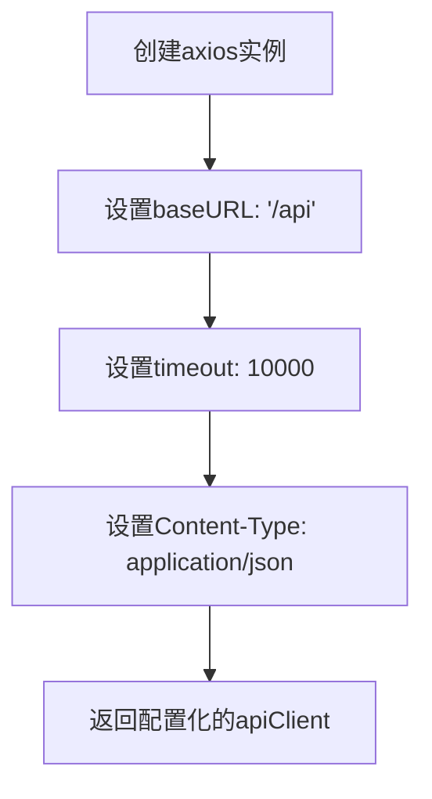
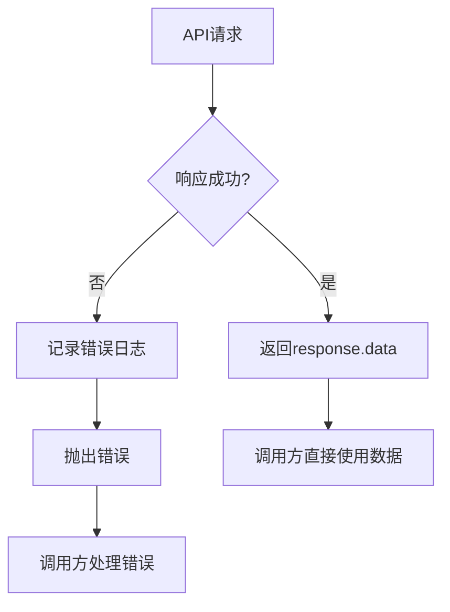
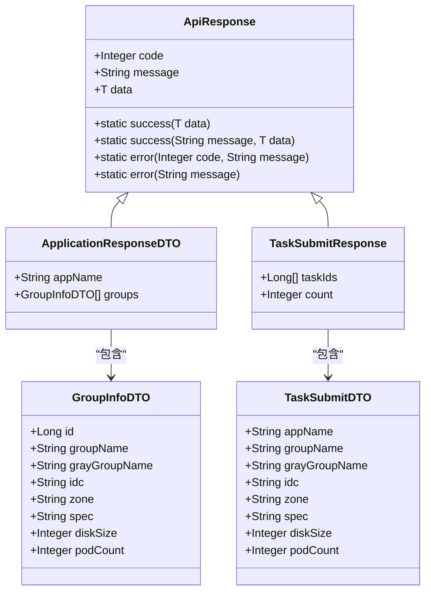
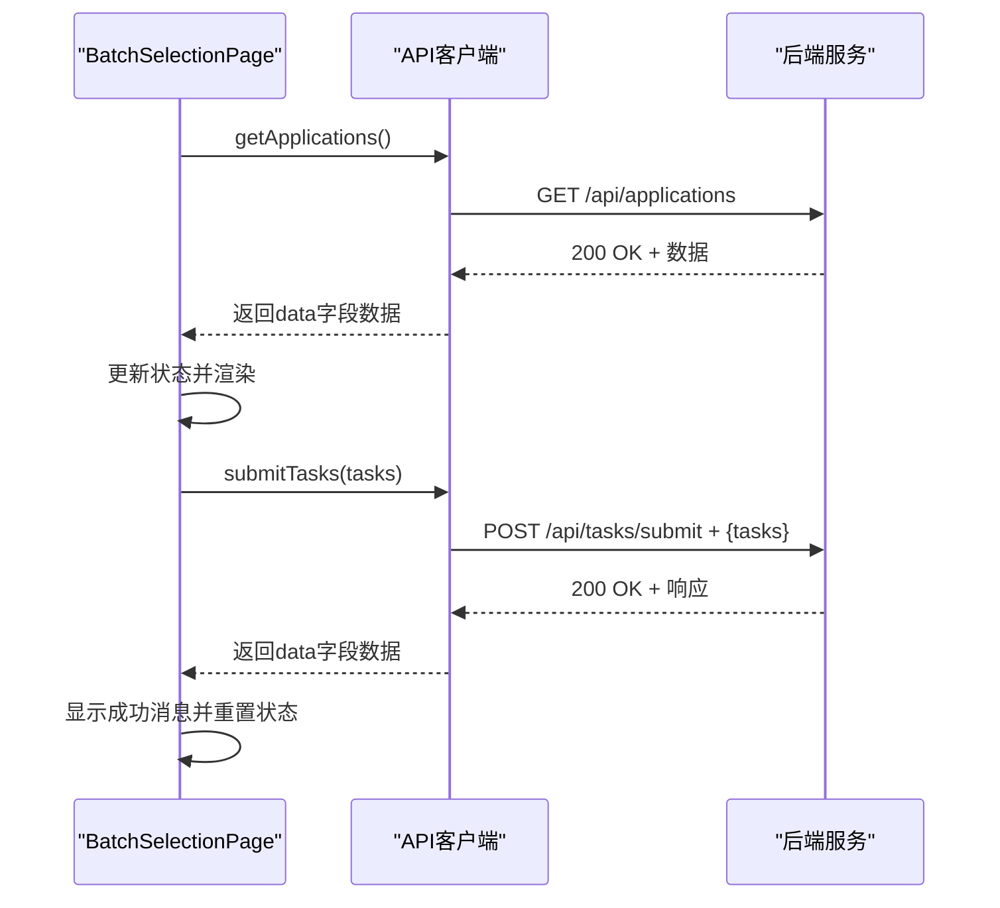

# API客户端封装

<cite>
**Referenced Files in This Document**   
- [index.js](file://frontend/src/api/index.js)
- [BatchSelectionPage.jsx](file://frontend/src/components/BatchSelectionPage.jsx)
- [ApiResponse.java](file://backend/src/main/java/com/example/batchselection/dto/ApiResponse.java)
- [TaskSubmitResponse.java](file://backend/src/main/java/com/example/batchselection/dto/TaskSubmitResponse.java)
- [TaskSubmitDTO.java](file://backend/src/main/java/com/example/batchselection/dto/TaskSubmitDTO.java)
- [ApplicationResponseDTO.java](file://backend/src/main/java/com/example/batchselection/dto/ApplicationResponseDTO.java)
- [GroupInfoDTO.java](file://backend/src/main/java/com/example/batchselection/dto/GroupInfoDTO.java)
</cite>

## 目录
1. [API客户端设计概述](#api客户端设计概述)
2. [axios实例配置](#axios实例配置)
3. [响应拦截器处理](#响应拦截器处理)
4. [API函数实现](#api函数实现)
5. [实际调用场景](#实际调用场景)
6. [API扩展与最佳实践](#api扩展与最佳实践)

## API客户端设计概述

本项目中的API客户端封装设计旨在提供一个统一、简洁且易于维护的HTTP请求接口。通过在`frontend/src/api/index.js`文件中创建axios实例并配置全局选项，实现了对后端API的集中管理。这种设计模式不仅提高了代码的可维护性，还为前端组件提供了简单一致的API调用方式。

API客户端的核心设计理念包括：
- **统一配置管理**：通过`axios.create`方法创建实例，集中管理基础URL、超时时间和请求头等配置
- **响应数据简化**：使用响应拦截器自动提取`response.data`，减少调用方的数据处理负担
- **错误处理标准化**：在拦截器中统一捕获和记录错误，确保错误处理的一致性
- **模块化导出**：将具体的API请求方法作为独立函数导出，便于在不同组件中复用

这种封装方式使得前端开发者可以专注于业务逻辑的实现，而无需关心底层的HTTP请求细节。

**Section sources**
- [index.js](file://frontend/src/api/index.js#L1-L40)

## axios实例配置

API客户端通过`axios.create`方法创建了一个配置化的实例，实现了请求路径的统一管理和基础请求参数的预设。

### baseURL配置

通过设置`baseURL: '/api'`，实现了请求路径的统一管理。这一配置具有以下优势：
- **路径统一**：所有API请求的前缀自动设置为`/api`，确保了API路径的一致性
- **环境适应**：在不同部署环境中，只需修改基础URL配置，无需更改各个API调用点
- **简化调用**：API函数中只需指定相对路径，如`/applications`和`/tasks/submit`，提高了代码的可读性

### 超时时间设置

`timeout: 10000`配置设置了10秒的请求超时时间，这一设置平衡了用户体验和系统性能：
- 防止请求无限期挂起，提升应用的响应性
- 给予后端足够的时间处理复杂请求
- 在超时发生时，能够及时向用户反馈问题

### Content-Type头部

通过`headers: {'Content-Type': 'application/json'}`配置，确保了所有请求默认以JSON格式发送数据：
- 自动将JavaScript对象序列化为JSON字符串
- 告知后端服务器请求体的格式，便于正确解析
- 符合RESTful API的通用实践



**Diagram sources**
- [index.js](file://frontend/src/api/index.js#L4-L10)

**Section sources**
- [index.js](file://frontend/src/api/index.js#L4-L10)

## 响应拦截器处理

响应拦截器是API客户端封装中的关键特性，它通过`apiClient.interceptors.response.use`方法实现，极大地简化了前端的数据处理逻辑。

### 成功响应处理

对于成功的响应，拦截器直接返回`response.data`：
```javascript
response => response.data
```
这一设计带来了以下好处：
- **简化调用方代码**：调用API的组件无需再访问`response.data`属性，可以直接使用返回的数据
- **一致性**：所有API调用都遵循相同的返回模式，降低了学习成本
- **减少错误**：避免了因忘记访问`data`属性而导致的undefined错误

### 错误处理机制

对于请求错误，拦截器执行以下操作：
```javascript
error => {
  console.error('API请求错误:', error);
  return Promise.reject(error);
}
```
这一错误处理策略具有以下特点：
- **统一日志记录**：所有API请求错误都会被记录到控制台，便于调试和问题追踪
- **错误传播**：通过`Promise.reject(error)`将错误继续抛出，允许调用方根据具体场景进行个性化处理
- **不影响调用流程**：错误处理不会中断Promise链，确保调用方可以使用标准的`.catch()`或`try/catch`语法处理错误



**Diagram sources**
- [index.js](file://frontend/src/api/index.js#L13-L18)

**Section sources**
- [index.js](file://frontend/src/api/index.js#L13-L18)

## API函数实现

API客户端封装了两个核心功能函数：`getApplications`和`submitTasks`，它们分别对应应用数据的获取和任务的提交。

### getApplications函数

`getApplications`函数用于获取所有应用数据：
- 发起GET请求到`/api/applications`端点
- 返回Promise对象，便于使用async/await语法
- 函数无参数，调用简单直接

该函数的返回数据结构遵循后端定义的`ApiResponse`格式，包含`code`、`message`和`data`三个字段，其中`data`字段包含`ApplicationResponseDTO`数组，每个元素代表一个应用及其分组信息。

### submitTasks函数

`submitTasks`函数用于批量提交任务：
- 接收任务数组作为参数
- 将任务数组包装在`{ tasks }`对象中，符合后端`BatchTaskSubmitRequest`的期望格式
- 发起POST请求到`/api/tasks/submit`端点
- 返回Promise对象，支持异步调用

后端对提交的任务进行严格验证，包括必填字段检查和数值范围验证，确保数据的完整性和正确性。



**Diagram sources**
- [ApiResponse.java](file://backend/src/main/java/com/example/batchselection/dto/ApiResponse.java#L13-L34)
- [ApplicationResponseDTO.java](file://backend/src/main/java/com/example/batchselection/dto/ApplicationResponseDTO.java#L10-L14)
- [TaskSubmitResponse.java](file://backend/src/main/java/com/example/batchselection/dto/TaskSubmitResponse.java#L14-L18)
- [TaskSubmitDTO.java](file://backend/src/main/java/com/example/batchselection/dto/TaskSubmitDTO.java#L12-L38)
- [GroupInfoDTO.java](file://backend/src/main/java/com/example/batchselection/dto/GroupInfoDTO.java#L9-L19)

**Section sources**
- [index.js](file://frontend/src/api/index.js#L24-L34)

## 实际调用场景

API客户端在`BatchSelectionPage`组件中得到了实际应用，展示了其在真实业务场景中的使用模式。

### 数据加载场景

在`BatchSelectionPage`组件的`useEffect`钩子中，调用`getApplications`函数加载应用数据：
- 组件挂载时自动触发数据加载
- 使用`async/await`语法处理异步请求
- 根据响应结果更新组件状态或显示错误消息
- 通过加载状态控制UI的显示，提升用户体验

### 表单提交场景

在`handleSubmit`函数中，调用`submitTasks`函数提交选中的任务：
- 收集用户勾选的分组数据
- 进行前端数据校验，确保必填字段不为空且数值有效
- 调用API提交任务，处理成功或失败的响应
- 根据结果更新UI状态，如清空选择和编辑内容

这种使用模式体现了API客户端封装的价值：通过简洁的函数调用，实现了复杂的业务逻辑，同时保持了代码的清晰和可维护性。



**Diagram sources**
- [index.js](file://frontend/src/api/index.js#L24-L34)
- [BatchSelectionPage.jsx](file://frontend/src/components/BatchSelectionPage.jsx#L24-L302)

**Section sources**
- [BatchSelectionPage.jsx](file://frontend/src/components/BatchSelectionPage.jsx#L24-L302)

## API扩展与最佳实践

随着项目的发展，可能需要扩展API客户端以支持更多功能。以下是推荐的扩展方式和最佳实践。

### 新增请求方法

添加新的API函数应遵循现有模式：
- 在`index.js`中定义新的导出函数
- 使用`apiClient`实例发起请求
- 保持一致的错误处理和响应处理方式
- 添加必要的JSDoc注释说明函数用途和参数

### 请求拦截器

可以添加请求拦截器以实现认证等功能：
- 在请求头中自动添加认证令牌
- 处理令牌过期和刷新逻辑
- 添加请求级别的日志记录

### 最佳实践

- **保持函数单一职责**：每个API函数只负责一个特定的API端点
- **合理使用默认导出**：将所有API函数组织在对象中导出，便于按需导入
- **错误处理分层**：在拦截器中处理通用错误，在调用方处理业务特定错误
- **类型安全**：在TypeScript项目中为API函数添加类型注解，提高代码质量

通过遵循这些最佳实践，可以确保API客户端的可扩展性和可维护性，为项目的长期发展奠定坚实基础。

**Section sources**
- [index.js](file://frontend/src/api/index.js#L1-L40)