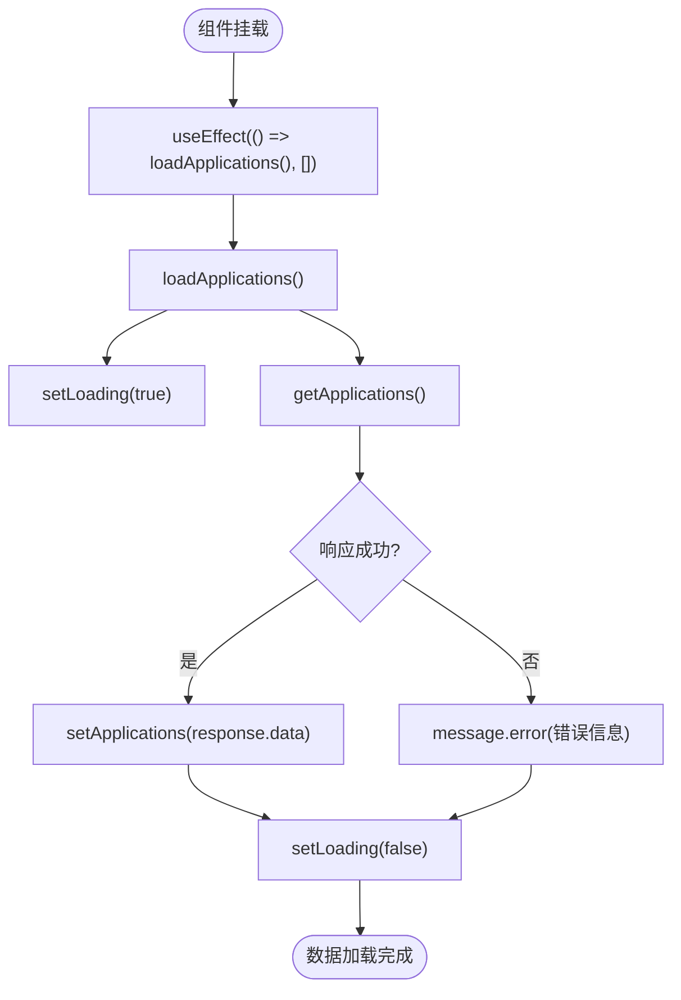
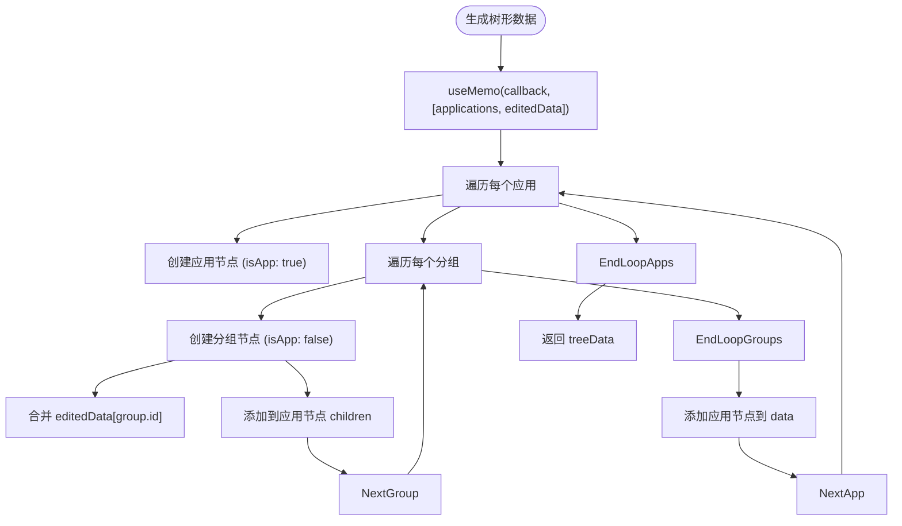
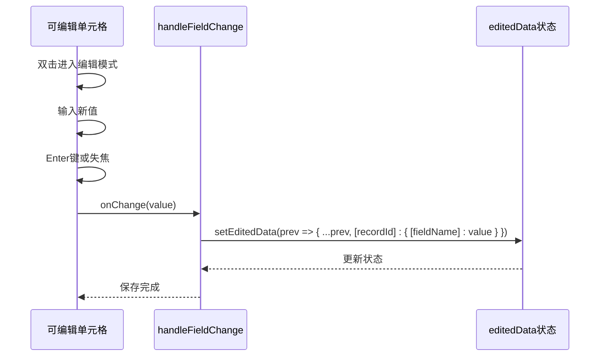
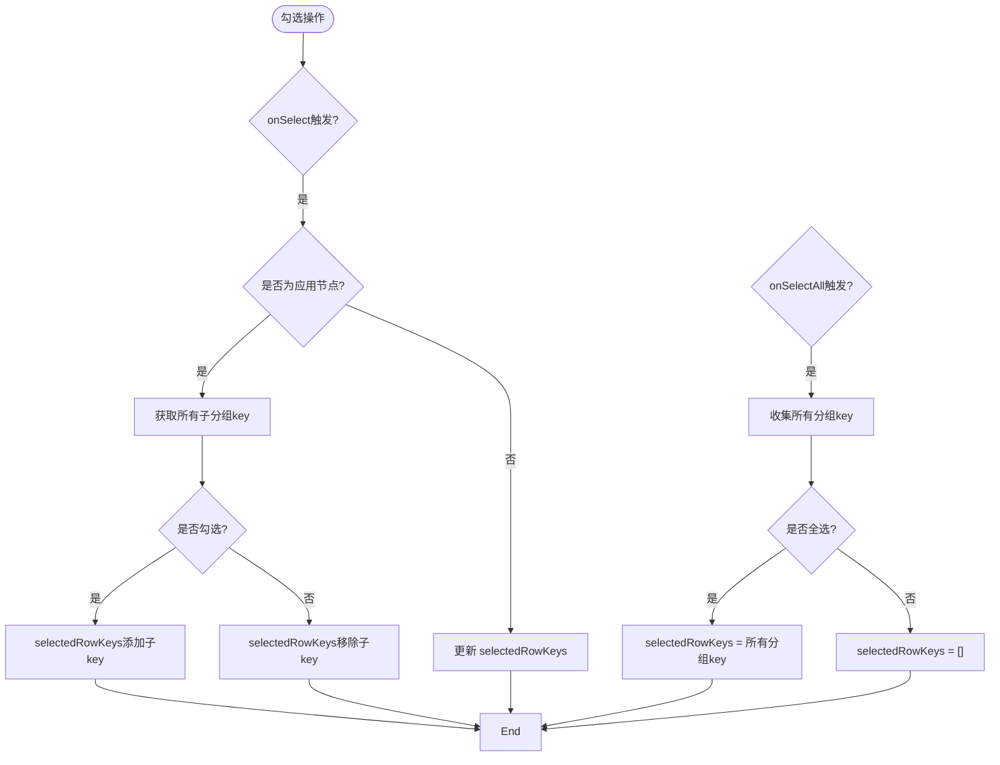
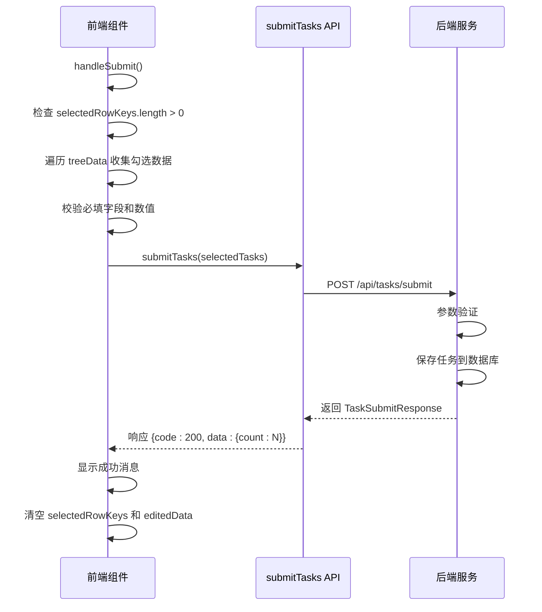

# 主页面组件

<cite>
**本文档中引用的文件**  
- [BatchSelectionPage.jsx](file://frontend/src/components/BatchSelectionPage.jsx)
- [EditableCell.jsx](file://frontend/src/components/EditableCell.jsx)
- [index.js](file://frontend/src/api/index.js)
- [BatchSelectionController.java](file://backend/src/main/java/com/example/batchselection/controller/BatchSelectionController.java)
- [BatchSelectionServiceImpl.java](file://backend/src/main/java/com/example/batchselection/service/impl/BatchSelectionServiceImpl.java)
</cite>

## 目录
1. [简介](#简介)
2. [核心状态管理](#核心状态管理)
3. [树形数据结构优化](#树形数据结构优化)
4. [可编辑单元格实现](#可编辑单元格实现)
5. [行选择与勾选联动](#行选择与勾选联动)
6. [任务提交流程](#任务提交流程)
7. [扩展建议](#扩展建议)

## 简介
`BatchSelectionPage` 是前端应用的核心组件，负责展示和管理批量勾选信息。该组件通过 React 的 `useState` 和 `useEffect` 实现数据加载、勾选状态和编辑数据的管理，结合 Ant Design 的 Table 组件实现树形表格展示。用户可通过勾选分组、编辑字段并提交任务，完成批量信息配置。

**Section sources**
- [BatchSelectionPage.jsx](file://frontend/src/components/BatchSelectionPage.jsx#L1-L350)

## 核心状态管理
组件使用多个 `useState` 钩子管理应用状态：
- `loading`：控制数据加载状态
- `submitting`：控制提交按钮的加载状态
- `applications`：存储从后端获取的应用数据
- `selectedRowKeys`：存储当前勾选的行键值
- `editedData`：存储用户编辑的字段数据

数据加载通过 `useEffect` 在组件挂载时触发 `loadApplications` 函数，调用 `getApplications` API 获取数据并更新 `applications` 状态。

**Diagram sources**
- [BatchSelectionPage.jsx](file://frontend/src/components/BatchSelectionPage.jsx#L13-L38)

**Section sources**
- [BatchSelectionPage.jsx](file://frontend/src/components/BatchSelectionPage.jsx#L13-L38)
- [index.js](file://frontend/src/api/index.js#L23-L25)

## 树形数据结构优化
`treeData` 使用 `useMemo` 将 `applications` 数据转换为树形结构，避免每次渲染时重复计算。该结构包含应用级节点（`isApp: true`）和分组级节点（`isApp: false`），并合并 `editedData` 中的编辑值。

`useMemo` 的依赖项为 `[applications, editedData]`，确保仅当这两个状态变化时才重新计算树形数据，提升性能。

**Diagram sources**
- [BatchSelectionPage.jsx](file://frontend/src/components/BatchSelectionPage.jsx#L41-L75)

**Section sources**
- [BatchSelectionPage.jsx](file://frontend/src/components/BatchSelectionPage.jsx#L41-L75)

## 可编辑单元格实现
表格列定义中的 `render` 函数集成了 `EditableCell` 组件，实现可编辑单元格。`EditableCell` 通过双击事件进入编辑模式，并支持键盘操作（Enter 保存，ESC 取消）。

`handleFieldChange` 函数接收字段变更，更新 `editedData` 状态，利用展开运算符保留原有数据，实现局部更新。

**Diagram sources**
- [BatchSelectionPage.jsx](file://frontend/src/components/BatchSelectionPage.jsx#L78-L85)
- [EditableCell.jsx](file://frontend/src/components/EditableCell.jsx#L20-L44)

**Section sources**
- [BatchSelectionPage.jsx](file://frontend/src/components/BatchSelectionPage.jsx#L78-L85)
- [EditableCell.jsx](file://frontend/src/components/EditableCell.jsx#L7-L105)

## 行选择与勾选联动
`rowSelection` 配置实现父子节点勾选联动：
- `onChange`：同步 `selectedRowKeys` 状态
- `onSelect`：处理应用级节点勾选时，自动勾选/取消所有子分组
- `onSelectAll`：全选时仅选择分组行，排除应用行
- `checkStrictly: false`：启用父子节点关联选择

**Diagram sources**
- [BatchSelectionPage.jsx](file://frontend/src/components/BatchSelectionPage.jsx#L214-L248)

**Section sources**
- [BatchSelectionPage.jsx](file://frontend/src/components/BatchSelectionPage.jsx#L214-L248)

## 任务提交流程
提交任务时，组件执行以下流程：
1. 检查是否至少勾选一个分组
2. 收集勾选的分组数据
3. 校验必填字段和数值合法性
4. 调用 `submitTasks` API 提交数据
5. 处理响应结果并清空状态

后端通过 `BatchSelectionController` 和 `BatchSelectionServiceImpl` 处理请求，验证参数并保存任务。

**Diagram sources**
- [BatchSelectionPage.jsx](file://frontend/src/components/BatchSelectionPage.jsx#L251-L302)
- [index.js](file://frontend/src/api/index.js#L31-L33)
- [BatchSelectionController.java](file://backend/src/main/java/com/example/batchselection/controller/BatchSelectionController.java#L48-L61)
- [BatchSelectionServiceImpl.java](file://backend/src/main/java/com/example/batchselection/service/impl/BatchSelectionServiceImpl.java#L64-L93)

**Section sources**
- [BatchSelectionPage.jsx](file://frontend/src/components/BatchSelectionPage.jsx#L251-L302)

## 扩展建议
为便于组件扩展，建议：
1. **新增列字段**：在 `columns` 数组中添加新列，定义 `dataIndex` 和 `render` 函数，集成 `EditableCell`
2. **自定义校验规则**：在 `handleSubmit` 中增加校验逻辑，或在 `EditableCell` 中实现字段级校验
3. **支持更多数据类型**：扩展 `EditableCell` 支持日期、下拉框等输入类型
4. **增强用户体验**：添加批量编辑、撤销操作等功能

**Section sources**
- [BatchSelectionPage.jsx](file://frontend/src/components/BatchSelectionPage.jsx#L89-L211)
- [EditableCell.jsx](file://frontend/src/components/EditableCell.jsx#L7-L105)