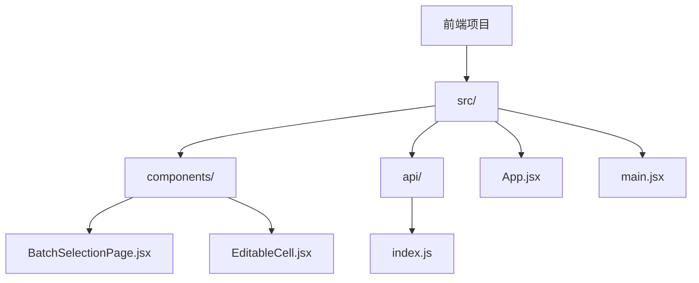
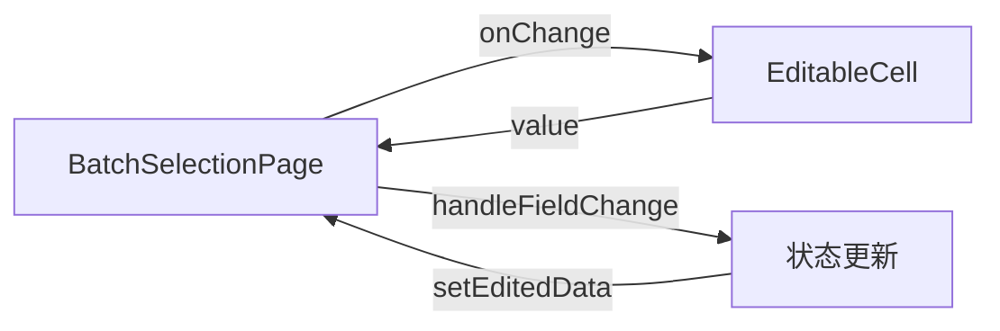
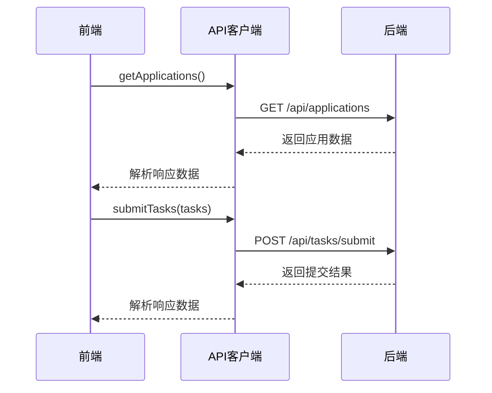
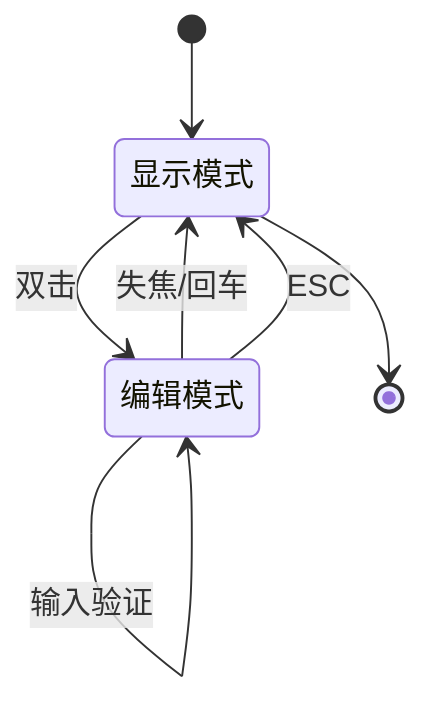
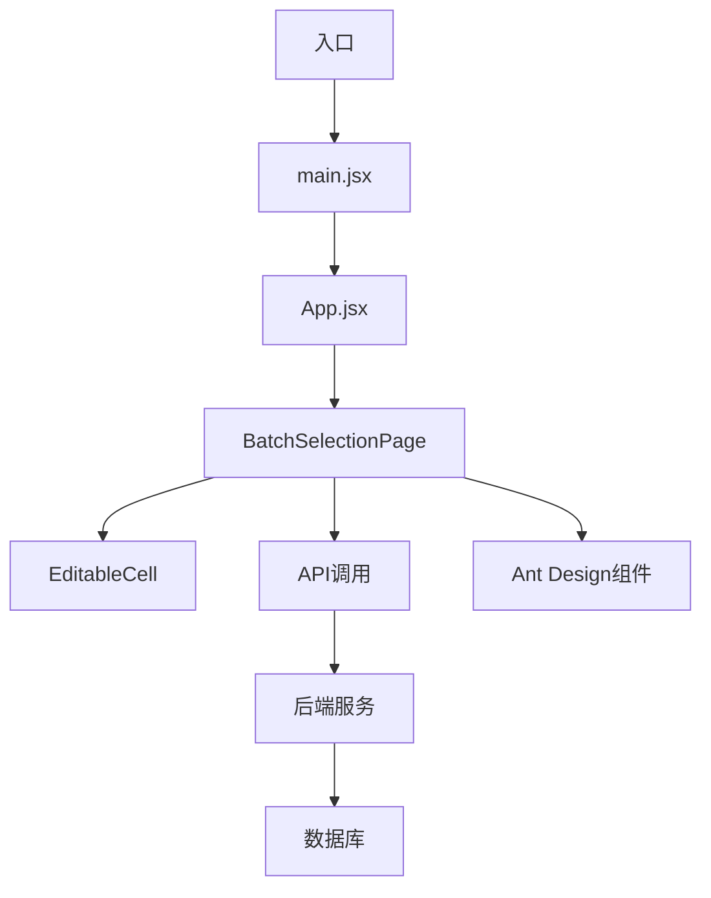
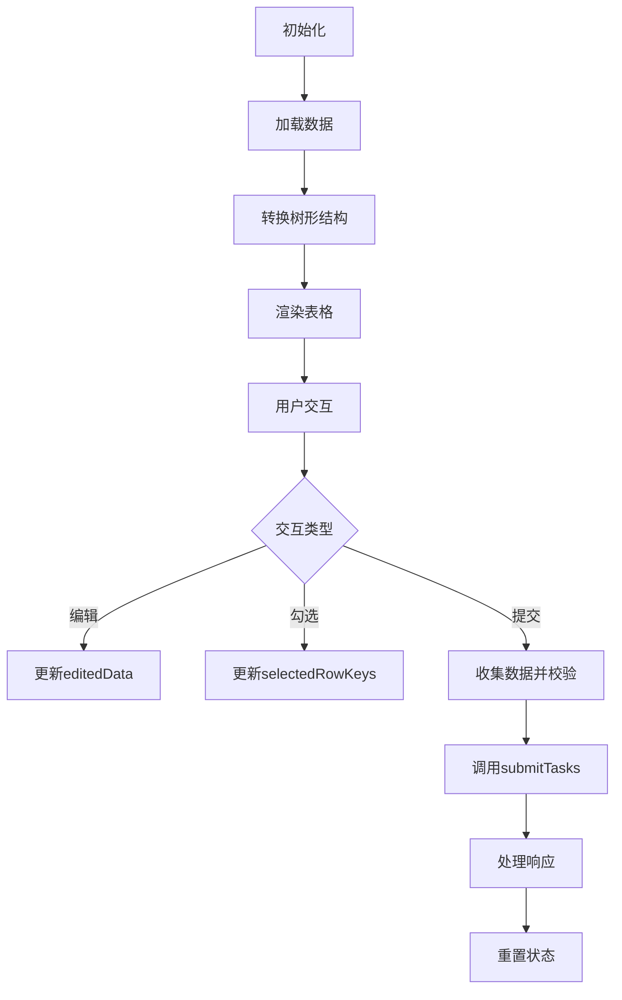

# 前端架构

<cite>
**本文档引用的文件**
- [BatchSelectionPage.jsx](file://frontend/src/components/BatchSelectionPage.jsx)
- [EditableCell.jsx](file://frontend/src/components/EditableCell.jsx)
- [index.js](file://frontend/src/api/index.js)
- [App.jsx](file://frontend/src/App.jsx)
- [main.jsx](file://frontend/src/main.jsx)
</cite>

## 目录
1. [项目结构](#项目结构)
2. [核心组件分析](#核心组件分析)
3. [组件通信与状态管理](#组件通信与状态管理)
4. [数据交互机制](#数据交互机制)
5. [用户交互设计](#用户交互设计)
6. [架构流程图](#架构流程图)
7. [最佳实践建议](#最佳实践建议)

## 项目结构

前端项目采用标准的React应用结构，主要包含组件、API接口和服务模块。整体结构清晰，遵循功能分离原则。

**文档来源**
- [BatchSelectionPage.jsx](file://frontend/src/components/BatchSelectionPage.jsx)
- [EditableCell.jsx](file://frontend/src/components/EditableCell.jsx)
- [index.js](file://frontend/src/api/index.js)

## 核心组件分析

### BatchSelectionPage组件

作为主页面组件，BatchSelectionPage负责组织整个用户界面，包含树形表格渲染、勾选状态管理和提交流程控制。

**状态管理**
- `loading`: 控制数据加载状态
- `submitting`: 控制提交按钮加载状态
- `applications`: 存储从后端获取的应用数据
- `selectedRowKeys`: 管理勾选行的键值
- `editedData`: 存储编辑中的数据

**功能特性**
- 使用`useEffect`在组件挂载时加载应用数据
- 通过`useMemo`优化树形数据转换性能
- 实现父子级勾选联动逻辑
- 提供完整的表单校验机制

**Section sources**
- [BatchSelectionPage.jsx](file://frontend/src/components/BatchSelectionPage.jsx#L13-L18)

### EditableCell组件

可编辑单元格组件实现了双击编辑、类型校验和失焦保存等交互行为。

**交互逻辑**
- 双击进入编辑模式
- 失焦或回车保存更改
- ESC键取消编辑
- 支持文本和数字两种输入类型
- 内置数据校验机制

**状态管理**
- `editing`: 编辑状态标识
- `currentValue`: 当前显示值
- `tempValue`: 临时编辑值

**Section sources**
- [EditableCell.jsx](file://frontend/src/components/EditableCell.jsx#L15-L17)

## 组件通信与状态管理

### 父子组件通信

主组件与可编辑单元格之间通过props进行通信，形成清晰的数据流。

**通信机制**
- 父组件通过`onChange`回调接收子组件的值变更
- 子组件通过`value`属性接收父组件传递的值
- 使用`handleFieldChange`函数处理字段变更
- 通过`editedData`状态对象集中管理编辑数据

**Section sources**
- [BatchSelectionPage.jsx](file://frontend/src/components/BatchSelectionPage.jsx#L78-L85)
- [EditableCell.jsx](file://frontend/src/components/EditableCell.jsx#L27-L43)

### 状态管理策略

采用React Hooks进行状态管理，确保状态更新的可预测性和性能优化。

**状态更新流程**
1. 用户交互触发状态变更
2. 使用函数式更新确保状态一致性
3. 依赖`useMemo`进行性能优化
4. 通过`useEffect`监听状态变化

**Section sources**
- [BatchSelectionPage.jsx](file://frontend/src/components/BatchSelectionPage.jsx#L40-L74)

## 数据交互机制

### API客户端封装

index.js文件中封装了Axios请求，与后端进行数据交互。

**API封装特点**
- 使用axios.create创建实例
- 配置baseURL为'/api'
- 设置请求超时时间为10秒
- 定义统一的响应拦截器
- 提供getApplications和submitTasks两个接口方法

**Section sources**
- [index.js](file://frontend/src/api/index.js#L4-L19)

### 响应处理机制

通过响应拦截器统一处理API响应，简化调用方的处理逻辑。

**拦截器功能**
- 自动提取响应数据
- 统一错误处理
- 控制台输出错误信息
- 返回Promise便于链式调用

**Section sources**
- [index.js](file://frontend/src/api/index.js#L13-L18)

## 用户交互设计

### 表格交互功能

BatchSelectionPage实现了丰富的表格交互功能。

**功能特性**
- 树形表格展示应用和分组层级
- 支持应用级勾选自动联动分组
- 全选功能仅选择分组行
- 固定表头和横向滚动
- 默认展开所有行

**勾选逻辑**
- 应用级勾选：自动勾选/取消所有子分组
- 全选操作：只选择分组行，不包括应用行
- 严格模式：允许父子节点独立选择

**Section sources**
- [BatchSelectionPage.jsx](file://frontend/src/components/BatchSelectionPage.jsx#L214-L248)

### 编辑交互流程

EditableCell组件提供了流畅的编辑体验。

**编辑流程**
1. 双击单元格进入编辑模式
2. 输入新值
3. 失焦或回车保存
4. ESC键取消编辑
5. 数字类型自动校验正整数

**Section sources**
- [EditableCell.jsx](file://frontend/src/components/EditableCell.jsx#L20-L58)

## 架构流程图

### 整体架构

**架构特点**
- 单入口应用结构
- 组件层级清晰
- API调用集中管理
- 第三方组件集成

**Diagram sources**
- [main.jsx](file://frontend/src/main.jsx#L6-L10)
- [App.jsx](file://frontend/src/App.jsx#L6-L10)

### 数据流图

**数据流特点**
- 单向数据流设计
- 状态集中管理
- 异步操作处理
- 错误处理机制

**Diagram sources**
- [BatchSelectionPage.jsx](file://frontend/src/components/BatchSelectionPage.jsx#L24-L37)
- [BatchSelectionPage.jsx](file://frontend/src/components/BatchSelectionPage.jsx#L251-L302)

## 最佳实践建议

### 组件设计模式

**可复用组件设计**
- EditableCell组件具有高度可复用性
- 支持多种输入类型
- 提供灵活的配置选项
- 内置校验逻辑

**主组件设计**
- 单一职责原则
- 状态管理清晰
- 逻辑分离合理
- 性能优化考虑

### 状态管理最佳实践

**状态设计原则**
- 将相关状态分组管理
- 使用useMemo优化计算密集型操作
- 避免不必要的重新渲染
- 保持状态的单一来源

### API交互最佳实践

**请求封装建议**
- 统一API客户端配置
- 使用拦截器处理公共逻辑
- 提供清晰的错误处理
- 保持接口的简洁性

**错误处理策略**
- 用户友好的错误提示
- 详细的错误日志记录
- 网络异常处理
- 超时机制

**Section sources**
- [index.js](file://frontend/src/api/index.js#L13-L18)
- [BatchSelectionPage.jsx](file://frontend/src/components/BatchSelectionPage.jsx#L34-L36)
- [BatchSelectionPage.jsx](file://frontend/src/components/BatchSelectionPage.jsx#L299-L300)