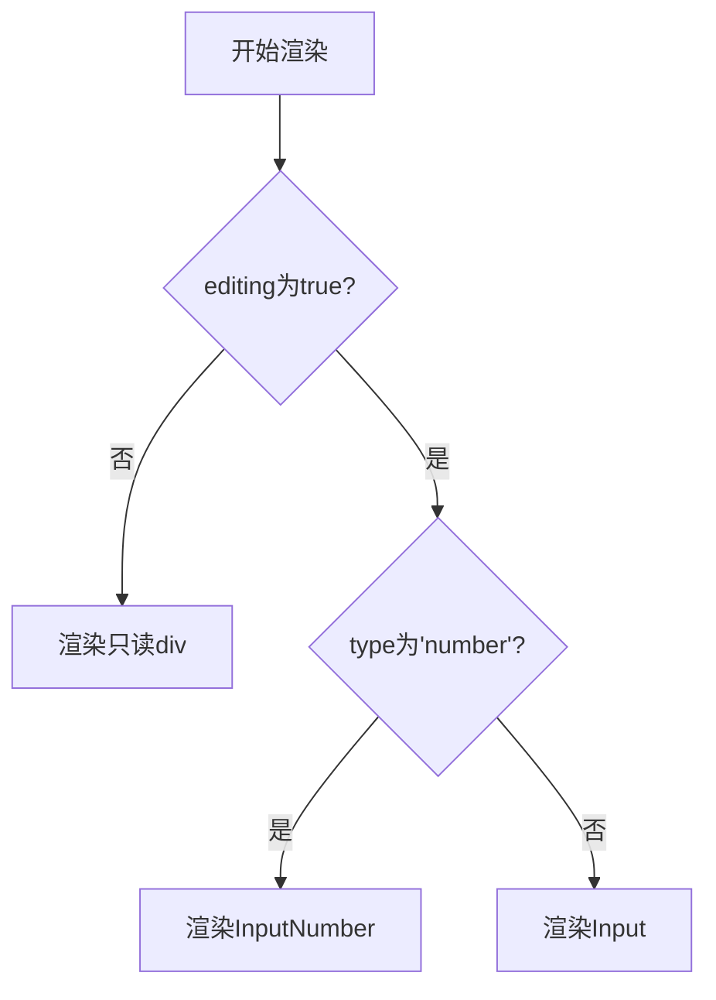

# 可编辑单元格组件

<cite>
**Referenced Files in This Document**  
- [EditableCell.jsx](file://frontend/src/components/EditableCell.jsx)
- [BatchSelectionPage.jsx](file://frontend/src/components/BatchSelectionPage.jsx)
</cite>

## 目录
1. [简介](#简介)
2. [核心状态管理](#核心状态管理)
3. [编辑模式触发与退出](#编辑模式触发与退出)
4. [值处理与校验逻辑](#值处理与校验逻辑)
5. [动态控件渲染机制](#动态控件渲染机制)
6. [键盘事件处理](#键盘事件处理)
7. [组件集成与复用](#组件集成与复用)
8. [总结](#总结)

## 简介

`EditableCell` 是一个功能完整的可编辑单元格组件，专为表格场景设计，允许用户通过双击操作在查看模式和编辑模式之间切换。该组件通过精细化的状态管理，实现了临时输入值与最终持久化值的隔离，确保了数据的一致性和用户体验的流畅性。它支持文本和数字两种输入类型，并内置了相应的格式化与校验逻辑，是构建交互式数据表格的理想选择。

**Section sources**
- [EditableCell.jsx](file://frontend/src/components/EditableCell.jsx#L4-L108)

## 核心状态管理

组件通过三个关键的 React 状态（`useState`）来精确控制其行为和数据流：

- **`editing`**: 布尔状态，用于标识当前单元格是否处于编辑模式。该状态直接决定了组件渲染 `Input`/`InputNumber` 控件还是只读的展示视图。
- **`currentValue`**: 存储单元格的“最终”或“已确认”值。这个值在用户成功保存编辑后更新，并在非编辑模式下显示。
- **`tempValue`**: 专门用于存储编辑过程中的“临时”输入值。这是实现值隔离的核心。当用户开始编辑时，`tempValue` 被初始化为当前的 `currentValue`。所有在输入框中的修改都只影响 `tempValue`，而不会直接修改 `currentValue`。这种设计确保了在用户取消编辑（如按 ESC）时，可以无缝地恢复到原始状态，而不会留下任何中间值。

这种状态分离模式（`currentValue` 代表持久状态，`tempValue` 代表瞬时状态）是构建健壮的可编辑 UI 组件的最佳实践。

**Section sources**
- [EditableCell.jsx](file://frontend/src/components/EditableCell.jsx#L16-L18)

## 编辑模式触发与退出

### 进入编辑模式
编辑模式通过双击（`onDoubleClick`）事件触发。当用户双击单元格时，会调用 `handleEdit` 函数。该函数将 `editing` 状态设置为 `true`，从而触发组件重新渲染为编辑视图。同时，它会将 `currentValue` 的当前值同步到 `tempValue`，为用户提供一个干净的编辑起点。

### 退出编辑模式
退出编辑模式有两种方式，分别对应保存和取消操作：
- **失焦（Blur）**: 当编辑控件失去焦点时（例如，用户点击了页面其他地方），会触发 `onBlur` 事件，进而调用 `handleSave` 函数。
- **回车（Enter）**: 在编辑状态下按 Enter 键，也会调用 `handleSave` 函数。

这两种方式都旨在确认用户的编辑意图并保存更改。

**Section sources**
- [EditableCell.jsx](file://frontend/src/components/EditableCell.jsx#L92-L104)
- [EditableCell.jsx](file://frontend/src/components/EditableCell.jsx#L21-L24)
- [EditableCell.jsx](file://frontend/src/components/EditableCell.jsx#L68-L69)
- [EditableCell.jsx](file://frontend/src/components/EditableCell.jsx#L54-L55)

## 值处理与校验逻辑

`handleSave` 函数是处理用户输入并进行校验的核心逻辑。其行为根据 `type` 属性的不同而有所区别：

### 文本类型 (`type='text'`)
当 `type` 属性为 `'text'` 或未指定时，组件处理文本输入。
1.  首先，将 `tempValue` 转换为字符串并使用 `trim()` 方法去除首尾空格。
2.  然后，将清理后的值同时更新到 `currentValue` 和通过 `onChange` 回调通知父组件。
3.  最后，将 `editing` 状态设为 `false`，完成保存。

此逻辑确保了文本输入的整洁性，避免了因意外空格导致的数据问题。

### 数字类型 (`type='number'`)
当 `type` 属性为 `'number'` 时，组件处理数值输入，并包含严格的校验。
1.  使用 `parseInt()` 函数尝试将 `tempValue` 解析为整数。
2.  进行双重校验：
    -   `!isNaN(num)`: 确保解析结果是一个有效的数字。
    -   `num > 0`: 确保数值为正整数（根据 `min={1}` 的默认属性）。
3.  如果校验通过，则将解析后的整数更新到 `currentValue` 并通过 `onChange` 回调通知父组件。
4.  如果校验失败（例如，输入了非数字字符或负数），则调用 `handleCancel` 逻辑，将 `tempValue` 恢复为 `currentValue` 的原始值，从而撤销无效的编辑。

这种校验机制保证了数据的有效性，防止了非法数值的输入。

**Section sources**
- [EditableCell.jsx](file://frontend/src/components/EditableCell.jsx#L27-L43)
- [EditableCell.jsx](file://frontend/src/components/EditableCell.jsx#L31-L38)

## 动态控件渲染机制

组件根据 `type` 属性的值，在编辑模式下动态渲染不同的 Ant Design 输入控件，实现了高度的灵活性。

**Diagram sources**
- [EditableCell.jsx](file://frontend/src/components/EditableCell.jsx#L62-L88)

### 文本输入
当 `type` 不是 `'number'` 时，组件渲染一个 Ant Design 的 `Input` 组件。它将 `tempValue` 作为 `value`，并将 `setTempValue` 作为 `onChange` 处理函数，确保输入能实时更新临时状态。`placeholder` 属性也会被传递，以提供输入提示。

### 数值输入
当 `type` 为 `'number'` 时，组件渲染一个 `InputNumber` 组件。除了 `value` 和 `onChange`，它还接收并应用了 `min` 和 `max` 属性。这些属性直接传递给 `InputNumber`，利用其内置的数值范围限制功能，为用户提供即时的输入反馈（例如，当输入值小于 `min` 时，输入框可能会变红或禁用减小按钮）。

**Section sources**
- [EditableCell.jsx](file://frontend/src/components/EditableCell.jsx#L63-L75)
- [EditableCell.jsx](file://frontend/src/components/EditableCell.jsx#L77-L87)

## 键盘事件处理

`handleKeyDown` 函数监听键盘事件，为用户提供快捷的编辑操作：
- **Enter 键**: 触发 `handleSave()`，确认并保存当前编辑。
- **Escape (ESC) 键**: 触发 `handleCancel()`，放弃当前编辑，恢复到编辑前的状态。

此功能极大地提升了键盘用户的操作效率，符合常见的桌面应用交互习惯。

**Section sources**
- [EditableCell.jsx](file://frontend/src/components/EditableCell.jsx#L53-L59)

## 组件集成与复用

`EditableCell` 组件在 `BatchSelectionPage.jsx` 中被广泛复用，展示了其在实际业务场景中的应用。

### 集成方式
父组件通过以下方式集成 `EditableCell`：
1.  **传递当前值**: 通过 `value` 属性传入单元格的当前数据。
2.  **接收变更通知**: 通过 `onChange` 回调函数接收用户编辑后的新值。在 `BatchSelectionPage` 中，`onChange` 被连接到 `handleFieldChange` 函数，用于更新一个集中管理的 `editedData` 状态对象。
3.  **配置行为**: 通过 `type`、`min`、`max` 和 `placeholder` 等属性来定制组件的行为和外观。

### 复用示例
在 `BatchSelectionPage` 的表格列定义中，可以看到多个 `EditableCell` 的实例：
- **文本字段**: 如“分组名”、“机房”等列，使用默认的文本类型，并提供 `placeholder`。
- **数字字段**: 如“硬盘大小”和“Pod数量”列，通过设置 `type="number"` 和 `min={1}` 来启用数值输入和正整数校验。

这种模式使得开发者可以轻松地在任何表格中集成可编辑功能，只需定义好数据流和配置即可。

**Section sources**
- [BatchSelectionPage.jsx](file://frontend/src/components/BatchSelectionPage.jsx#L101-L110)
- [BatchSelectionPage.jsx](file://frontend/src/components/BatchSelectionPage.jsx#L181-L191)

## 总结

`EditableCell` 组件通过清晰的状态管理、直观的交互设计和灵活的配置选项，成功地将一个复杂的可编辑单元格功能封装成一个可复用的独立单元。其核心在于 `currentValue` 与 `tempValue` 的分离，这为实现可靠的保存和取消操作提供了基础。结合 Ant Design 的强大输入控件，该组件不仅功能完备，而且用户体验良好。通过分析其在 `BatchSelectionPage` 中的集成方式，可以清晰地看到如何在实际项目中复用此组件，为构建动态、交互式的数据管理界面提供了有力支持。