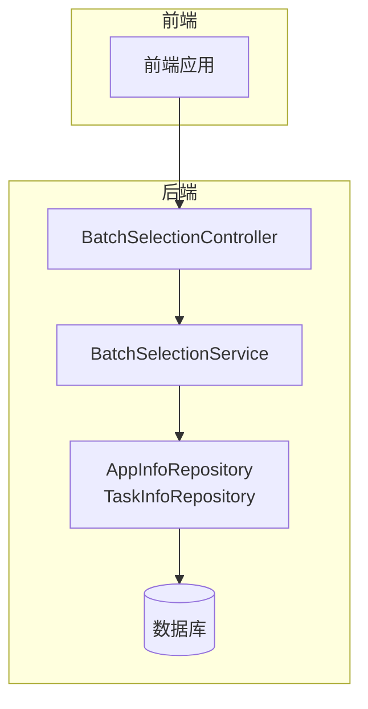
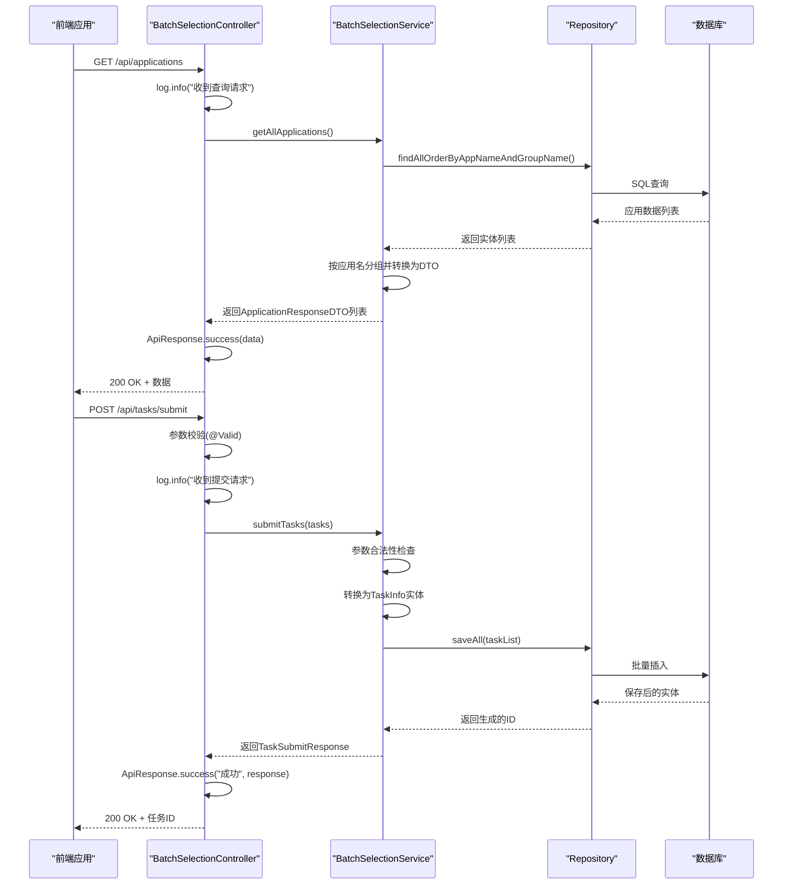
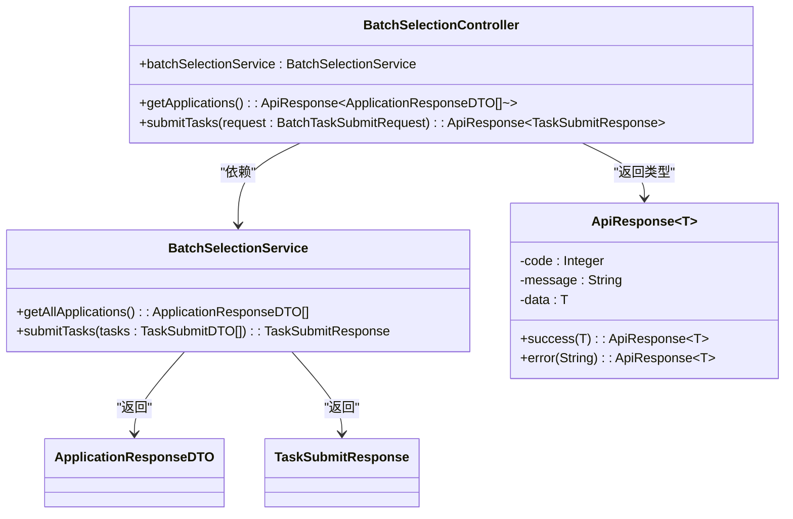
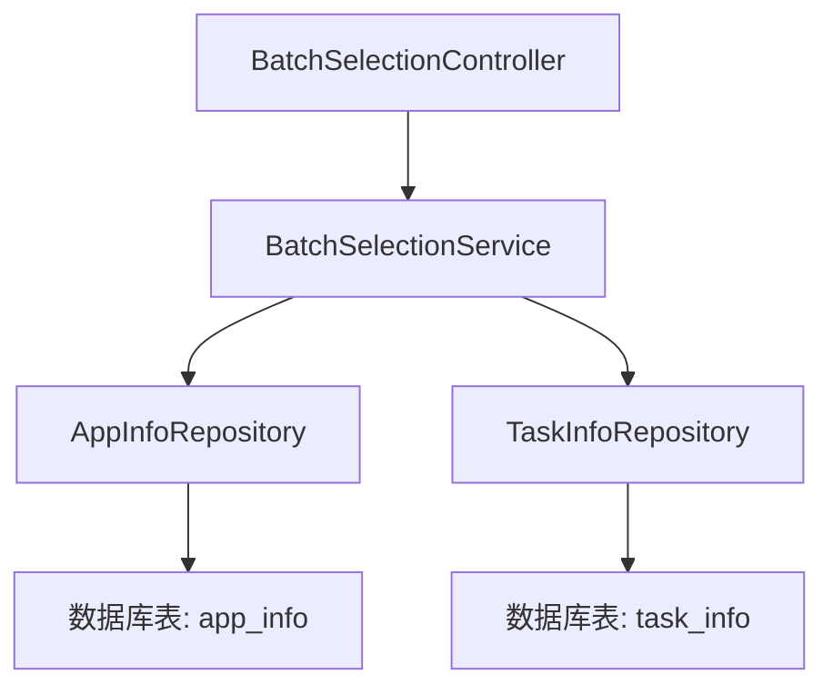

# 后端控制器

<cite>
**本文档引用的文件**   
- [BatchSelectionController.java](file://backend/src/main/java/com/example/batchselection/controller/BatchSelectionController.java)
- [ApiResponse.java](file://backend/src/main/java/com/example/batchselection/dto/ApiResponse.java)
- [BatchSelectionService.java](file://backend/src/main/java/com/example/batchselection/service/BatchSelectionService.java)
- [BatchTaskSubmitRequest.java](file://backend/src/main/java/com/example/batchselection/dto/BatchTaskSubmitRequest.java)
- [TaskSubmitDTO.java](file://backend/src/main/java/com/example/batchselection/dto/TaskSubmitDTO.java)
- [ApplicationResponseDTO.java](file://backend/src/main/java/com/example/batchselection/dto/ApplicationResponseDTO.java)
- [TaskSubmitResponse.java](file://backend/src/main/java/com/example/batchselection/dto/TaskSubmitResponse.java)
- [application.properties](file://backend/src/main/resources/application.properties)
</cite>

## 目录
1. [简介](#简介)
2. [项目结构](#项目结构)
3. [核心组件](#核心组件)
4. [架构概述](#架构概述)
5. [详细组件分析](#详细组件分析)
6. [依赖分析](#依赖分析)
7. [性能考虑](#性能考虑)
8. [故障排除指南](#故障排除指南)
9. [结论](#结论)

## 简介
`BatchSelectionController` 是本系统的核心 RESTful API 入口，负责处理前端应用的两个关键请求：获取所有应用数据和批量提交任务。该控制器通过 Spring MVC 注解实现路由映射、跨域支持、输入验证和异常处理，体现了典型的分层架构设计。本文档将深入分析其设计原理、实现逻辑和最佳实践。

## 项目结构
本项目采用标准的 Spring Boot 多层架构，分为 controller、dto、entity、repository 和 service 层。控制器层位于 `controller` 包中，负责接收 HTTP 请求并返回响应；数据传输对象（DTO）位于 `dto` 包中，用于封装请求和响应数据；实体类位于 `entity` 包中，映射数据库表结构；服务层位于 `service` 包中，封装业务逻辑。



**Diagram sources**
- [BatchSelectionController.java](file://backend/src/main/java/com/example/batchselection/controller/BatchSelectionController.java#L15-L62)
- [BatchSelectionService.java](file://backend/src/main/java/com/example/batchselection/service/BatchSelectionService.java#L7-L24)

**Section sources**
- [BatchSelectionController.java](file://backend/src/main/java/com/example/batchselection/controller/BatchSelectionController.java#L1-L62)
- [BatchSelectionService.java](file://backend/src/main/java/com/example/batchselection/service/BatchSelectionService.java#L1-L26)

## 核心组件
`BatchSelectionController` 是系统的主要入口点，通过 `@RestController` 注解声明为 REST 控制器，所有方法返回的数据将直接作为响应体。它依赖 `BatchSelectionService` 实现业务逻辑，通过构造函数注入（`@RequiredArgsConstructor`）实现依赖注入，确保了松耦合和可测试性。

**Section sources**
- [BatchSelectionController.java](file://backend/src/main/java/com/example/batchselection/controller/BatchSelectionController.java#L15-L62)
- [BatchSelectionService.java](file://backend/src/main/java/com/example/batchselection/service/BatchSelectionService.java#L7-L24)

## 架构概述
系统采用典型的 MVC 架构，控制器接收请求后调用服务层处理业务逻辑，服务层通过 JPA Repository 访问数据库。`ApiResponse` 类作为统一的响应封装，确保了 API 返回格式的一致性。输入验证通过 `@Valid` 和 Bean Validation 注解实现，异常处理通过 try-catch 块和日志记录保障系统稳定性。



**Diagram sources**
- [BatchSelectionController.java](file://backend/src/main/java/com/example/batchselection/controller/BatchSelectionController.java#L15-L62)
- [BatchSelectionServiceImpl.java](file://backend/src/main/java/com/example/batchselection/service/impl/BatchSelectionServiceImpl.java#L22-L126)

## 详细组件分析

### BatchSelectionController 分析
`BatchSelectionController` 类使用了多个 Spring 注解来实现其功能。`@RestController` 将其标记为 REST 控制器，`@RequestMapping("/api")` 设置基础路径，`@CrossOrigin(origins = "*")` 启用跨域资源共享，允许来自任何域的请求。`@Validated` 启用方法级别的验证支持。

#### 注解使用说明


**Diagram sources**
- [BatchSelectionController.java](file://backend/src/main/java/com/example/batchselection/controller/BatchSelectionController.java#L15-L62)
- [ApiResponse.java](file://backend/src/main/java/com/example/batchselection/dto/ApiResponse.java#L6-L33)

#### GET /api/applications 端点
该端点处理获取所有应用数据的请求。实现逻辑包括：记录请求日志、调用服务层获取数据、封装成功响应或捕获异常返回错误信息。通过 try-catch 结构实现了健壮的异常处理，确保任何异常都不会导致服务崩溃。

**Section sources**
- [BatchSelectionController.java](file://backend/src/main/java/com/example/batchselection/controller/BatchSelectionController.java#L33-L42)
- [BatchSelectionServiceImpl.java](file://backend/src/main/java/com/example/batchselection/service/impl/BatchSelectionServiceImpl.java#L34-L62)

#### POST /api/tasks/submit 端点
该端点处理批量提交任务的请求。关键特性包括：`@Valid` 注解触发请求体验证、`@RequestBody` 绑定 JSON 请求体、多层异常处理。方法首先验证输入，然后调用服务层处理任务提交，最后根据结果返回相应的响应。对 `IllegalArgumentException` 的特殊处理提供了更精确的客户端错误反馈。

**Section sources**
- [BatchSelectionController.java](file://backend/src/main/java/com/example/batchselection/controller/BatchSelectionController.java#L49-L61)
- [BatchTaskSubmitRequest.java](file://backend/src/main/java/com/example/batchselection/dto/BatchTaskSubmitRequest.java#L1-L18)
- [TaskSubmitDTO.java](file://backend/src/main/java/com/example/batchselection/dto/TaskSubmitDTO.java#L1-L39)

### 统一响应格式分析
`ApiResponse` 类实现了统一的响应封装策略，包含状态码、消息和数据三个核心字段。通过静态工厂方法 `success()` 和 `error()` 简化了响应创建过程，确保了 API 返回格式的一致性，便于前端统一处理。

```mermaid
classDiagram
class ApiResponse~T~ {
-code : Integer
-message : String
-data : T
+success(T) : ApiResponse~T~
+success(String, T) : ApiResponse~T~
+error(Integer, String) : ApiResponse~T~
+error(String) : ApiResponse~T~
}
ApiResponse~ApplicationResponseDTO[]~~ --> ApplicationResponseDTO
ApiResponse~TaskSubmitResponse~ --> TaskSubmitResponse
```

**Diagram sources**
- [ApiResponse.java](file://backend/src/main/java/com/example/batchselection/dto/ApiResponse.java#L6-L33)
- [ApplicationResponseDTO.java](file://backend/src/main/java/com/example/batchselection/dto/ApplicationResponseDTO.java#L1-L15)
- [TaskSubmitResponse.java](file://backend/src/main/java/com/example/batchselection/dto/TaskSubmitResponse.java#L1-L19)

**Section sources**
- [ApiResponse.java](file://backend/src/main/java/com/example/batchselection/dto/ApiResponse.java#L1-L35)

## 依赖分析
控制器层依赖服务层接口，服务层依赖数据访问层，形成了清晰的依赖链。通过接口编程和依赖注入，各层之间保持松耦合。`BatchSelectionController` 仅依赖 `BatchSelectionService` 接口，不关心具体实现，这有利于单元测试和未来重构。



**Diagram sources**
- [BatchSelectionController.java](file://backend/src/main/java/com/example/batchselection/controller/BatchSelectionController.java#L15-L62)
- [BatchSelectionService.java](file://backend/src/main/java/com/example/batchselection/service/BatchSelectionService.java#L7-L24)
- [AppInfo.java](file://backend/src/main/java/com/example/batchselection/entity/AppInfo.java#L1-L61)

**Section sources**
- [BatchSelectionController.java](file://backend/src/main/java/com/example/batchselection/controller/BatchSelectionController.java#L1-L62)
- [BatchSelectionService.java](file://backend/src/main/java/com/example/batchselection/service/BatchSelectionService.java#L1-L26)
- [pom.xml](file://backend/pom.xml#L42-L86)

## 性能考虑
系统在设计时考虑了性能因素。服务层的 `submitTasks` 方法使用 `@Transactional` 注解确保数据库操作的原子性，并通过 `saveAll` 实现批量插入，减少了数据库交互次数。查询方法通过自定义 JPQL 查询 `findAllOrderByAppNameAndGroupName` 优化了数据获取效率。同时，通过限制单次提交任务数量（不超过1000条）防止了大规模请求对系统造成压力。

## 故障排除指南
当 API 出现问题时，应首先检查日志输出。`@Slf4j` 注解提供了详细的日志记录，`getApplications` 方法中的 `log.error` 可以捕获查询失败的异常信息，`submitTasks` 方法中的 `log.warn` 和 `log.error` 分别记录了参数错误和系统错误。此外，应检查数据库连接配置（`application.properties`）和输入数据的合法性。

**Section sources**
- [BatchSelectionController.java](file://backend/src/main/java/com/example/batchselection/controller/BatchSelectionController.java#L35-L41)
- [BatchSelectionController.java](file://backend/src/main/java/com/example/batchselection/controller/BatchSelectionController.java#L50-L59)
- [application.properties](file://backend/src/main/resources/application.properties#L1-L33)

## 结论
`BatchSelectionController` 作为系统的 RESTful API 入口，通过合理的注解配置、清晰的分层架构和健壮的错误处理机制，实现了高效、稳定的服务。其设计遵循了 Spring Boot 最佳实践，包括依赖注入、统一响应封装、输入验证和日志记录，为系统的可维护性和可扩展性奠定了坚实基础。