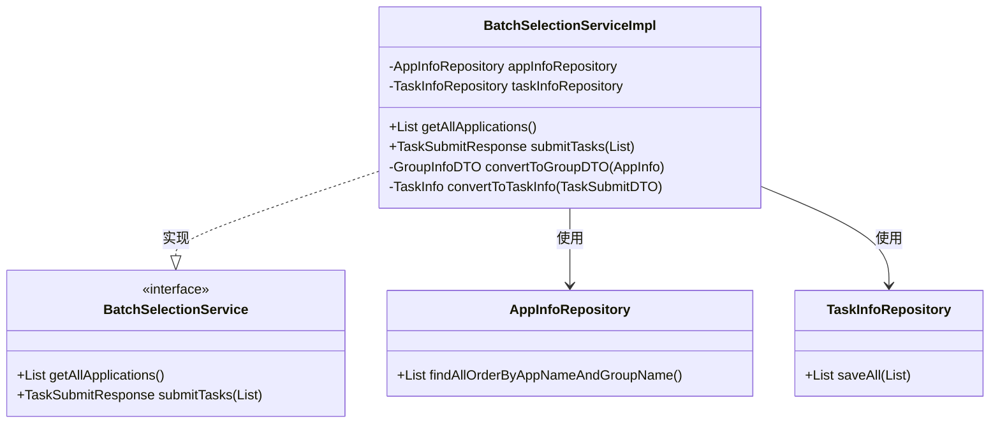
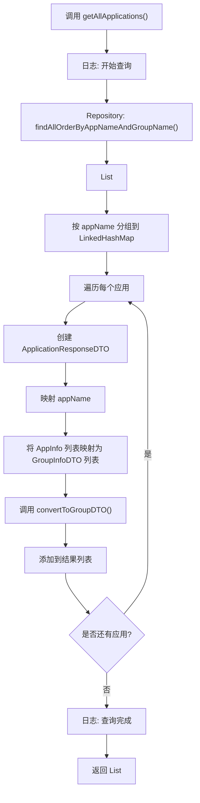
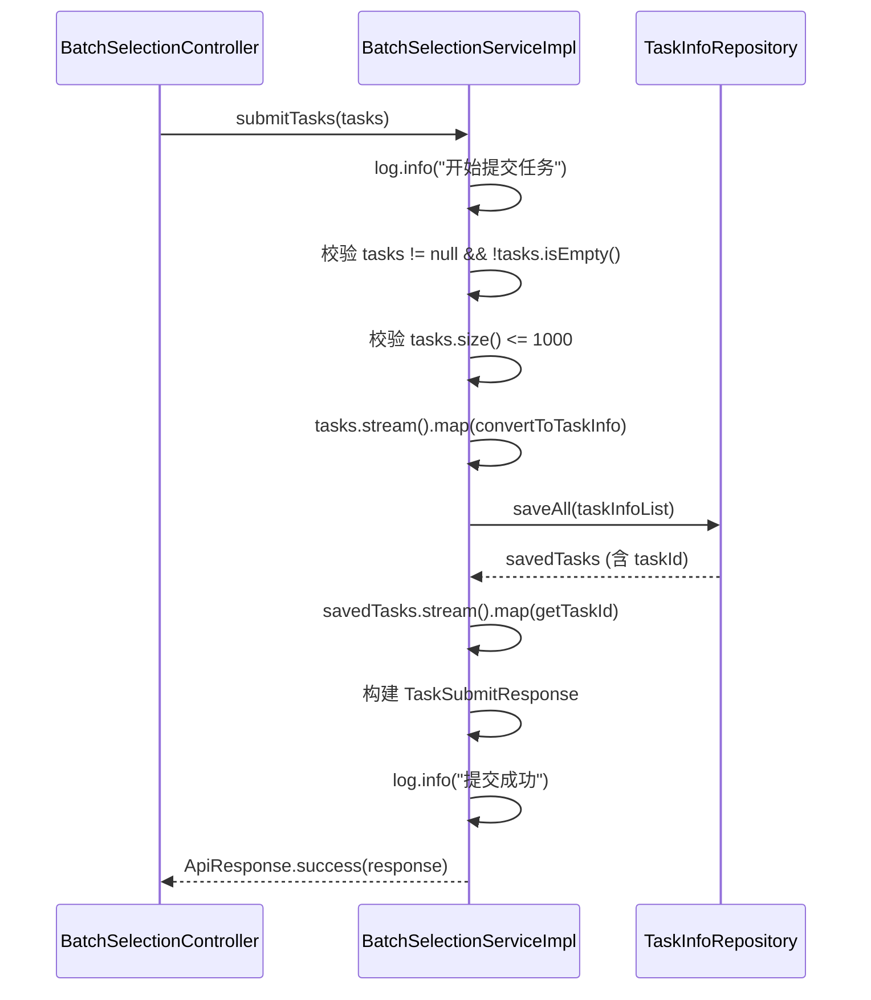

# 后端服务层

<cite>
**本文档引用的文件**  
- [BatchSelectionService.java](file://backend/src/main/java/com/example/batchselection/service/BatchSelectionService.java)
- [BatchSelectionServiceImpl.java](file://backend/src/main/java/com/example/batchselection/service/impl/BatchSelectionServiceImpl.java)
- [AppInfoRepository.java](file://backend/src/main/java/com/example/batchselection/repository/AppInfoRepository.java)
- [TaskInfoRepository.java](file://backend/src/main/java/com/example/batchselection/repository/TaskInfoRepository.java)
- [ApplicationResponseDTO.java](file://backend/src/main/java/com/example/batchselection/dto/ApplicationResponseDTO.java)
- [GroupInfoDTO.java](file://backend/src/main/java/com/example/batchselection/dto/GroupInfoDTO.java)
- [TaskSubmitDTO.java](file://backend/src/main/java/com/example/batchselection/dto/TaskSubmitDTO.java)
- [TaskSubmitResponse.java](file://backend/src/main/java/com/example/batchselection/dto/TaskSubmitResponse.java)
- [AppInfo.java](file://backend/src/main/java/com/example/batchselection/entity/AppInfo.java)
- [TaskInfo.java](file://backend/src/main/java/com/example/batchselection/entity/TaskInfo.java)
</cite>

## 目录
1. [引言](#引言)
2. [服务层职责概述](#服务层职责概述)
3. [接口与实现结构分析](#接口与实现结构分析)
4. [getAllApplications() 方法详解](#getallapplications-方法详解)
5. [submitTasks() 方法深度解析](#submittasks-方法深度解析)
6. [事务管理机制](#事务管理机制)
7. [数据转换流程](#数据转换流程)
8. [业务校验与异常处理](#业务校验与异常处理)
9. [日志记录与性能优化](#日志记录与性能优化)
10. [总结](#总结)

## 引言
本文档深入解析 `BatchSelectionService` 接口及其核心实现类 `BatchSelectionServiceImpl`，重点阐述其在MVC架构中的角色与职责。通过分析 `getAllApplications()` 和 `submitTasks()` 两个核心方法，揭示服务层如何封装业务逻辑、管理事务、进行数据映射与转换，并体现最佳实践中的日志记录与性能优化策略。

## 服务层职责概述
在典型的MVC架构中，服务层（Service Layer）承担着核心业务逻辑的封装与协调职责。它位于控制器（Controller）与数据访问层（Repository）之间，主要职责包括：
- **业务逻辑封装**：将复杂的业务规则集中管理，避免在控制器中编写冗余逻辑。
- **事务管理**：通过 `@Transactional` 注解确保数据操作的原子性与一致性。
- **数据转换**：在实体（Entity）与数据传输对象（DTO）之间进行安全、清晰的映射。
- **调用协调**：整合多个Repository操作，提供统一的业务服务接口。

**Section sources**
- [BatchSelectionService.java](file://backend/src/main/java/com/example/batchselection/service/BatchSelectionService.java)
- [BatchSelectionServiceImpl.java](file://backend/src/main/java/com/example/batchselection/service/impl/BatchSelectionServiceImpl.java)

## 接口与实现结构分析
`BatchSelectionService` 是一个定义批量勾选业务能力的接口，其核心方法包括 `getAllApplications()` 和 `submitTasks()`。`BatchSelectionServiceImpl` 作为其实现类，通过依赖注入获取 `AppInfoRepository` 和 `TaskInfoRepository`，完成具体的数据操作。

**Diagram sources**
- [BatchSelectionService.java](file://backend/src/main/java/com/example/batchselection/service/BatchSelectionService.java)
- [BatchSelectionServiceImpl.java](file://backend/src/main/java/com/example/batchselection/service/impl/BatchSelectionServiceImpl.java)
- [AppInfoRepository.java](file://backend/src/main/java/com/example/batchselection/repository/AppInfoRepository.java)
- [TaskInfoRepository.java](file://backend/src/main/java/com/example/batchselection/repository/TaskInfoRepository.java)

**Section sources**
- [BatchSelectionService.java](file://backend/src/main/java/com/example/batchselection/service/BatchSelectionService.java#L11-L24)
- [BatchSelectionServiceImpl.java](file://backend/src/main/java/com/example/batchselection/service/impl/BatchSelectionServiceImpl.java#L29-L127)

## getAllApplications() 方法详解
该方法负责查询所有应用及其分组信息，并以结构化的DTO形式返回前端。

### 执行流程
1. **日志记录**：使用 `@Slf4j` 记录方法入口与结果，便于监控与调试。
2. **数据获取**：调用 `AppInfoRepository.findAllOrderByAppNameAndGroupName()` 从数据库获取已排序的应用数据。
3. **分组处理**：使用 `LinkedHashMap` 按 `appName` 进行分组，保持插入顺序。
4. **数据映射**：遍历分组结果，将 `AppInfo` 实体转换为 `ApplicationResponseDTO` 结构，其中分组信息通过 `convertToGroupDTO()` 方法转换为 `GroupInfoDTO` 列表。

### 数据流图

**Diagram sources**
- [BatchSelectionServiceImpl.java](file://backend/src/main/java/com/example/batchselection/service/impl/BatchSelectionServiceImpl.java#L35-L62)
- [AppInfoRepository.java](file://backend/src/main/java/com/example/batchselection/repository/AppInfoRepository.java#L18-L19)

**Section sources**
- [BatchSelectionServiceImpl.java](file://backend/src/main/java/com/example/batchselection/service/impl/BatchSelectionServiceImpl.java#L35-L62)
- [ApplicationResponseDTO.java](file://backend/src/main/java/com/example/batchselection/dto/ApplicationResponseDTO.java)
- [GroupInfoDTO.java](file://backend/src/main/java/com/example/batchselection/dto/GroupInfoDTO.java)

## submitTasks() 方法深度解析
该方法处理批量任务的提交，是服务层事务控制与业务校验的核心体现。

### 核心特性
- **事务性**：使用 `@Transactional(rollbackFor = Exception.class)` 确保所有任务保存操作的原子性，任何异常都将回滚。
- **批量操作**：利用 `saveAll()` 方法实现高效的数据持久化，减少数据库交互次数。
- **结果反馈**：返回包含生成任务ID列表的响应，便于前端追踪。

### 执行流程
1. **参数校验**：检查任务列表是否为空。
2. **业务规则校验**：限制单次提交任务数量不超过1000条。
3. **数据转换**：将 `List<TaskSubmitDTO>` 流式转换为 `List<TaskInfo>`。
4. **批量保存**：调用 `taskInfoRepository.saveAll()` 持久化所有任务。
5. **结果提取**：从保存后的实体列表中提取自动生成的 `taskId`。
6. **响应构建**：构造并返回 `TaskSubmitResponse`。

**Diagram sources**
- [BatchSelectionServiceImpl.java](file://backend/src/main/java/com/example/batchselection/service/impl/BatchSelectionServiceImpl.java#L66-L93)
- [TaskInfoRepository.java](file://backend/src/main/java/com/example/batchselection/repository/TaskInfoRepository.java)
- [TaskSubmitResponse.java](file://backend/src/main/java/com/example/batchselection/dto/TaskSubmitResponse.java)

**Section sources**
- [BatchSelectionServiceImpl.java](file://backend/src/main/java/com/example/batchselection/service/impl/BatchSelectionServiceImpl.java#L66-L93)
- [TaskSubmitDTO.java](file://backend/src/main/java/com/example/batchselection/dto/TaskSubmitDTO.java)
- [TaskInfo.java](file://backend/src/main/java/com/example/batchselection/entity/TaskInfo.java)

## 事务管理机制
`submitTasks()` 方法上的 `@Transactional` 注解是Spring框架提供的声明式事务管理。其关键点包括：
- **回滚规则**：`rollbackFor = Exception.class` 表明任何 `Exception` 及其子类都会触发事务回滚，确保数据一致性。
- **作用范围**：事务覆盖整个方法执行过程，从数据转换到 `saveAll()` 调用。
- **自动管理**：开发者无需手动开启/提交事务，由Spring AOP在方法执行前后自动处理。

此机制对于批量操作至关重要，避免了部分成功、部分失败的脏数据状态。

**Section sources**
- [BatchSelectionServiceImpl.java](file://backend/src/main/java/com/example/batchselection/service/impl/BatchSelectionServiceImpl.java#L66)

## 数据转换流程
服务层严格遵循“实体与DTO分离”的设计原则，通过私有转换方法实现安全映射。

### 转换方法
- **`convertToGroupDTO(AppInfo)`**：将 `AppInfo` 实体的字段映射到 `GroupInfoDTO`，用于 `getAllApplications()` 的响应构建。
- **`convertToTaskInfo(TaskSubmitDTO)`**：将 `TaskSubmitDTO` 的字段映射到 `TaskInfo` 实体，用于 `submitTasks()` 的数据持久化。

### 优势
- **解耦**：DTO的变化不会直接影响数据库实体。
- **安全性**：可以控制暴露给前端的字段，避免敏感信息泄露。
- **灵活性**：可以在转换过程中添加默认值、格式化或计算字段。

**Section sources**
- [BatchSelectionServiceImpl.java](file://backend/src/main/java/com/example/batchselection/service/impl/BatchSelectionServiceImpl.java#L98-L109)
- [BatchSelectionServiceImpl.java](file://backend/src/main/java/com/example/batchselection/service/impl/BatchSelectionServiceImpl.java#L115-L125)

## 业务校验与异常处理
服务层实现了多层次的校验与异常处理：

### 校验层级
1. **DTO级校验**：`TaskSubmitDTO` 使用 `@NotBlank`, `@NotNull`, `@Positive` 等注解进行字段级验证（由Controller的 `@Valid` 触发）。
2. **业务级校验**：`submitTasks()` 方法内进行逻辑校验，如检查任务列表为空、限制提交数量。

### 异常处理
- **参数异常**：抛出 `IllegalArgumentException`，由Controller捕获并返回400错误。
- **其他异常**：捕获后返回500错误，同时记录详细日志。

这种分层校验确保了数据的合法性与系统的健壮性。

**Section sources**
- [TaskSubmitDTO.java](file://backend/src/main/java/com/example/batchselection/dto/TaskSubmitDTO.java)
- [BatchSelectionServiceImpl.java](file://backend/src/main/java/com/example/batchselection/service/impl/BatchSelectionServiceImpl.java#L70-L77)
- [BatchSelectionController.java](file://backend/src/main/java/com/example/batchselection/controller/BatchSelectionController.java#L55-L60)

## 日志记录与性能优化
### 日志记录
- 使用 `@Slf4j` 注解，通过 `log.info()` 记录关键操作的开始、结束及重要信息（如任务数量、生成ID）。
- 使用 `log.error()` 记录异常，便于问题追踪。

### 性能优化
- **批量操作**：`saveAll()` 显著优于循环调用 `save()`，减少数据库往返次数。
- **流式处理**：使用Java 8 Stream API进行数据转换，代码简洁且性能良好。
- **有序集合**：`LinkedHashMap` 在分组时保持顺序，避免了额外的排序开销。

这些实践共同提升了服务的响应速度与可维护性。

**Section sources**
- [BatchSelectionServiceImpl.java](file://backend/src/main/java/com/example/batchselection/service/impl/BatchSelectionServiceImpl.java#L26)
- [BatchSelectionServiceImpl.java](file://backend/src/main/java/com/example/batchselection/service/impl/BatchSelectionServiceImpl.java#L36-L37)
- [BatchSelectionServiceImpl.java](file://backend/src/main/java/com/example/batchselection/service/impl/BatchSelectionServiceImpl.java#L84)

## 总结
`BatchSelectionServiceImpl` 是一个典型的Spring Boot服务层实现，它充分体现了MVC架构中服务层的核心价值。通过清晰的接口定义、严谨的事务管理、安全的数据转换、全面的业务校验以及良好的日志与性能实践，该服务为上层控制器提供了稳定、高效的业务能力。其设计模式可作为同类业务服务开发的参考范例。