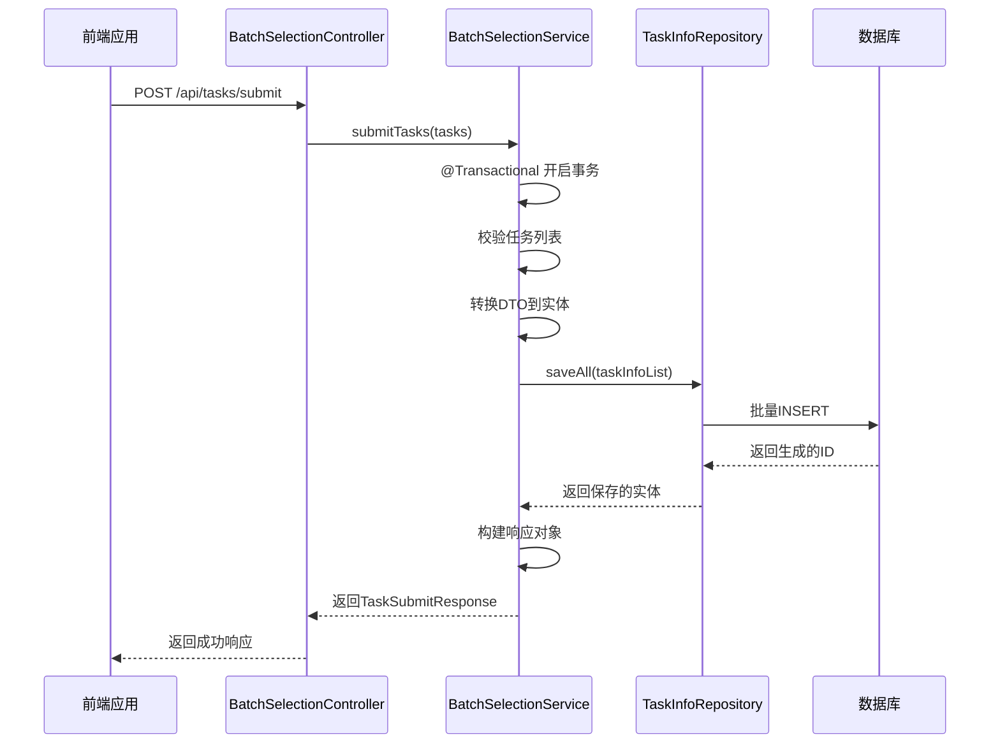
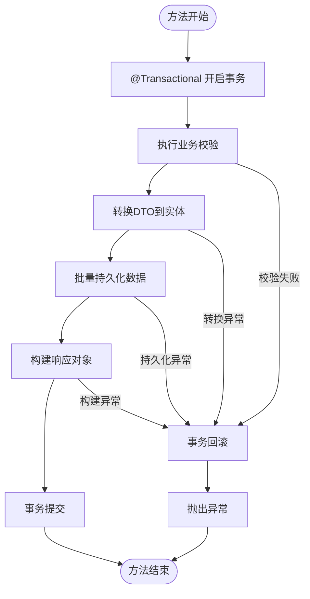
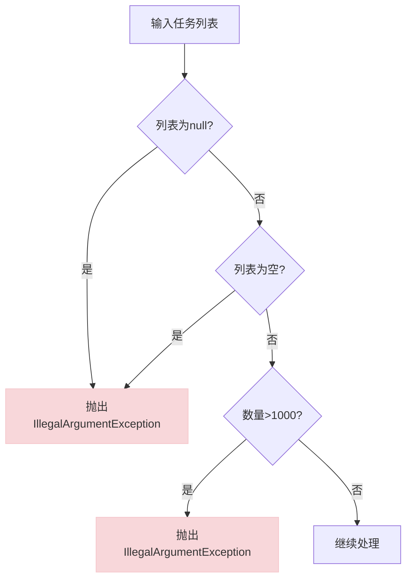
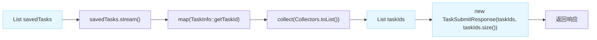
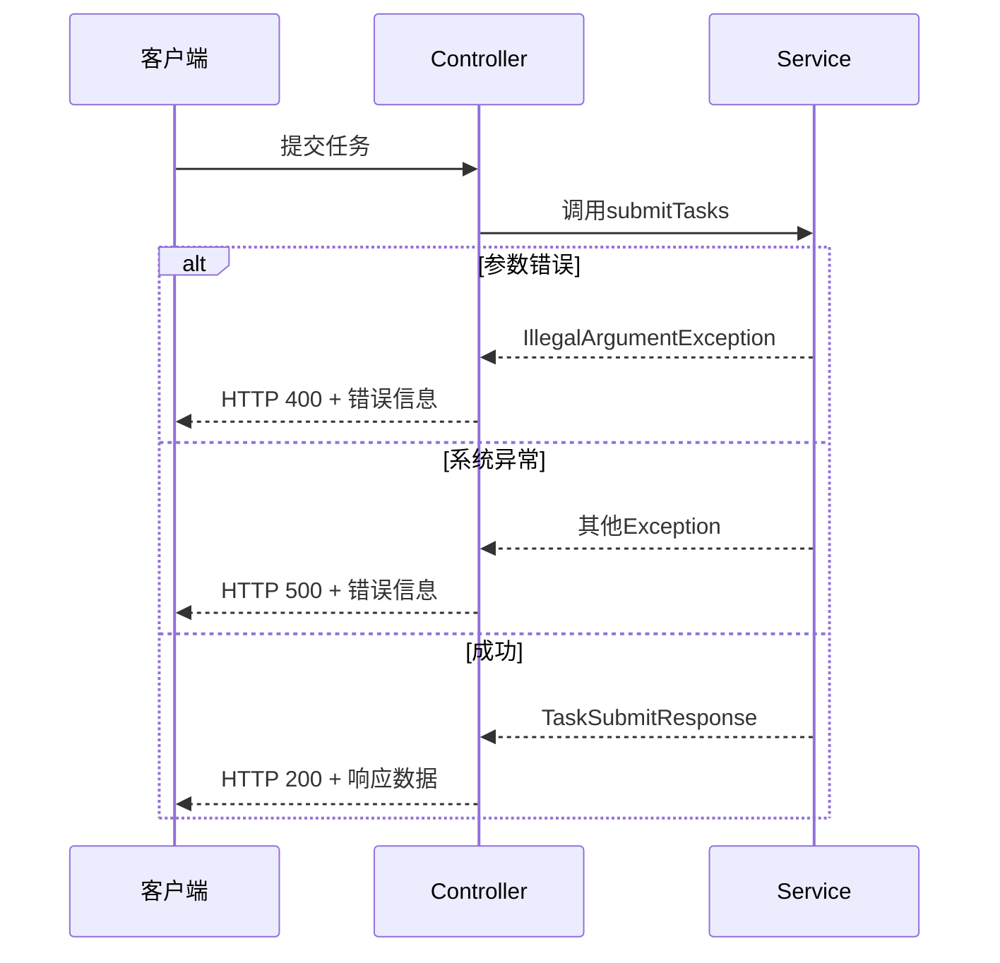

# 提交服务实现

<cite>
**Referenced Files in This Document**   
- [BatchSelectionServiceImpl.java](file://backend/src/main/java/com/example/batchselection/service/impl/BatchSelectionServiceImpl.java)
- [TaskSubmitDTO.java](file://backend/src/main/java/com/example/batchselection/dto/TaskSubmitDTO.java)
- [TaskInfo.java](file://backend/src/main/java/com/example/batchselection/entity/TaskInfo.java)
- [TaskSubmitResponse.java](file://backend/src/main/java/com/example/batchselection/dto/TaskSubmitResponse.java)
- [TaskInfoRepository.java](file://backend/src/main/java/com/example/batchselection/repository/TaskInfoRepository.java)
- [BatchSelectionController.java](file://backend/src/main/java/com/example/batchselection/controller/BatchSelectionController.java)
- [schema.sql](file://backend/src/main/resources/schema.sql)
- [BatchTaskSubmitRequest.java](file://backend/src/main/java/com/example/batchselection/dto/BatchTaskSubmitRequest.java)
</cite>

## 目录
1. [事务性批量提交机制概述](#事务性批量提交机制概述)
2. [事务管理与数据一致性](#事务管理与数据一致性)
3. [业务校验逻辑](#业务校验逻辑)
4. [数据转换与映射](#数据转换与映射)
5. [批量持久化与性能优化](#批量持久化与性能优化)
6. [响应构建与结果返回](#响应构建与结果返回)
7. [并发控制与错误处理](#并发控制与错误处理)

## 事务性批量提交机制概述

`submitTasks()`方法实现了事务性的批量任务提交功能，确保了数据操作的原子性和一致性。该方法通过Spring框架的事务管理机制，将多个任务的保存操作封装在一个数据库事务中，要么全部成功，要么全部回滚。



**Diagram sources**
- [BatchSelectionController.java](file://backend/src/main/java/com/example/batchselection/controller/BatchSelectionController.java#L48-L61)
- [BatchSelectionServiceImpl.java](file://backend/src/main/java/com/example/batchselection/service/impl/BatchSelectionServiceImpl.java#L64-L93)
- [TaskInfoRepository.java](file://backend/src/main/java/com/example/batchselection/repository/TaskInfoRepository.java#L10-L11)

**Section sources**
- [BatchSelectionServiceImpl.java](file://backend/src/main/java/com/example/batchselection/service/impl/BatchSelectionServiceImpl.java#L64-L93)

## 事务管理与数据一致性

`@Transactional(rollbackFor = Exception.class)`注解是确保数据一致性的核心机制。当方法执行过程中抛出任何异常时，Spring事务管理器会自动回滚已执行的数据库操作，防止数据处于不一致状态。

该注解的`rollbackFor = Exception.class`配置确保了所有类型的异常（包括检查型异常和非检查型异常）都会触发事务回滚。这意味着即使在数据转换、验证或持久化过程中发生任何错误，所有已保存的数据都将被撤销，保持数据库的原始状态。



**Diagram sources**
- [BatchSelectionServiceImpl.java](file://backend/src/main/java/com/example/batchselection/service/impl/BatchSelectionServiceImpl.java#L66-L67)

**Section sources**
- [BatchSelectionServiceImpl.java](file://backend/src/main/java/com/example/batchselection/service/impl/BatchSelectionServiceImpl.java#L64-L93)

## 业务校验逻辑

`submitTasks()`方法实现了严格的业务校验逻辑，确保输入数据的合法性和系统稳定性。

### 空列表检查
方法首先检查传入的任务列表是否为null或空，这是防止空数据操作的基本安全措施。如果列表为空，立即抛出`IllegalArgumentException`异常，避免不必要的处理开销。

### 数量限制校验
为防止系统资源过度消耗和性能下降，方法限制了单次提交的任务数量不得超过1000条。这一限制基于系统性能测试和资源评估确定，平衡了批量处理效率和系统稳定性。



**Diagram sources**
- [BatchSelectionServiceImpl.java](file://backend/src/main/java/com/example/batchselection/service/impl/BatchSelectionServiceImpl.java#L70-L77)
- [BatchTaskSubmitRequest.java](file://backend/src/main/java/com/example/batchselection/dto/BatchTaskSubmitRequest.java#L14-L15)

**Section sources**
- [BatchSelectionServiceImpl.java](file://backend/src/main/java/com/example/batchselection/service/impl/BatchSelectionServiceImpl.java#L70-L77)

## 数据转换与映射

`convertToTaskInfo()`方法负责将传输对象（DTO）转换为持久化实体，实现了数据层与业务层的解耦。

### 字段映射实现
转换过程通过简单的属性复制完成，将`TaskSubmitDTO`中的所有字段值映射到`TaskInfo`实体的对应字段。这种直接映射方式简单高效，避免了复杂的转换逻辑。

### 实体类结构
`TaskInfo`实体类使用JPA注解定义了与数据库表的映射关系，包括主键生成策略、字段约束和索引配置。

```mermaid
classDiagram
class TaskSubmitDTO {
+String appName
+String groupName
+String grayGroupName
+String idc
+String zone
+String spec
+Integer diskSize
+Integer podCount
}
class TaskInfo {
+Long taskId
+String appName
+String groupName
+String grayGroupName
+String idc
+String zone
+String spec
+Integer diskSize
+Integer podCount
+LocalDateTime createdAt
+onCreate()
}
class TaskInfoRepository {
+saveAll(Iterable~TaskInfo~)
+save(TaskInfo)
+findById(Long)
+findAll()
}
TaskSubmitDTO --> TaskInfo : "转换"
TaskInfo --> TaskInfoRepository : "持久化"
TaskInfoRepository --> Database : "JPA/Hibernate"
note right of TaskInfo : : onCreate
@PrePersist注解方法
在实体持久化前自动设置
创建时间
end note
```

**Diagram sources**
- [TaskSubmitDTO.java](file://backend/src/main/java/com/example/batchselection/dto/TaskSubmitDTO.java#L12-L38)
- [TaskInfo.java](file://backend/src/main/java/com/example/batchselection/entity/TaskInfo.java#L15-L52)
- [BatchSelectionServiceImpl.java](file://backend/src/main/java/com/example/batchselection/service/impl/BatchSelectionServiceImpl.java#L115-L125)

**Section sources**
- [TaskSubmitDTO.java](file://backend/src/main/java/com/example/batchselection/dto/TaskSubmitDTO.java#L12-L38)
- [TaskInfo.java](file://backend/src/main/java/com/example/batchselection/entity/TaskInfo.java#L15-L52)
- [BatchSelectionServiceImpl.java](file://backend/src/main/java/com/example/batchselection/service/impl/BatchSelectionServiceImpl.java#L115-L125)

## 批量持久化与性能优化

`saveAll()`方法的使用是性能优化的关键，它通过批量操作显著提升了数据持久化的效率。

### 批量操作优势
相比逐条保存，批量保存减少了数据库连接、SQL解析和网络传输的开销。Spring Data JPA的`saveAll()`方法会将多个INSERT语句合并为批量操作，大大降低了I/O操作次数。

### 数据库表设计
`task_info`表的设计考虑了查询性能和数据完整性，包括主键索引和创建时间索引，支持高效的按ID和时间范围查询。

```mermaid
erDiagram
TASK_INFO {
BIGINT task_id PK
VARCHAR(64) app_name
VARCHAR(64) group_name
VARCHAR(64) gray_group_name
VARCHAR(32) idc
VARCHAR(32) zone
VARCHAR(64) spec
INT disk_size
INT pod_count
TIMESTAMP created_at
}
TASK_INFO ||--o{ BATCH_TASK_SUBMIT : "包含"
note right of TASK_INFO
索引:
- 主键索引: task_id
- 普通索引: created_at
主键自增，created_at自动填充
end note
```

**Diagram sources**
- [TaskInfoRepository.java](file://backend/src/main/java/com/example/batchselection/repository/TaskInfoRepository.java#L10-L11)
- [schema.sql](file://backend/src/main/resources/schema.sql#L24-L37)
- [BatchSelectionServiceImpl.java](file://backend/src/main/java/com/example/batchselection/service/impl/BatchSelectionServiceImpl.java#L84-L85)

**Section sources**
- [TaskInfoRepository.java](file://backend/src/main/java/com/example/batchselection/repository/TaskInfoRepository.java#L10-L11)
- [schema.sql](file://backend/src/main/resources/schema.sql#L24-L37)

## 响应构建与结果返回

`submitTasks()`方法通过收集生成的任务ID构建响应对象，为客户端提供操作结果的反馈。

### ID收集过程
使用Java 8 Stream API从保存的实体列表中提取`taskId`字段，转换为`List<Long>`。这种函数式编程方式简洁高效，避免了传统的循环迭代。

### 响应对象设计
`TaskSubmitResponse`DTO包含任务ID列表和数量统计，既提供了详细信息又便于客户端快速获取关键数据。



**Diagram sources**
- [TaskSubmitResponse.java](file://backend/src/main/java/com/example/batchselection/dto/TaskSubmitResponse.java#L14-L18)
- [BatchSelectionServiceImpl.java](file://backend/src/main/java/com/example/batchselection/service/impl/BatchSelectionServiceImpl.java#L86-L89)

**Section sources**
- [TaskSubmitResponse.java](file://backend/src/main/java/com/example/batchselection/dto/TaskSubmitResponse.java#L14-L18)
- [BatchSelectionServiceImpl.java](file://backend/src/main/java/com/example/batchselection/service/impl/BatchSelectionServiceImpl.java#L86-L89)

## 并发控制与错误处理

系统的并发控制和错误处理策略确保了在高并发场景下的稳定性和可靠性。

### 并发安全
通过数据库事务和主键自增机制保证了数据的并发安全。多个客户端同时提交任务时，数据库会自动处理并发冲突，确保每条记录都有唯一的任务ID。

### 错误处理策略
控制器层实现了分层的异常处理机制，区分参数错误和系统异常，提供不同的HTTP状态码和错误信息，便于客户端进行相应的错误处理。



**Diagram sources**
- [BatchSelectionController.java](file://backend/src/main/java/com/example/batchselection/controller/BatchSelectionController.java#L48-L61)
- [BatchSelectionServiceImpl.java](file://backend/src/main/java/com/example/batchselection/service/impl/BatchSelectionServiceImpl.java#L64-L93)

**Section sources**
- [BatchSelectionController.java](file://backend/src/main/java/com/example/batchselection/controller/BatchSelectionController.java#L48-L61)
- [BatchSelectionServiceImpl.java](file://backend/src/main/java/com/example/batchselection/service/impl/BatchSelectionServiceImpl.java#L64-L93)