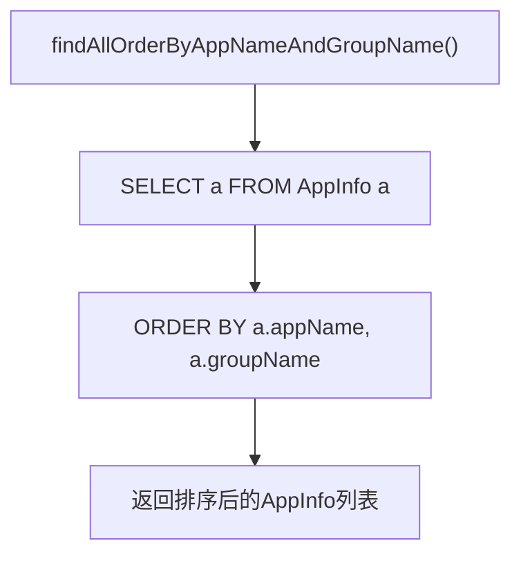
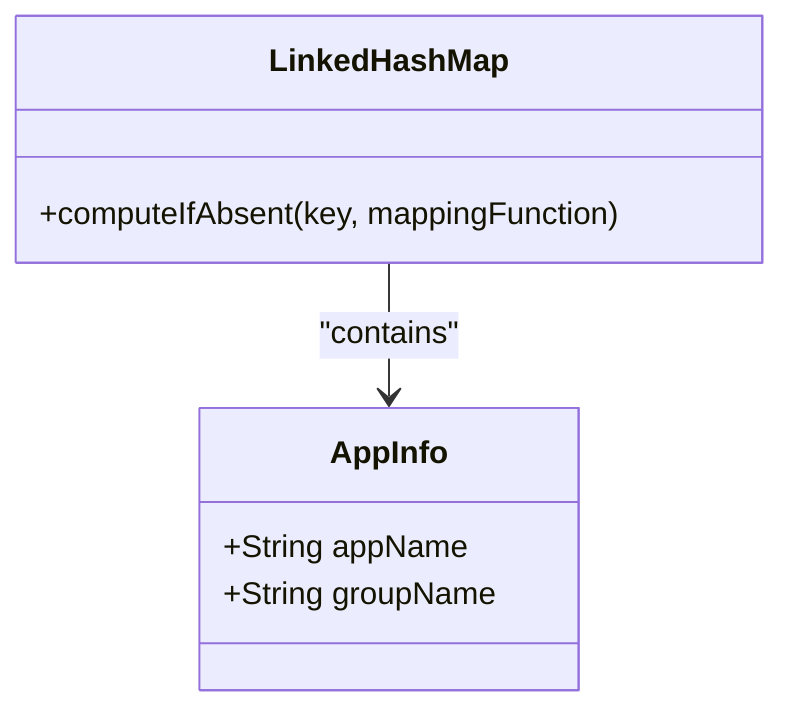
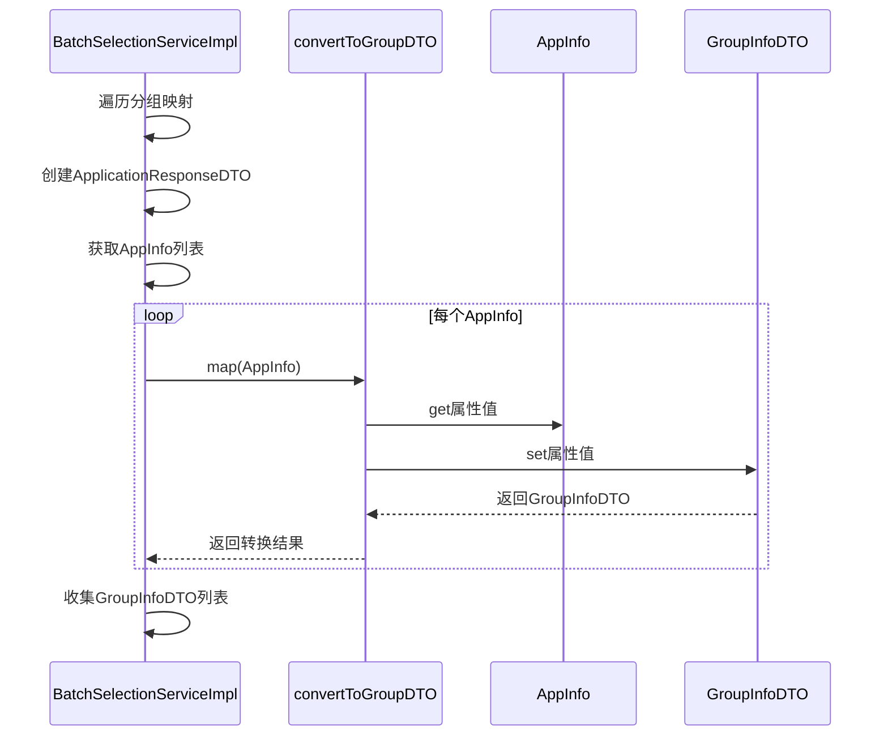
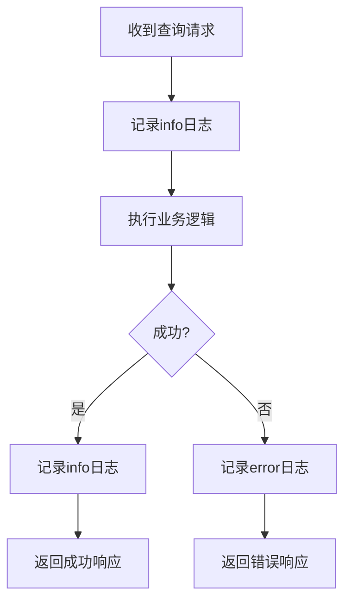

# 查询服务实现

<cite>
**Referenced Files in This Document**   
- [BatchSelectionServiceImpl.java](file://backend/src/main/java/com/example/batchselection/service/impl/BatchSelectionServiceImpl.java)
- [AppInfoRepository.java](file://backend/src/main/java/com/example/batchselection/repository/AppInfoRepository.java)
- [AppInfo.java](file://backend/src/main/java/com/example/batchselection/entity/AppInfo.java)
- [ApplicationResponseDTO.java](file://backend/src/main/java/com/example/batchselection/dto/ApplicationResponseDTO.java)
- [GroupInfoDTO.java](file://backend/src/main/java/com/example/batchselection/dto/GroupInfoDTO.java)
- [BatchSelectionService.java](file://backend/src/main/java/com/example/batchselection/service/BatchSelectionService.java)
- [BatchSelectionController.java](file://backend/src/main/java/com/example/batchselection/controller/BatchSelectionController.java)
</cite>

## 目录
1. [核心方法职责](#核心方法职责)
2. [数据获取与排序机制](#数据获取与排序机制)
3. [分组处理与数据结构设计](#分组处理与数据结构设计)
4. [实体到DTO的转换过程](#实体到dto的转换过程)
5. [日志记录与异常处理](#日志记录与异常处理)
6. [流式处理优势分析](#流式处理优势分析)
7. [前端展示对应关系](#前端展示对应关系)
8. [性能优化建议](#性能优化建议)

## 核心方法职责

`getAllApplications()` 方法是批量选择服务中的核心查询方法，其主要职责是为前端提供结构化的应用数据。该方法位于 `BatchSelectionServiceImpl` 类中，实现了 `BatchSelectionService` 接口定义的业务契约。方法通过协调数据访问层、业务逻辑层和数据传输对象，完成从数据库查询到响应数据构建的完整流程。

该方法的执行流程遵循典型的三层架构模式：首先通过 `AppInfoRepository` 获取原始数据，然后在服务层进行业务逻辑处理（包括分组和转换），最后返回符合前端需求的DTO结构。整个过程体现了关注点分离的设计原则，确保了数据访问、业务逻辑和接口契约的清晰边界。

**Section sources**
- [BatchSelectionServiceImpl.java](file://backend/src/main/java/com/example/batchselection/service/impl/BatchSelectionServiceImpl.java#L33-L62)
- [BatchSelectionService.java](file://backend/src/main/java/com/example/batchselection/service/BatchSelectionService.java#L16-L16)

## 数据获取与排序机制

数据获取是通过 `AppInfoRepository` 接口的 `findAllOrderByAppNameAndGroupName()` 方法实现的。该方法使用Spring Data JPA的`@Query`注解定义了一个JPQL查询，明确指定了排序规则：首先按应用名(`appName`)排序，然后按分组名(`groupName`)排序。

这种排序策略确保了数据的确定性和可预测性，为后续的分组处理提供了基础。数据库层面的排序比在内存中排序更高效，能够充分利用数据库的索引机制。值得注意的是，`AppInfo` 实体类中定义了复合索引 `idx_app_group`，该索引覆盖了`app_name`和`group_name`字段，能够显著提升排序查询的性能。

**Diagram sources**
- [AppInfoRepository.java](file://backend/src/main/java/com/example/batchselection/repository/AppInfoRepository.java#L17-L18)
- [AppInfo.java](file://backend/src/main/java/com/example/batchselection/entity/AppInfo.java#L13)

**Section sources**
- [AppInfoRepository.java](file://backend/src/main/java/com/example/batchselection/repository/AppInfoRepository.java#L17-L18)

## 分组处理与数据结构设计

分组处理使用了 `LinkedHashMap<String, List<AppInfo>>` 数据结构，这是实现业务需求的关键设计决策。选择 `LinkedHashMap` 而非普通 `HashMap` 的原因是前者能够保持键的插入顺序，这对于确保前端展示时应用的顺序一致性至关重要。

分组逻辑通过Java 8的 `computeIfAbsent` 方法高效实现。该方法结合了"检查-创建-获取"的原子操作，避免了显式的null检查和条件判断，使代码更加简洁和函数式。对于每个 `AppInfo` 实体，系统以其 `appName` 作为键，将相同应用名的实体归入同一个列表中，从而实现了按应用名的分组。

这种设计模式体现了空间换时间的优化思想：通过在内存中构建分组映射，避免了后续处理中的重复查找操作，为快速构建响应数据结构奠定了基础。

**Diagram sources**
- [BatchSelectionServiceImpl.java](file://backend/src/main/java/com/example/batchselection/service/impl/BatchSelectionServiceImpl.java#L42-L45)
- [AppInfo.java](file://backend/src/main/java/com/example/batchselection/entity/AppInfo.java#L22)

**Section sources**
- [BatchSelectionServiceImpl.java](file://backend/src/main/java/com/example/batchselection/service/impl/BatchSelectionServiceImpl.java#L41-L45)

## 实体到DTO的转换过程

实体到DTO的转换过程通过 `convertToGroupDTO()` 私有方法实现，该方法负责将 `AppInfo` 实体映射到 `GroupInfoDTO` 数据传输对象。这种转换模式遵循了DTO设计模式的最佳实践，有效地隔离了持久层实体和接口层数据结构。

`ApplicationResponseDTO` 作为顶层响应结构，包含应用名和分组列表两个属性，形成了树形数据结构的根节点。在转换过程中，系统遍历 `LinkedHashMap` 的每个条目，为每个应用名创建一个 `ApplicationResponseDTO` 实例，并将其分组列表通过流式处理转换为 `GroupInfoDTO` 列表。

流式处理的使用体现了函数式编程的优势：通过 `stream().map().collect()` 的链式调用，代码更加声明式和可读，同时JVM能够对流操作进行优化，提高处理效率。

**Diagram sources**
- [BatchSelectionServiceImpl.java](file://backend/src/main/java/com/example/batchselection/service/impl/BatchSelectionServiceImpl.java#L53-L56)
- [BatchSelectionServiceImpl.java](file://backend/src/main/java/com/example/batchselection/service/impl/BatchSelectionServiceImpl.java#L99-L110)

**Section sources**
- [BatchSelectionServiceImpl.java](file://backend/src/main/java/com/example/batchselection/service/impl/BatchSelectionServiceImpl.java#L49-L58)
- [BatchSelectionServiceImpl.java](file://backend/src/main/java/com/example/batchselection/service/impl/BatchSelectionServiceImpl.java#L99-L110)
- [ApplicationResponseDTO.java](file://backend/src/main/java/com/example/batchselection/dto/ApplicationResponseDTO.java#L12-L13)
- [GroupInfoDTO.java](file://backend/src/main/java/com/example/batchselection/dto/GroupInfoDTO.java#L11-L18)

## 日志记录与异常处理

日志记录策略在该服务中得到了充分体现，使用了SLF4J日志框架在关键执行点记录信息。方法开始时记录"开始查询所有应用数据"，结束时记录"查询完成，共找到 {} 个应用"，这种成对的日志记录便于监控方法执行时间和结果统计。

异常处理机制通过控制器层的全局异常处理实现。`BatchSelectionController` 中的 `getApplications()` 方法使用了try-catch块捕获所有异常，将技术性异常转换为用户友好的错误消息。这种分层异常处理策略确保了服务层专注于业务逻辑，而异常的呈现和HTTP状态码的处理由控制器层负责。

日志级别也经过精心设计：正常流程使用`info`级别，便于监控系统运行状态；异常情况使用`error`级别，并包含异常堆栈，便于问题排查。这种日志策略平衡了日志的可读性和诊断价值。

**Diagram sources**
- [BatchSelectionServiceImpl.java](file://backend/src/main/java/com/example/batchselection/service/impl/BatchSelectionServiceImpl.java#L36-L37)
- [BatchSelectionServiceImpl.java](file://backend/src/main/java/com/example/batchselection/service/impl/BatchSelectionServiceImpl.java#L60-L61)
- [BatchSelectionController.java](file://backend/src/main/java/com/example/batchselection/controller/BatchSelectionController.java#L35-L41)

**Section sources**
- [BatchSelectionServiceImpl.java](file://backend/src/main/java/com/example/batchselection/service/impl/BatchSelectionServiceImpl.java#L36-L37)
- [BatchSelectionServiceImpl.java](file://backend/src/main/java/com/example/batchselection/service/impl/BatchSelectionServiceImpl.java#L60-L61)
- [BatchSelectionController.java](file://backend/src/main/java/com/example/batchselection/controller/BatchSelectionController.java#L35-L41)

## 流式处理优势分析

流式处理在 `convertToGroupDTO()` 方法的调用中发挥了重要作用。通过 `entry.getValue().stream().map(this::convertToGroupDTO).collect(Collectors.toList())` 的链式调用，系统实现了对分组列表的声明式转换。

流式处理的主要优势包括：
1. **可读性**：代码表达了"将每个元素映射为DTO，然后收集为列表"的意图，比传统的for循环更加直观
2. **可组合性**：流操作可以轻松添加过滤、排序等中间操作，便于未来功能扩展
3. **潜在的性能优化**：JVM可以对流操作进行内部优化，如短路求值和并行处理
4. **函数式编程风格**：避免了可变状态，减少了副作用，提高了代码的可测试性

尽管在当前场景下性能优势可能不明显，但流式处理为代码的可维护性和扩展性提供了长期价值。

**Section sources**
- [BatchSelectionServiceImpl.java](file://backend/src/main/java/com/example/batchselection/service/impl/BatchSelectionServiceImpl.java#L53-L56)

## 前端展示对应关系

该查询服务与前端树形表格展示有着直接的对应关系。`ApplicationResponseDTO` 的结构设计完全匹配前端的树形数据需求：`appName` 作为树的父节点，`groups` 列表作为子节点集合。

这种前后端契约的设计体现了API优先的开发理念。后端服务不是简单地暴露数据库结构，而是根据前端展示需求构建专门的数据结构。`LinkedHashMap` 保持的插入顺序确保了应用在树形表格中的显示顺序与预期一致，提供了良好的用户体验。

前端可以通过简单的递归渲染实现树形表格，每个 `ApplicationResponseDTO` 对应一个可展开的行，其 `groups` 属性对应子行集合。这种清晰的数据契约减少了前后端的集成复杂性。

**Section sources**
- [ApplicationResponseDTO.java](file://backend/src/main/java/com/example/batchselection/dto/ApplicationResponseDTO.java#L12-L13)
- [BatchSelectionController.java](file://backend/src/main/java/com/example/batchselection/controller/BatchSelectionController.java#L33-L42)

## 性能优化建议

基于当前实现，提出以下性能优化建议：

1. **缓存策略**：对于不频繁变化的应用数据，可以引入Redis等缓存机制。使用`@Cacheable`注解缓存`getAllApplications()`方法的结果，设置合理的过期时间，可以显著减少数据库查询压力。

2. **分页查询**：当应用数据量较大时，应考虑实现分页查询，避免一次性加载过多数据导致内存溢出和响应延迟。

3. **数据库索引优化**：确保`appName`和`groupName`字段上有适当的索引，特别是复合索引，以支持高效的排序和分组操作。

4. **异步加载**：对于大型数据集，可以考虑实现异步API，先返回任务ID，后台完成数据处理后通过WebSocket或轮询通知前端。

5. **DTO投影**：在Repository层直接使用DTO投影，避免先查询实体再转换，减少不必要的字段加载。

这些优化建议可以根据实际的性能监控数据和业务需求逐步实施。

**Section sources**
- [BatchSelectionServiceImpl.java](file://backend/src/main/java/com/example/batchselection/service/impl/BatchSelectionServiceImpl.java#L33-L62)
- [AppInfoRepository.java](file://backend/src/main/java/com/example/batchselection/repository/AppInfoRepository.java#L17-L18)