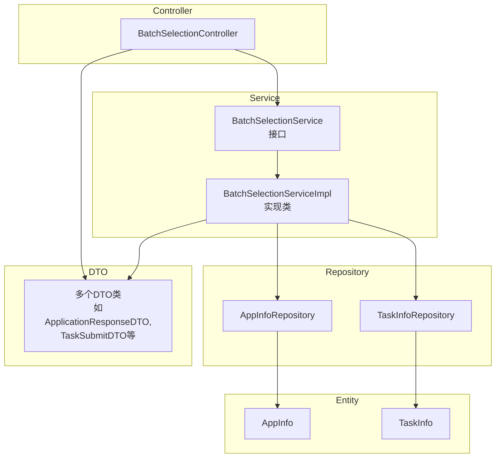
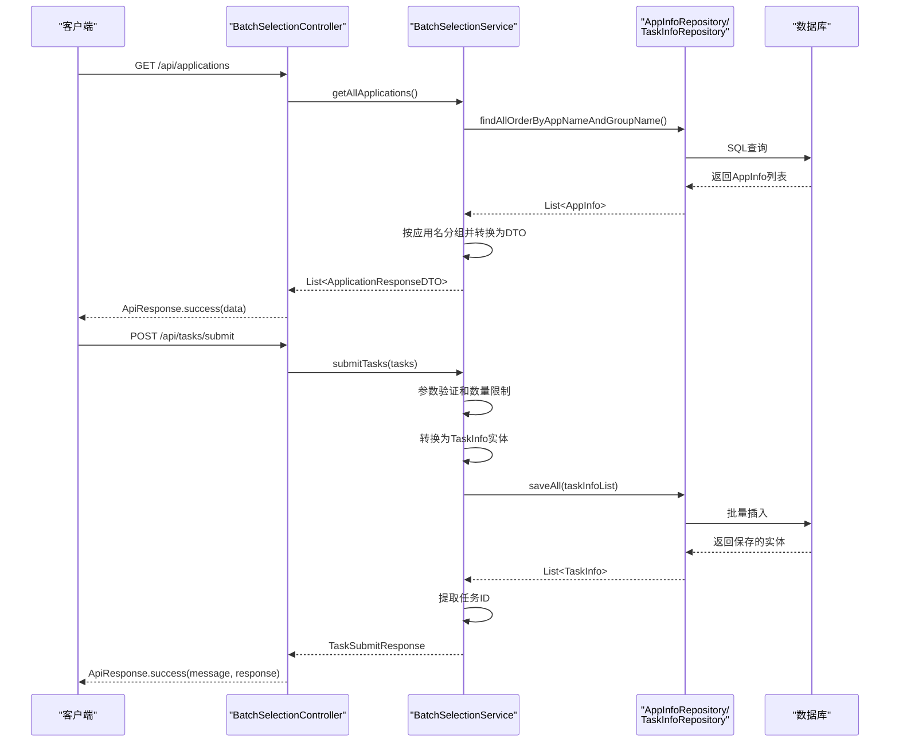
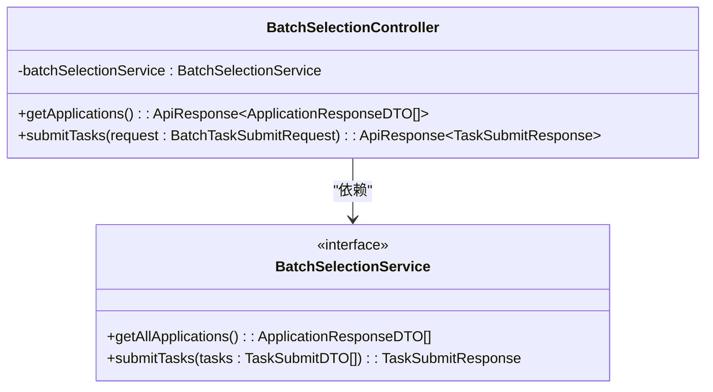
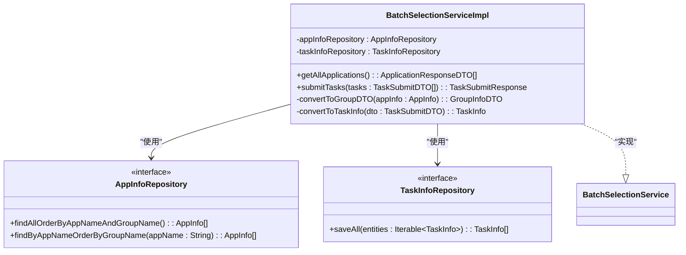
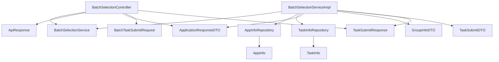

# 后端架构

<cite>
**本文档引用的文件**  
- [BatchSelectionController.java](file://backend/src/main/java/com/example/batchselection/controller/BatchSelectionController.java)
- [BatchSelectionService.java](file://backend/src/main/java/com/example/batchselection/service/BatchSelectionService.java)
- [BatchSelectionServiceImpl.java](file://backend/src/main/java/com/example/batchselection/service/impl/BatchSelectionServiceImpl.java)
- [AppInfoRepository.java](file://backend/src/main/java/com/example/batchselection/repository/AppInfoRepository.java)
- [TaskInfoRepository.java](file://backend/src/main/java/com/example/batchselection/repository/TaskInfoRepository.java)
- [ApiResponse.java](file://backend/src/main/java/com/example/batchselection/dto/ApiResponse.java)
- [ApplicationResponseDTO.java](file://backend/src/main/java/com/example/batchselection/dto/ApplicationResponseDTO.java)
- [BatchTaskSubmitRequest.java](file://backend/src/main/java/com/example/batchselection/dto/BatchTaskSubmitRequest.java)
- [TaskSubmitDTO.java](file://backend/src/main/java/com/example/batchselection/dto/TaskSubmitDTO.java)
- [TaskSubmitResponse.java](file://backend/src/main/java/com/example/batchselection/dto/TaskSubmitResponse.java)
- [AppInfo.java](file://backend/src/main/java/com/example/batchselection/entity/AppInfo.java)
- [TaskInfo.java](file://backend/src/main/java/com/example/batchselection/entity/TaskInfo.java)
- [application.properties](file://backend/src/main/resources/application.properties)
</cite>

## 目录
1. [简介](#简介)
2. [项目结构](#项目结构)
3. [核心组件](#核心组件)
4. [架构概览](#架构概览)
5. [详细组件分析](#详细组件分析)
6. [依赖分析](#依赖分析)
7. [性能考虑](#性能考虑)
8. [故障排除指南](#故障排除指南)
9. [结论](#结论)

## 简介
本文档深入解析基于Spring Boot的后端架构，重点阐述`BatchSelectionController`如何暴露REST API接口，处理`GET /api/applications`和`POST /api/tasks/submit`请求。文档详细说明`BatchSelectionService`接口与其实现类`BatchSelectionServiceImpl`之间的关系，以及服务层如何协调数据访问与业务逻辑。通过分析从控制器到服务层再到Repository的数据流转过程，体现典型的Spring分层设计。同时涵盖异常处理、事务管理（特别是在任务提交时）和跨域配置（`@CrossOrigin`）等关键实现细节，为后端开发者提供完整的调用链路视图。

## 项目结构
本项目采用标准的Spring Boot分层架构，主要分为控制器（controller）、数据传输对象（dto）、实体（entity）、仓库（repository）和服务（service）等模块。核心业务逻辑集中在`batchselection`包下，通过清晰的分层设计实现关注点分离。

**图示来源**
- [BatchSelectionController.java](file://backend/src/main/java/com/example/batchselection/controller/BatchSelectionController.java#L20-L25)
- [BatchSelectionService.java](file://backend/src/main/java/com/example/batchselection/service/BatchSelectionService.java#L11-L24)
- [BatchSelectionServiceImpl.java](file://backend/src/main/java/com/example/batchselection/service/impl/BatchSelectionServiceImpl.java#L29-L32)
- [AppInfoRepository.java](file://backend/src/main/java/com/example/batchselection/repository/AppInfoRepository.java#L13-L25)
- [TaskInfoRepository.java](file://backend/src/main/java/com/example/batchselection/repository/TaskInfoRepository.java#L11-L12)

**本节来源**
- [BatchSelectionController.java](file://backend/src/main/java/com/example/batchselection/controller/BatchSelectionController.java#L1-L64)
- [BatchSelectionServiceImpl.java](file://backend/src/main/java/com/example/batchselection/service/impl/BatchSelectionServiceImpl.java#L1-L128)

## 核心组件
核心组件包括`BatchSelectionController`、`BatchSelectionService`接口及其实现`BatchSelectionServiceImpl`，以及两个Repository：`AppInfoRepository`和`TaskInfoRepository`。控制器负责接收HTTP请求并返回响应，服务层封装业务逻辑，Repository层负责数据持久化操作。DTO类用于在各层之间传输数据，确保接口契约的稳定性。

**本节来源**
- [BatchSelectionController.java](file://backend/src/main/java/com/example/batchselection/controller/BatchSelectionController.java#L27-L62)
- [BatchSelectionService.java](file://backend/src/main/java/com/example/batchselection/service/BatchSelectionService.java#L11-L24)
- [BatchSelectionServiceImpl.java](file://backend/src/main/java/com/example/batchselection/service/impl/BatchSelectionServiceImpl.java#L29-L126)

## 架构概览
系统采用典型的Spring MVC三层架构：表现层（Controller）、业务逻辑层（Service）和数据访问层（Repository）。`BatchSelectionController`作为入口，通过依赖注入获取`BatchSelectionService`实例，将请求委派给服务层处理。服务层协调两个Repository完成数据查询和持久化，并在必要时进行事务管理。

**图示来源**
- [BatchSelectionController.java](file://backend/src/main/java/com/example/batchselection/controller/BatchSelectionController.java#L33-L62)
- [BatchSelectionServiceImpl.java](file://backend/src/main/java/com/example/batchselection/service/impl/BatchSelectionServiceImpl.java#L35-L93)
- [AppInfoRepository.java](file://backend/src/main/java/com/example/batchselection/repository/AppInfoRepository.java#L18-L19)
- [TaskInfoRepository.java](file://backend/src/main/java/com/example/batchselection/repository/TaskInfoRepository.java#L11-L12)

## 详细组件分析

### 控制器分析
`BatchSelectionController`是REST API的入口点，使用`@RestController`和`@RequestMapping("/api")`注解暴露API。它通过`@RequiredArgsConstructor`实现依赖注入，获得`BatchSelectionService`的实例。控制器暴露两个端点：`GET /api/applications`用于查询所有应用数据，`POST /api/tasks/submit`用于批量提交任务。

**图示来源**
- [BatchSelectionController.java](file://backend/src/main/java/com/example/batchselection/controller/BatchSelectionController.java#L25-L62)
- [BatchSelectionService.java](file://backend/src/main/java/com/example/batchselection/service/BatchSelectionService.java#L11-L24)

#### 请求处理流程
对于`GET /api/applications`请求，控制器调用服务层的`getAllApplications()`方法，将结果包装在`ApiResponse.success()`中返回。对于`POST /api/tasks/submit`请求，控制器使用`@Valid`对请求体进行验证，然后调用服务层的`submitTasks()`方法。控制器实现了分层的异常处理：捕获`IllegalArgumentException`返回400错误，其他异常返回500错误。

**本节来源**
- [BatchSelectionController.java](file://backend/src/main/java/com/example/batchselection/controller/BatchSelectionController.java#L33-L62)
- [ApiResponse.java](file://backend/src/main/java/com/example/batchselection/dto/ApiResponse.java#L19-L33)

### 服务层分析
`BatchSelectionService`接口定义了两个核心业务方法：`getAllApplications()`和`submitTasks()`。`BatchSelectionServiceImpl`实现了这些方法，协调数据访问和业务逻辑。

**图示来源**
- [BatchSelectionServiceImpl.java](file://backend/src/main/java/com/example/batchselection/service/impl/BatchSelectionServiceImpl.java#L29-L126)
- [AppInfoRepository.java](file://backend/src/main/java/com/example/batchselection/repository/AppInfoRepository.java#L13-L25)
- [TaskInfoRepository.java](file://backend/src/main/java/com/example/batchselection/repository/TaskInfoRepository.java#L11-L12)

#### 数据流转过程
在`getAllApplications()`方法中，服务层调用`AppInfoRepository`的`findAllOrderByAppNameAndGroupName()`方法获取所有应用数据，然后按应用名分组，并将`AppInfo`实体转换为`ApplicationResponseDTO`。在`submitTasks()`方法中，服务层首先进行参数验证和数量限制，然后将`TaskSubmitDTO`转换为`TaskInfo`实体，通过`TaskInfoRepository`批量保存，并返回包含生成任务ID的响应。

**本节来源**
- [BatchSelectionServiceImpl.java](file://backend/src/main/java/com/example/batchselection/service/impl/BatchSelectionServiceImpl.java#L35-L93)
- [AppInfo.java](file://backend/src/main/java/com/example/batchselection/entity/AppInfo.java#L15-L62)
- [TaskInfo.java](file://backend/src/main/java/com/example/batchselection/entity/TaskInfo.java#L15-L54)

## 依赖分析
系统依赖关系清晰，遵循依赖倒置原则。控制器依赖服务接口而非具体实现，服务实现类依赖Repository接口。DTO类被控制器和服务层共同使用，形成稳定的数据传输契约。

**图示来源**
- [BatchSelectionController.java](file://backend/src/main/java/com/example/batchselection/controller/BatchSelectionController.java#L7-L8)
- [BatchSelectionServiceImpl.java](file://backend/src/main/java/com/example/batchselection/service/impl/BatchSelectionServiceImpl.java#L11-L12)
- [AppInfoRepository.java](file://backend/src/main/java/com/example/batchselection/repository/AppInfoRepository.java#L3-L4)
- [TaskInfoRepository.java](file://backend/src/main/java/com/example/batchselection/repository/TaskInfoRepository.java#L3-L4)

## 性能考虑
系统在设计时考虑了性能因素。`AppInfoRepository`使用自定义JPQL查询`findAllOrderByAppNameAndGroupName`，确保数据按应用名和分组名排序，避免在内存中排序。`TaskInfoRepository`使用`saveAll`方法进行批量插入，提高数据持久化效率。服务层对单次提交的任务数量进行了限制（最多1000条），防止因请求过大导致系统资源耗尽。

**本节来源**
- [AppInfoRepository.java](file://backend/src/main/java/com/example/batchselection/repository/AppInfoRepository.java#L18-L19)
- [TaskInfoRepository.java](file://backend/src/main/java/com/example/batchselection/repository/TaskInfoRepository.java#L11-L12)
- [BatchSelectionServiceImpl.java](file://backend/src/main/java/com/example/batchselection/service/impl/BatchSelectionServiceImpl.java#L75-L77)

## 故障排除指南
常见问题包括参数验证失败和数据库操作异常。当提交空任务列表或任务数量超过1000条时，会抛出`IllegalArgumentException`，返回400错误。数据库连接问题或持久化异常会触发事务回滚，并返回500错误。日志记录在`BatchSelectionController`和`BatchSelectionServiceImpl`中广泛使用，便于追踪请求处理流程和定位问题。

**本节来源**
- [BatchSelectionController.java](file://backend/src/main/java/com/example/batchselection/controller/BatchSelectionController.java#L55-L60)
- [BatchSelectionServiceImpl.java](file://backend/src/main/java/com/example/batchselection/service/impl/BatchSelectionServiceImpl.java#L70-L77)
- [application.properties](file://backend/src/main/resources/application.properties#L26-L28)

## 结论
该后端架构遵循Spring Boot最佳实践，采用清晰的分层设计，实现了关注点分离。通过`@CrossOrigin`注解支持跨域请求，满足前后端分离架构的需求。服务层的`@Transactional`注解确保了任务提交的原子性，`@Validated`和JSR-303注解提供了强大的参数验证能力。整体架构具有良好的可维护性和扩展性，为批量勾选功能提供了稳定可靠的技术支撑。