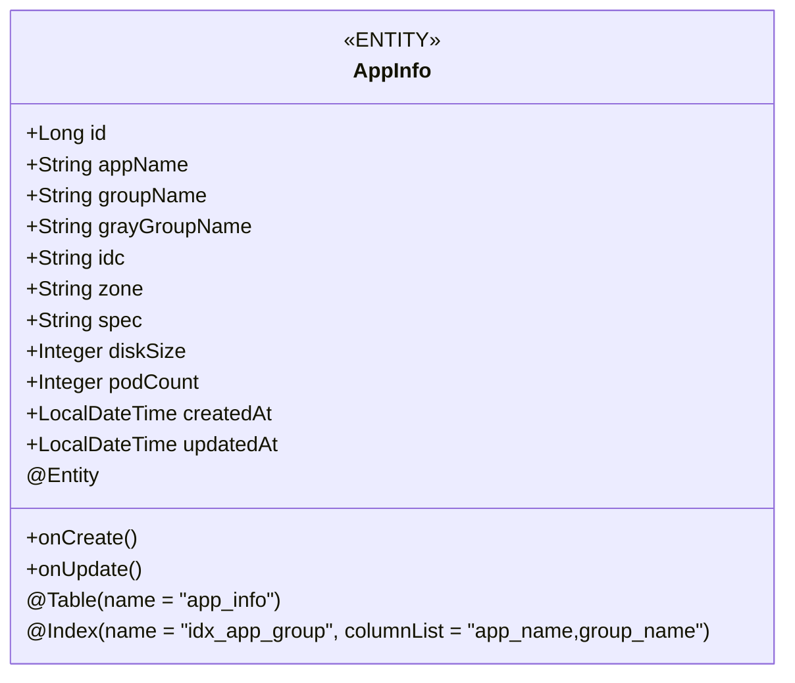
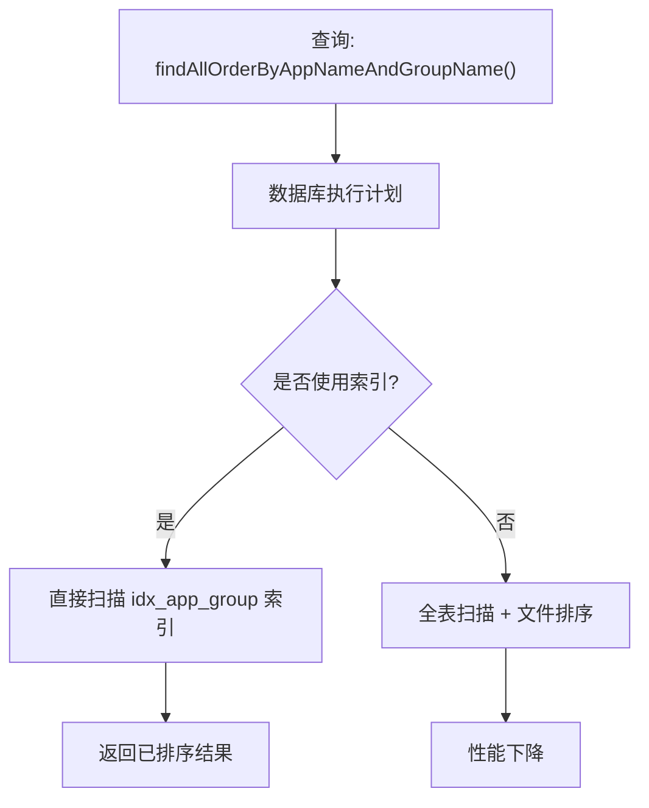
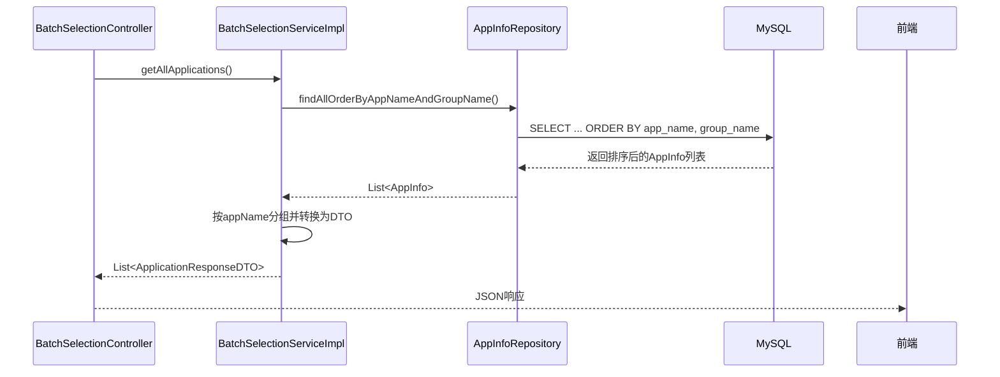

# AppInfoRepository

<cite>
**Referenced Files in This Document**   
- [AppInfoRepository.java](file://backend/src/main/java/com/example/batchselection/repository/AppInfoRepository.java)
- [AppInfo.java](file://backend/src/main/java/com/example/batchselection/entity/AppInfo.java)
- [BatchSelectionServiceImpl.java](file://backend/src/main/java/com/example/batchselection/service/impl/BatchSelectionServiceImpl.java)
- [schema.sql](file://backend/src/main/resources/schema.sql)
- [BatchSelectionService.java](file://backend/src/main/java/com/example/batchselection/service/BatchSelectionService.java)
</cite>

## 目录
1. [简介](#简介)
2. [核心职责与继承机制](#核心职责与继承机制)
3. [CRUD方法继承与实现](#crud方法继承与实现)
4. [自定义查询方法详解](#自定义查询方法详解)
5. [实体类与数据库映射](#实体类与数据库映射)
6. [索引优化与查询性能](#索引优化与查询性能)
7. [服务层调用示例](#服务层调用示例)
8. [常见问题与最佳实践](#常见问题与最佳实践)
9. [扩展与分页查询](#扩展与分页查询)

## 简介
`AppInfoRepository` 是批量勾选信息管理系统中的核心数据访问接口，负责应用数据的持久化操作。该接口基于 Spring Data JPA 框架构建，通过继承 `JpaRepository` 获得完整的 CRUD 功能，并定义了两个自定义查询方法以满足特定业务需求。本文档将深入解析其设计原理、实现机制及实际应用方式。

**Section sources**
- [AppInfoRepository.java](file://backend/src/main/java/com/example/batchselection/repository/AppInfoRepository.java#L1-L26)

## 核心职责与继承机制
`AppInfoRepository` 的主要职责是作为应用数据访问层（DAO），封装对 `app_info` 表的所有数据库操作。它通过继承 `JpaRepository<AppInfo, Long>` 接口，自动获得 Spring Data JPA 提供的标准数据访问能力。

`JpaRepository` 是 Spring Data JPA 的核心接口之一，位于 `org.springframework.data.jpa.repository` 包中，为 JPA 实体提供了丰富的持久化操作支持。通过泛型参数 `<AppInfo, Long>`，指定了该仓库操作的实体类型为 `AppInfo`，主键类型为 `Long`。

**Section sources**
- [AppInfoRepository.java](file://backend/src/main/java/com/example/batchselection/repository/AppInfoRepository.java#L13-L13)

## CRUD方法继承与实现
通过继承 `JpaRepository`，`AppInfoRepository` 自动获得了以下核心 CRUD 方法：

- **save(S entity)**：保存或更新单个实体
- **saveAll(Iterable<S> entities)**：批量保存实体
- **findById(ID id)**：根据主键查询单个实体
- **findAll()**：查询所有实体
- **deleteById(ID id)**：根据主键删除实体
- **existsById(ID id)**：检查实体是否存在
- **count()**：统计实体总数

这些方法的实现由 Spring Data JPA 在运行时通过代理机制自动生成。当 Spring 容器启动时，`JpaRepositoryFactory` 会为每个 Repository 接口创建代理实例，并根据方法签名动态生成对应的 JPQL 或 SQL 语句。例如，`findById` 方法会被转换为 `SELECT` 查询，自动映射到 `AppInfo` 实体的主键字段。

**Section sources**
- [AppInfoRepository.java](file://backend/src/main/java/com/example/batchselection/repository/AppInfoRepository.java#L13-L13)

## 自定义查询方法详解
除了继承的标准方法外，`AppInfoRepository` 定义了两个自定义查询方法，以满足特定的业务排序和检索需求。

### findAllOrderByAppNameAndGroupName()
该方法使用 `@Query` 注解定义了一个 JPQL 查询，用于获取所有应用数据并按应用名和分组名排序。

```java
@Query("SELECT a FROM AppInfo a ORDER BY a.appName, a.groupName")
List<AppInfo> findAllOrderByAppNameAndGroupName();
```

**实现原理**：
- **JPQL 注解**：`@Query` 注解允许开发者直接编写 JPQL（Java Persistence Query Language）语句，Spring Data JPA 会将其编译为对应的 SQL。
- **排序逻辑**：`ORDER BY a.appName, a.groupName` 实现了多级排序，首先按 `appName` 升序排列，当应用名相同时再按 `groupName` 升序排列。
- **方法命名**：虽然 Spring Data JPA 支持通过方法名推断查询（如 findByXxx），但此处使用显式 JPQL 以确保查询逻辑的精确性和可读性。

**Section sources**
- [AppInfoRepository.java](file://backend/src/main/java/com/example/batchselection/repository/AppInfoRepository.java#L18-L19)

### findByAppNameOrderByGroupName(String appName)
这是一个基于方法名的查询，遵循 Spring Data JPA 的命名约定。

```java
List<AppInfo> findByAppNameOrderByGroupName(String appName);
```

**实现机制**：
- **方法名解析**：Spring Data JPA 会解析方法名 `findByAppNameOrderByGroupName`，将其拆解为：
  - `find`：查询操作
  - `ByAppName`：查询条件，对应 `appName` 字段
  - `OrderByGroupName`：排序规则，按 `groupName` 字段排序
- **自动生成查询**：框架会自动生成等效的 JPQL 语句：`SELECT a FROM AppInfo a WHERE a.appName = ?1 ORDER BY a.groupName`。
- **参数绑定**：方法参数 `String appName` 会自动绑定到查询中的占位符 `?1`。

此方法允许前端按应用名称筛选数据，并确保同一应用下的分组按名称有序展示。

**Section sources**
- [AppInfoRepository.java](file://backend/src/main/java/com/example/batchselection/repository/AppInfoRepository.java#L24-L24)

## 实体类与数据库映射
`AppInfoRepository` 操作的 `AppInfo` 实体类通过 JPA 注解与数据库 `app_info` 表建立了精确的映射关系。

### 核心注解解析


**字段映射关系**：
| 实体字段 | 数据库列名 | 约束条件 | 说明 |
|---------|-----------|---------|------|
| id | id | PRIMARY KEY, AUTO_INCREMENT | 主键ID |
| appName | app_name | NOT NULL, VARCHAR(64) | 应用名称 |
| groupName | group_name | NOT NULL, VARCHAR(64) | 分组名称 |
| grayGroupName | gray_group_name | NULL, VARCHAR(64) | 灰度分组名称 |
| idc | idc | NOT NULL, VARCHAR(32) | 机房信息 |
| zone | zone | NOT NULL, VARCHAR(32) | 分区信息 |
| spec | spec | NOT NULL, VARCHAR(64) | 参数规格 |
| diskSize | disk_size | NOT NULL, INT | 硬盘大小(GB) |
| podCount | pod_count | NOT NULL, INT | Pod数量 |
| createdAt | created_at | NOT NULL, TIMESTAMP | 创建时间 |
| updatedAt | updated_at | NOT NULL, TIMESTAMP | 更新时间 |

**注解说明**：
- `@Entity`：声明 `AppInfo` 为 JPA 实体类。
- `@Table(name = "app_info")`：指定对应的数据库表名。
- `@Column`：定义字段与数据库列的映射，包括名称、可空性、长度等约束。
- `@Id` 和 `@GeneratedValue`：标识主键字段及其生成策略（自增）。

**Section sources**
- [AppInfo.java](file://backend/src/main/java/com/example/batchselection/entity/AppInfo.java#L10-L62)

## 索引优化与查询性能
`AppInfo` 实体类中定义的复合索引对查询性能有显著优化作用。

```java
@Index(name = "idx_app_group", columnList = "app_name,group_name")
```

### 索引作用分析
该复合索引在数据库层面创建了 `idx_app_group` 索引，包含 `app_name` 和 `group_name` 两个字段，按此顺序组织。

**性能优化场景**：
1. **`findAllOrderByAppNameAndGroupName()` 查询**：此查询的排序字段与索引字段完全匹配，数据库可以直接利用索引的有序性，避免额外的排序操作（filesort），显著提升查询效率。
2. **`findByAppNameOrderByGroupName(String appName)` 查询**：当按 `appName` 查询时，索引的前导列可以快速定位数据范围，后续按 `groupName` 排序时，由于索引中 `groupName` 已经有序，无需额外排序。

**SQL 验证**：
在 `schema.sql` 中，该索引被定义为：
```sql
INDEX idx_app_group (app_name, group_name) COMMENT '应用分组联合索引'
```
这确保了索引在数据库初始化时被正确创建。



**Section sources**
- [AppInfo.java](file://backend/src/main/java/com/example/batchselection/entity/AppInfo.java#L13-L13)
- [schema.sql](file://backend/src/main/resources/schema.sql#L21-L21)

## 服务层调用示例
`AppInfoRepository` 在服务层通过依赖注入被 `BatchSelectionServiceImpl` 使用，展示了典型的调用模式。

### 依赖注入
```java
@Service
@RequiredArgsConstructor
public class BatchSelectionServiceImpl implements BatchSelectionService {
    private final AppInfoRepository appInfoRepository;
    // ...
}
```
使用 `@RequiredArgsConstructor` 和 `final` 字段实现构造器注入，确保依赖不为空，避免空指针异常。

### 方法调用流程


**代码路径**：
- 服务接口：`BatchSelectionService.getAllApplications()`
- 服务实现：`BatchSelectionServiceImpl.getAllApplications()`
- 仓库调用：`appInfoRepository.findAllOrderByAppNameAndGroupName()`

此流程确保了数据从数据库到前端的完整传输，同时在服务层进行了业务逻辑处理和数据转换。

**Section sources**
- [BatchSelectionServiceImpl.java](file://backend/src/main/java/com/example/batchselection/service/impl/BatchSelectionServiceImpl.java#L31-L31)
- [BatchSelectionServiceImpl.java](file://backend/src/main/java/com/example/batchselection/service/impl/BatchSelectionServiceImpl.java#L39-L39)
- [BatchSelectionService.java](file://backend/src/main/java/com/example/batchselection/service/BatchSelectionService.java#L17-L17)

## 常见问题与最佳实践
### 空指针异常预防
- **问题**：若 `AppInfoRepository` 未被正确注入，调用其方法将导致 `NullPointerException`。
- **解决方案**：
  1. 使用构造器注入（如示例所示），而非字段注入。
  2. 在 Spring 配置中确保 `@Repository` 注解被组件扫描捕获。
  3. 在测试中使用 `@DataJpaTest` 进行集成测试。

### 查询性能监控
- 对 `findAllOrderByAppNameAndGroupName()` 等可能返回大量数据的方法，应监控其执行时间和返回行数。
- 考虑在生产环境中添加查询超时设置。

### 事务管理
- 数据修改操作（如 `save`）应由调用方（如 `BatchSelectionServiceImpl`）通过 `@Transactional` 注解管理事务。
- 查询方法通常不需要事务，除非涉及复杂的一致性读取。

**Section sources**
- [BatchSelectionServiceImpl.java](file://backend/src/main/java/com/example/batchselection/service/impl/BatchSelectionServiceImpl.java#L66-L66)

## 扩展与分页查询
对于大数据量场景，可扩展 `AppInfoRepository` 以支持分页查询。

### 分页接口扩展
```java
import org.springframework.data.domain.Page;
import org.springframework.data.domain.Pageable;

public interface AppInfoRepository extends JpaRepository<AppInfo, Long> {
    Page<AppInfo> findAllOrderByAppNameAndGroupName(Pageable pageable);
    Page<AppInfo> findByAppNameOrderByGroupName(String appName, Pageable pageable);
}
```

### 服务层调用
```java
public Page<ApplicationResponseDTO> getApplications(Pageable pageable) {
    Page<AppInfo> appPage = appInfoRepository.findAllOrderByAppNameAndGroupName(pageable);
    return appPage.map(this::convertToDTO);
}
```

此扩展允许前端实现无限滚动或分页加载，有效控制单次查询的数据量，提升系统响应速度和用户体验。

**Section sources**
- [AppInfoRepository.java](file://backend/src/main/java/com/example/batchselection/repository/AppInfoRepository.java#L13-L13)