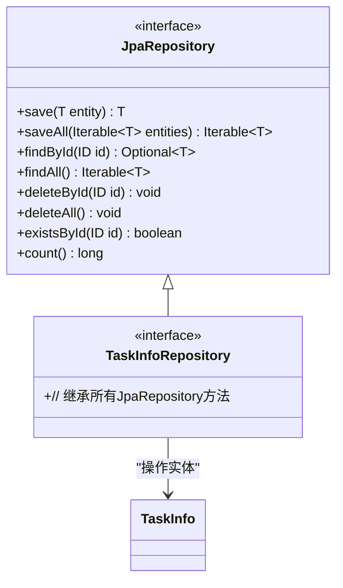
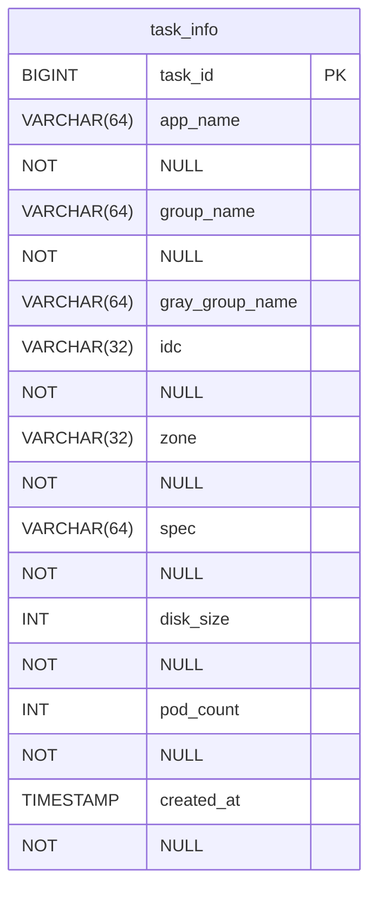
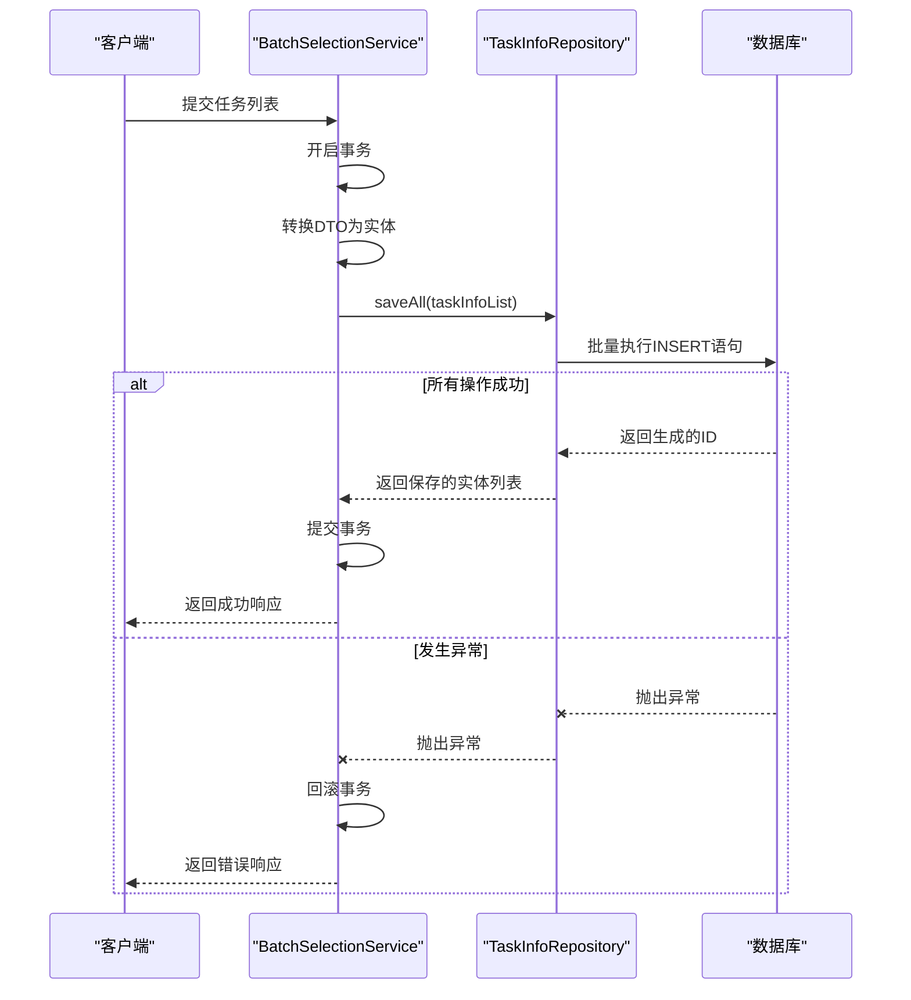

# TaskInfoRepository

<cite>
**Referenced Files in This Document**   
- [TaskInfoRepository.java](file://backend/src/main/java/com/example/batchselection/repository/TaskInfoRepository.java)
- [TaskInfo.java](file://backend/src/main/java/com/example/batchselection/entity/TaskInfo.java)
- [BatchSelectionServiceImpl.java](file://backend/src/main/java/com/example/batchselection/service/impl/BatchSelectionServiceImpl.java)
- [schema.sql](file://backend/src/main/resources/schema.sql)
</cite>

## 目录
1. [简介](#简介)
2. [核心功能与继承关系](#核心功能与继承关系)
3. [TaskInfo实体类分析](#taskinfo实体类分析)
4. [数据持久化机制](#数据持久化机制)
5. [批量提交流程与最佳实践](#批量提交流程与最佳实践)
6. [事务行为分析](#事务行为分析)
7. [性能优化建议](#性能优化建议)

## 简介
`TaskInfoRepository` 是系统中负责任务数据持久化的关键接口，作为 `task_info` 数据表的访问入口，它承担着批量任务提交场景下的数据存储职责。该接口通过继承 Spring Data JPA 的 `JpaRepository`，无需定义自定义方法即可获得完整的 CRUD（创建、读取、更新、删除）操作能力。其核心价值体现在 `saveAll()` 方法上，该方法支持高效地批量插入任务数据，是系统处理大规模任务提交请求的技术基石。

**Section sources**
- [TaskInfoRepository.java](file://backend/src/main/java/com/example/batchselection/repository/TaskInfoRepository.java#L7-L11)

## 核心功能与继承关系
`TaskInfoRepository` 是一个标准的 Spring Data JPA 仓库接口，其主要功能完全来源于对 `JpaRepository<TaskInfo, Long>` 的继承。这种设计模式遵循了“约定优于配置”的原则，极大地简化了数据访问层的开发。



**Diagram sources**
- [TaskInfoRepository.java](file://backend/src/main/java/com/example/batchselection/repository/TaskInfoRepository.java#L11)
- [TaskInfo.java](file://backend/src/main/java/com/example/batchselection/entity/TaskInfo.java#L15)

**Section sources**
- [TaskInfoRepository.java](file://backend/src/main/java/com/example/batchselection/repository/TaskInfoRepository.java#L11)

## TaskInfo实体类分析
`TaskInfo` 实体类定义了任务数据的结构，并通过 JPA 注解精确映射到数据库表 `task_info`。

### 主键与索引
- **主键策略**：`taskId` 字段使用 `@GeneratedValue(strategy = GenerationType.IDENTITY)` 注解，表明其采用数据库自增（IDENTITY）策略。这意味着每当插入一条新记录时，数据库会自动为 `task_id` 列生成一个唯一的、递增的整数值，确保了主键的唯一性和连续性。
- **查询索引**：`@Table` 注解中定义了 `@Index(name = "idx_created_at", columnList = "created_at")`，这会在数据库的 `created_at` 字段上创建一个名为 `idx_created_at` 的索引。该索引对于执行基于创建时间的范围查询（如“查询过去一小时创建的任务”）至关重要，能显著提升查询性能。

### 字段与约束
实体类中的字段通过 `@Column` 注解与数据库列名一一对应，并设置了 `nullable = false` 等约束，确保了数据的完整性。



**Diagram sources**
- [TaskInfo.java](file://backend/src/main/java/com/example/batchselection/entity/TaskInfo.java#L12-L20)
- [schema.sql](file://backend/src/main/resources/schema.sql#L25-L37)

**Section sources**
- [TaskInfo.java](file://backend/src/main/java/com/example/batchselection/entity/TaskInfo.java#L15-L20)

## 数据持久化机制
`TaskInfoRepository` 的数据持久化过程涉及实体类的自动填充和生命周期管理。

### createdAt字段自动填充
`createdAt` 字段的值并非由业务代码手动设置，而是由 JPA 的生命周期回调机制自动完成。`@PrePersist` 注解标记的 `onCreate()` 方法是关键：
- **触发时机**：当一个 `TaskInfo` 实体对象首次被持久化（即执行 `save()` 或 `saveAll()`）时，JPA 会在执行 INSERT SQL 语句之前自动调用此方法。
- **填充逻辑**：`onCreate()` 方法将 `createdAt` 字段设置为 `LocalDateTime.now()`，即当前系统时间。这保证了每条记录的创建时间都是精确且一致的。

### 事务性提交流程
`TaskInfoRepository` 的操作通常在事务上下文中执行。以 `BatchSelectionServiceImpl` 中的 `submitTasks` 方法为例，其流程如下：
1.  **事务开启**：`@Transactional` 注解确保了整个 `submitTasks` 方法运行在一个数据库事务中。
2.  **数据转换**：服务层将传入的 `TaskSubmitDTO` 列表转换为 `TaskInfo` 实体列表。
3.  **批量持久化**：调用 `taskInfoRepository.saveAll(taskInfoList)`。JPA 会为列表中的每个实体生成 INSERT 语句。
4.  **事务提交**：如果所有操作都成功，事务被提交，所有数据被永久写入数据库。如果在过程中发生任何异常（如数据库约束冲突），事务将根据 `rollbackFor = Exception.class` 的配置回滚，撤销所有已执行的插入操作，保证了数据的原子性。



**Diagram sources**
- [BatchSelectionServiceImpl.java](file://backend/src/main/java/com/example/batchselection/service/impl/BatchSelectionServiceImpl.java#L64-L93)
- [TaskInfo.java](file://backend/src/main/java/com/example/batchselection/entity/TaskInfo.java#L48-L51)

**Section sources**
- [TaskInfo.java](file://backend/src/main/java/com/example/batchselection/entity/TaskInfo.java#L46-L51)
- [BatchSelectionServiceImpl.java](file://backend/src/main/java/com/example/batchselection/service/impl/BatchSelectionServiceImpl.java#L64-L93)

## 批量提交流程与最佳实践
`saveAll()` 方法是实现高效批量数据插入的核心。

### 服务层调用示例
服务层通过注入 `TaskInfoRepository` 实例来调用 `saveAll()`：
```java
// 在BatchSelectionServiceImpl中
@Autowired
private TaskInfoRepository taskInfoRepository;

public TaskSubmitResponse submitTasks(List<TaskSubmitDTO> tasks) {
    List<TaskInfo> taskInfoList = tasks.stream()
        .map(this::convertToTaskInfo)
        .collect(Collectors.toList());
    
    // 批量保存所有任务
    List<TaskInfo> savedTasks = taskInfoRepository.saveAll(taskInfoList);
    // ...
}
```

### 最佳实践
1.  **前置数据校验**：在调用 `saveAll()` 之前，必须对输入数据进行严格校验（如检查列表是否为空、字段是否符合业务规则），避免无效数据进入持久化流程。
2.  **异常处理**：`saveAll()` 可能抛出 `DataAccessException` 等异常。服务层应捕获这些异常，并将其转换为有意义的业务错误响应，同时利用 `@Transactional` 确保事务回滚。
3.  **批量大小控制**：虽然 `saveAll()` 支持大批量操作，但过大的批次可能导致内存溢出或数据库连接超时。应在服务层设置合理的上限（如示例中的1000条），或采用分页提交策略。

**Section sources**
- [BatchSelectionServiceImpl.java](file://backend/src/main/java/com/example/batchselection/service/impl/BatchSelectionServiceImpl.java#L64-L93)

## 事务行为分析
`TaskInfoRepository` 本身不管理事务，其事务行为由调用方（通常是服务层）控制。如 `BatchSelectionServiceImpl.submitTasks()` 方法所示，通过 `@Transactional` 注解，确保了批量插入操作的原子性。这意味着，要么所有任务都成功入库，要么在发生任何错误时全部回滚，不会出现部分数据插入成功的情况，这对于保证业务数据的一致性至关重要。

**Section sources**
- [BatchSelectionServiceImpl.java](file://backend/src/main/java/com/example/batchselection/service/impl/BatchSelectionServiceImpl.java#L66)

## 性能优化建议
1.  **批量大小**：根据数据库性能和网络状况，调整 `saveAll()` 的批次大小。过小的批次会增加网络往返开销，过大的批次则可能耗尽内存。建议通过压力测试找到最优值。
2.  **JPA批量配置**：在 `application.properties` 中配置 JPA 的批量处理参数，如 `spring.jpa.properties.hibernate.jdbc.batch_size` 和 `spring.jpa.properties.hibernate.order_inserts`，可以进一步提升批量插入的性能。
3.  **索引利用**：`idx_created_at` 索引应被充分利用于时间范围查询。避免在 `created_at` 字段上进行函数运算（如 `DATE(created_at)`），这会导致索引失效。