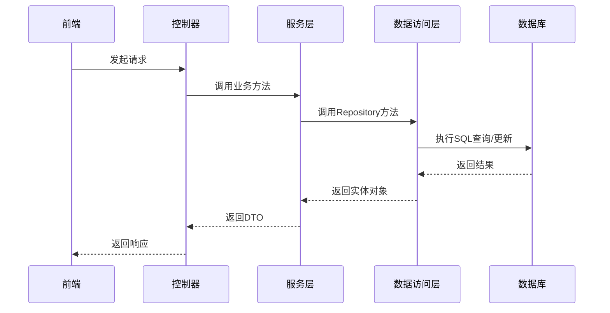
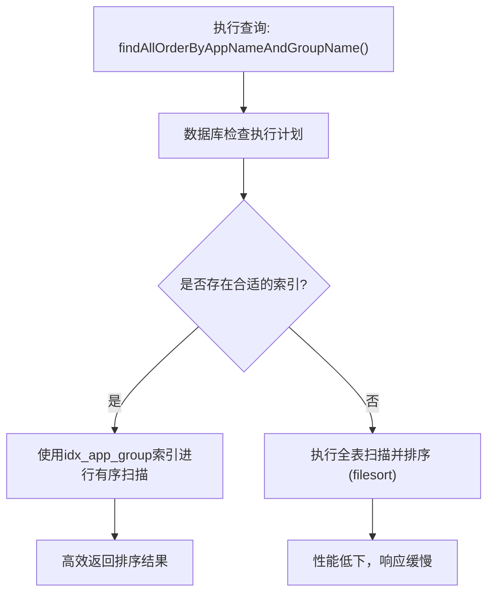

# 数据访问层

<cite>
**Referenced Files in This Document**   
- [AppInfoRepository.java](file://backend/src/main/java/com/example/batchselection/repository/AppInfoRepository.java)
- [TaskInfoRepository.java](file://backend/src/main/java/com/example/batchselection/repository/TaskInfoRepository.java)
- [AppInfo.java](file://backend/src/main/java/com/example/batchselection/entity/AppInfo.java)
- [TaskInfo.java](file://backend/src/main/java/com/example/batchselection/entity/TaskInfo.java)
- [schema.sql](file://backend/src/main/resources/schema.sql)
- [BatchSelectionServiceImpl.java](file://backend/src/main/java/com/example/batchselection/service/impl/BatchSelectionServiceImpl.java)
</cite>

## 目录
1. [引言](#引言)
2. [核心组件](#核心组件)
3. [数据持久化流程](#数据持久化流程)
4. [实体类与数据库映射](#实体类与数据库映射)
5. [主键生成策略](#主键生成策略)
6. [索引设计与查询优化](#索引设计与查询优化)
7. [性能优化建议](#性能优化建议)

## 引言
本文档详细阐述了批量勾选信息管理系统的数据访问层设计与实现。系统采用Spring Data JPA作为持久化框架，通过`AppInfoRepository`和`TaskInfoRepository`接口提供数据访问能力。文档将深入解析这两个核心Repository接口的功能特性、继承自`JpaRepository`的CRUD能力、自定义查询方法的实现原理，以及实体类与数据库表的映射关系。同时，本文还将探讨主键生成策略、索引设计考量及查询性能优化建议，为开发者提供数据库交互的底层视角和最佳实践指导。

## 核心组件

数据访问层的核心由两个Repository接口构成：`AppInfoRepository`和`TaskInfoRepository`。这两个接口均继承自Spring Data JPA的`JpaRepository`，从而自动获得了丰富的CRUD（创建、读取、更新、删除）操作能力。

`AppInfoRepository`接口除了继承基础的CRUD方法外，还定义了两个自定义查询方法：`findAllOrderByAppNameAndGroupName()`和`findByAppNameOrderByGroupName(String appName)`。前者用于查询所有应用数据并按应用名和分组名排序，后者则根据应用名查询其下的所有分组信息。这些方法通过Spring Data JPA的方法名解析机制或JPQL（Java Persistence Query Language）注解实现，极大地简化了数据访问代码。

`TaskInfoRepository`接口则是一个典型的空接口，它完全依赖于`JpaRepository`提供的通用方法来执行数据操作。这种设计模式体现了Spring Data JPA的“约定优于配置”原则，对于标准的CRUD操作，开发者无需编写任何实现代码。

**Section sources**
- [AppInfoRepository.java](file://backend/src/main/java/com/example/batchselection/repository/AppInfoRepository.java#L1-L25)
- [TaskInfoRepository.java](file://backend/src/main/java/com/example/batchselection/repository/TaskInfoRepository.java#L1-L12)

## 数据持久化流程

系统的数据持久化流程始于业务服务层（`BatchSelectionServiceImpl`），该层通过依赖注入获取`AppInfoRepository`和`TaskInfoRepository`的实例。当业务逻辑需要访问数据时，服务层会调用Repository接口中定义的方法。

以查询所有应用数据为例，`BatchSelectionServiceImpl`中的`getAllApplications()`方法会调用`appInfoRepository.findAllOrderByAppNameAndGroupName()`。Spring Data JPA的运行时会根据方法名或`@Query`注解解析出对应的SQL查询语句，并通过JPA Provider（如Hibernate）执行该语句。查询结果（`List<AppInfo>`）被返回给服务层，随后被转换为DTO（Data Transfer Object）结构并返回给前端。

对于数据写入操作，如提交任务，`BatchSelectionServiceImpl`中的`submitTasks()`方法会将`TaskSubmitDTO`列表转换为`TaskInfo`实体列表，然后调用`taskInfoRepository.saveAll()`方法。JPA Provider会负责将这些实体持久化到数据库中，自动生成相应的INSERT语句，并处理主键生成和时间戳更新等细节。



**Diagram sources**
- [BatchSelectionServiceImpl.java](file://backend/src/main/java/com/example/batchselection/service/impl/BatchSelectionServiceImpl.java#L35-L62)
- [AppInfoRepository.java](file://backend/src/main/java/com/example/batchselection/repository/AppInfoRepository.java#L18-L19)

## 实体类与数据库映射

实体类`AppInfo`和`TaskInfo`是Java对象与数据库表之间的桥梁，它们通过JPA注解精确地定义了对象属性与数据库列的映射关系。

`AppInfo`实体类映射到`app_info`表。其核心字段包括：
- `id`: 主键，使用`@Id`和`@GeneratedValue(strategy = GenerationType.IDENTITY)`注解，对应数据库的自增主键。
- `appName`和`groupName`: 分别映射到`app_name`和`group_name`列，使用`@Column`注解指定列名、非空约束和长度限制。
- `createdAt`和`updatedAt`: 时间戳字段，分别记录创建和更新时间。`createdAt`使用`updatable = false`确保创建时间不可更改。

`TaskInfo`实体类映射到`task_info`表，其字段结构与`AppInfo`高度相似，但有以下关键区别：
- 主键字段名为`taskId`，通过`@Column(name = "task_id")`显式映射到数据库的`task_id`列。
- 仅包含`createdAt`一个时间戳字段，且没有`updatedAt`，因为任务一旦创建其信息通常不会被修改。

两个实体类都使用了`@PrePersist`和`@PreUpdate`生命周期回调注解。`AppInfo`在`@PrePersist`和`@PreUpdate`时都会更新`updatedAt`，而`TaskInfo`仅在`@PrePersist`时设置`createdAt`，这体现了不同的业务需求。

```mermaid
erDiagram
app_info {
BIGINT id PK
VARCHAR(64) app_name NOT NULL
VARCHAR(64) group_name NOT NULL
VARCHAR(64) gray_group_name NULL
VARCHAR(32) idc NOT NULL
VARCHAR(32) zone NOT NULL
VARCHAR(64) spec NOT NULL
INT disk_size NOT NULL
INT pod_count NOT NULL
TIMESTAMP created_at NOT NULL
TIMESTAMP updated_at NOT NULL
}
task_info {
BIGINT task_id PK
VARCHAR(64) app_name NOT NULL
VARCHAR(64) group_name NOT NULL
VARCHAR(64) gray_group_name NULL
VARCHAR(32) idc NOT NULL
VARCHAR(32) zone NOT NULL
VARCHAR(64) spec NOT NULL
INT disk_size NOT NULL
INT pod_count NOT NULL
TIMESTAMP created_at NOT NULL
}
```

**Diagram sources**
- [AppInfo.java](file://backend/src/main/java/com/example/batchselection/entity/AppInfo.java#L10-L61)
- [TaskInfo.java](file://backend/src/main/java/com/example/batchselection/entity/TaskInfo.java#L10-L53)
- [schema.sql](file://backend/src/main/resources/schema.sql#L9-L22)

## 主键生成策略

系统为两个核心实体采用了相同的主键生成策略：`GenerationType.IDENTITY`。这是一种基于数据库自增列的策略。

在`schema.sql`脚本中，`app_info`表的`id`列和`task_info`表的`task_id`列都被定义为`AUTO_INCREMENT`。当一个新实体被持久化时，JPA Provider会向数据库发送一个INSERT语句，但不包含主键值。数据库会自动生成下一个可用的自增ID，并将其赋给新记录。JPA Provider随后会通过`SELECT LAST_INSERT_ID()`或类似机制获取这个新生成的ID，并将其设置回Java实体对象中。

这种策略的优点是简单、可靠，并且由数据库保证ID的唯一性。它非常适合单数据库实例的场景。然而，在分布式或分库分表的环境中，`IDENTITY`策略可能会遇到扩展性问题，此时可能需要考虑使用`GenerationType.UUID`或其他分布式ID生成方案。

**Section sources**
- [AppInfo.java](file://backend/src/main/java/com/example/batchselection/entity/AppInfo.java#L17-L18)
- [TaskInfo.java](file://backend/src/main/java/com/example/batchselection/entity/TaskInfo.java#L17-L18)
- [schema.sql](file://backend/src/main/resources/schema.sql#L10-L11)

## 索引设计与查询优化

数据库索引是提升查询性能的关键。系统在`schema.sql`脚本中为两个表都定义了精心设计的索引。

`app_info`表上创建了一个名为`idx_app_group`的联合索引，覆盖了`app_name`和`group_name`两列。这个索引的设计直接服务于`AppInfoRepository`中的`findAllOrderByAppNameAndGroupName()`和`findByAppNameOrderByGroupName()`方法。当执行按`appName`和`groupName`排序的查询时，数据库可以直接利用这个索引进行有序扫描，避免了昂贵的排序操作（filesort），从而显著提升查询效率。

`task_info`表上创建了一个名为`idx_created_at`的单列索引，覆盖`created_at`列。这个索引对于按时间范围查询任务（例如，“查找过去24小时内的所有任务”）非常有用。虽然当前的Repository接口没有直接暴露此类查询，但该索引为未来的功能扩展提供了性能保障。



**Diagram sources**
- [AppInfoRepository.java](file://backend/src/main/java/com/example/batchselection/repository/AppInfoRepository.java#L18-L19)
- [schema.sql](file://backend/src/main/resources/schema.sql#L21-L22)

## 性能优化建议

基于当前的数据访问层设计，提出以下性能优化建议：

1.  **批量操作优化**: 在`BatchSelectionServiceImpl`中，`submitTasks`方法使用了`saveAll()`进行批量插入，这是一个良好的实践。建议确保JPA Provider的批量插入配置已启用（如`hibernate.jdbc.batch_size`），以进一步提升性能。

2.  **查询方法优化**: `findAllOrderByAppNameAndGroupName()`方法会加载所有`app_info`表的数据。如果数据量巨大，这可能导致内存溢出或响应延迟。建议实现分页查询（例如，使用`Pageable`参数），以支持大数据量下的高效访问。

3.  **缓存策略**: 对于`AppInfo`这类相对静态的数据，可以考虑引入缓存（如Redis）。在首次查询后将结果缓存起来，后续请求可以直接从缓存读取，避免频繁的数据库访问。

4.  **索引监控**: 定期使用`EXPLAIN`命令分析关键查询的执行计划，确保数据库能够有效利用现有索引。随着数据量的增长和查询模式的变化，可能需要调整或添加新的索引。

5.  **实体类精简**: 在查询大量数据时，考虑使用投影（Projection）或自定义DTO查询，只选择真正需要的字段，避免加载不必要的数据，减少网络传输和内存占用。