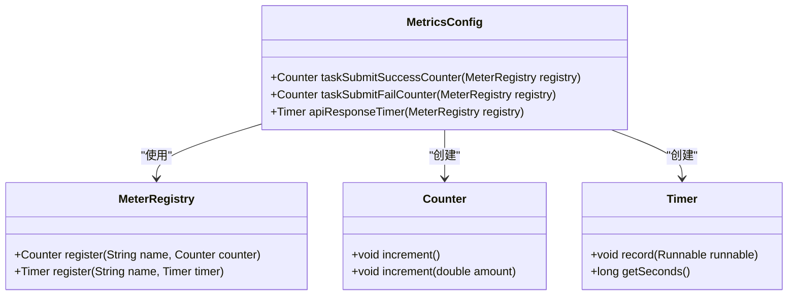
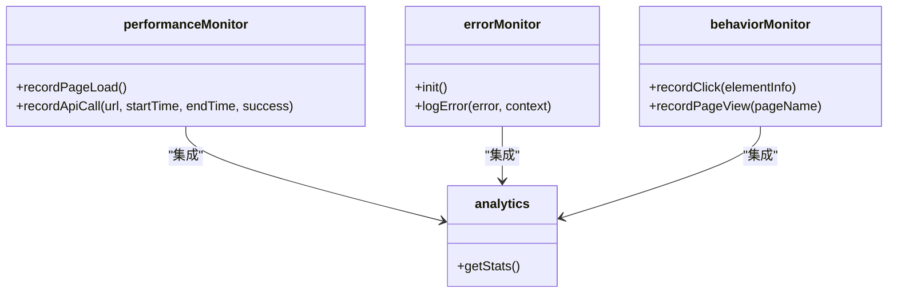
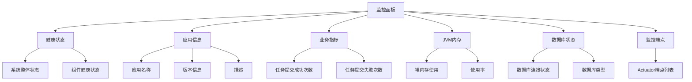
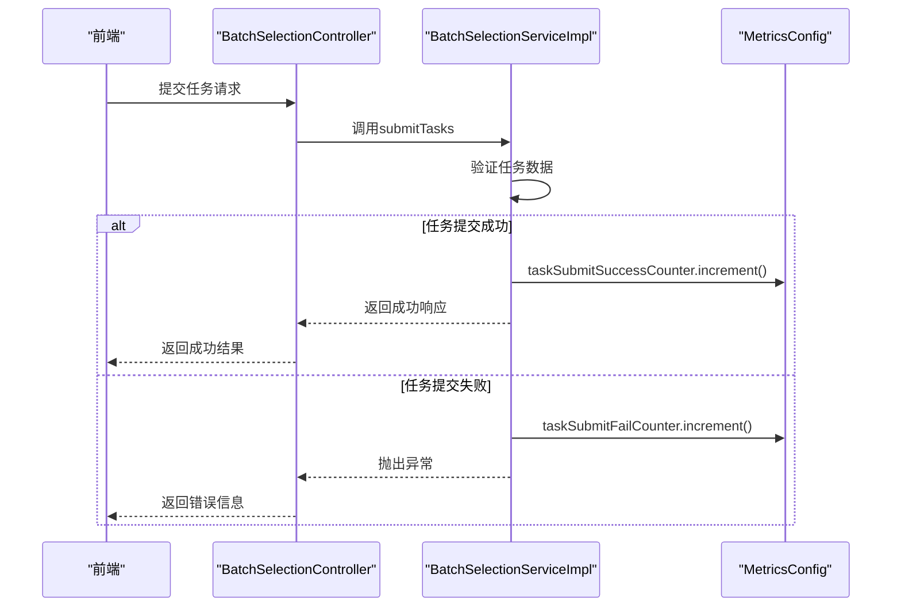

# 监控指标配置

<cite>
**Referenced Files in This Document**   
- [MetricsConfig.java](file://backend/src/main/java/com/example/batchselection/config/MetricsConfig.java)
- [BatchSelectionServiceImpl.java](file://backend/src/main/java/com/example/batchselection/service/impl/BatchSelectionServiceImpl.java)
- [BatchSelectionController.java](file://backend/src/main/java/com/example/batchselection/controller/BatchSelectionController.java)
- [application.properties](file://backend/src/main/resources/application.properties)
- [monitor-dashboard.html](file://monitor-dashboard.html)
- [monitor.js](file://frontend/src/utils/monitor.js)
- [pom.xml](file://backend/pom.xml)
- [package.json](file://frontend/package.json)
</cite>

## 目录
1. [简介](#简介)
2. [监控指标配置](#监控指标配置)
3. [前端监控实现](#前端监控实现)
4. [监控面板配置](#监控面板配置)
5. [系统架构与依赖](#系统架构与依赖)
6. [配置参数说明](#配置参数说明)
7. [监控指标使用](#监控指标使用)
8. [总结](#总结)

## 简介
本系统是一个批量勾选信息管理系统，包含完整的后端服务和前端界面。系统实现了全面的监控功能，包括后端业务指标监控、API性能监控、前端性能监控以及可视化监控面板。本文档详细说明了系统的监控指标配置和实现方式。

**Section sources**
- [MetricsConfig.java](file://backend/src/main/java/com/example/batchselection/config/MetricsConfig.java#L1-L48)
- [monitor-dashboard.html](file://monitor-dashboard.html#L1-L376)

## 监控指标配置
系统后端使用Spring Boot Actuator和Micrometer实现监控指标收集，通过`MetricsConfig`类定义了关键的业务和性能指标。



**Diagram sources**
- [MetricsConfig.java](file://backend/src/main/java/com/example/batchselection/config/MetricsConfig.java#L12-L47)

### 业务指标配置
系统定义了两个核心业务指标，用于跟踪任务提交的成功和失败情况：

- **任务提交成功计数器**：`batch.task.submit.success`
- **任务提交失败计数器**：`batch.task.submit.fail`

这些指标在`MetricsConfig`类中通过`@Bean`注解定义，并在业务逻辑中被引用。

**Section sources**
- [MetricsConfig.java](file://backend/src/main/java/com/example/batchselection/config/MetricsConfig.java#L18-L34)

### 性能指标配置
系统还配置了API响应时间监控，用于评估系统性能：

- **API响应时间计时器**：`batch.api.response.time`

该指标用于记录关键API接口的响应时间，帮助识别性能瓶颈。

**Section sources**
- [MetricsConfig.java](file://backend/src/main/java/com/example/batchselection/config/MetricsConfig.java#L40-L46)

## 前端监控实现
前端通过`monitor.js`文件实现了全面的监控功能，包括性能监控、错误监控和用户行为监控。



**Diagram sources**
- [monitor.js](file://frontend/src/utils/monitor.js#L6-L168)

### 性能监控
前端性能监控主要包含：

- 页面加载性能指标（DNS查询、TCP连接、DOM解析等）
- API请求性能记录
- 页面完全加载时间

这些指标通过浏览器的Performance API获取，为前端性能优化提供数据支持。

**Section sources**
- [monitor.js](file://frontend/src/utils/monitor.js#L6-L46)

### 错误监控
系统实现了全面的前端错误监控机制：

- JavaScript运行时错误捕获
- Promise未处理拒绝错误捕获
- 资源加载错误捕获
- 手动错误记录功能

这些监控功能通过事件监听器实现，能够及时发现和定位前端错误。

**Section sources**
- [monitor.js](file://frontend/src/utils/monitor.js#L49-L117)

## 监控面板配置
系统提供了一个独立的HTML监控面板`monitor-dashboard.html`，用于可视化展示系统各项监控指标。



**Diagram sources**
- [monitor-dashboard.html](file://monitor-dashboard.html#L148-L375)

### 面板功能
监控面板主要包含以下功能模块：

- **系统健康状态**：显示系统整体健康状况和各组件状态
- **应用信息**：展示应用名称、版本和描述等基本信息
- **业务指标**：显示自定义的业务监控指标
- **JVM内存**：监控Java虚拟机内存使用情况
- **数据库状态**：显示数据库连接状态
- **监控端点**：提供所有可用监控端点的链接

**Section sources**
- [monitor-dashboard.html](file://monitor-dashboard.html#L150-L186)

### 数据获取机制
监控面板通过调用Spring Boot Actuator的REST API获取监控数据：

- 健康检查：`/actuator/health`
- 应用信息：`/actuator/info`
- 指标数据：`/actuator/metrics`
- JVM内存：`/actuator/metrics/jvm.memory.used`
- 监控端点：`/actuator`

面板每30秒自动刷新一次数据，确保监控信息的实时性。

**Section sources**
- [monitor-dashboard.html](file://monitor-dashboard.html#L194-L372)

## 系统架构与依赖
系统采用前后端分离架构，后端基于Spring Boot，前端基于React，通过REST API进行通信。

```mermaid
graph TD
subgraph "前端"
A[React应用]
B[监控工具]
C[Ant Design UI]
end
subgraph "后端"
D[Spring Boot]
E[Actuator监控]
F[JPA数据访问]
G[MySQL数据库]
end
A --> D : "HTTP API"
B --> E : "监控数据"
D --> G : "JDBC"
E --> B : "指标暴露"
```

**Diagram sources**
- [pom.xml](file://backend/pom.xml#L1-L99)
- [package.json](file://frontend/package.json#L1-L34)

### 后端依赖
后端主要依赖包括：

- **Spring Boot Web**：提供Web服务支持
- **Spring Boot Data JPA**：实现数据持久化
- **Spring Boot Actuator**：提供监控功能
- **Micrometer Prometheus**：指标收集和导出
- **MySQL Connector**：数据库连接

这些依赖在`pom.xml`文件中定义，构成了系统的核心技术栈。

**Section sources**
- [pom.xml](file://backend/pom.xml#L29-L80)

### 前端依赖
前端主要依赖包括：

- **React**：前端框架
- **Ant Design**：UI组件库
- **Axios**：HTTP客户端
- **Vite**：构建工具

这些依赖在`package.json`文件中定义，支持前端应用的开发和构建。

**Section sources**
- [package.json](file://frontend/package.json#L6-L15)

## 配置参数说明
系统的监控功能通过配置文件进行控制，主要配置参数如下：

### Actuator配置
在`application.properties`文件中，配置了Actuator监控的相关参数：

```properties
# 暴露所有监控端点
management.endpoints.web.exposure.include=health,info,metrics,prometheus,env,beans,httptrace
# 显示详细健康信息
management.endpoint.health.show-details=always
# 监控端点路径
management.endpoints.web.base-path=/actuator
# 启用健康检查组件
management.health.db.enabled=true
management.health.diskspace.enabled=true
# 应用信息
info.app.name=Batch Selection Application
info.app.version=1.0.0
info.app.description=批量勾选信息管理系统
```

这些配置确保了监控功能的完整性和安全性。

**Section sources**
- [application.properties](file://backend/src/main/resources/application.properties#L35-L50)

## 监控指标使用
监控指标在业务逻辑中被实际使用，通过依赖注入的方式在服务类中引用。



**Diagram sources**
- [BatchSelectionServiceImpl.java](file://backend/src/main/java/com/example/batchselection/service/impl/BatchSelectionServiceImpl.java#L70-L104)
- [BatchSelectionController.java](file://backend/src/main/java/com/example/batchselection/controller/BatchSelectionController.java#L50-L62)

### 指标注入与使用
在`BatchSelectionServiceImpl`类中，监控指标通过构造函数注入：

```java
@Service
@RequiredArgsConstructor
public class BatchSelectionServiceImpl implements BatchSelectionService {
    private final Counter taskSubmitSuccessCounter;
    private final Counter taskSubmitFailCounter;
    
    @Override
    public TaskSubmitResponse submitTasks(List<TaskSubmitDTO> tasks) {
        try {
            // 业务逻辑处理
            // ...
            
            // 监控: 记录成功次数
            taskSubmitSuccessCounter.increment(tasks.size());
            return new TaskSubmitResponse(taskIds, taskIds.size());
        } catch (Exception e) {
            // 监控: 记录失败次数
            taskSubmitFailCounter.increment();
            log.error("任务提交失败", e);
            throw e;
        }
    }
}
```

这种设计实现了业务逻辑与监控逻辑的解耦，提高了代码的可维护性。

**Section sources**
- [BatchSelectionServiceImpl.java](file://backend/src/main/java/com/example/batchselection/service/impl/BatchSelectionServiceImpl.java#L34-L35)
- [BatchSelectionServiceImpl.java](file://backend/src/main/java/com/example/batchselection/service/impl/BatchSelectionServiceImpl.java#L98-L103)

## 总结
本系统实现了全面的监控体系，涵盖了后端业务指标、API性能、前端性能和错误监控等多个方面。通过Spring Boot Actuator和Micrometer的集成，系统能够收集和暴露关键的监控指标。独立的监控面板提供了直观的可视化界面，便于运维人员实时掌握系统状态。前端监控工具则补充了客户端的性能和错误数据，形成了完整的端到端监控解决方案。

系统的监控配置具有良好的扩展性，可以方便地添加新的监控指标，为系统的稳定运行和性能优化提供了有力支持。