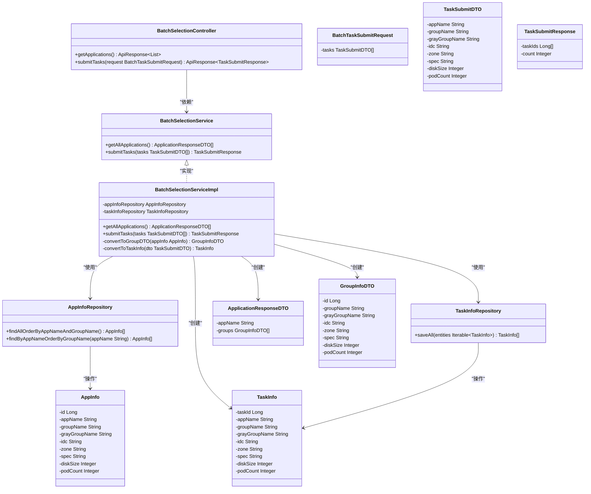
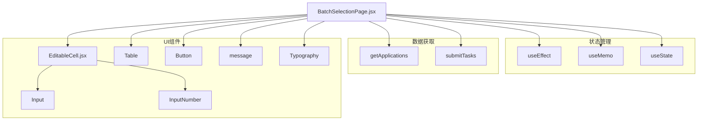
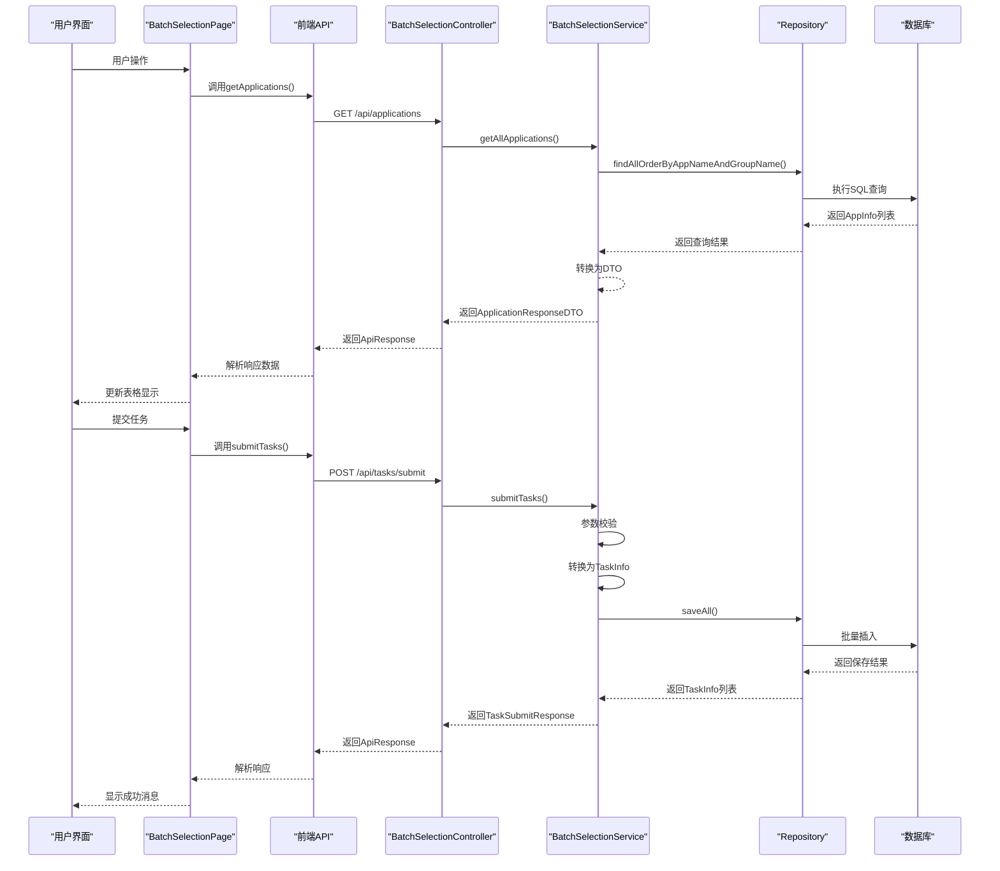

# 代码结构规范

<cite>
**本文档引用的文件**
- [BatchSelectionController.java](file://backend/src/main/java/com/example/batchselection/controller/BatchSelectionController.java)
- [BatchSelectionServiceImpl.java](file://backend/src/main/java/com/example/batchselection/service/impl/BatchSelectionServiceImpl.java)
- [AppInfoRepository.java](file://backend/src/main/java/com/example/batchselection/repository/AppInfoRepository.java)
- [TaskInfoRepository.java](file://backend/src/main/java/com/example/batchselection/repository/TaskInfoRepository.java)
- [AppInfo.java](file://backend/src/main/java/com/example/batchselection/entity/AppInfo.java)
- [TaskInfo.java](file://backend/src/main/java/com/example/batchselection/entity/TaskInfo.java)
- [ApplicationResponseDTO.java](file://backend/src/main/java/com/example/batchselection/dto/ApplicationResponseDTO.java)
- [GroupInfoDTO.java](file://backend/src/main/java/com/example/batchselection/dto/GroupInfoDTO.java)
- [BatchTaskSubmitRequest.java](file://backend/src/main/java/com/example/batchselection/dto/BatchTaskSubmitRequest.java)
- [TaskSubmitResponse.java](file://backend/src/main/java/com/example/batchselection/dto/TaskSubmitResponse.java)
- [BatchSelectionPage.jsx](file://frontend/src/components/BatchSelectionPage.jsx)
- [EditableCell.jsx](file://frontend/src/components/EditableCell.jsx)
- [index.js](file://frontend/src/api/index.js)
</cite>

## 目录
1. [项目概述](#项目概述)
2. [后端分层架构](#后端分层架构)
3. [前端组件化架构](#前端组件化架构)
4. [前后端交互流程](#前后端交互流程)
5. [常见反模式与规范建议](#常见反模式与规范建议)

## 项目概述

本项目实现了一个批量勾选信息管理功能，包含前后端完整实现。后端采用Spring Boot框架，遵循MVC分层架构，通过RESTful API提供服务；前端采用React框架，基于组件化设计实现用户界面。系统支持查询应用数据和批量提交任务两大核心功能，前后端通过清晰的职责划分和接口定义实现解耦。

## 后端分层架构

后端代码严格遵循MVC（Model-View-Controller）设计模式，分为Controller层、Service层和Repository层，各层职责明确，通过依赖注入实现松耦合。

**图示来源**
- [BatchSelectionController.java](file://backend/src/main/java/com/example/batchselection/controller/BatchSelectionController.java#L18-L62)
- [BatchSelectionServiceImpl.java](file://backend/src/main/java/com/example/batchselection/service/impl/BatchSelectionServiceImpl.java#L25-L126)
- [AppInfoRepository.java](file://backend/src/main/java/com/example/batchselection/repository/AppInfoRepository.java#L11-L24)
- [TaskInfoRepository.java](file://backend/src/main/java/com/example/batchselection/repository/TaskInfoRepository.java#L10-L12)
- [AppInfo.java](file://backend/src/main/java/com/example/batchselection/entity/AppInfo.java#L10-L62)
- [TaskInfo.java](file://backend/src/main/java/com/example/batchselection/entity/TaskInfo.java#L10-L54)
- [ApplicationResponseDTO.java](file://backend/src/main/java/com/example/batchselection/dto/ApplicationResponseDTO.java#L9-L15)
- [GroupInfoDTO.java](file://backend/src/main/java/com/example/batchselection/dto/GroupInfoDTO.java#L8-L20)
- [BatchTaskSubmitRequest.java](file://backend/src/main/java/com/example/batchselection/dto/BatchTaskSubmitRequest.java#L11-L18)
- [TaskSubmitResponse.java](file://backend/src/main/java/com/example/batchselection/dto/TaskSubmitResponse.java#L11-L19)

### Controller层职责

Controller层负责接收HTTP请求、验证参数、调用Service层处理业务逻辑，并封装响应结果。`BatchSelectionController`类使用`@RestController`注解标记，通过`@RequestMapping("/api")`统一设置API前缀。

`getApplications()`方法处理`GET /api/applications`请求，调用Service层获取应用数据并封装为`ApiResponse`对象返回。该方法包含完整的异常处理逻辑，确保系统稳定性。

**代码片段来源**
- [BatchSelectionController.java](file://backend/src/main/java/com/example/batchselection/controller/BatchSelectionController.java#L33-L43)

### Service层职责

Service层实现核心业务逻辑，是系统业务规则的主要承载者。`BatchSelectionServiceImpl`类实现了`BatchSelectionService`接口，包含两个核心方法：

`getAllApplications()`方法从数据库获取所有应用数据，按应用名分组，并转换为前端所需的DTO结构。该方法体现了数据转换和聚合的业务逻辑。

`submitTasks()`方法使用`@Transactional`注解确保事务一致性，对批量提交的任务进行参数校验、实体转换和持久化操作，体现了核心业务流程的处理。

**代码片段来源**
- [BatchSelectionServiceImpl.java](file://backend/src/main/java/com/example/batchselection/service/impl/BatchSelectionServiceImpl.java#L35-L63)
- [BatchSelectionServiceImpl.java](file://backend/src/main/java/com/example/batchselection/service/impl/BatchSelectionServiceImpl.java#L67-L94)

### Repository层职责

Repository层通过Spring Data JPA与数据库交互，封装数据访问逻辑。`AppInfoRepository`接口继承`JpaRepository`，提供基本的CRUD操作，并通过`@Query`注解定义了自定义查询方法`findAllOrderByAppNameAndGroupName()`，实现按应用名和分组名排序的数据查询。

`TaskInfoRepository`接口仅继承`JpaRepository`，使用默认的`saveAll()`方法实现批量数据持久化，体现了Repository层的简洁性和复用性。

**代码片段来源**
- [AppInfoRepository.java](file://backend/src/main/java/com/example/batchselection/repository/AppInfoRepository.java#L18-L19)
- [TaskInfoRepository.java](file://backend/src/main/java/com/example/batchselection/repository/TaskInfoRepository.java#L11-L12)

## 前端组件化架构

前端采用React组件化架构，通过组件拆分实现关注点分离，提高代码可维护性和复用性。

**图示来源**
- [BatchSelectionPage.jsx](file://frontend/src/components/BatchSelectionPage.jsx#L12-L350)
- [EditableCell.jsx](file://frontend/src/components/EditableCell.jsx#L8-L108)

### 容器组件：BatchSelectionPage

`BatchSelectionPage`作为容器组件，负责管理应用的整体状态和数据流。它使用`useState`钩子管理多个状态变量，包括`loading`、`submitting`、`applications`、`selectedRowKeys`和`editedData`。

组件通过`useEffect`钩子在挂载时自动加载应用数据，体现了数据获取与组件生命周期的结合。`loadApplications`函数调用API服务获取数据，并根据响应结果更新状态和显示消息。

**代码片段来源**
- [BatchSelectionPage.jsx](file://frontend/src/components/BatchSelectionPage.jsx#L13-L38)

### 展示组件：EditableCell

`EditableCell`是一个受控的展示组件，专门处理单元格的编辑交互。它接收`value`、`onChange`等props，实现双击进入编辑模式、失焦或回车保存、ESC取消的完整交互逻辑。

组件内部使用`useState`管理编辑状态和临时值，区分显示模式和编辑模式。对于数字类型输入，使用`InputNumber`组件并进行基本校验，体现了组件的通用性和健壮性。

**代码片段来源**
- [EditableCell.jsx](file://frontend/src/components/EditableCell.jsx#L16-L108)

### 数据流与回调机制

前端组件间通过props传递数据和回调函数实现通信。在`BatchSelectionPage`的列定义中，每个可编辑列的`render`函数都通过`onChange`回调将`handleFieldChange`函数传递给`EditableCell`组件。

`handleFieldChange`函数接收记录ID、字段名和新值，更新`editedData`状态对象，实现了编辑数据的集中管理。这种模式确保了状态的可预测性和调试的便利性。

**代码片段来源**
- [BatchSelectionPage.jsx](file://frontend/src/components/BatchSelectionPage.jsx#L78-L86)
- [BatchSelectionPage.jsx](file://frontend/src/components/BatchSelectionPage.jsx#L107-L108)

## 前后端交互流程

系统通过清晰的API接口定义实现前后端解耦，数据交互遵循统一的规范。

**图示来源**
- [BatchSelectionPage.jsx](file://frontend/src/components/BatchSelectionPage.jsx#L24-L38)
- [index.js](file://frontend/src/api/index.js#L24-L25)
- [BatchSelectionController.java](file://backend/src/main/java/com/example/batchselection/controller/BatchSelectionController.java#L33-L43)
- [BatchSelectionServiceImpl.java](file://backend/src/main/java/com/example/batchselection/service/impl/BatchSelectionServiceImpl.java#L35-L63)
- [AppInfoRepository.java](file://backend/src/main/java/com/example/batchselection/repository/AppInfoRepository.java#L18-L19)

### 查询流程分析

当用户访问页面时，`BatchSelectionPage`组件通过`useEffect`触发`loadApplications`函数，调用`getApplications` API方法。该方法通过axios发送GET请求到`/api/applications`端点。

后端`BatchSelectionController`接收请求，调用`BatchSelectionService`的`getAllApplications`方法。Service层从`AppInfoRepository`获取数据，进行分组和DTO转换后返回。Controller层将结果封装为`ApiResponse`格式返回给前端。

**代码片段来源**
- [BatchSelectionPage.jsx](file://frontend/src/components/BatchSelectionPage.jsx#L24-L38)
- [index.js](file://frontend/src/api/index.js#L24-L25)
- [BatchSelectionController.java](file://backend/src/main/java/com/example/batchselection/controller/BatchSelectionController.java#L33-L43)

### 提交流程分析

用户勾选分组并点击提交时，`BatchSelectionPage`收集`selectedRowKeys`中的数据，调用`submitTasks` API方法。前端将任务列表作为请求体发送到`/api/tasks/submit`端点。

后端`BatchSelectionController`接收请求，自动进行参数验证。`BatchSelectionService`的`submitTasks`方法在事务中处理批量插入，通过`TaskInfoRepository`的`saveAll`方法持久化数据，并返回生成的任务ID列表。

**代码片段来源**
- [BatchSelectionPage.jsx](file://frontend/src/components/BatchSelectionPage.jsx#L251-L302)
- [index.js](file://frontend/src/api/index.js#L32-L34)
- [BatchSelectionController.java](file://backend/src/main/java/com/example/batchselection/controller/BatchSelectionController.java#L49-L62)
- [BatchSelectionServiceImpl.java](file://backend/src/main/java/com/example/batchselection/service/impl/BatchSelectionServiceImpl.java#L67-L94)

## 常见反模式与规范建议

在实际开发中，应避免以下违反分层规范的常见反模式：

### 后端反模式

**跨层调用**：避免在Controller层直接调用Repository层，这会破坏Service层的业务逻辑封装。所有数据访问应通过Service层进行。

**业务逻辑泄露**：避免在Controller层处理复杂的业务规则或数据转换逻辑。Controller应保持轻量，仅负责请求接收和响应封装。

**事务管理不当**：避免在Service层方法外进行事务管理，或在非Service类中使用`@Transactional`注解。事务边界应在Service层明确。

### 前端反模式

**状态管理混乱**：避免在多个组件中分散管理相关状态，应遵循"单一数据源"原则，将共享状态提升到共同父组件。

**过度耦合**：避免容器组件与展示组件职责不清，展示组件应保持无状态或仅管理自身UI状态，不直接访问API。

**回调地狱**：避免在组件间传递过多回调函数，对于复杂的状态逻辑，可考虑使用Context API或状态管理库。

### 最佳实践建议

**后端**：保持Service层的纯粹性，将数据转换、验证、事务等横切关注点分离；合理使用DTO避免暴露实体细节；通过接口定义Service契约。

**前端**：遵循"容器组件-展示组件"模式，明确职责划分；使用TypeScript增强类型安全；通过自定义Hook封装可复用逻辑。

**前后端协作**：定义清晰的API契约，使用Swagger等工具生成文档；约定统一的错误处理格式；通过DTO明确数据传输结构。