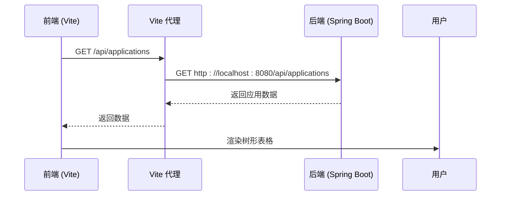
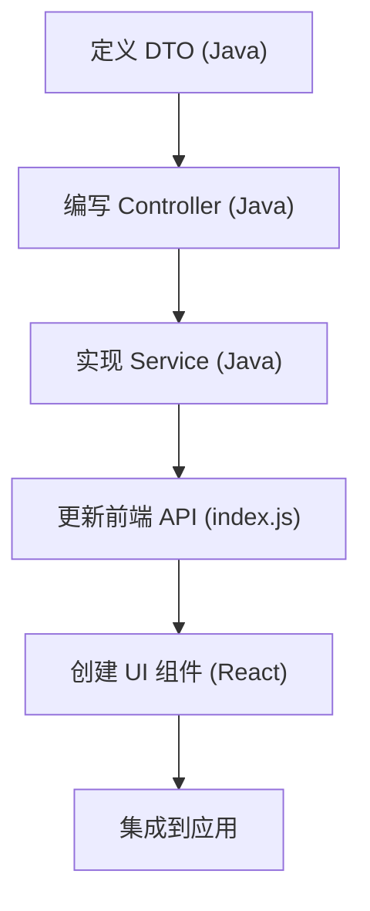

# 开发流程

<cite>
**本文档引用的文件**  
- [README.md](file://README.md)
- [BatchSelectionController.java](file://backend/src/main/java/com/example/batchselection/controller/BatchSelectionController.java)
- [BatchSelectionServiceImpl.java](file://backend/src/main/java/com/example/batchselection/service/impl/BatchSelectionServiceImpl.java)
- [BatchSelectionService.java](file://backend/src/main/java/com/example/batchselection/service/BatchSelectionService.java)
- [BatchTaskSubmitRequest.java](file://backend/src/main/java/com/example/batchselection/dto/BatchTaskSubmitRequest.java)
- [TaskSubmitDTO.java](file://backend/src/main/java/com/example/batchselection/dto/TaskSubmitDTO.java)
- [TaskSubmitResponse.java](file://backend/src/main/java/com/example/batchselection/dto/TaskSubmitResponse.java)
- [ApplicationResponseDTO.java](file://backend/src/main/java/com/example/batchselection/dto/ApplicationResponseDTO.java)
- [index.js](file://frontend/src/api/index.js)
- [BatchSelectionPage.jsx](file://frontend/src/components/BatchSelectionPage.jsx)
- [application.properties](file://backend/src/main/resources/application.properties)
- [schema.sql](file://backend/src/main/resources/schema.sql)
- [test-data.sql](file://backend/src/main/resources/test-data.sql)
- [pom.xml](file://backend/pom.xml)
- [package.json](file://frontend/package.json)
- [vite.config.js](file://frontend/vite.config.js)
</cite>

## 目录
1. [项目概览](#项目概览)
2. [环境准备与启动](#环境准备与启动)
3. [数据库初始化](#数据库初始化)
4. [前后端联调说明](#前后端联调说明)
5. [功能迭代开发流程](#功能迭代开发流程)
6. [代码结构与命名规范](#代码结构与命名规范)

## 项目概览

新开发者应首先阅读 `README.md` 文件以获取项目整体信息。该项目是一个基于 React + Spring Boot + MySQL 的批量勾选信息管理系统，支持树形表格展示、在线编辑、批量提交等功能。后端采用 Spring Boot 构建 RESTful API，前端使用 React 18 与 Ant Design 5 实现用户界面。

**Section sources**
- [README.md](file://README.md)

## 环境准备与启动

### 前置要求
确保已安装以下环境：
- JDK 11+
- Maven 3.6+
- Node.js 16+
- MySQL 8.0+

### 后端启动
进入 `backend` 目录，使用 Maven 命令启动 Spring Boot 应用：

```bash
cd backend
mvn clean install
mvn spring-boot:run
```

服务将在 `http://localhost:8080` 启动。端口配置位于 `application.properties` 文件中。

### 前端启动
进入 `frontend` 目录，安装依赖并启动 Vite 开发服务器：

```bash
cd frontend
npm install
npm run dev
```

前端页面将在 `http://localhost:3000` 打开。Vite 的代理配置已将 `/api` 请求转发至后端 `8080` 端口。

**Section sources**
- [application.properties](file://backend/src/main/resources/application.properties#L4)
- [vite.config.js](file://frontend/vite.config.js#L7-L11)
- [pom.xml](file://backend/pom.xml)
- [package.json](file://frontend/package.json#L17)

## 数据库初始化

项目通过 SQL 脚本自动初始化数据库结构和测试数据。

### 表结构初始化
`schema.sql` 脚本用于创建数据库和表结构：
- `app_info`：存储应用与分组的基础信息
- `task_info`：存储用户提交的任务快照

该脚本在应用启动时由 Spring Boot 自动执行，配置位于 `application.properties` 中的 `spring.sql.init.mode=always`。

### 测试数据导入
`test-data.sql` 包含预设的测试数据，用于开发和调试。该脚本也会在启动时自动执行，路径配置为 `spring.sql.init.data-locations=classpath:test-data.sql`。

**Section sources**
- [schema.sql](file://backend/src/main/resources/schema.sql)
- [test-data.sql](file://backend/src/main/resources/test-data.sql)
- [application.properties](file://backend/src/main/resources/application.properties#L21-L23)

## 前后端联调说明

### 跨域配置（CORS）
后端已在 `BatchSelectionController` 类上使用 `@CrossOrigin(origins = "*")` 注解，允许所有来源的跨域请求，开发环境下无需额外配置。

### API 代理
前端 Vite 配置了代理规则，将所有 `/api` 开头的请求转发至 `http://localhost:8080`，避免了开发环境的跨域问题。

### 接口调用流程
前端通过 `axios` 封装 API 调用，`src/api/index.js` 提供了 `getApplications` 和 `submitTasks` 方法，分别对应查询数据和提交任务的后端接口。



**Diagram sources**
- [BatchSelectionController.java](file://backend/src/main/java/com/example/batchselection/controller/BatchSelectionController.java#L21-L24)
- [vite.config.js](file://frontend/vite.config.js#L9-L12)
- [index.js](file://frontend/src/api/index.js)

**Section sources**
- [BatchSelectionController.java](file://backend/src/main/java/com/example/batchselection/controller/BatchSelectionController.java)
- [vite.config.js](file://frontend/vite.config.js)
- [index.js](file://frontend/src/api/index.js)

## 功能迭代开发流程

当需要添加新的 API 端点时，应遵循以下标准流程：

### 1. 定义数据传输对象（DTO）
在 `backend/src/main/java/com/example/batchselection/dto/` 目录下创建新的 DTO 类，用于请求和响应的数据封装。例如，`TaskSubmitDTO` 定义了提交任务所需字段，并包含 JSR-303 校验注解。

### 2. 编写 Controller 方法
在 `BatchSelectionController` 中添加新的 `@GetMapping` 或 `@PostMapping` 方法，定义 REST 接口路径和参数。方法应调用 Service 层并处理异常。

### 3. 实现 Service 逻辑
在 `BatchSelectionServiceImpl` 中实现具体的业务逻辑。该类通过依赖注入使用 `AppInfoRepository` 和 `TaskInfoRepository` 进行数据访问。

### 4. 更新前端 API 客户端
在 `frontend/src/api/index.js` 中添加新的 API 调用函数，封装 `axios` 请求。

### 5. 创建前端 UI 组件
在 `frontend/src/components/` 目录下创建新的 React 组件，并在路由或主页面中引入。



**Diagram sources**
- [TaskSubmitDTO.java](file://backend/src/main/java/com/example/batchselection/dto/TaskSubmitDTO.java)
- [BatchSelectionController.java](file://backend/src/main/java/com/example/batchselection/controller/BatchSelectionController.java)
- [BatchSelectionServiceImpl.java](file://backend/src/main/java/com/example/batchselection/service/impl/BatchSelectionServiceImpl.java)
- [index.js](file://frontend/src/api/index.js)
- [BatchSelectionPage.jsx](file://frontend/src/components/BatchSelectionPage.jsx)

**Section sources**
- [TaskSubmitDTO.java](file://backend/src/main/java/com/example/batchselection/dto/TaskSubmitDTO.java)
- [BatchSelectionController.java](file://backend/src/main/java/com/example/batchselection/controller/BatchSelectionController.java)
- [BatchSelectionServiceImpl.java](file://backend/src/main/java/com/example/batchselection/service/impl/BatchSelectionServiceImpl.java)
- [index.js](file://frontend/src/api/index.js)
- [BatchSelectionPage.jsx](file://frontend/src/components/BatchSelectionPage.jsx)

## 代码结构与命名规范

### 后端目录结构
遵循标准的 Spring Boot 分层架构：
- `controller`：处理 HTTP 请求
- `dto`：数据传输对象
- `entity`：JPA 实体类
- `repository`：数据访问接口
- `service`：业务逻辑实现

### 前端目录结构
- `api`：API 接口封装
- `components`：可复用的 UI 组件
- 所有组件采用 PascalCase 命名（如 `BatchSelectionPage.jsx`）

### 命名一致性
- Java 类名使用驼峰命名（如 `BatchSelectionApplication`）
- 方法名使用小驼峰（如 `getAllApplications`）
- 前端组件文件名与组件名一致
- 保持与现有代码风格一致，确保项目整体一致性

**Section sources**
- [README.md](file://README.md#L9-L34)
- [BatchSelectionApplication.java](file://backend/src/main/java/com/example/batchselection/BatchSelectionApplication.java)
- [BatchSelectionPage.jsx](file://frontend/src/components/BatchSelectionPage.jsx)