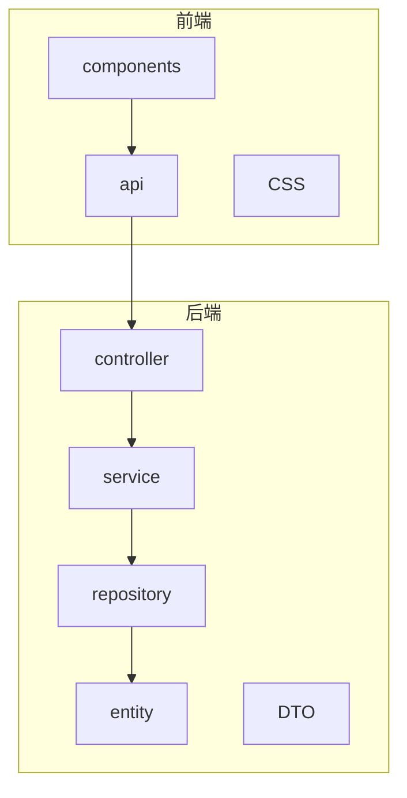
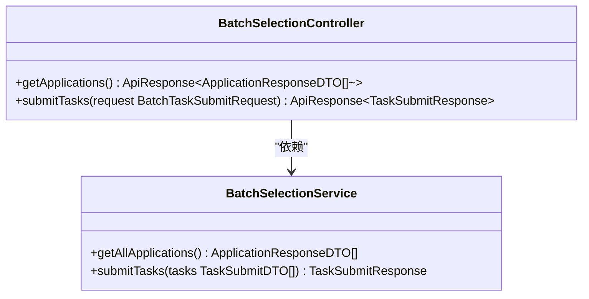
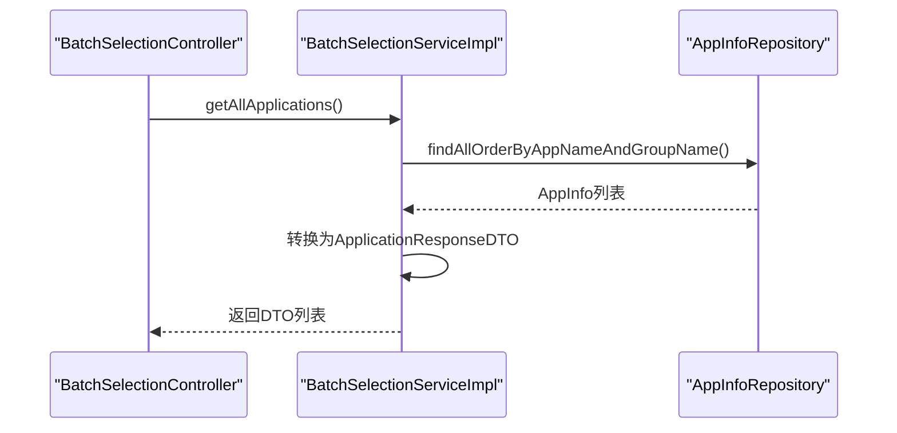
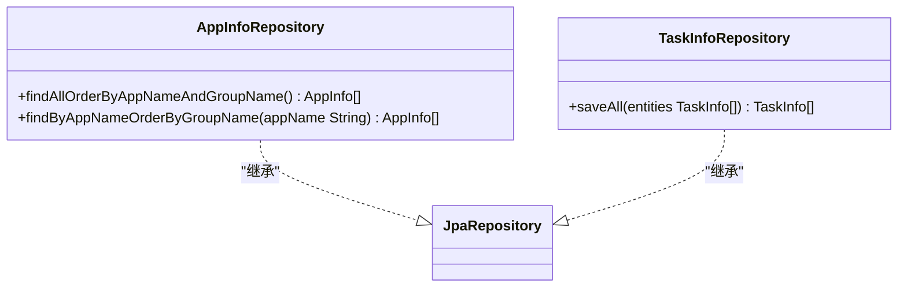
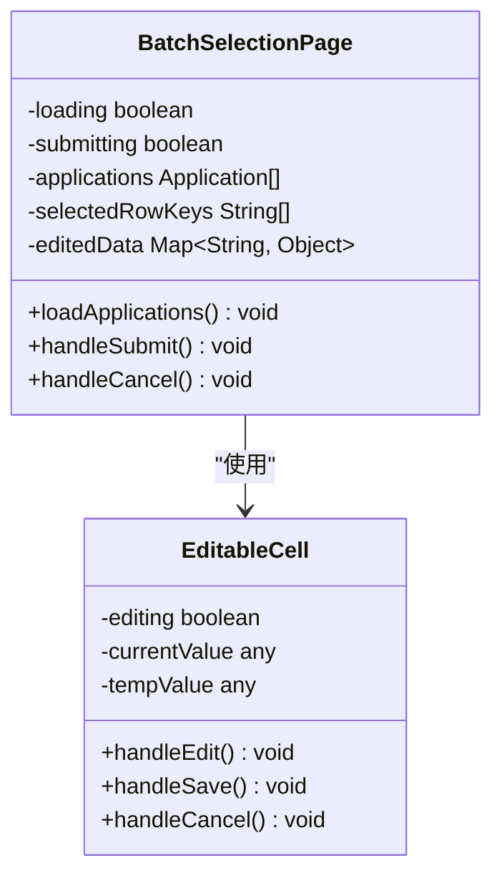
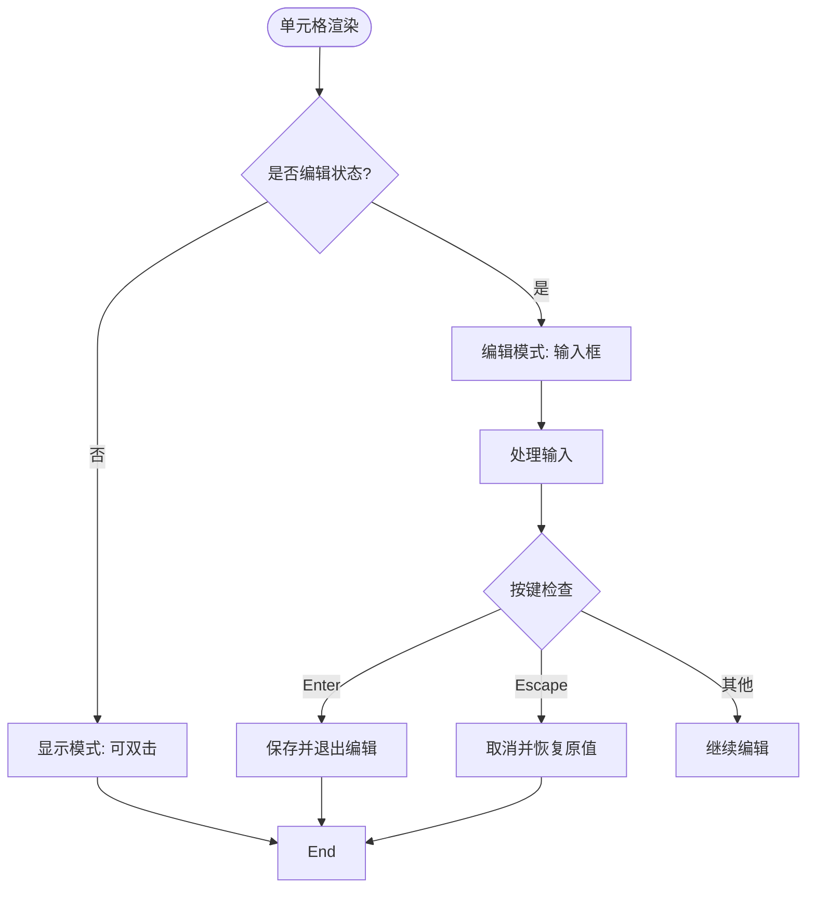
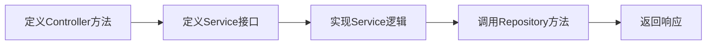
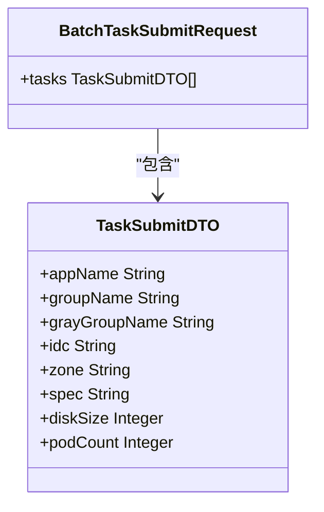
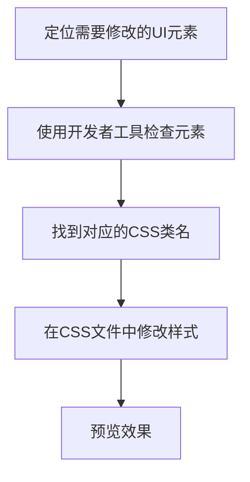
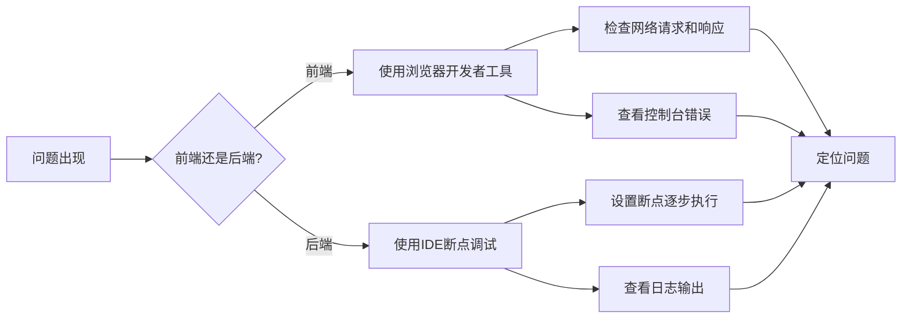

# 开发者指南

<cite>
**本文档引用的文件**  
- [BatchSelectionController.java](file://backend/src/main/java/com/example/batchselection/controller/BatchSelectionController.java)
- [BatchSelectionService.java](file://backend/src/main/java/com/example/batchselection/service/BatchSelectionService.java)
- [BatchSelectionServiceImpl.java](file://backend/src/main/java/com/example/batchselection/service/impl/BatchSelectionServiceImpl.java)
- [AppInfoRepository.java](file://backend/src/main/java/com/example/batchselection/repository/AppInfoRepository.java)
- [TaskInfoRepository.java](file://backend/src/main/java/com/example/batchselection/repository/TaskInfoRepository.java)
- [BatchTaskSubmitRequest.java](file://backend/src/main/java/com/example/batchselection/dto/BatchTaskSubmitRequest.java)
- [TaskSubmitDTO.java](file://backend/src/main/java/com/example/batchselection/dto/TaskSubmitDTO.java)
- [TaskSubmitResponse.java](file://backend/src/main/java/com/example/batchselection/dto/TaskSubmitResponse.java)
- [BatchSelectionPage.jsx](file://frontend/src/components/BatchSelectionPage.jsx)
- [EditableCell.jsx](file://frontend/src/components/EditableCell.jsx)
- [index.js](file://frontend/src/api/index.js)
- [README.md](file://README.md)
</cite>

## 目录
1. [项目结构](#项目结构)
2. [后端MVC分层架构](#后端mvc分层架构)
3. [前端组件化开发模式](#前端组件化开发模式)
4. [API开发指南](#api开发指南)
5. [DTO扩展与修改](#dto扩展与修改)
6. [UI样式修改](#ui样式修改)
7. [调试技巧](#调试技巧)
8. [代码风格与一致性](#代码风格与一致性)

## 项目结构

本项目采用前后端分离架构，包含后端Spring Boot应用和前端React应用。

**图示来源**  
- [README.md](file://README.md#L5-L34)

## 后端MVC分层架构

本项目严格遵循MVC分层原则，各层职责明确。

### Controller层：请求路由

`BatchSelectionController`负责处理HTTP请求，定义API端点，进行参数校验和日志记录。

**图示来源**  
- [BatchSelectionController.java](file://backend/src/main/java/com/example/batchselection/controller/BatchSelectionController.java#L25-L63)
- [BatchSelectionService.java](file://backend/src/main/java/com/example/batchselection/service/BatchSelectionService.java#L11-L25)

**本节来源**  
- [BatchSelectionController.java](file://backend/src/main/java/com/example/batchselection/controller/BatchSelectionController.java#L1-L64)

### Service层：业务逻辑

`BatchSelectionService`接口定义业务方法，`BatchSelectionServiceImpl`实现具体逻辑，包括数据转换、业务校验和事务管理。

**图示来源**  
- [BatchSelectionServiceImpl.java](file://backend/src/main/java/com/example/batchselection/service/impl/BatchSelectionServiceImpl.java#L29-L63)
- [AppInfoRepository.java](file://backend/src/main/java/com/example/batchselection/repository/AppInfoRepository.java#L13-L19)

**本节来源**  
- [BatchSelectionServiceImpl.java](file://backend/src/main/java/com/example/batchselection/service/impl/BatchSelectionServiceImpl.java#L1-L128)

### Repository层：数据访问

Repository接口继承`JpaRepository`，提供数据访问能力，可自定义查询方法。

**图示来源**  
- [AppInfoRepository.java](file://backend/src/main/java/com/example/batchselection/repository/AppInfoRepository.java#L13-L25)
- [TaskInfoRepository.java](file://backend/src/main/java/com/example/batchselection/repository/TaskInfoRepository.java#L10-L12)

**本节来源**  
- [AppInfoRepository.java](file://backend/src/main/java/com/example/batchselection/repository/AppInfoRepository.java#L1-L26)
- [TaskInfoRepository.java](file://backend/src/main/java/com/example/batchselection/repository/TaskInfoRepository.java#L1-L13)

## 前端组件化开发模式

前端采用组件化开发，清晰分离容器组件和展示组件。

### 容器组件：BatchSelectionPage

`BatchSelectionPage`作为容器组件，管理应用状态、处理数据加载和用户交互逻辑。

**图示来源**  
- [BatchSelectionPage.jsx](file://frontend/src/components/BatchSelectionPage.jsx#L12-L350)
- [EditableCell.jsx](file://frontend/src/components/EditableCell.jsx#L8-L108)

**本节来源**  
- [BatchSelectionPage.jsx](file://frontend/src/components/BatchSelectionPage.jsx#L1-L351)

### 展示组件：EditableCell

`EditableCell`作为展示组件，处理单元格的编辑交互，实现双击编辑、回车保存、ESC取消等功能。

**图示来源**  
- [EditableCell.jsx](file://frontend/src/components/EditableCell.jsx#L16-L108)

**本节来源**  
- [EditableCell.jsx](file://frontend/src/components/EditableCell.jsx#L1-L109)

## API开发指南

### 添加新API步骤

1. 在`controller`包中创建新的Controller类或在现有类中添加方法
2. 使用`@GetMapping`、`@PostMapping`等注解定义端点
3. 在`service`接口中定义业务方法
4. 在`service/impl`中实现业务逻辑
5. 如需数据访问，在`repository`中定义数据访问方法

**本节来源**  
- [BatchSelectionController.java](file://backend/src/main/java/com/example/batchselection/controller/BatchSelectionController.java#L25-L63)
- [BatchSelectionService.java](file://backend/src/main/java/com/example/batchselection/service/BatchSelectionService.java#L11-L25)
- [BatchSelectionServiceImpl.java](file://backend/src/main/java/com/example/batchselection/service/impl/BatchSelectionServiceImpl.java#L29-L127)

## DTO扩展与修改

DTO（数据传输对象）位于`dto`包中，用于在各层间传输数据。

### 扩展DTO步骤

1. 确定需要扩展的DTO类（如`TaskSubmitDTO`）
2. 添加新的字段及其getter/setter方法（使用Lombok的`@Data`注解）
3. 如需校验，添加相应的JSR-303校验注解
4. 更新相关Controller、Service中的使用代码

**图示来源**  
- [TaskSubmitDTO.java](file://backend/src/main/java/com/example/batchselection/dto/TaskSubmitDTO.java#L12-L38)
- [BatchTaskSubmitRequest.java](file://backend/src/main/java/com/example/batchselection/dto/BatchTaskSubmitRequest.java#L12-L17)

**本节来源**  
- [TaskSubmitDTO.java](file://backend/src/main/java/com/example/batchselection/dto/TaskSubmitDTO.java#L1-L39)
- [BatchTaskSubmitRequest.java](file://backend/src/main/java/com/example/batchselection/dto/BatchTaskSubmitRequest.java#L1-L18)

## UI样式修改

### 修改组件样式

1. 找到对应组件的CSS文件（如`BatchSelectionPage.css`）
2. 根据类名修改样式属性
3. 可通过浏览器开发者工具定位具体元素和类名

**本节来源**  
- [BatchSelectionPage.css](file://frontend/src/components/BatchSelectionPage.css)
- [BatchSelectionPage.jsx](file://frontend/src/components/BatchSelectionPage.jsx#L5)

## 调试技巧

### 后端调试

- **使用IDE断点调试**：在Java代码中设置断点，启动调试模式运行应用
- **日志分析**：查看Controller和Service中的日志输出，使用`@Slf4j`注解
- **异常处理**：关注try-catch块中的错误日志和返回信息

### 前端调试

- **浏览器开发者工具**：监控网络请求、查看控制台日志、检查React组件状态
- **API测试**：使用Postman测试后端接口，验证请求参数和响应格式
- **状态检查**：在`BatchSelectionPage`中检查`applications`、`selectedRowKeys`、`editedData`等状态变量

**本节来源**  
- [BatchSelectionPage.jsx](file://frontend/src/components/BatchSelectionPage.jsx#L13-L17)
- [BatchSelectionController.java](file://backend/src/main/java/com/example/batchselection/controller/BatchSelectionController.java#L19-L63)

## 代码风格与一致性

为保持项目一致性，请遵循以下规范：

1. **命名规范**：类名采用大驼峰，方法名采用小驼峰，常量全大写
2. **注释规范**：关键方法和类添加JavaDoc注释，说明功能和参数
3. **异常处理**：使用try-catch处理可能的异常，记录日志并返回友好错误信息
4. **事务管理**：在Service层使用`@Transactional`注解确保数据一致性
5. **依赖注入**：使用`@RequiredArgsConstructor`实现构造函数注入，避免字段注入

**本节来源**  
- [README.md](file://README.md#L289-L302)
- [BatchSelectionController.java](file://backend/src/main/java/com/example/batchselection/controller/BatchSelectionController.java#L1-L64)
- [BatchSelectionServiceImpl.java](file://backend/src/main/java/com/example/batchselection/service/impl/BatchSelectionServiceImpl.java#L1-L128)
- [BatchSelectionPage.jsx](file://frontend/src/components/BatchSelectionPage.jsx#L1-L351)