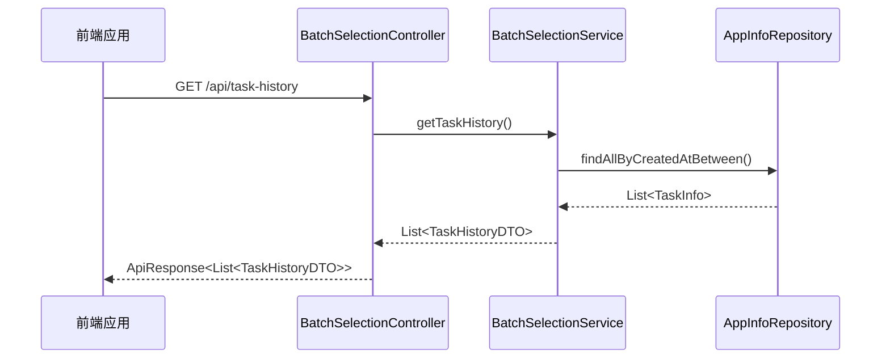
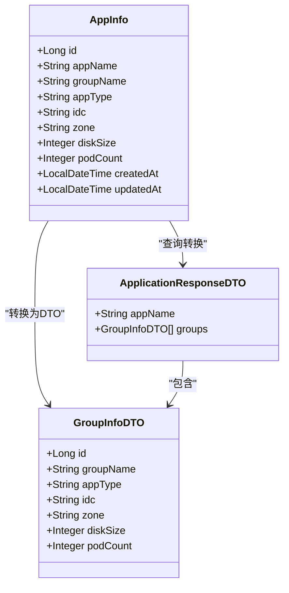
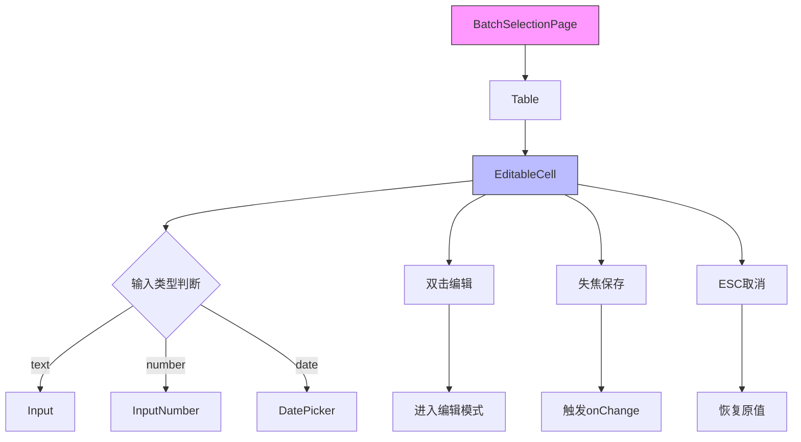

# 扩展与定制

<cite>
**Referenced Files in This Document**   
- [BatchSelectionController.java](file://backend/src/main/java/com/example/batchselection/controller/BatchSelectionController.java)
- [AppInfo.java](file://backend/src/main/java/com/example/batchselection/entity/AppInfo.java)
- [schema.sql](file://backend/src/main/resources/schema.sql)
- [BatchSelectionPage.css](file://frontend/src/components/BatchSelectionPage.css)
- [EditableCell.jsx](file://frontend/src/components/EditableCell.jsx)
- [ApiResponse.java](file://backend/src/main/java/com/example/batchselection/dto/ApiResponse.java)
- [BatchSelectionServiceImpl.java](file://backend/src/main/java/com/example/batchselection/service/impl/BatchSelectionServiceImpl.java)
- [ApplicationResponseDTO.java](file://backend/src/main/java/com/example/batchselection/dto/ApplicationResponseDTO.java)
- [GroupInfoDTO.java](file://backend/src/main/java/com/example/batchselection/dto/GroupInfoDTO.java)
- [BatchSelectionPage.jsx](file://frontend/src/components/BatchSelectionPage.jsx)
- [index.js](file://frontend/src/api/index.js)
</cite>

## 目录
1. [API扩展](#api扩展)
2. [数据模型扩展](#数据模型扩展)
3. [前端UI扩展](#前端ui扩展)
4. [架构一致性原则](#架构一致性原则)

## API扩展

本项目遵循Spring Boot RESTful API设计规范。要添加新的GET接口（如获取任务历史），需遵循以下步骤：

1. **创建新的DTO类**：在`dto`包下创建新的响应DTO类，用于封装返回数据结构。DTO应使用Lombok的`@Data`注解简化POJO定义。

2. **在Controller中添加方法**：在`BatchSelectionController`中添加带有`@GetMapping`注解的方法。新方法应返回`ApiResponse<T>`泛型封装类型，以保持响应格式一致性。

3. **实现Service逻辑**：在`BatchSelectionService`接口中声明新方法，并在`BatchSelectionServiceImpl`中实现具体业务逻辑。实现时应遵循依赖注入原则，通过Repository访问数据。

4. **异常处理**：在Controller方法中使用try-catch块捕获异常，并通过`ApiResponse.error()`方法返回统一错误响应。



**Diagram sources**
- [BatchSelectionController.java](file://backend/src/main/java/com/example/batchselection/controller/BatchSelectionController.java#L15-L62)
- [BatchSelectionServiceImpl.java](file://backend/src/main/java/com/example/batchselection/service/impl/BatchSelectionServiceImpl.java#L22-L126)
- [AppInfoRepository.java](file://backend/src/main/java/com/example/batchselection/repository/AppInfoRepository.java#L8-L24)

**Section sources**
- [BatchSelectionController.java](file://backend/src/main/java/com/example/batchselection/controller/BatchSelectionController.java#L15-L62)
- [BatchSelectionServiceImpl.java](file://backend/src/main/java/com/example/batchselection/service/impl/BatchSelectionServiceImpl.java#L22-L126)

## 数据模型扩展

为`AppInfo`实体添加新字段（如`appType`）需要同步更新多个组件以保持数据一致性：

1. **实体类修改**：在`AppInfo.java`中添加新的字段属性，并使用JPA注解配置数据库映射。例如，添加`@Column(name = "app_type") private String appType;`。

2. **数据库Schema同步**：在`schema.sql`中修改`app_info`表结构，添加对应的列定义。应遵循现有命名规范（小写下划线）和数据类型标准。

3. **DTO层更新**：如果新字段需要暴露给前端，需在相关DTO类（如`ApplicationResponseDTO`或`GroupInfoDTO`）中添加相应属性。

4. **Service层适配**：更新`BatchSelectionServiceImpl`中的数据转换逻辑，确保实体与DTO之间的字段映射完整。



**Diagram sources**
- [AppInfo.java](file://backend/src/main/java/com/example/batchselection/entity/AppInfo.java#L9-L60)
- [ApplicationResponseDTO.java](file://backend/src/main/java/com/example/batchselection/dto/ApplicationResponseDTO.java#L5-L13)
- [GroupInfoDTO.java](file://backend/src/main/java/com/example/batchselection/dto/GroupInfoDTO.java#L4-L18)

**Section sources**
- [AppInfo.java](file://backend/src/main/java/com/example/batchselection/entity/AppInfo.java#L9-L60)
- [schema.sql](file://backend/src/main/resources/schema.sql#L10-L22)

## 前端UI扩展

前端UI扩展主要涉及样式调整和组件功能增强，需遵循React组件化开发规范：

1. **CSS样式修改**：`BatchSelectionPage.css`文件包含了页面的主要样式定义。可通过修改`.table-container`下的样式规则来调整树形表格的外观，如行高、背景色、悬停效果等。

2. **组件功能增强**：`EditableCell.jsx`是一个可复用的可编辑单元格组件。要支持新的输入类型（如日期选择器），需扩展`type`属性的处理逻辑，在组件内部根据类型渲染不同的Ant Design组件。

3. **Props传递模式**：遵循props-drill模式，通过`BatchSelectionPage.jsx`中的状态管理（`editedData`）收集编辑数据，并通过`handleFieldChange`回调函数向上传递变更。



**Diagram sources**
- [BatchSelectionPage.jsx](file://frontend/src/components/BatchSelectionPage.jsx#L12-L351)
- [EditableCell.jsx](file://frontend/src/components/EditableCell.jsx#L8-L109)
- [BatchSelectionPage.css](file://frontend/src/components/BatchSelectionPage.css#L1-L70)

**Section sources**
- [BatchSelectionPage.css](file://frontend/src/components/BatchSelectionPage.css#L1-L70)
- [EditableCell.jsx](file://frontend/src/components/EditableCell.jsx#L8-L109)

## 架构一致性原则

在扩展本项目功能时，必须严格遵守以下架构一致性原则：

1. **API响应格式统一**：所有后端API接口必须返回`ApiResponse<T>`封装格式，通过`ApiResponse.success()`和`ApiResponse.error()`静态方法创建响应实例，确保前后端交互格式标准化。

2. **前端组件模式一致**：新开发的UI组件应遵循props-drill状态提升模式，避免使用全局状态管理，保持组件间数据流的清晰和可预测性。

3. **代码分层清晰**：严格遵循Controller-Service-Repository三层架构，业务逻辑必须放在Service层，Controller仅负责请求处理和响应封装。

4. **前后端契约同步**：当修改数据模型时，必须同步更新前后端的DTO/接口定义，确保数据契约的一致性。

```mermaid
graph TB
subgraph 后端
C[Controller]
S[Service]
R[Repository]
E[Entity]
D[DTO]
end
subgraph 前端
P[Page]
CP[Component]
API[API Client]
M[Model]
end
C --> |返回| D
D --> |序列化| 前端
前端 --> |请求| C
P --> CP
P --> API
API < --> |JSON| C
S --> R
R --> E
S --> D
style 后端 fill:#f0f0f0,stroke:#333
style 前端 fill:#e6f7ff,stroke:#333
```

**Diagram sources**
- [ApiResponse.java](file://backend/src/main/java/com/example/batchselection/dto/ApiResponse.java#L6-L33)
- [BatchSelectionController.java](file://backend/src/main/java/com/example/batchselection/controller/BatchSelectionController.java#L15-L62)
- [BatchSelectionPage.jsx](file://frontend/src/components/BatchSelectionPage.jsx#L12-L351)
- [index.js](file://frontend/src/api/index.js#L1-L40)

**Section sources**
- [ApiResponse.java](file://backend/src/main/java/com/example/batchselection/dto/ApiResponse.java#L6-L33)
- [BatchSelectionPage.jsx](file://frontend/src/components/BatchSelectionPage.jsx#L12-L351)