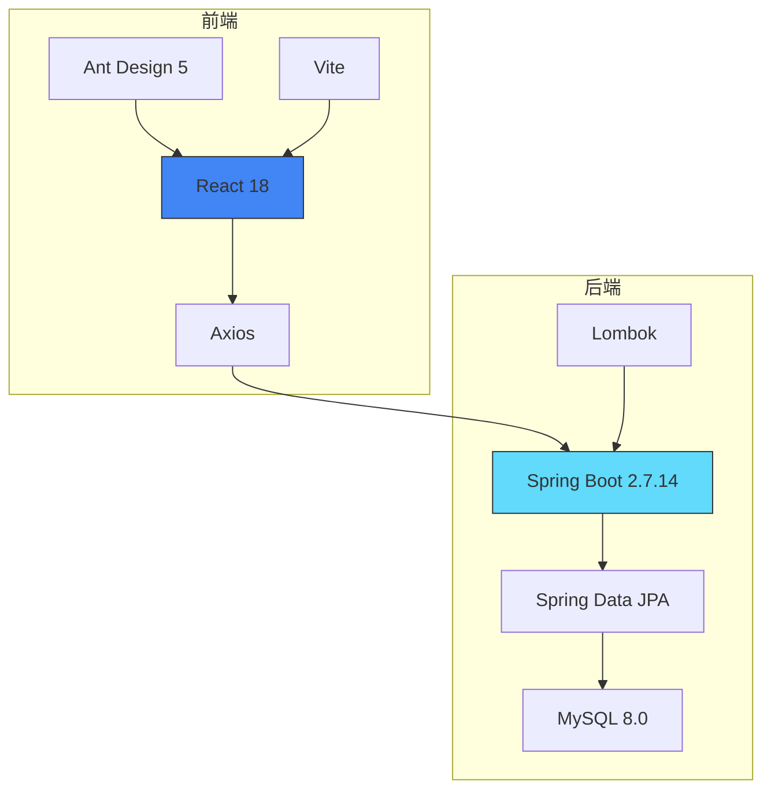
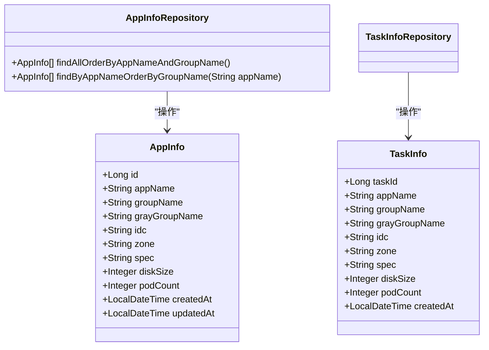
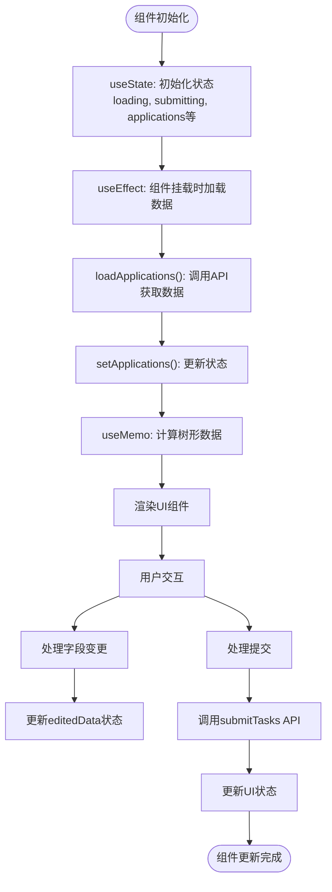
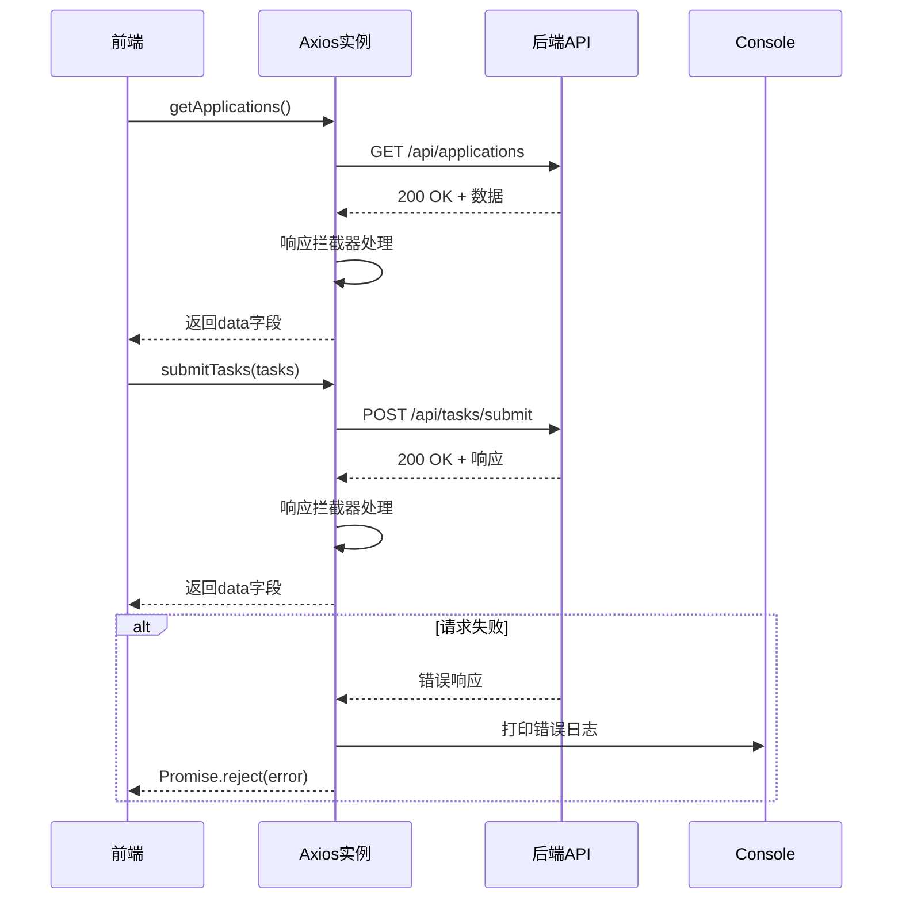
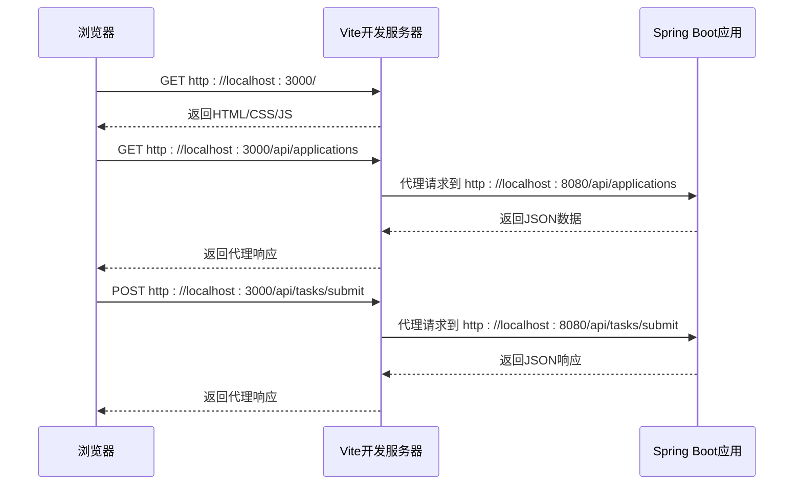

# 技术栈

<cite>
**本文档引用的文件**  
- [pom.xml](file://backend/pom.xml)
- [package.json](file://frontend/package.json)
- [application.properties](file://backend/src/main/resources/application.properties)
- [vite.config.js](file://frontend/vite.config.js)
- [BatchSelectionApplication.java](file://backend/src/main/java/com/example/batchselection/BatchSelectionApplication.java)
- [BatchSelectionController.java](file://backend/src/main/java/com/example/batchselection/controller/BatchSelectionController.java)
- [AppInfo.java](file://backend/src/main/java/com/example/batchselection/entity/AppInfo.java)
- [TaskInfo.java](file://backend/src/main/java/com/example/batchselection/entity/TaskInfo.java)
- [AppInfoRepository.java](file://backend/src/main/java/com/example/batchselection/repository/AppInfoRepository.java)
- [TaskInfoRepository.java](file://backend/src/main/java/com/example/batchselection/repository/TaskInfoRepository.java)
- [BatchSelectionService.java](file://backend/src/main/java/com/example/batchselection/service/BatchSelectionService.java)
- [BatchSelectionServiceImpl.java](file://backend/src/main/java/com/example/batchselection/service/impl/BatchSelectionServiceImpl.java)
- [index.js](file://frontend/src/api/index.js)
- [BatchSelectionPage.jsx](file://frontend/src/components/BatchSelectionPage.jsx)
</cite>

## 目录
1. [技术栈概览](#技术栈概览)
2. [后端技术栈详解](#后端技术栈详解)
3. [前端技术栈详解](#前端技术栈详解)
4. [技术协同机制](#技术协同机制)
5. [版本选择依据](#版本选择依据)
6. [开发环境配置](#开发环境配置)

## 技术栈概览

本项目采用前后端分离架构，后端基于Java生态构建，前端采用现代JavaScript框架。整体技术栈设计兼顾开发效率、系统稳定性和可维护性。

后端技术栈以Spring Boot为核心，结合Spring Data JPA实现数据持久化，使用MySQL作为关系型数据库存储，Lombok简化Java代码冗余。前端技术栈采用React 18构建组件化UI，Ant Design提供企业级UI组件库，Axios处理HTTP通信，Vite作为现代化构建工具提升开发体验。

**技术栈协同关系图**

**图示来源**  
- [package.json](file://frontend/package.json)
- [pom.xml](file://backend/pom.xml)

## 后端技术栈详解

### Spring Boot 2.7.14

Spring Boot作为本项目后端核心框架，用于快速构建RESTful服务。通过自动配置机制简化了Spring应用的初始化和配置过程，显著提升了开发效率。

项目通过`@SpringBootApplication`注解启动应用，集成Web、JPA、Validation等模块，实现开箱即用的微服务架构。Spring Boot的嵌入式Tomcat服务器使应用可独立运行，无需外部部署容器。

**Section sources**
- [BatchSelectionApplication.java](file://backend/src/main/java/com/example/batchselection/BatchSelectionApplication.java)
- [pom.xml](file://backend/pom.xml#L9-L11)

### Spring Data JPA

Spring Data JPA实现了数据持久化层，通过面向对象的方式操作数据库，避免了传统JDBC的样板代码。项目中`AppInfoRepository`和`TaskInfoRepository`接口继承`JpaRepository`，自动获得CRUD操作能力。

JPA通过实体类与数据库表的映射（如`AppInfo`实体对应`app_info`表），结合HQL查询语言，实现了类型安全的数据访问。配置中指定`hibernate.dialect=org.hibernate.dialect.MySQL8Dialect`，确保与MySQL 8.0的兼容性。

**图示来源**  
- [AppInfo.java](file://backend/src/main/java/com/example/batchselection/entity/AppInfo.java)
- [TaskInfo.java](file://backend/src/main/java/com/example/batchselection/entity/TaskInfo.java)
- [AppInfoRepository.java](file://backend/src/main/java/com/example/batchselection/repository/AppInfoRepository.java)
- [TaskInfoRepository.java](file://backend/src/main/java/com/example/batchselection/repository/TaskInfoRepository.java)

### MySQL 8.0

MySQL 8.0作为本项目的关系型数据库，存储应用配置和任务信息。在`application.properties`中配置了连接参数，包括时区设置`serverTimezone=Asia/Shanghai`和SSL配置`useSSL=false`，确保连接的稳定性和数据的正确性。

数据库初始化通过`schema.sql`和`test-data.sql`脚本完成，配置`spring.sql.init.mode=always`确保每次启动都执行初始化脚本。JPA配置`spring.jpa.hibernate.ddl-auto=update`实现表结构的自动更新，便于开发阶段的迭代。

**Section sources**
- [application.properties](file://backend/src/main/resources/application.properties#L8-L11)
- [application.properties](file://backend/src/main/resources/application.properties#L21-L23)

### Lombok

Lombok通过注解方式减少Java代码的样板代码，提高开发效率。项目中广泛使用`@Data`注解自动生成getter、setter、toString等方法，使用`@Slf4j`自动生成日志对象，使用`@RequiredArgsConstructor`实现依赖注入的构造函数。

在`pom.xml`中将Lombok配置为可选依赖（`<optional>true</optional>`），避免传递到其他模块。同时在`spring-boot-maven-plugin`配置中排除Lombok，确保打包时正确处理。

**Section sources**
- [pom.xml](file://backend/pom.xml#L49-L54)
- [pom.xml](file://backend/pom.xml#L76-L81)
- [AppInfo.java](file://backend/src/main/java/com/example/batchselection/entity/AppInfo.java#L10)

## 前端技术栈详解

### React 18

React 18作为前端核心框架，采用组件化开发模式构建用户界面。项目中`BatchSelectionPage.jsx`为主组件，使用函数组件和Hooks（useState、useEffect、useMemo）管理状态和副作用。

React 18的新特性如自动批处理（Automatic Batching）提升了渲染性能，使得在处理大量表格数据时仍能保持流畅的用户体验。组件通过props传递数据，通过回调函数实现父子组件通信。

**图示来源**  
- [BatchSelectionPage.jsx](file://frontend/src/components/BatchSelectionPage.jsx)

### Ant Design 5

Ant Design 5提供企业级UI组件库，项目中使用Table组件展示树形数据结构，Button组件提供操作入口，Space组件布局操作按钮，Typography组件展示标题。

Table组件配置`rowSelection`实现复杂的勾选逻辑，包括父子节点联动选择、全选/取消功能。通过`EditableCell`自定义可编辑单元格，结合Ant Design的表单验证能力，实现数据的在线编辑功能。

**Section sources**
- [BatchSelectionPage.jsx](file://frontend/src/components/BatchSelectionPage.jsx#L2-L3)
- [BatchSelectionPage.jsx](file://frontend/src/components/BatchSelectionPage.jsx#L88-L211)

### Axios

Axios作为HTTP客户端，处理前端与后端的通信。项目中创建`apiClient`实例，配置基础URL为`/api`，设置请求超时时间和内容类型。通过响应拦截器统一处理响应数据，直接返回`response.data`，简化后续处理逻辑。

API接口封装在`index.js`中，提供`getApplications`和`submitTasks`方法，实现关注点分离。错误处理通过Promise.reject传递，由调用方统一处理，确保错误信息的一致性。

**图示来源**  
- [index.js](file://frontend/src/api/index.js)
- [BatchSelectionController.java](file://backend/src/main/java/com/example/batchselection/controller/BatchSelectionController.java)

### Vite构建工具

Vite作为现代化前端构建工具，提供极速的开发服务器和高效的生产构建。在`vite.config.js`中配置React插件，设置开发服务器端口为3000，并配置代理将`/api`请求转发到后端服务`http://localhost:8080`，解决开发环境的跨域问题。

Vite利用浏览器原生ES模块支持，实现按需编译，显著提升开发服务器的启动速度和热更新效率。生产构建使用Rollup进行代码分割和优化，生成高效的静态资源。

**Section sources**
- [vite.config.js](file://frontend/vite.config.js)
- [package.json](file://frontend/package.json#L13-L14)

## 技术协同机制

### 前后端通信机制

前后端通过RESTful API进行通信，遵循统一的请求响应格式。后端`ApiResponse`类封装统一的响应结构，包含code、message和data字段，前端根据code判断请求结果，实现一致的错误处理逻辑。

API端点设计遵循REST规范：`GET /api/applications`获取数据，`POST /api/tasks/submit`提交任务。前端通过Vite代理解决开发环境跨域问题，生产环境通过Nginx等反向代理实现API路由。

**图示来源**  
- [vite.config.js](file://frontend/vite.config.js#L9-L12)
- [application.properties](file://backend/src/main/resources/application.properties#L4)
- [BatchSelectionController.java](file://backend/src/main/java/com/example/batchselection/controller/BatchSelectionController.java)

### 数据流协同

系统数据流从数据库到前端展示形成完整闭环。后端JPA从MySQL读取数据，通过Service层转换为DTO，Controller层封装为`ApiResponse`返回。前端Axios接收响应，React组件渲染数据，用户交互后通过Axios提交变更，后端Service处理并持久化到数据库。

数据转换过程确保各层职责分离：实体类（Entity）对应数据库表结构，DTO类对应API传输结构，前端组件状态对应UI展示结构。Lombok简化Java对象的样板代码，提高开发效率。

**Section sources**
- [BatchSelectionServiceImpl.java](file://backend/src/main/java/com/example/batchselection/service/impl/BatchSelectionServiceImpl.java#L34-L63)
- [BatchSelectionPage.jsx](file://frontend/src/components/BatchSelectionPage.jsx#L40-L75)

## 版本选择依据

### 后端版本选择

- **Spring Boot 2.7.14**：选择2.7.x系列的最新维护版本，该版本基于Spring Framework 5.3，提供长期支持（LTS）和稳定的企业级功能，同时兼容Java 8+环境。
- **MySQL Connector 8.0.33**：与MySQL 8.0数据库版本匹配，提供JDBC 4.2支持，包含性能优化和安全修复。
- **Lombok 1.18.20**：选择稳定版本，提供Java 11+兼容性，支持现代IDE的代码生成。

### 前端版本选择

- **React 18.2.0**：采用React 18主版本，利用其并发渲染特性提升用户体验，^18.2.0的版本范围允许自动获取补丁更新。
- **Ant Design 5.11.0**：选择Ant Design 5主版本的最新稳定版，利用其现代化设计语言和丰富的组件库。
- **Vite 5.0.0**：采用Vite 5主版本，获得最新的构建性能优化和插件生态系统支持。

**Section sources**
- [pom.xml](file://backend/pom.xml#L11)
- [pom.xml](file://backend/pom.xml#L46)
- [pom.xml](file://backend/pom.xml#L26)
- [package.json](file://frontend/package.json#L7-L10)
- [package.json](file://frontend/package.json#L13-L14)

## 开发环境配置

### 后端配置

后端配置文件`application.properties`包含服务器、数据源、JPA、初始化脚本等配置。服务器端口设置为8080，数据库连接配置包含时区和SSL参数，JPA配置指定MySQL 8方言和SQL格式化输出。

日志配置设置根日志级别为INFO，应用包日志级别为DEBUG，便于开发调试。Jackson配置设置时区为GMT+8和日期格式，确保时间数据的正确序列化。

**Section sources**
- [application.properties](file://backend/src/main/resources/application.properties)

### 前端配置

前端`vite.config.js`配置开发服务器端口为3000，设置`/api`路径代理到后端服务，解决开发环境跨域问题。`package.json`中定义开发、构建和预览脚本，通过Vite提供现代化的开发体验。

浏览器兼容性配置`browserslist`指定生产环境和开发环境的目标浏览器范围，确保生成的代码兼容主流浏览器。

**Section sources**
- [vite.config.js](file://frontend/vite.config.js)
- [package.json](file://frontend/package.json#L16-L19)
- [package.json](file://frontend/package.json#L21-L31)