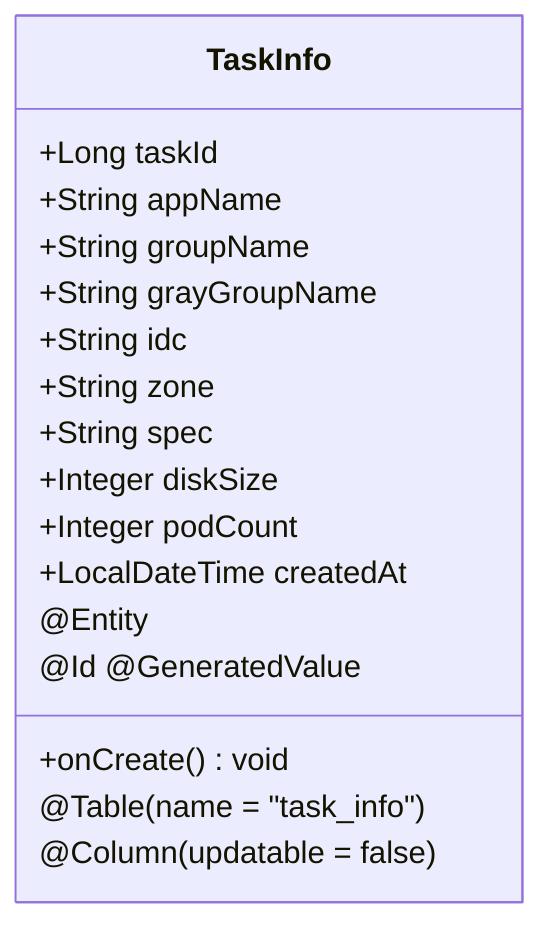
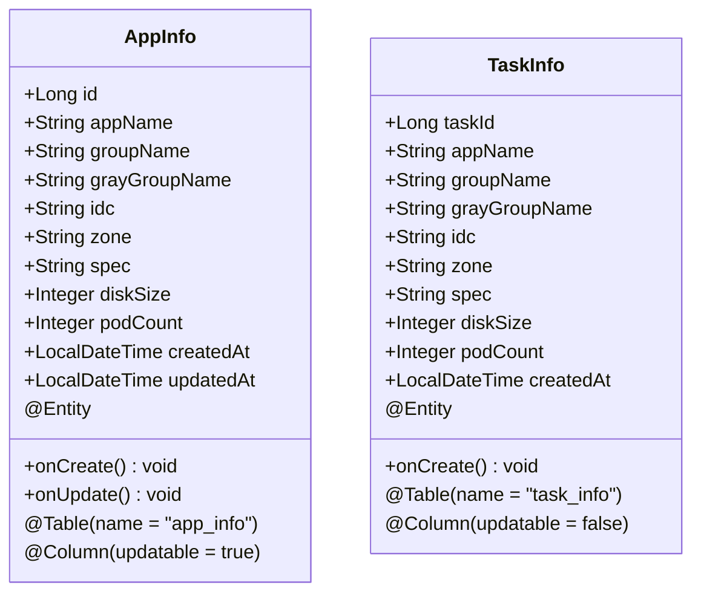

# 任务数据表 (task_info)

<cite>
**Referenced Files in This Document**   
- [TaskInfo.java](file://backend/src/main/java/com/example/batchselection/entity/TaskInfo.java)
- [schema.sql](file://backend/src/main/resources/schema.sql)
- [AppInfo.java](file://backend/src/main/java/com/example/batchselection/entity/AppInfo.java)
- [BatchSelectionServiceImpl.java](file://backend/src/main/java/com/example/batchselection/service/impl/BatchSelectionServiceImpl.java)
</cite>

## Table of Contents
1. [任务数据表 (task_info)](#任务数据表-task_info)
2. [表结构与字段说明](#表结构与字段说明)
3. [核心作用与设计理念](#核心作用与设计理念)
4. [JPA实体映射机制](#jpa实体映射机制)
5. [索引与查询优化](#索引与查询优化)
6. [与app_info表的对比分析](#与app_info表的对比分析)
7. [建表SQL与实体类对照](#建表sql与实体类对照)
8. [时间戳自动填充实现](#时间戳自动填充实现)

## 表结构与字段说明

任务数据表 `task_info` 用于记录批量提交操作的完整数据副本，其字段定义如下：

| 字段名 | 数据类型 | 约束条件 | 业务含义 |
| :--- | :--- | :--- | :--- |
| `task_id` | BIGINT | 主键，自增 | 任务唯一标识ID |
| `app_name` | VARCHAR(64) | 非空 | 应用名称 |
| `group_name` | VARCHAR(64) | 非空 | 分组名称 |
| `gray_group_name` | VARCHAR(64) | 可为空 | 灰度分组名称 |
| `idc` | VARCHAR(32) | 非空 | 机房信息 |
| `zone` | VARCHAR(32) | 非空 | 分区信息 |
| `spec` | VARCHAR(64) | 非空 | 参数规格 |
| `disk_size` | INT | 非空 | 硬盘大小(GB) |
| `pod_count` | INT | 非空 | Pod数量 |
| `created_at` | TIMESTAMP | 非空，不可更新 | 任务创建时间 |

**Section sources**
- [schema.sql](file://backend/src/main/resources/schema.sql#L25-L37)
- [TaskInfo.java](file://backend/src/main/java/com/example/batchselection/entity/TaskInfo.java#L17-L47)

## 核心作用与设计理念

`task_info` 表作为任务快照表，其核心作用是记录每次批量提交操作的完整数据副本。该表采用只写归档的设计理念，一旦数据写入即不可修改，确保了操作留痕与历史追溯的可靠性。与可更新的 `app_info` 表不同，`task_info` 仅保留任务提交时刻的状态快照，不记录任何修改时间或更新操作，从而保证了历史数据的完整性和不可篡改性。

**Section sources**
- [TaskInfo.java](file://backend/src/main/java/com/example/batchselection/entity/TaskInfo.java#L7-L9)
- [AppInfo.java](file://backend/src/main/java/com/example/batchselection/entity/AppInfo.java#L7-L9)

## JPA实体映射机制

`TaskInfo` 实体类通过JPA注解实现与数据库表的精确映射。其中，`task_id` 字段使用 `@Id` 和 `@GeneratedValue(strategy = GenerationType.IDENTITY)` 注解，表明其为主键且采用数据库自增策略。`created_at` 字段通过 `@Column(nullable = false, updatable = false)` 注解确保其在创建后不可被更新，强制维护数据的只写特性。



**Diagram sources**
- [TaskInfo.java](file://backend/src/main/java/com/example/batchselection/entity/TaskInfo.java#L11-L47)

**Section sources**
- [TaskInfo.java](file://backend/src/main/java/com/example/batchselection/entity/TaskInfo.java#L11-L47)

## 索引与查询优化

为支持高效的时间范围查询，`task_info` 表在 `created_at` 字段上建立了名为 `idx_created_at` 的索引。该索引使得系统能够快速检索特定时间段内的任务记录，对于审计、监控和数据分析等场景至关重要。索引的创建通过JPA的 `@Index` 注解在实体类中声明，确保了代码与数据库结构的一致性。

**Section sources**
- [TaskInfo.java](file://backend/src/main/java/com/example/batchselection/entity/TaskInfo.java#L13-L14)
- [schema.sql](file://backend/src/main/resources/schema.sql#L36)

## 与app_info表的对比分析

`task_info` 与 `app_info` 两表在设计上形成鲜明对比：`app_info` 作为主数据表，包含 `updated_at` 字段并支持数据更新，反映当前最新状态；而 `task_info` 作为归档表，省略了 `updated_at` 字段，仅保留 `created_at`，体现其只写、不可变的特性。这种设计分离了实时业务数据与历史操作记录，既保证了主表的灵活性，又确保了审计数据的完整性。



**Diagram sources**
- [AppInfo.java](file://backend/src/main/java/com/example/batchselection/entity/AppInfo.java#L11-L61)
- [TaskInfo.java](file://backend/src/main/java/com/example/batchselection/entity/TaskInfo.java#L11-L53)

**Section sources**
- [AppInfo.java](file://backend/src/main/java/com/example/batchselection/entity/AppInfo.java#L48-L49)
- [TaskInfo.java](file://backend/src/main/java/com/example/batchselection/entity/TaskInfo.java#L46-L47)

## 建表SQL与实体类对照

建表SQL与JPA实体类之间存在直接的映射关系。例如，SQL中的 `task_id BIGINT AUTO_INCREMENT PRIMARY KEY` 对应实体类中的 `@Id @GeneratedValue(strategy = GenerationType.IDENTITY) private Long taskId;`。这种对照确保了数据库结构与应用代码的高度一致，降低了维护成本。

```mermaid
flowchart TD
SQL["建表SQL (schema.sql)"] --> |CREATE TABLE task_info| Entity["JPA实体 (TaskInfo.java)"]
Entity --> |@Entity @Table| Repository["Repository接口"]
Repository --> |saveAll| Service["业务服务 (BatchSelectionServiceImpl.java)"]
Service --> |convertToTaskInfo| Controller["控制器 (BatchSelectionController.java)"]
style SQL fill:#f9f,stroke:#333
style Entity fill:#bbf,stroke:#333
style Repository fill:#f96,stroke:#333
style Service fill:#6f9,stroke:#333
style Controller fill:#69f,stroke:#333
```

**Diagram sources**
- [schema.sql](file://backend/src/main/resources/schema.sql#L25-L37)
- [TaskInfo.java](file://backend/src/main/java/com/example/batchselection/entity/TaskInfo.java#L10-L53)

**Section sources**
- [schema.sql](file://backend/src/main/resources/schema.sql#L25-L37)
- [TaskInfo.java](file://backend/src/main/java/com/example/batchselection/entity/TaskInfo.java#L10-L53)

## 时间戳自动填充实现

`created_at` 字段的值通过 `@PrePersist` 注解在实体持久化前自动填充。`TaskInfo` 类中的 `onCreate()` 方法会在每次保存新记录时被JPA容器自动调用，将 `createdAt` 设置为当前时间。这一机制确保了时间戳的准确性和一致性，无需在业务逻辑中手动设置，简化了代码并减少了出错可能。

**Section sources**
- [TaskInfo.java](file://backend/src/main/java/com/example/batchselection/entity/TaskInfo.java#L49-L52)
- [BatchSelectionServiceImpl.java](file://backend/src/main/java/com/example/batchselection/service/impl/BatchSelectionServiceImpl.java#L80-L84)