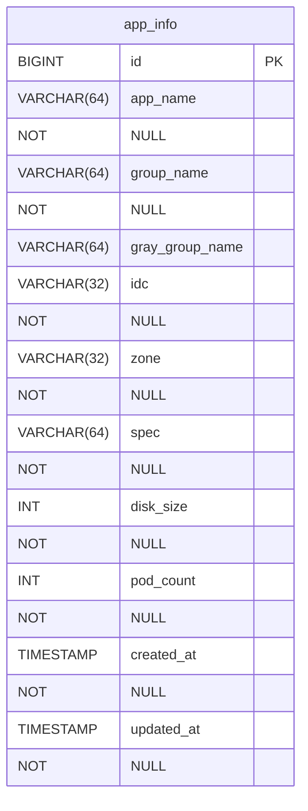
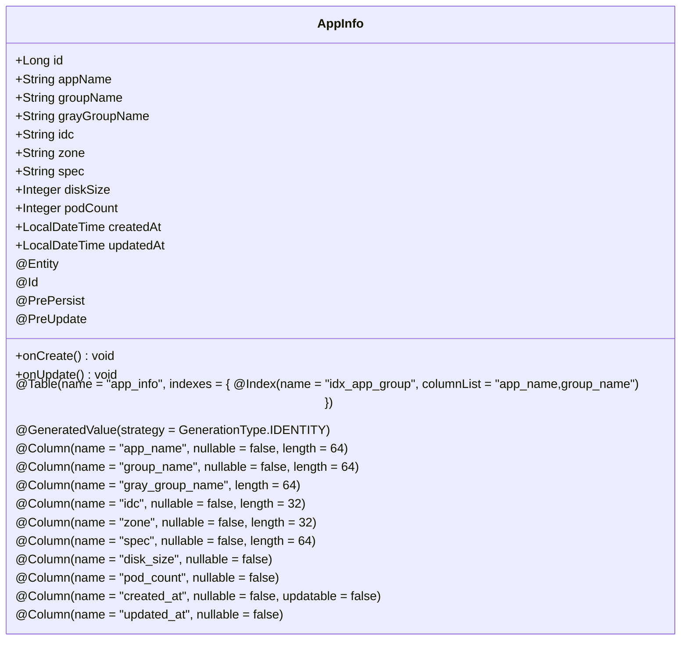
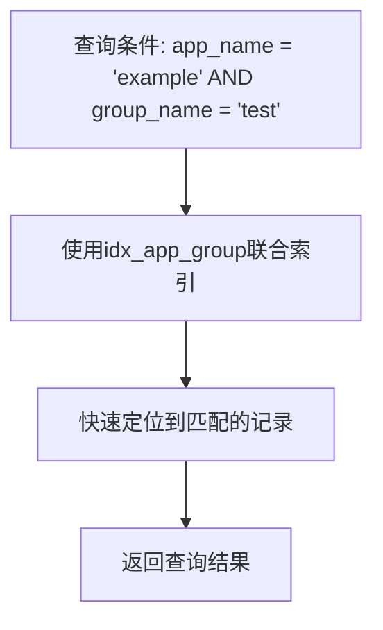
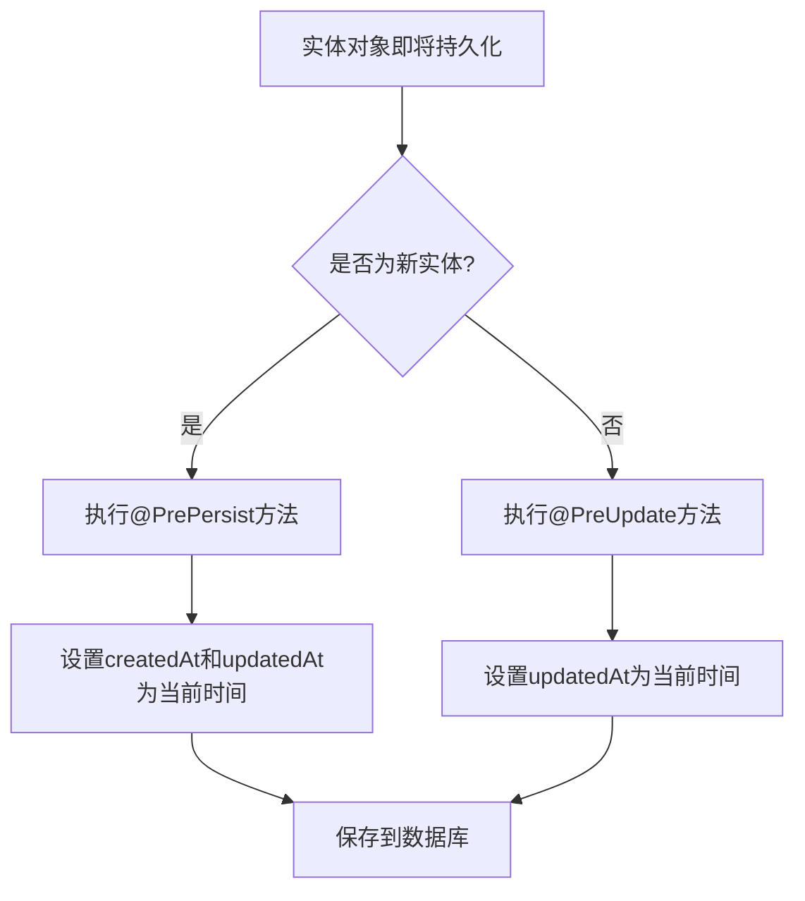
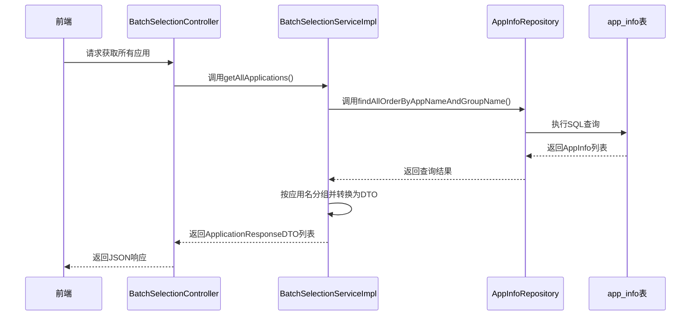

# 应用数据表 (app_info)

<cite>
**Referenced Files in This Document**   
- [AppInfo.java](file://backend/src/main/java/com/example/batchselection/entity/AppInfo.java)
- [schema.sql](file://backend/src/main/resources/schema.sql)
- [AppInfoRepository.java](file://backend/src/main/java/com/example/batchselection/repository/AppInfoRepository.java)
- [BatchSelectionServiceImpl.java](file://backend/src/main/java/com/example/batchselection/service/impl/BatchSelectionServiceImpl.java)
</cite>

## 目录
1. [简介](#简介)
2. [表结构概览](#表结构概览)
3. [字段详细说明](#字段详细说明)
4. [实体类与JPA映射](#实体类与jpa映射)
5. [索引设计](#索引设计)
6. [时间戳自动填充机制](#时间戳自动填充机制)
7. [业务角色与用途](#业务角色与用途)
8. [SQL建表语句](#sql建表语句)

## 简介
`app_info`表是批量勾选信息管理系统的核心配置表，用于存储应用及其分组的静态配置信息。该表作为系统的基础数据源，为前端展示和任务提交提供必要的应用元数据。通过JPA实体类`AppInfo`与数据库表进行映射，实现了对象关系的持久化管理。

**Section sources**
- [AppInfo.java](file://backend/src/main/java/com/example/batchselection/entity/AppInfo.java#L7-L14)
- [schema.sql](file://backend/src/main/resources/schema.sql#L8-L22)

## 表结构概览
`app_info`表包含11个字段，涵盖了应用的基本信息、部署配置和时间戳。该表以`id`作为主键，采用InnoDB存储引擎，支持事务和外键约束。表中存储的数据主要用于前端应用列表的展示和任务提交时的参数填充。



**Diagram sources**
- [schema.sql](file://backend/src/main/resources/schema.sql#L9-L21)

**Section sources**
- [schema.sql](file://backend/src/main/resources/schema.sql#L9-L21)

## 字段详细说明
`app_info`表的每个字段都有明确的业务含义和数据约束，确保数据的完整性和一致性。

| 字段名 | 数据类型 | 约束条件 | 业务含义 |
|--------|----------|----------|----------|
| id | BIGINT | 主键, 自增 | 记录的唯一标识符 |
| app_name | VARCHAR(64) | 非空 | 应用名称，用于标识不同的应用 |
| group_name | VARCHAR(64) | 非空 | 分组名称，表示应用的逻辑分组 |
| gray_group_name | VARCHAR(64) | 可为空 | 灰度分组名称，用于灰度发布场景 |
| idc | VARCHAR(32) | 非空 | 机房信息，标识应用部署的物理机房 |
| zone | VARCHAR(32) | 非空 | 分区信息，标识应用部署的逻辑分区 |
| spec | VARCHAR(64) | 非空 | 参数规格，描述应用的配置规格 |
| disk_size | INT | 非空 | 硬盘大小(GB)，表示应用所需的存储空间 |
| pod_count | INT | 非空 | Pod数量，表示应用实例的数量 |
| created_at | TIMESTAMP | 非空, 默认CURRENT_TIMESTAMP | 记录创建时间 |
| updated_at | TIMESTAMP | 非空, 默认CURRENT_TIMESTAMP ON UPDATE CURRENT_TIMESTAMP | 记录最后更新时间 |

**Section sources**
- [schema.sql](file://backend/src/main/resources/schema.sql#L10-L20)
- [AppInfo.java](file://backend/src/main/java/com/example/batchselection/entity/AppInfo.java#L17-L49)

## 实体类与JPA映射
`AppInfo`实体类通过JPA注解与`app_info`数据库表进行精确映射，实现了对象关系的持久化管理。



**Diagram sources**
- [AppInfo.java](file://backend/src/main/java/com/example/batchselection/entity/AppInfo.java#L11-L49)

**Section sources**
- [AppInfo.java](file://backend/src/main/java/com/example/batchselection/entity/AppInfo.java#L11-L49)

## 索引设计
`app_info`表设计了`idx_app_group`联合索引，以优化按应用和分组查询的性能。



**Diagram sources**
- [schema.sql](file://backend/src/main/resources/schema.sql#L21)
- [AppInfo.java](file://backend/src/main/java/com/example/batchselection/entity/AppInfo.java#L13)

**Section sources**
- [schema.sql](file://backend/src/main/resources/schema.sql#L21)
- [AppInfo.java](file://backend/src/main/java/com/example/batchselection/entity/AppInfo.java#L13)
- [AppInfoRepository.java](file://backend/src/main/java/com/example/batchselection/repository/AppInfoRepository.java#L18-L19)

## 时间戳自动填充机制
`AppInfo`实体类通过`@PrePersist`和`@PreUpdate`注解实现了创建和更新时间的自动填充。



**Diagram sources**
- [AppInfo.java](file://backend/src/main/java/com/example/batchselection/entity/AppInfo.java#L51-L59)

**Section sources**
- [AppInfo.java](file://backend/src/main/java/com/example/batchselection/entity/AppInfo.java#L51-L59)

## 业务角色与用途
`app_info`表作为系统的基础配置数据源，在批量勾选信息管理系统中扮演着核心角色。该表存储的应用与分组静态信息被`BatchSelectionServiceImpl`服务类用于查询所有应用数据，并按应用名分组后转换为前端所需的DTO结构。



**Diagram sources**
- [AppInfo.java](file://backend/src/main/java/com/example/batchselection/entity/AppInfo.java#L15-L60)
- [AppInfoRepository.java](file://backend/src/main/java/com/example/batchselection/repository/AppInfoRepository.java#L13-L19)
- [BatchSelectionServiceImpl.java](file://backend/src/main/java/com/example/batchselection/service/impl/BatchSelectionServiceImpl.java#L34-L62)

**Section sources**
- [AppInfo.java](file://backend/src/main/java/com/example/batchselection/entity/AppInfo.java#L15-L60)
- [AppInfoRepository.java](file://backend/src/main/java/com/example/batchselection/repository/AppInfoRepository.java#L13-L19)
- [BatchSelectionServiceImpl.java](file://backend/src/main/java/com/example/batchselection/service/impl/BatchSelectionServiceImpl.java#L34-L62)

## SQL建表语句
以下是`app_info`表的实际建表SQL语句片段，定义了表结构、字段约束和索引。

```sql
CREATE TABLE IF NOT EXISTS app_info (
    id BIGINT AUTO_INCREMENT PRIMARY KEY COMMENT '主键ID',
    app_name VARCHAR(64) NOT NULL COMMENT '应用名称',
    group_name VARCHAR(64) NOT NULL COMMENT '分组名称',
    gray_group_name VARCHAR(64) DEFAULT NULL COMMENT '灰度分组名称',
    idc VARCHAR(32) NOT NULL COMMENT '机房',
    zone VARCHAR(32) NOT NULL COMMENT '分区',
    spec VARCHAR(64) NOT NULL COMMENT '参数规格',
    disk_size INT NOT NULL COMMENT '硬盘大小(GB)',
    pod_count INT NOT NULL COMMENT 'Pod数量',
    created_at TIMESTAMP NOT NULL DEFAULT CURRENT_TIMESTAMP COMMENT '创建时间',
    updated_at TIMESTAMP NOT NULL DEFAULT CURRENT_TIMESTAMP ON UPDATE CURRENT_TIMESTAMP COMMENT '更新时间',
    INDEX idx_app_group (app_name, group_name) COMMENT '应用分组联合索引'
) ENGINE=InnoDB DEFAULT CHARSET=utf8mb4 COLLATE=utf8mb4_unicode_ci COMMENT='应用数据表';
```

**Section sources**
- [schema.sql](file://backend/src/main/resources/schema.sql#L9-L21)