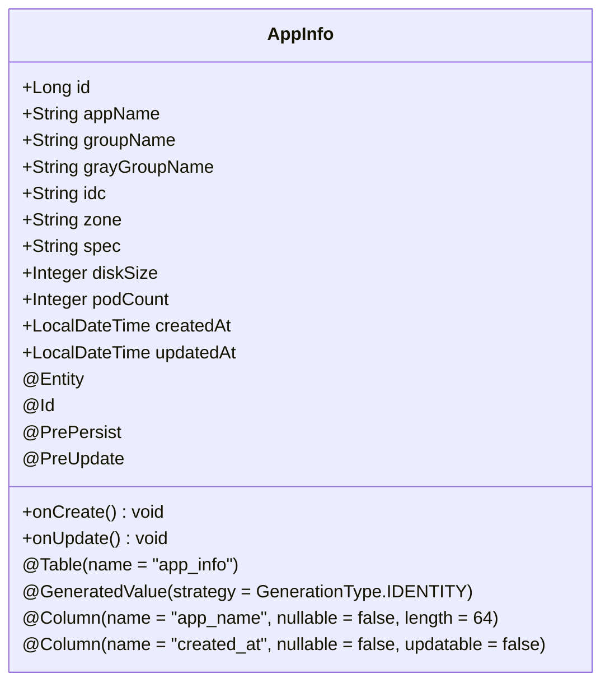
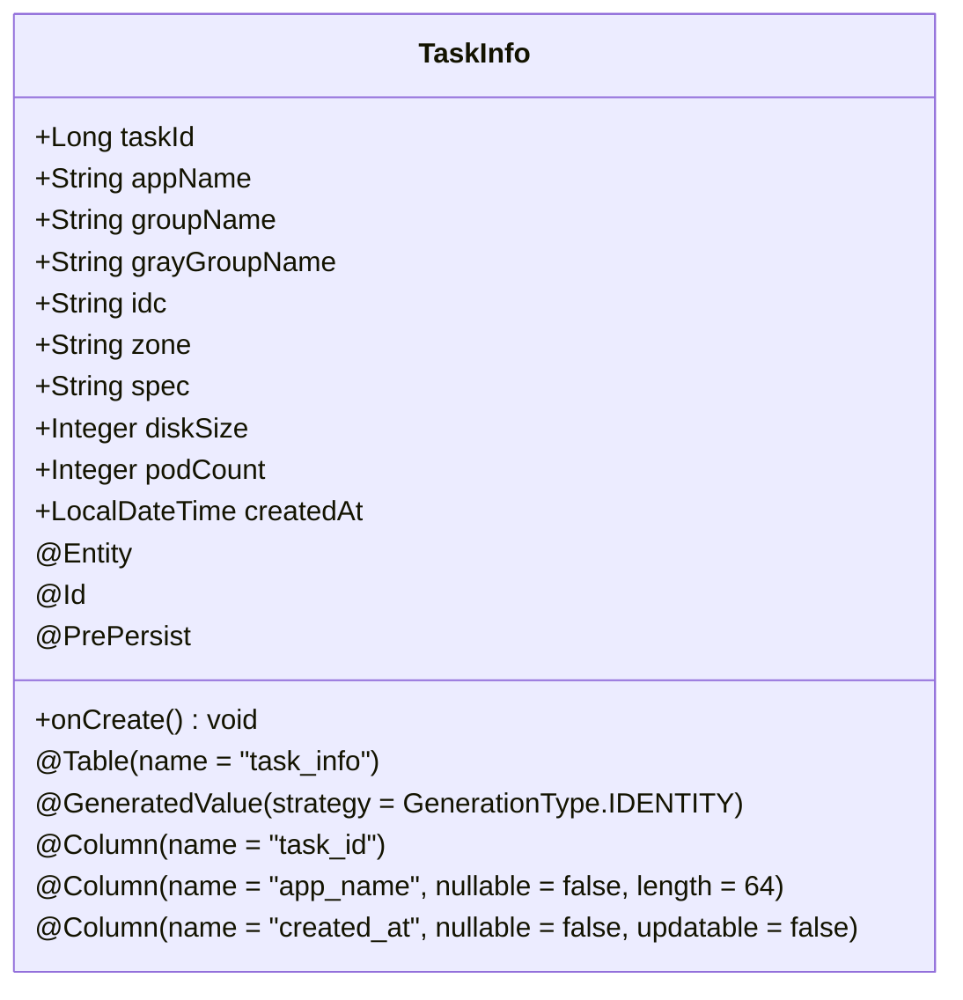
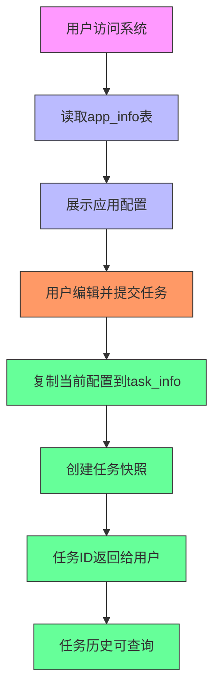
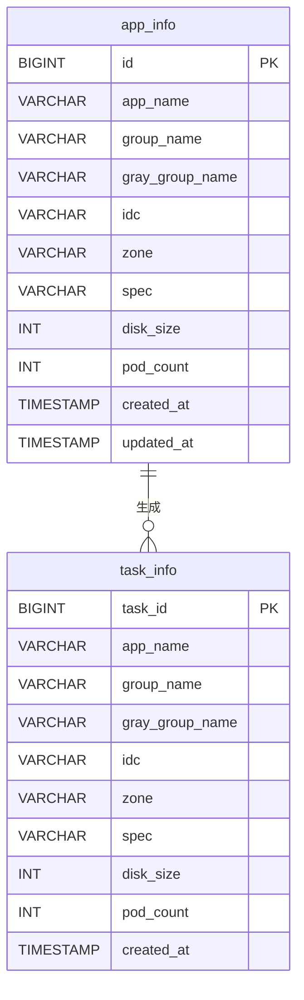

# 数据库设计

<cite>
**Referenced Files in This Document**   
- [AppInfo.java](file://backend/src/main/java/com/example/batchselection/entity/AppInfo.java)
- [TaskInfo.java](file://backend/src/main/java/com/example/batchselection/entity/TaskInfo.java)
- [schema.sql](file://backend/src/main/resources/schema.sql)
- [AppInfoRepository.java](file://backend/src/main/java/com/example/batchselection/repository/AppInfoRepository.java)
- [TaskInfoRepository.java](file://backend/src/main/java/com/example/batchselection/repository/TaskInfoRepository.java)
- [BatchSelectionServiceImpl.java](file://backend/src/main/java/com/example/batchselection/service/impl/BatchSelectionServiceImpl.java)
</cite>

## 目录
1. [app_info表结构](#app_info表结构)
2. [task_info表结构](#task_info表结构)
3. [实体类与JPA映射](#实体类与jpa映射)
4. [数据生命周期与ER图](#数据生命周期与er图)

## app_info表结构

`app_info`表是系统的基础配置表，用于存储应用的静态配置信息。该表作为源数据，为前端展示和任务提交提供基础数据支持。

**字段详细说明：**

| 字段名 | 数据类型 | 约束条件 | 业务含义 |
|--------|--------|----------|----------|
| id | BIGINT | 主键，自增 | 记录的唯一标识符 |
| app_name | VARCHAR(64) | 非空 | 应用名称，标识应用的逻辑分组 |
| group_name | VARCHAR(64) | 非空 | 分组名称，同一应用下的不同部署分组 |
| gray_group_name | VARCHAR(64) | 可为空 | 灰度分组名称，用于标识灰度发布环境 |
| idc | VARCHAR(32) | 非空 | 机房信息，标识服务器物理位置 |
| zone | VARCHAR(32) | 非空 | 分区信息，标识机房内的逻辑分区 |
| spec | VARCHAR(64) | 非空 | 参数规格，定义服务器配置规格 |
| disk_size | INT | 非空 | 硬盘大小(GB)，存储容量配置 |
| pod_count | INT | 非空 | Pod数量，标识应用实例数量 |
| created_at | TIMESTAMP | 非空，默认当前时间 | 记录创建时间，不可更新 |
| updated_at | TIMESTAMP | 非空，默认当前时间，自动更新 | 记录最后更新时间 |

该表通过`idx_app_group`联合索引（app_name, group_name）优化按应用和分组查询的性能。表的注释为"应用数据表"，采用InnoDB存储引擎，支持事务处理。

**Section sources**
- [schema.sql](file://backend/src/main/resources/schema.sql#L9-L22)
- [AppInfo.java](file://backend/src/main/java/com/example/batchselection/entity/AppInfo.java#L12-L60)

## task_info表结构

`task_info`表是系统的任务快照表，用于记录每次批量勾选操作的完整数据。该表作为操作结果的存档，不随源数据变更而自动更新，确保了操作历史的可追溯性。

**字段详细说明：**

| 字段名 | 数据类型 | 约束条件 | 业务含义 |
|--------|--------|----------|----------|
| task_id | BIGINT | 主键，自增 | 任务的唯一标识符 |
| app_name | VARCHAR(64) | 非空 | 应用名称，记录操作时的应用名称 |
| group_name | VARCHAR(64) | 非空 | 分组名称，记录操作时的分组名称 |
| gray_group_name | VARCHAR(64) | 可为空 | 灰度分组名称，记录操作时的灰度分组 |
| idc | VARCHAR(32) | 非空 | 机房信息，记录操作时的机房配置 |
| zone | VARCHAR(32) | 非空 | 分区信息，记录操作时的分区配置 |
| spec | VARCHAR(64) | 非空 | 参数规格，记录操作时的规格配置 |
| disk_size | INT | 非空 | 硬盘大小(GB)，记录操作时的磁盘配置 |
| pod_count | INT | 非空 | Pod数量，记录操作时的实例数量 |
| created_at | TIMESTAMP | 非空，默认当前时间 | 任务创建时间，记录操作提交时间 |

该表通过`idx_created_at`索引（created_at）优化按时间查询任务的性能。表的注释为"任务表"，同样采用InnoDB存储引擎。与app_info表不同，task_info表没有updated_at字段，因为任务一旦提交即为不可变的历史记录。

**Section sources**
- [schema.sql](file://backend/src/main/resources/schema.sql#L25-L37)
- [TaskInfo.java](file://backend/src/main/java/com/example/batchselection/entity/TaskInfo.java#L12-L52)

## 实体类与JPA映射

系统通过JPA实体类实现数据库表的ORM映射，确保了代码与数据库结构的一致性。

### AppInfo实体类映射

`AppInfo`实体类通过JPA注解精确映射到`app_info`数据库表：

**关键映射说明：**
- `@Entity`和`@Table(name = "app_info")`注解将类映射到app_info表
- `@Id`和`@GeneratedValue`注解定义id为主键且自增
- `@Column`注解精确指定字段名、可空性和长度约束
- `updatable = false`确保createdAt字段在更新时不会被修改
- `@PrePersist`和`@PreUpdate`注解在保存和更新时自动设置时间戳

### TaskInfo实体类映射

`TaskInfo`实体类通过JPA注解映射到`task_info`数据库表：

**关键映射说明：**
- `@Column(name = "task_id")`注解将taskId字段映射到数据库的task_id列
- 与AppInfo不同，TaskInfo没有updated_at字段和@PreUpdate注解，符合其不可变的历史记录特性
- `@PrePersist`注解在任务保存时自动设置创建时间

**Diagram sources**
- [AppInfo.java](file://backend/src/main/java/com/example/batchselection/entity/AppInfo.java#L10-L60)
- [TaskInfo.java](file://backend/src/main/java/com/example/batchselection/entity/TaskInfo.java#L10-L52)

**Section sources**
- [AppInfo.java](file://backend/src/main/java/com/example/batchselection/entity/AppInfo.java#L10-L60)
- [TaskInfo.java](file://backend/src/main/java/com/example/batchselection/entity/TaskInfo.java#L10-L52)

## 数据生命周期与ER图

### 数据生命周期

系统采用"源数据+操作快照"的设计模式，实现了数据的分离与追溯：

1. **源数据层 (app_info)**：存储应用的基础配置信息，可被编辑和更新。当用户在前端查看应用列表时，系统从app_info表读取最新配置。

2. **操作快照层 (task_info)**：当用户提交批量勾选任务时，系统将当前选中的配置数据完整复制到task_info表中，形成不可变的任务记录。这种设计确保了：
   - 操作历史的可追溯性
   - 即使源数据后续变更，历史任务仍能反映提交时的真实状态
   - 避免了因源数据变更导致的历史任务信息失真

### 实体关系图(ERD)

**Diagram sources**
- [schema.sql](file://backend/src/main/resources/schema.sql#L9-L37)

**Section sources**
- [schema.sql](file://backend/src/main/resources/schema.sql#L9-L37)
- [BatchSelectionServiceImpl.java](file://backend/src/main/java/com/example/batchselection/service/impl/BatchSelectionServiceImpl.java#L64-L93)