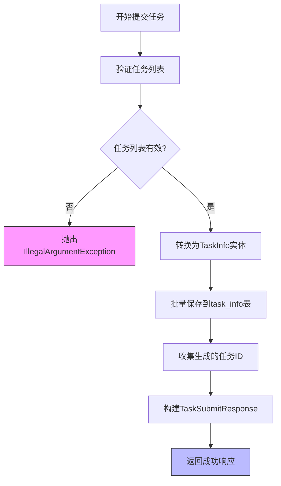
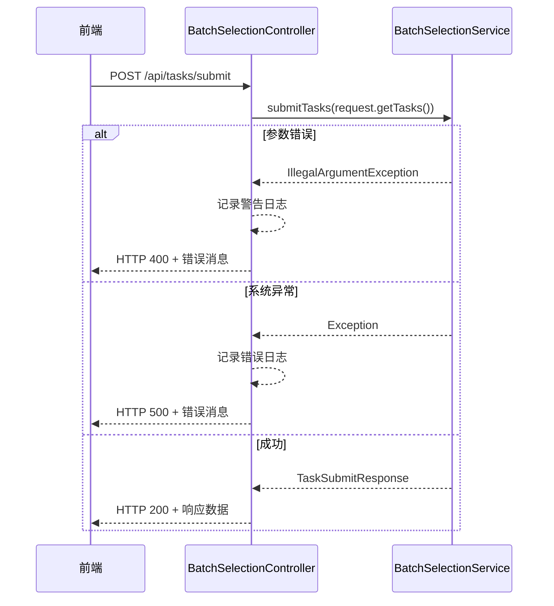

# 提交数据流

<cite>
**Referenced Files in This Document**   
- [BatchSelectionPage.jsx](file://frontend/src/components/BatchSelectionPage.jsx)
- [index.js](file://frontend/src/api/index.js)
- [BatchSelectionController.java](file://backend/src/main/java/com/example/batchselection/controller/BatchSelectionController.java)
- [BatchTaskSubmitRequest.java](file://backend/src/main/java/com/example/batchselection/dto/BatchTaskSubmitRequest.java)
- [TaskSubmitDTO.java](file://backend/src/main/java/com/example/batchselection/dto/TaskSubmitDTO.java)
- [TaskSubmitResponse.java](file://backend/src/main/java/com/example/batchselection/dto/TaskSubmitResponse.java)
- [BatchSelectionServiceImpl.java](file://backend/src/main/java/com/example/batchselection/service/impl/BatchSelectionServiceImpl.java)
- [TaskInfo.java](file://backend/src/main/java/com/example/batchselection/entity/TaskInfo.java)
- [TaskInfoRepository.java](file://backend/src/main/java/com/example/batchselection/repository/TaskInfoRepository.java)
</cite>

## 目录
1. [前端数据收集与校验](#前端数据收集与校验)
2. [API请求与响应处理](#api请求与响应处理)
3. [后端参数校验机制](#后端参数校验机制)
4. [事务性任务写入流程](#事务性任务写入流程)
5. [异常分类处理策略](#异常分类处理策略)
6. [前端状态控制与重置](#前端状态控制与重置)
7. [数据封装与解包过程](#数据封装与解包过程)

## 前端数据收集与校验

用户点击提交按钮后，前端`handleSubmit`函数开始执行数据收集与校验流程。函数首先检查`selectedRowKeys`中是否存在勾选项，若为空则提示用户至少勾选一个分组。

随后，函数遍历`treeData`数据结构，提取与`selectedRowKeys`匹配的分组数据。对于每个匹配的分组节点，将其关键字段（包括应用名、分组名、机房、分区、参数规格、硬盘大小和Pod数量）构造成`TaskSubmitDTO`对象，并添加到`selectedTasks`列表中。

在提交前，执行双重校验机制：
1. **必填字段非空检查**：验证应用名、分组名、机房、分区和参数规格等必填字段是否为空
2. **数值字段正整数验证**：确保硬盘大小和Pod数量为正整数

若校验失败，立即终止流程并显示相应错误消息。

**Section sources**
- [BatchSelectionPage.jsx](file://frontend/src/components/BatchSelectionPage.jsx#L250-L302)

## API请求与响应处理

校验通过后，前端调用`submitTasks` API发起POST请求。该API函数通过`apiClient.post('/tasks/submit', { tasks })`向后端发送请求，其中`tasks`为已校验的`TaskSubmitDTO`列表。

请求设置包含以下关键配置：
- **baseURL**: `/api`，定义API基础路径
- **Content-Type**: `application/json`，指定请求内容类型
- **timeout**: 10000毫秒，设置请求超时时间

前端通过响应拦截器统一处理API响应，直接返回`response.data`内容。在`handleSubmit`函数中，通过`await submitTasks(selectedTasks)`等待响应结果。

**Section sources**
- [index.js](file://frontend/src/api/index.js#L31-L33)
- [BatchSelectionPage.jsx](file://frontend/src/components/BatchSelectionPage.jsx#L289-L298)

## 后端参数校验机制

后端控制器`BatchSelectionController`通过`@Valid`注解实现参数校验。`submitTasks`方法接收`BatchTaskSubmitRequest`对象，该对象包含`@NotEmpty`和`@Valid`注解，确保任务列表不为空且每个任务都经过验证。

`TaskSubmitDTO`类中定义了详细的字段校验规则：
- `@NotBlank`：确保应用名、分组名、机房、分区和参数规格不为空
- `@NotNull`：确保硬盘大小和Pod数量不为null
- `@Positive`：确保硬盘大小和Pod数量为正整数

这些注解在Spring框架中自动触发JSR-303 Bean Validation，若校验失败将抛出`MethodArgumentNotValidException`，由全局异常处理器捕获并返回400错误。

**Section sources**
- [BatchSelectionController.java](file://backend/src/main/java/com/example/batchselection/controller/BatchSelectionController.java#L49-L61)
- [BatchTaskSubmitRequest.java](file://backend/src/main/java/com/example/batchselection/dto/BatchTaskSubmitRequest.java#L14-L16)
- [TaskSubmitDTO.java](file://backend/src/main/java/com/example/batchselection/dto/TaskSubmitDTO.java#L14-L37)

## 事务性任务写入流程

后端服务层`BatchSelectionServiceImpl`的`submitTasks`方法使用`@Transactional(rollbackFor = Exception.class)`注解确保事务性写入。当方法执行过程中发生任何异常时，所有数据库操作将自动回滚，保证数据一致性。

写入流程如下：
1. 验证任务列表不为空且数量不超过1000条限制
2. 使用Java 8 Stream API将`TaskSubmitDTO`列表转换为`TaskInfo`实体列表
3. 调用`TaskInfoRepository.saveAll()`批量保存到`task_info`表
4. 收集生成的任务ID并构建响应对象

`TaskInfo`实体通过`@PrePersist`注解在持久化前自动设置`createdAt`时间戳，确保每条记录都有准确的创建时间。

**Diagram sources**
- [BatchSelectionServiceImpl.java](file://backend/src/main/java/com/example/batchselection/service/impl/BatchSelectionServiceImpl.java#L64-L93)
- [TaskInfo.java](file://backend/src/main/java/com/example/batchselection/entity/TaskInfo.java#L49-L52)

**Section sources**
- [BatchSelectionServiceImpl.java](file://backend/src/main/java/com/example/batchselection/service/impl/BatchSelectionServiceImpl.java#L64-L93)
- [TaskInfoRepository.java](file://backend/src/main/java/com/example/batchselection/repository/TaskInfoRepository.java#L11-L12)

## 异常分类处理策略

后端采用分层异常处理策略，在`BatchSelectionController`的`submitTasks`方法中通过try-catch块区分不同类型的异常：

1. **IllegalArgumentException**：捕获参数相关的业务异常，如任务列表为空或超出数量限制。此类异常被视为客户端错误，返回HTTP 400状态码，并记录警告日志。
2. **通用Exception**：捕获其他未预期的异常，如数据库连接失败或系统错误。此类异常被视为服务器端错误，返回通用错误消息，并记录错误日志。

这种分类处理方式有助于前端准确识别错误类型并提供相应的用户提示，同时便于运维人员根据日志级别快速定位问题。

**Diagram sources**
- [BatchSelectionController.java](file://backend/src/main/java/com/example/batchselection/controller/BatchSelectionController.java#L53-L61)

**Section sources**
- [BatchSelectionController.java](file://backend/src/main/java/com/example/batchselection/controller/BatchSelectionController.java#L53-L61)

## 前端状态控制与重置

前端通过状态管理实现提交过程的完整控制：

1. **禁用状态控制**：提交按钮通过`disabled={selectedRowKeys.length === 0}`属性控制，当没有勾选项时自动禁用，防止无效提交。
2. **加载状态**：使用`setSubmitting(true)`在请求开始时启用加载状态，提交完成后在`finally`块中通过`setSubmitting(false)`恢复按钮状态。
3. **成功后重置**：提交成功后执行状态重置：
   - 清空`selectedRowKeys`，取消所有勾选项
   - 清空`editedData`，重置所有编辑内容
   - 显示成功消息，包含提交的任务数量

这种状态控制机制提供了良好的用户体验，确保用户在提交过程中有明确的反馈，并在成功后自动清理界面状态。

**Section sources**
- [BatchSelectionPage.jsx](file://frontend/src/components/BatchSelectionPage.jsx#L288-L295)

## 数据封装与解包过程

整个数据流涉及多层数据封装与解包：

1. **前端封装**：`handleSubmit`函数将`treeData`中的分组数据提取并封装为`TaskSubmitDTO`列表
2. **API传输**：`submitTasks`函数将任务列表包装在`{ tasks }`对象中发送
3. **后端解包**：`BatchTaskSubmitRequest`接收并解包请求体，提取`tasks`列表
4. **服务层处理**：`BatchSelectionServiceImpl`将`TaskSubmitDTO`转换为`TaskInfo`实体
5. **数据库持久化**：`TaskInfoRepository`将实体写入`task_info`表
6. **响应封装**：服务层创建`TaskSubmitResponse`包含任务ID列表和计数
7. **前端解包**：前端从响应中提取`response.data.count`显示成功消息

```mermaid
flowchart LR
A["前端treeData"] --> B["TaskSubmitDTO列表"]
B --> C["{ tasks }请求体"]
C --> D["BatchTaskSubmitRequest"]
D --> E["TaskSubmitDTO列表"]
E --> F["TaskInfo实体"]
F --> G["task_info表"]
G --> H["TaskSubmitResponse"]
H --> I["{ code, data }响应"]
I --> J["response.data.count"]
style A fill:#f96,stroke:#333
style G fill:#6f9,stroke:#333
style J fill:#69f,stroke:#333
```

**Diagram sources**
- [BatchSelectionPage.jsx](file://frontend/src/components/BatchSelectionPage.jsx#L258-L274)
- [index.js](file://frontend/src/api/index.js#L32-L33)
- [BatchTaskSubmitRequest.java](file://backend/src/main/java/com/example/batchselection/dto/BatchTaskSubmitRequest.java#L12-L17)
- [BatchSelectionServiceImpl.java](file://backend/src/main/java/com/example/batchselection/service/impl/BatchSelectionServiceImpl.java#L80-L82)
- [TaskSubmitResponse.java](file://backend/src/main/java/com/example/batchselection/dto/TaskSubmitResponse.java#L14-L18)

**Section sources**
- [BatchSelectionPage.jsx](file://frontend/src/components/BatchSelectionPage.jsx#L258-L274)
- [index.js](file://frontend/src/api/index.js#L32-L33)
- [BatchTaskSubmitRequest.java](file://backend/src/main/java/com/example/batchselection/dto/BatchTaskSubmitRequest.java#L12-L17)
- [BatchSelectionServiceImpl.java](file://backend/src/main/java/com/example/batchselection/service/impl/BatchSelectionServiceImpl.java#L80-L82)
- [TaskSubmitResponse.java](file://backend/src/main/java/com/example/batchselection/dto/TaskSubmitResponse.java#L14-L18)