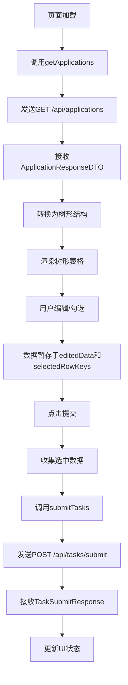
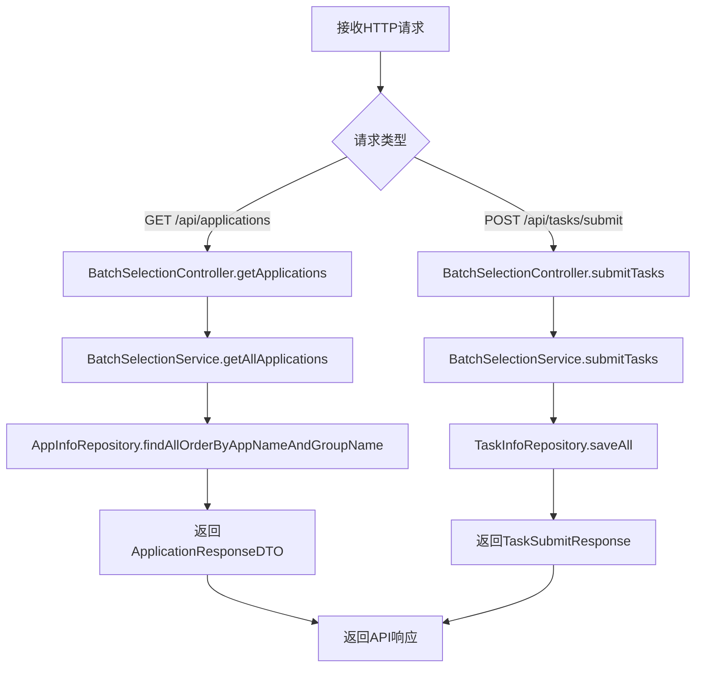
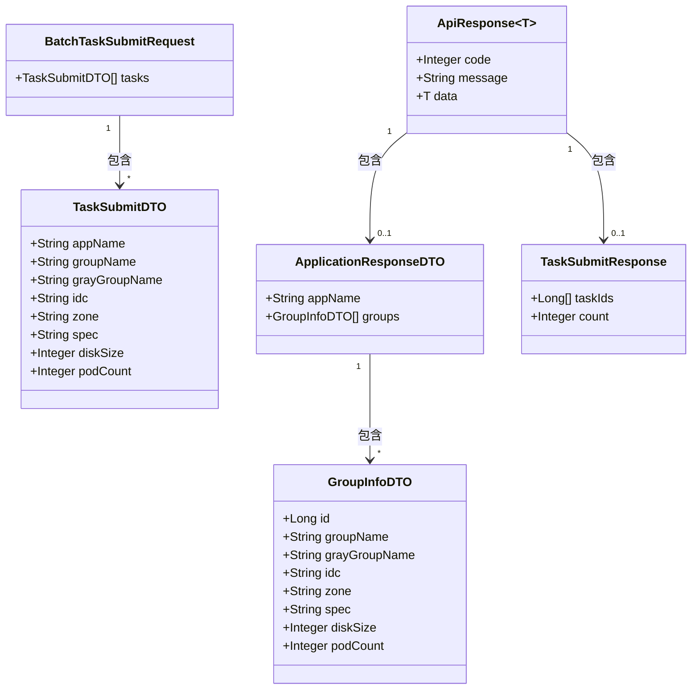
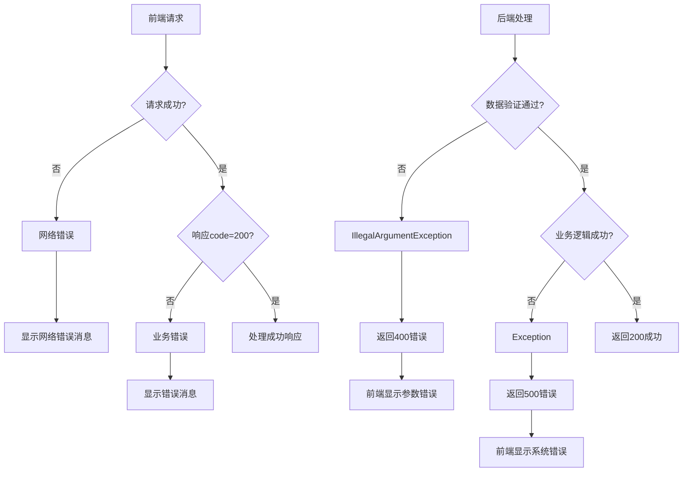
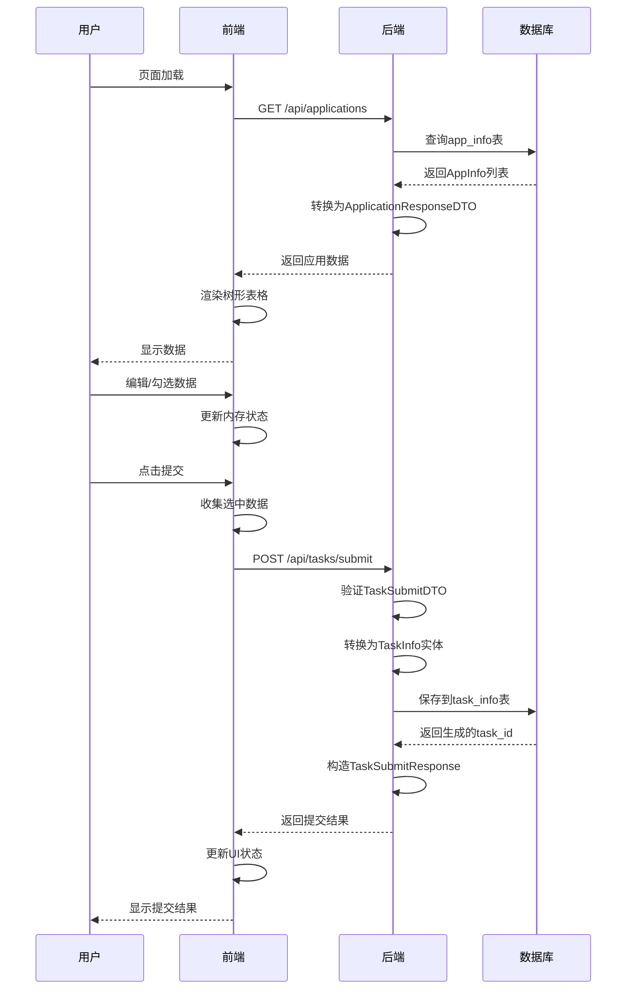
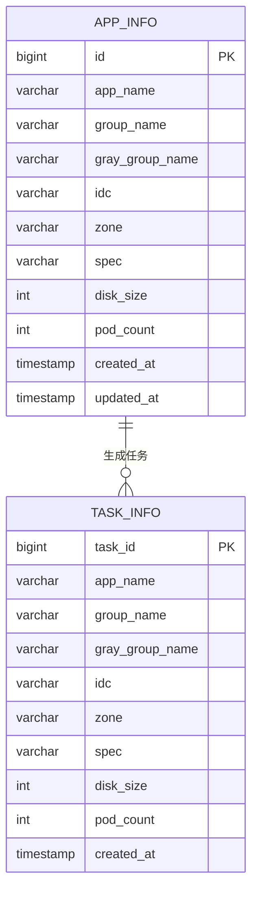
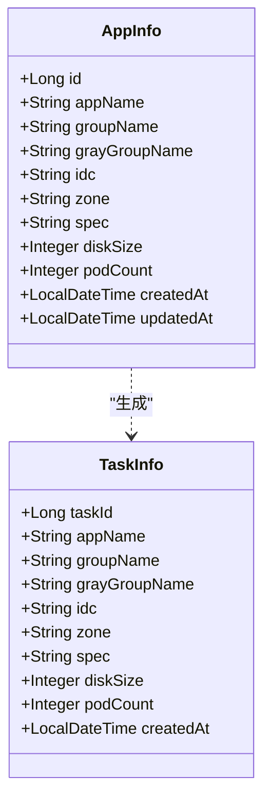

# 数据流分析

<cite>
**本文档引用的文件**  
- [BatchSelectionController.java](file://backend/src/main/java/com/example/batchselection/controller/BatchSelectionController.java)
- [BatchSelectionServiceImpl.java](file://backend/src/main/java/com/example/batchselection/service/impl/BatchSelectionServiceImpl.java)
- [ApplicationResponseDTO.java](file://backend/src/main/java/com/example/batchselection/dto/ApplicationResponseDTO.java)
- [TaskSubmitDTO.java](file://backend/src/main/java/com/example/batchselection/dto/TaskSubmitDTO.java)
- [BatchTaskSubmitRequest.java](file://backend/src/main/java/com/example/batchselection/dto/BatchTaskSubmitRequest.java)
- [ApiResponse.java](file://backend/src/main/java/com/example/batchselection/dto/ApiResponse.java)
- [AppInfo.java](file://backend/src/main/java/com/example/batchselection/entity/AppInfo.java)
- [TaskInfo.java](file://backend/src/main/java/com/example/batchselection/entity/TaskInfo.java)
- [AppInfoRepository.java](file://backend/src/main/java/com/example/batchselection/repository/AppInfoRepository.java)
- [TaskInfoRepository.java](file://backend/src/main/java/com/example/batchselection/repository/TaskInfoRepository.java)
- [index.js](file://frontend/src/api/index.js)
- [BatchSelectionPage.jsx](file://frontend/src/components/BatchSelectionPage.jsx)
- [EditableCell.jsx](file://frontend/src/components/EditableCell.jsx)
- [application.properties](file://backend/src/main/resources/application.properties)
- [schema.sql](file://backend/src/main/resources/schema.sql)
</cite>

## 目录
1. [引言](#引言)
2. [前端数据流](#前端数据流)
3. [后端数据流](#后端数据流)
4. [数据格式转换](#数据格式转换)
5. [状态同步机制](#状态同步机制)
6. [错误传播路径](#错误传播路径)
7. [数据流时序图](#数据流时序图)
8. [数据库持久化](#数据库持久化)
9. [总结](#总结)

## 引言
本系统实现了从前端用户操作到后端数据库持久化的完整数据流。用户通过树形表格界面进行数据查看、编辑和勾选操作，最终将选中数据提交至后端服务，经由DTO转换和业务逻辑处理后持久化到MySQL数据库。本文档详细描述了整个数据流动路径，包括各环节的数据格式转换、状态同步机制和错误传播路径，帮助开发者理解系统的动态行为并进行调试。

## 前端数据流

前端数据流始于页面加载时对`/api/applications`接口的GET请求，通过Axios获取初始数据并展示为树形表格；用户进行勾选或编辑操作后，数据暂存于前端内存；点击提交时，将选中数据通过POST `/api/tasks/submit`发送至后端。



**图示来源**  
- [index.js](file://frontend/src/api/index.js)
- [BatchSelectionPage.jsx](file://frontend/src/components/BatchSelectionPage.jsx)

**本节来源**  
- [BatchSelectionPage.jsx](file://frontend/src/components/BatchSelectionPage.jsx#L19-L350)
- [index.js](file://frontend/src/api/index.js#L1-L40)

## 后端数据流

后端数据流始于接收前端HTTP请求，经由Spring MVC控制器分发至服务层，进行业务逻辑处理和数据转换，最终通过JPA持久化到数据库。系统采用分层架构，包括Controller层、Service层、Repository层和Entity层。



**图示来源**  
- [BatchSelectionController.java](file://backend/src/main/java/com/example/batchselection/controller/BatchSelectionController.java)
- [BatchSelectionServiceImpl.java](file://backend/src/main/java/com/example/batchselection/service/impl/BatchSelectionServiceImpl.java)
- [AppInfoRepository.java](file://backend/src/main/java/com/example/batchselection/repository/AppInfoRepository.java)
- [TaskInfoRepository.java](file://backend/src/main/java/com/example/batchselection/repository/TaskInfoRepository.java)

**本节来源**  
- [BatchSelectionController.java](file://backend/src/main/java/com/example/batchselection/controller/BatchSelectionController.java#L15-L62)
- [BatchSelectionServiceImpl.java](file://backend/src/main/java/com/example/batchselection/service/impl/BatchSelectionServiceImpl.java#L22-L126)

## 数据格式转换

系统在不同层级间进行多种数据格式转换，确保数据在传输、处理和存储过程中的正确性和一致性。

### 前端数据格式
前端使用React状态管理用户交互数据：
- `applications`: 存储从后端获取的应用数据
- `editedData`: 存储用户编辑的字段值
- `selectedRowKeys`: 存储用户勾选的行键

### DTO数据格式转换
后端定义了多种DTO用于数据传输：



**图示来源**  
- [ApplicationResponseDTO.java](file://backend/src/main/java/com/example/batchselection/dto/ApplicationResponseDTO.java)
- [TaskSubmitDTO.java](file://backend/src/main/java/com/example/batchselection/dto/TaskSubmitDTO.java)
- [BatchTaskSubmitRequest.java](file://backend/src/main/java/com/example/batchselection/dto/BatchTaskSubmitRequest.java)
- [TaskSubmitResponse.java](file://backend/src/main/java/com/example/batchselection/dto/TaskSubmitResponse.java)
- [ApiResponse.java](file://backend/src/main/java/com/example/batchselection/dto/ApiResponse.java)

**本节来源**  
- [ApplicationResponseDTO.java](file://backend/src/main/java/com/example/batchselection/dto/ApplicationResponseDTO.java#L5-L13)
- [TaskSubmitDTO.java](file://backend/src/main/java/com/example/batchselection/dto/TaskSubmitDTO.java#L7-L37)
- [BatchTaskSubmitRequest.java](file://backend/src/main/java/com/example/batchselection/dto/BatchTaskSubmitRequest.java#L8-L17)
- [TaskSubmitResponse.java](file://backend/src/main/java/com/example/batchselection/dto/TaskSubmitResponse.java#L8-L17)

## 状态同步机制

系统通过多层状态管理机制确保前后端数据的一致性。

### 前端状态同步
前端使用React的useState和useMemo钩子管理状态：
- `applications`状态存储从后端获取的原始数据
- `editedData`状态存储用户编辑的变更
- `selectedRowKeys`状态存储用户勾选的行
- `treeData`使用useMemo优化，基于applications和editedData动态生成树形结构

### 后端状态同步
后端通过Spring的事务管理确保数据一致性：
- `@Transactional(rollbackFor = Exception.class)`确保提交操作的原子性
- JPA Repository自动处理实体状态
- `@PrePersist`和`@PreUpdate`注解自动管理创建和更新时间戳

```mermaid
flowchart TD
A[用户操作] --> B[前端状态更新]
B --> C{操作类型}
C --> |编辑| D[更新editedData]
C --> |勾选| E[更新selectedRowKeys]
D --> F[useMemo重新计算treeData]
E --> F
F --> G[UI重新渲染]
G --> H[用户提交]
H --> I[@Transactional开始]
I --> J[数据验证]
J --> K[DTO到Entity转换]
K --> L[JPA持久化]
L --> M{成功?}
M --> |是| N[事务提交]
M --> |否| O[事务回滚]
N --> P[返回成功响应]
O --> Q[返回错误响应]
```

**图示来源**  
- [BatchSelectionPage.jsx](file://frontend/src/components/BatchSelectionPage.jsx)
- [BatchSelectionServiceImpl.java](file://backend/src/main/java/com/example/batchselection/service/impl/BatchSelectionServiceImpl.java)

**本节来源**  
- [BatchSelectionPage.jsx](file://frontend/src/components/BatchSelectionPage.jsx#L13-L18)
- [BatchSelectionServiceImpl.java](file://backend/src/main/java/com/example/batchselection/service/impl/BatchSelectionServiceImpl.java#L66-L94)

## 错误传播路径

系统建立了完整的错误处理和传播机制，确保异常情况能够被正确捕获、记录和反馈。

### 前端错误处理
前端通过try-catch和响应拦截器处理错误：
- API请求使用try-catch捕获网络异常
- 响应拦截器统一处理HTTP错误
- 表单提交前进行客户端验证
- 使用Ant Design的message组件向用户展示错误信息

### 后端错误处理
后端采用分层异常处理机制：
- Controller层捕获Service层抛出的异常
- 使用特定异常类型区分不同错误场景
- 记录详细错误日志
- 返回结构化的错误响应



**图示来源**  
- [BatchSelectionController.java](file://backend/src/main/java/com/example/batchselection/controller/BatchSelectionController.java)
- [BatchSelectionPage.jsx](file://frontend/src/components/BatchSelectionPage.jsx)

**本节来源**  
- [BatchSelectionController.java](file://backend/src/main/java/com/example/batchselection/controller/BatchSelectionController.java#L30-L62)
- [BatchSelectionPage.jsx](file://frontend/src/components/BatchSelectionPage.jsx#L27-L37)

## 数据流时序图

以下时序图展示了从页面加载到数据提交的完整流程：



**图示来源**  
- [BatchSelectionController.java](file://backend/src/main/java/com/example/batchselection/controller/BatchSelectionController.java)
- [BatchSelectionServiceImpl.java](file://backend/src/main/java/com/example/batchselection/service/impl/BatchSelectionServiceImpl.java)
- [BatchSelectionPage.jsx](file://frontend/src/components/BatchSelectionPage.jsx)

## 数据库持久化

系统使用JPA和MySQL实现数据持久化，确保数据的可靠存储。

### 数据库表结构
系统包含两个主要数据表：



**图示来源**  
- [schema.sql](file://backend/src/main/resources/schema.sql)
- [AppInfo.java](file://backend/src/main/java/com/example/batchselection/entity/AppInfo.java)
- [TaskInfo.java](file://backend/src/main/java/com/example/batchselection/entity/TaskInfo.java)

### 实体类映射
JPA实体类与数据库表的映射关系：



**图示来源**  
- [AppInfo.java](file://backend/src/main/java/com/example/batchselection/entity/AppInfo.java)
- [TaskInfo.java](file://backend/src/main/java/com/example/batchselection/entity/TaskInfo.java)

**本节来源**  
- [AppInfo.java](file://backend/src/main/java/com/example/batchselection/entity/AppInfo.java#L7-L61)
- [TaskInfo.java](file://backend/src/main/java/com/example/batchselection/entity/TaskInfo.java#L7-L53)
- [schema.sql](file://backend/src/main/resources/schema.sql#L8-L37)

## 总结
本系统实现了从前端用户界面到后端数据库的完整数据流闭环。数据流动路径清晰，各环节职责分明：
1. 前端通过Axios发起请求，使用React状态管理用户交互数据
2. 后端Controller接收请求，Service层处理业务逻辑，Repository层持久化数据
3. 多种DTO在不同层级间转换，确保数据格式的一致性
4. 完整的错误处理机制确保系统的健壮性
5. JPA与MySQL的结合提供了可靠的数据持久化

开发者在调试数据流转问题时，可按照"前端→网络→后端→数据库"的顺序进行排查，重点关注各环节的数据格式转换和状态同步机制。