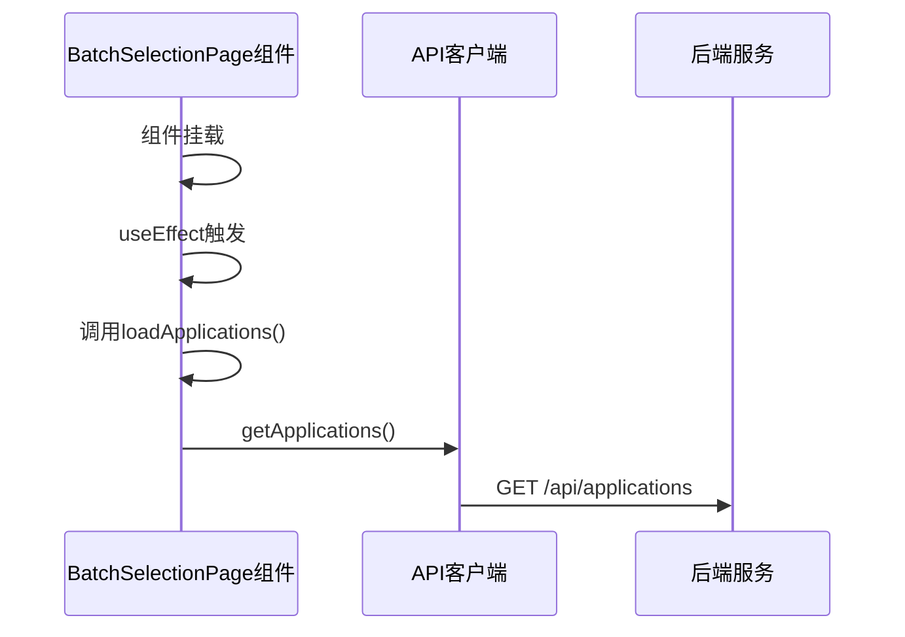
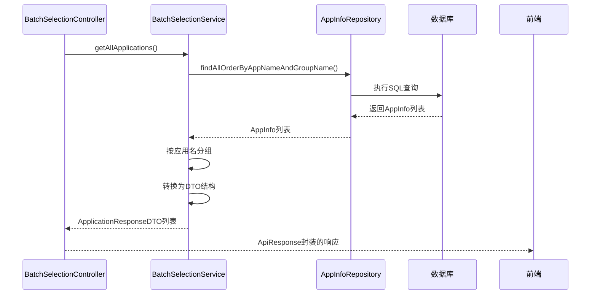
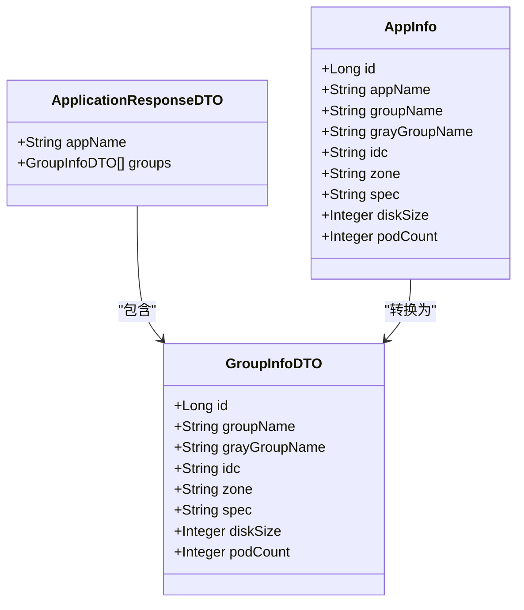
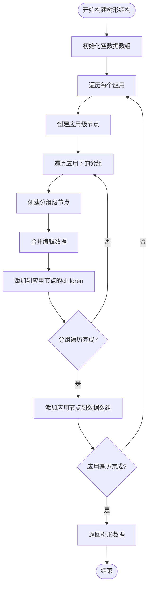
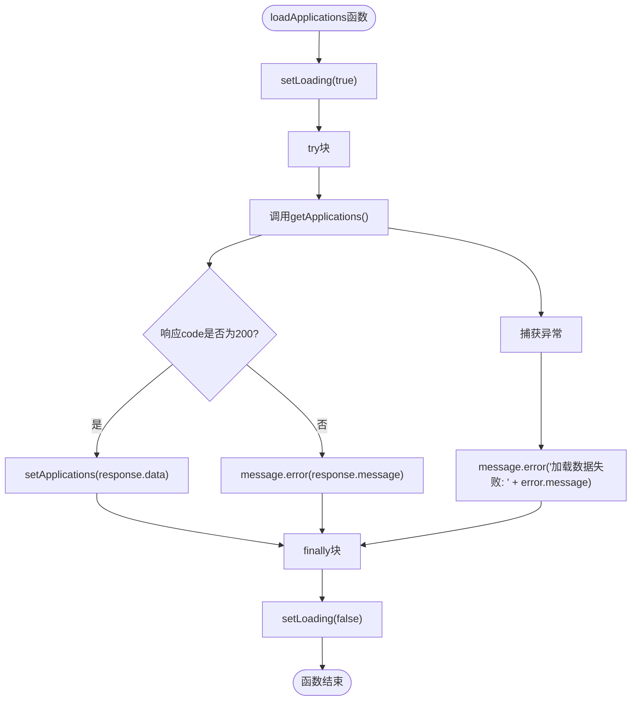
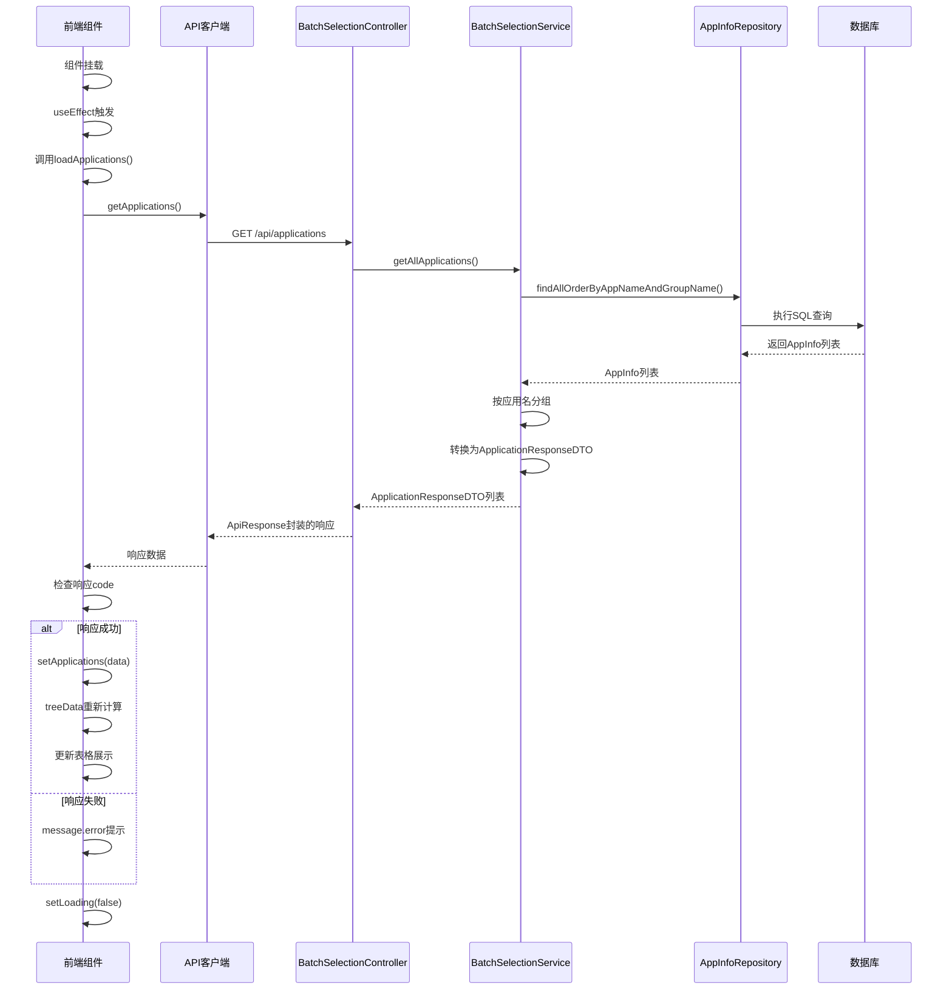

# 查询数据流

<cite>
**Referenced Files in This Document**   
- [BatchSelectionPage.jsx](file://frontend/src/components/BatchSelectionPage.jsx)
- [index.js](file://frontend/src/api/index.js)
- [BatchSelectionController.java](file://backend/src/main/java/com/example/batchselection/controller/BatchSelectionController.java)
- [BatchSelectionServiceImpl.java](file://backend/src/main/java/com/example/batchselection/service/impl/BatchSelectionServiceImpl.java)
- [ApplicationResponseDTO.java](file://backend/src/main/java/com/example/batchselection/dto/ApplicationResponseDTO.java)
- [AppInfo.java](file://backend/src/main/java/com/example/batchselection/entity/AppInfo.java)
- [GroupInfoDTO.java](file://backend/src/main/java/com/example/batchselection/dto/GroupInfoDTO.java)
- [AppInfoRepository.java](file://backend/src/main/java/com/example/batchselection/repository/AppInfoRepository.java)
</cite>

## Table of Contents
1. [数据查询流程概述](#数据查询流程概述)
2. [前端数据加载机制](#前端数据加载机制)
3. [后端数据处理流程](#后端数据处理流程)
4. [数据格式转换与树形结构构建](#数据格式转换与树形结构构建)
5. [错误处理与状态管理](#错误处理与状态管理)
6. [数据流时序图](#数据流时序图)

## 数据查询流程概述

本系统实现了从前端页面加载到后端数据查询的完整数据流。当用户访问批量勾选信息管理页面时，前端组件在挂载后自动触发数据查询流程，通过REST API与后端服务交互，获取应用数据并进行展示。整个流程涉及前端状态管理、API调用、后端控制器处理、服务层业务逻辑和数据库查询等多个环节。

**Section sources**
- [BatchSelectionPage.jsx](file://frontend/src/components/BatchSelectionPage.jsx#L1-L351)
- [BatchSelectionController.java](file://backend/src/main/java/com/example/batchselection/controller/BatchSelectionController.java#L1-L64)

## 前端数据加载机制

前端数据加载流程始于`BatchSelectionPage.jsx`组件的挂载。组件使用React的`useEffect` Hook在组件挂载后自动调用`loadApplications`函数，启动数据查询过程。

**Diagram sources**
- [BatchSelectionPage.jsx](file://frontend/src/components/BatchSelectionPage.jsx#L20-L22)
- [index.js](file://frontend/src/api/index.js#L24-L25)

**Section sources**
- [BatchSelectionPage.jsx](file://frontend/src/components/BatchSelectionPage.jsx#L19-L37)
- [index.js](file://frontend/src/api/index.js#L23-L25)

## 后端数据处理流程

后端数据处理流程由`BatchSelectionController`接收前端请求开始，通过服务层调用完成数据查询和转换。控制器接收到`GET /api/applications`请求后，委托`BatchSelectionService`服务获取数据。

**Diagram sources**
- [BatchSelectionController.java](file://backend/src/main/java/com/example/batchselection/controller/BatchSelectionController.java#L33-L42)
- [BatchSelectionServiceImpl.java](file://backend/src/main/java/com/example/batchselection/service/impl/BatchSelectionServiceImpl.java#L35-L62)
- [AppInfoRepository.java](file://backend/src/main/java/com/example/batchselection/repository/AppInfoRepository.java#L18-L19)

**Section sources**
- [BatchSelectionController.java](file://backend/src/main/java/com/example/batchselection/controller/BatchSelectionController.java#L32-L42)
- [BatchSelectionServiceImpl.java](file://backend/src/main/java/com/example/batchselection/service/impl/BatchSelectionServiceImpl.java#L34-L62)
- [AppInfoRepository.java](file://backend/src/main/java/com/example/batchselection/repository/AppInfoRepository.java#L18-L19)

## 数据格式转换与树形结构构建

数据格式转换过程包含两个关键阶段：后端DTO转换和前端树形结构构建。

### 后端数据转换

后端服务从数据库查询`AppInfo`实体列表后，首先按应用名进行分组，然后将每个应用下的分组信息转换为`GroupInfoDTO`对象，最终构建成`ApplicationResponseDTO`列表。这种分层数据结构便于前端进行树形展示。

**Diagram sources**
- [ApplicationResponseDTO.java](file://backend/src/main/java/com/example/batchselection/dto/ApplicationResponseDTO.java#L10-L13)
- [GroupInfoDTO.java](file://backend/src/main/java/com/example/batchselection/dto/GroupInfoDTO.java#L9-L19)
- [AppInfo.java](file://backend/src/main/java/com/example/batchselection/entity/AppInfo.java#L15-L61)
- [BatchSelectionServiceImpl.java](file://backend/src/main/java/com/example/batchselection/service/impl/BatchSelectionServiceImpl.java#L98-L109)

### 前端树形结构构建

前端接收到`ApplicationResponseDTO`列表后，使用`useMemo` Hook将扁平数据转换为树形结构，以适应Ant Design Table的树形展示需求。`treeData`依赖`applications`和`editedData`两个状态，当它们发生变化时自动重新计算。

**Diagram sources**
- [BatchSelectionPage.jsx](file://frontend/src/components/BatchSelectionPage.jsx#L40-L74)

**Section sources**
- [BatchSelectionPage.jsx](file://frontend/src/components/BatchSelectionPage.jsx#L40-L74)
- [BatchSelectionPage.jsx](file://frontend/src/components/BatchSelectionPage.jsx#L77-L85)

## 错误处理与状态管理

系统实现了完善的错误处理机制和加载状态管理，确保用户体验的流畅性和系统的健壮性。

### 加载状态管理

前端通过`loading`状态变量控制加载指示器的显示。在数据查询开始时设置`setLoading(true)`，在`finally`块中设置`setLoading(false)`，确保无论请求成功或失败都能正确关闭加载状态。

### 错误处理机制

系统采用分层错误处理策略：
- **前端错误处理**：使用Ant Design的`message.error`方法显示错误提示，区分API响应错误和网络异常
- **后端错误处理**：在控制器层捕获异常，记录日志并返回标准化的错误响应

**Diagram sources**
- [BatchSelectionPage.jsx](file://frontend/src/components/BatchSelectionPage.jsx#L24-L37)

**Section sources**
- [BatchSelectionPage.jsx](file://frontend/src/components/BatchSelectionPage.jsx#L30-L34)
- [BatchSelectionController.java](file://backend/src/main/java/com/example/batchselection/controller/BatchSelectionController.java#L39-L41)

## 数据流时序图

以下时序图完整展示了从前端组件挂载到数据展示的整个数据流过程：

**Diagram sources**
- [BatchSelectionPage.jsx](file://frontend/src/components/BatchSelectionPage.jsx#L19-L37)
- [index.js](file://frontend/src/api/index.js#L24-L25)
- [BatchSelectionController.java](file://backend/src/main/java/com/example/batchselection/controller/BatchSelectionController.java#L33-L42)
- [BatchSelectionServiceImpl.java](file://backend/src/main/java/com/example/batchselection/service/impl/BatchSelectionServiceImpl.java#L35-L62)
- [AppInfoRepository.java](file://backend/src/main/java/com/example/batchselection/repository/AppInfoRepository.java#L18-L19)

**Section sources**
- [BatchSelectionPage.jsx](file://frontend/src/components/BatchSelectionPage.jsx#L1-L351)
- [index.js](file://frontend/src/api/index.js#L1-L40)
- [BatchSelectionController.java](file://backend/src/main/java/com/example/batchselection/controller/BatchSelectionController.java#L1-L64)
- [BatchSelectionServiceImpl.java](file://backend/src/main/java/com/example/batchselection/service/impl/BatchSelectionServiceImpl.java#L1-L128)