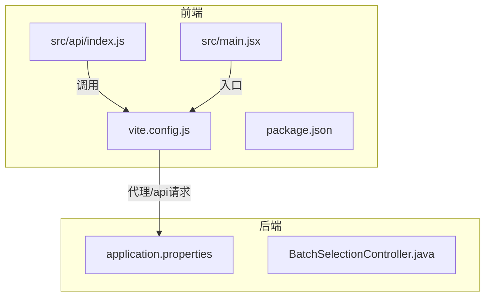
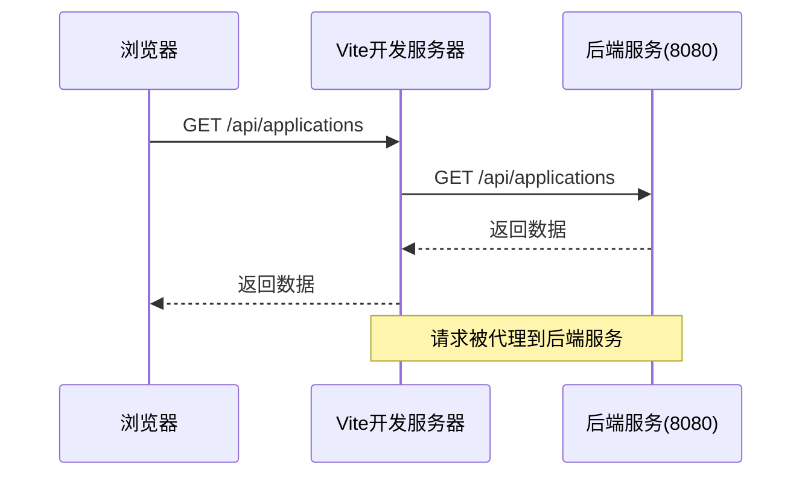

# 前端环境配置

<cite>
**Referenced Files in This Document**   
- [vite.config.js](file://frontend/vite.config.js)
- [package.json](file://frontend/package.json)
- [application.properties](file://backend/src/main/resources/application.properties)
- [index.js](file://frontend/src/api/index.js)
- [main.jsx](file://frontend/src/main.jsx)
</cite>

## 目录
1. [项目结构](#项目结构)
2. [Vite配置文件解析](#vite配置文件解析)
3. [React插件配置](#react插件配置)
4. [开发服务器端口配置](#开发服务器端口配置)
5. [代理配置详解](#代理配置详解)
6. [常见问题解决方案](#常见问题解决方案)

## 项目结构

本项目采用前后端分离架构，前端使用Vite + React技术栈，后端使用Spring Boot框架。前端代码位于`frontend`目录，后端代码位于`backend`目录。



**Diagram sources**
- [vite.config.js](file://frontend/vite.config.js#L1-L15)
- [package.json](file://frontend/package.json#L1-L34)
- [application.properties](file://backend/src/main/resources/application.properties#L1-L34)

**Section sources**
- [vite.config.js](file://frontend/vite.config.js#L1-L15)
- [package.json](file://frontend/package.json#L1-L34)

## Vite配置文件解析

`vite.config.js`是Vite项目的配置文件，定义了开发服务器、构建选项和插件等核心配置。该文件通过`defineConfig`函数导出配置对象，确保类型安全和智能提示。

```javascript
import { defineConfig } from 'vite'
import react from '@vitejs/plugin-react'

export default defineConfig({
  plugins: [react()],
  server: {
    port: 3000,
    proxy: {
      '/api': {
        target: 'http://localhost:8080',
        changeOrigin: true
      }
    }
  }
})
```

**Section sources**
- [vite.config.js](file://frontend/vite.config.js#L1-L15)

## React插件配置

`@vitejs/plugin-react`插件为Vite提供了React开发支持，包括JSX语法解析、Fast Refresh热重载等功能。在配置文件中通过`plugins: [react()]`启用该插件。

该插件的主要功能包括：
- 自动配置Babel以支持JSX和React 17+的新特性
- 启用React Fast Refresh，实现组件的热重载
- 优化开发服务器的性能
- 提供生产环境的构建优化

**Section sources**
- [vite.config.js](file://frontend/vite.config.js#L2-L5)
- [package.json](file://frontend/package.json#L13-L14)

## 开发服务器端口配置

`server.port=3000`配置指定了Vite开发服务器监听的端口号。当运行`npm run dev`时，前端应用将在`http://localhost:3000`启动。

### 端口修改方法

要修改开发服务器端口，只需更改`vite.config.js`中的`port`值：

```javascript
server: {
  port: 8081, // 修改为8081或其他未被占用的端口
  proxy: {
    '/api': {
      target: 'http://localhost:8080',
      changeOrigin: true
    }
  }
}
```

### 端口冲突处理

当指定端口被占用时，Vite会自动尝试下一个可用端口。也可以在`package.json`的启动脚本中指定端口：

```json
"scripts": {
  "dev": "vite --port 3001",
  "build": "vite build",
  "preview": "vite preview"
}
```

**Section sources**
- [vite.config.js](file://frontend/vite.config.js#L6-L8)
- [package.json](file://frontend/package.json#L16-L19)

## 代理配置详解

代理配置是解决开发环境下跨域问题的关键机制。通过`server.proxy`配置，将前端开发服务器的API请求代理到后端服务。

### 代理配置原理



**Diagram sources**
- [vite.config.js](file://frontend/vite.config.js#L8-L13)
- [application.properties](file://backend/src/main/resources/application.properties#L4)

### 代理配置参数说明

| 参数 | 值 | 说明 |
|------|-----|------|
| `target` | `http://localhost:8080` | 代理目标服务器地址 |
| `changeOrigin` | `true` | 修改请求头中的Origin字段 |
| `secure` | `false` | 不验证SSL证书（可选） |
| `ws` | `false` | 不代理WebSocket（可选） |

### changeOrigin的作用

`changeOrigin: true`确保目标服务器接收到正确的`Origin`头信息。当设置为`true`时，Vite会将代理请求的`Origin`头修改为与目标服务器相同的值，避免后端服务因CORS策略拒绝请求。

### 扩展代理规则

可以配置多个代理规则以支持不同的API路径或后端服务：

```javascript
server: {
  port: 3000,
  proxy: {
    '/api': {
      target: 'http://localhost:8080',
      changeOrigin: true
    },
    '/auth': {
      target: 'http://localhost:8081',
      changeOrigin: true
    },
    '/files': {
      target: 'http://localhost:9000',
      changeOrigin: true,
      rewrite: (path) => path.replace(/^\/files/, '')
    }
  }
}
```

### API调用验证

前端通过`axios`库调用API，`baseURL: '/api'`配置确保所有请求都带有`/api`前缀，从而触发代理机制：

```javascript
const apiClient = axios.create({
  baseURL: '/api',
  timeout: 10000
});
```

**Section sources**
- [vite.config.js](file://frontend/vite.config.js#L8-L13)
- [index.js](file://frontend/src/api/index.js#L4-L5)
- [application.properties](file://backend/src/main/resources/application.properties#L4)

## 常见问题解决方案

### 代理不生效

**问题现象**：API请求未被代理，出现404错误或跨域错误。

**解决方案**：
1. 检查API请求路径是否以`/api`开头
2. 确认`vite.config.js`中的代理配置正确
3. 重启Vite开发服务器
4. 检查后端服务是否正常运行

```javascript
// 确保API请求路径正确
export const getApplications = () => {
  return apiClient.get('/applications'); // 正确：路径为/api/applications
};
```

### 端口被占用

**问题现象**：Vite启动时提示端口被占用。

**解决方案**：
1. 修改`vite.config.js`中的`port`值
2. 在启动脚本中指定端口：`vite --port 3001`
3. 使用`lsof -i :3000`查找并终止占用端口的进程

### 热重载失败

**问题现象**：代码修改后页面未自动刷新。

**解决方案**：
1. 检查`@vitejs/plugin-react`插件是否正确配置
2. 确保React组件使用函数组件或类组件的正确语法
3. 检查是否有语法错误阻止了热重载
4. 清除浏览器缓存并重启开发服务器

### 验证代理配置

可以通过以下方法验证代理配置是否正常工作：

1. **浏览器开发者工具**：检查网络请求，确认请求被代理到正确的目标
2. **后端日志**：查看后端服务日志，确认收到代理请求
3. **curl测试**：使用curl命令测试代理是否工作

```bash
# 测试代理是否工作
curl http://localhost:3000/api/applications
```

**Section sources**
- [vite.config.js](file://frontend/vite.config.js#L8-L13)
- [index.js](file://frontend/src/api/index.js#L4-L5)
- [main.jsx](file://frontend/src/main.jsx#L6-L10)