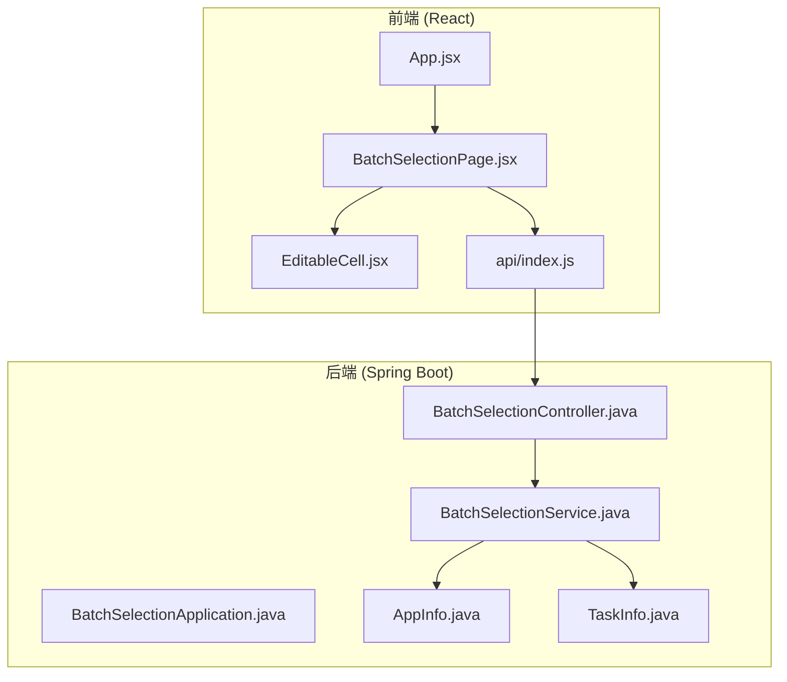
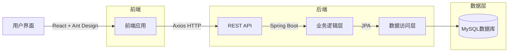
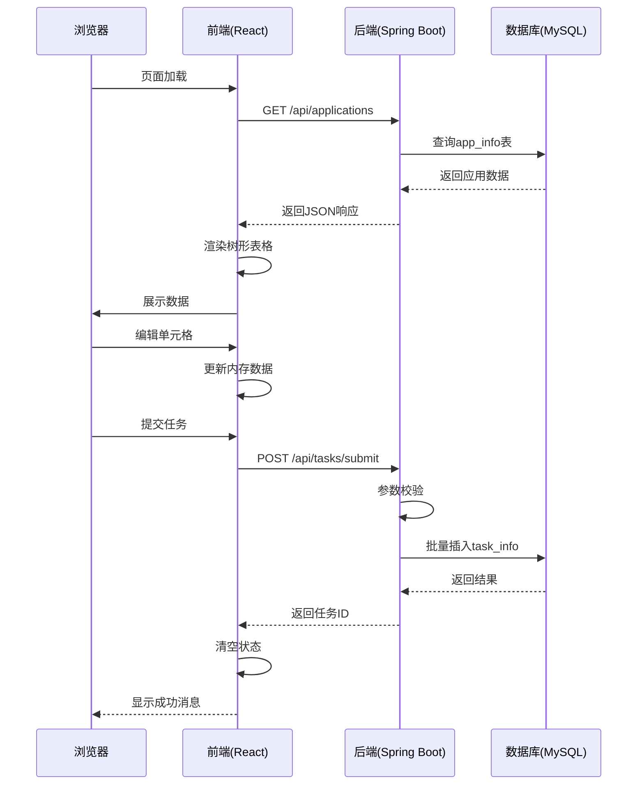
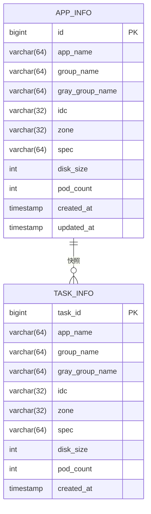

# 系统概述

<cite>
**本文档引用的文件**
- [BatchSelectionApplication.java](file://backend/src/main/java/com/example/batchselection/BatchSelectionApplication.java)
- [BatchSelectionController.java](file://backend/src/main/java/com/example/batchselection/controller/BatchSelectionController.java)
- [BatchSelectionServiceImpl.java](file://backend/src/main/java/com/example/batchselection/service/impl/BatchSelectionServiceImpl.java)
- [AppInfo.java](file://backend/src/main/java/com/example/batchselection/entity/AppInfo.java)
- [TaskInfo.java](file://backend/src/main/java/com/example/batchselection/entity/TaskInfo.java)
- [ApplicationResponseDTO.java](file://backend/src/main/java/com/example/batchselection/dto/ApplicationResponseDTO.java)
- [BatchTaskSubmitRequest.java](file://backend/src/main/java/com/example/batchselection/dto/BatchTaskSubmitRequest.java)
- [BatchSelectionPage.jsx](file://frontend/src/components/BatchSelectionPage.jsx)
- [EditableCell.jsx](file://frontend/src/components/EditableCell.jsx)
- [index.js](file://frontend/src/api/index.js)
- [application.properties](file://backend/src/main/resources/application.properties)
</cite>

## 目录
1. [简介](#简介)
2. [项目结构](#项目结构)
3. [核心功能](#核心功能)
4. [技术架构](#技术架构)
5. [前后端交互流程](#前后端交互流程)
6. [组件分析](#组件分析)
7. [数据模型](#数据模型)
8. [系统边界与业务价值](#系统边界与业务价值)
9. [使用说明](#使用说明)
10. [扩展建议](#扩展建议)

## 简介

批量勾选信息管理系统是一个基于 React 前端与 Spring Boot 后端的全栈应用，旨在为用户提供一个直观、高效的数据管理界面。系统支持树形表格展示、批量勾选、在线编辑和任务提交等关键功能，适用于需要对应用-分组结构进行可视化操作的场景。

该系统采用前后端分离架构，前端使用 React 18 和 Ant Design 实现用户界面，后端基于 Spring Boot 提供 RESTful API 接口，并通过 MySQL 存储数据。整体设计目标是实现数据的可视化管理，提升用户在复杂数据结构下的操作效率。

**Section sources**
- [README.md](file://README.md#L1-L317)

## 项目结构

项目采用标准的前后端分离结构，分为 `frontend` 和 `backend` 两个主要目录：

**Diagram sources**
- [README.md](file://README.md#L5-L34)

**Section sources**
- [README.md](file://README.md#L5-L34)

## 核心功能

### 树形表格展示
系统以应用-分组两级结构展示数据，支持展开/折叠操作，默认展开所有节点，便于用户快速浏览。

### 批量勾选
- **应用级勾选**：勾选应用时自动选中其下所有分组
- **分组级勾选**：可单独选择特定分组
- **半选状态**：当部分分组被选中时，应用节点显示半选状态

### 在线编辑
- 双击单元格进入编辑模式
- 支持文本和数字类型字段（如硬盘大小、Pod数量）
- 回车保存、ESC取消、失焦自动保存
- 编辑内容暂存于内存，提交后才写入数据库

### 数据验证
- 必填字段校验（应用名、分组名、机房等）
- 数值类型校验（确保硬盘大小和Pod数量为正整数）
- 提交前完整性检查

### 批量提交
- 收集所有勾选项及其编辑后数据
- 事务性写入任务表
- 自动生成任务ID和时间戳
- 提交成功后清空勾选与编辑状态

**Section sources**
- [README.md](file://README.md#L39-L67)

## 技术架构

系统采用典型的前后端分离架构，各层职责清晰：

**Diagram sources**
- [BatchSelectionApplication.java](file://backend/src/main/java/com/example/batchselection/BatchSelectionApplication.java#L1-L16)
- [BatchSelectionPage.jsx](file://frontend/src/components/BatchSelectionPage.jsx#L1-L351)

**Section sources**
- [README.md](file://README.md#L80-L93)

## 前后端交互流程

系统通过标准化的 API 接口实现前后端通信：

**Diagram sources**
- [BatchSelectionController.java](file://backend/src/main/java/com/example/batchselection/controller/BatchSelectionController.java#L1-L64)
- [index.js](file://frontend/src/api/index.js#L1-L40)

**Section sources**
- [BatchSelectionController.java](file://backend/src/main/java/com/example/batchselection/controller/BatchSelectionController.java#L1-L64)
- [index.js](file://frontend/src/api/index.js#L1-L40)

## 组件分析

### 前端组件

#### 批量选择页面 (BatchSelectionPage.jsx)
主界面组件，负责：
- 加载应用数据
- 管理勾选状态
- 处理编辑操作
- 提交任务请求
- 状态管理（loading、submitting等）

**Section sources**
- [BatchSelectionPage.jsx](file://frontend/src/components/BatchSelectionPage.jsx#L1-L351)

#### 可编辑单元格 (EditableCell.jsx)
通用可编辑组件，支持：
- 双击触发编辑
- 输入框/数字输入框类型切换
- 键盘事件处理（Enter保存，ESC取消）
- 数据校验（特别是数值类型）

**Section sources**
- [EditableCell.jsx](file://frontend/src/components/EditableCell.jsx#L1-L109)

### 后端组件

#### 控制器层 (BatchSelectionController)
提供两个核心接口：
- `GET /api/applications`：获取所有应用数据
- `POST /api/tasks/submit`：提交任务列表

使用 `@CrossOrigin` 支持跨域请求，`@Validated` 进行参数校验。

**Section sources**
- [BatchSelectionController.java](file://backend/src/main/java/com/example/batchselection/controller/BatchSelectionController.java#L1-L64)

#### 服务层 (BatchSelectionServiceImpl)
核心业务逻辑实现：
- 查询应用数据并按应用名分组
- 提交任务时进行数量限制（≤1000条）
- 转换DTO与实体类
- 事务性保存任务数据

**Section sources**
- [BatchSelectionServiceImpl.java](file://backend/src/main/java/com/example/batchselection/service/impl/BatchSelectionServiceImpl.java#L1-L128)

## 数据模型

系统包含两个核心数据表：

**Diagram sources**
- [AppInfo.java](file://backend/src/main/java/com/example/batchselection/entity/AppInfo.java#L1-L62)
- [TaskInfo.java](file://backend/src/main/java/com/example/batchselection/entity/TaskInfo.java#L1-L54)

**Section sources**
- [AppInfo.java](file://backend/src/main/java/com/example/batchselection/entity/AppInfo.java#L1-L62)
- [TaskInfo.java](file://backend/src/main/java/com/example/batchselection/entity/TaskInfo.java#L1-L54)

## 系统边界与业务价值

### 系统边界
- **内部系统**：应用数据管理、任务提交、状态维护
- **外部依赖**：MySQL数据库、前端浏览器环境
- **接口边界**：RESTful API 接口 `/api/applications` 和 `/api/tasks/submit`

### 业务价值
1. **提升操作效率**：通过批量勾选和在线编辑，减少重复操作
2. **降低出错率**：提供数据校验和提交前检查
3. **操作可追溯**：任务提交生成独立记录，便于审计
4. **用户体验优化**：直观的树形界面和即时反馈机制
5. **数据一致性**：前端编辑不影响源数据，提交才生效

**Section sources**
- [README.md](file://README.md#L1-L317)

## 使用说明

### 启动步骤
1. **数据库准备**：执行 `schema.sql` 创建表结构
2. **后端启动**：`mvn spring-boot:run` 启动服务（端口8080）
3. **前端启动**：`npm run dev` 启动开发服务器（端口3000）

### 操作流程
1. **查看数据**：页面自动加载所有应用-分组数据
2. **勾选数据**：选择应用或分组进行批量选择
3. **编辑数据**：双击单元格修改配置信息
4. **提交任务**：点击"提交"按钮将数据写入任务表
5. **取消操作**：点击"取消"清空所有临时状态

**Section sources**
- [README.md](file://README.md#L118-L155)

## 扩展建议

未来可考虑以下功能扩展：
- **数据导出**：将勾选数据导出为 Excel 文件
- **批量导入**：从 Excel 文件导入数据
- **历史查询**：查看已提交的任务记录
- **任务跟踪**：增加任务状态（待执行、执行中、已完成）
- **权限控制**：不同用户角色的访问权限管理
- **操作日志**：记录关键操作日志

这些扩展将进一步提升系统的实用性和企业级特性。

**Section sources**
- [README.md](file://README.md#L304-L312)