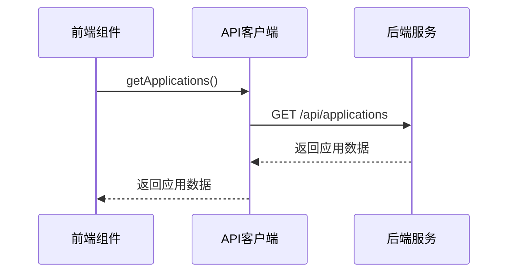
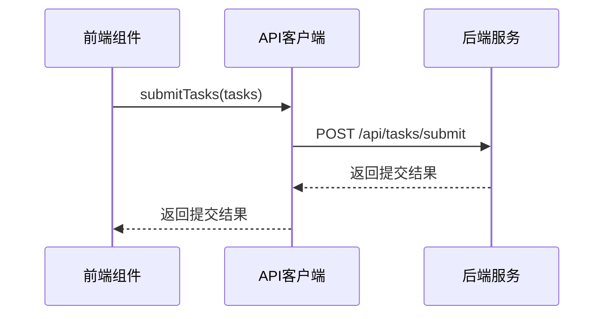
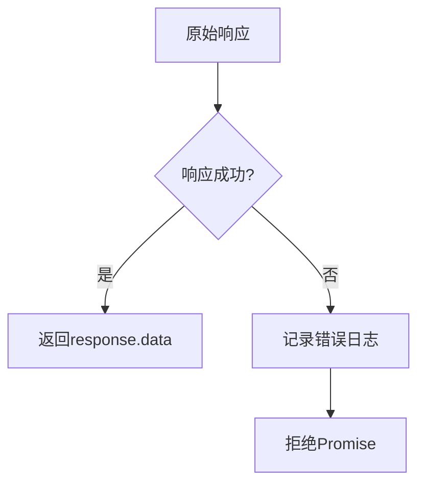
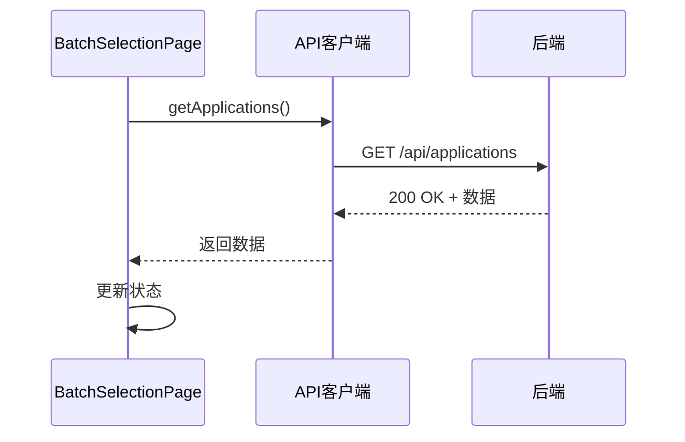
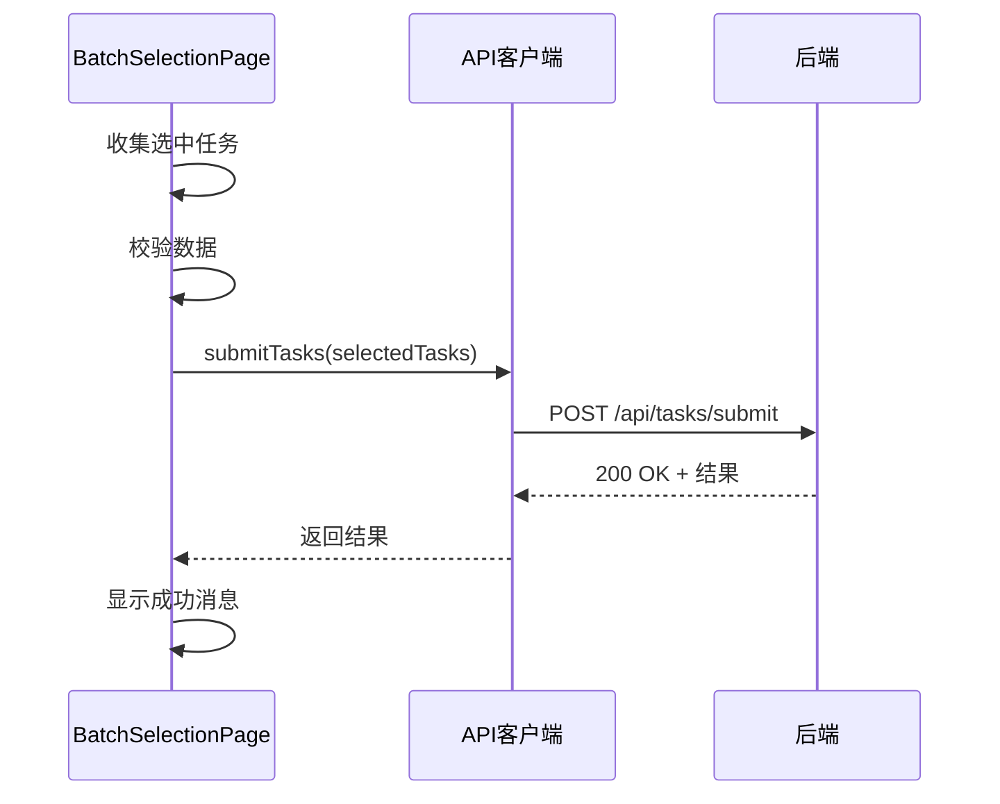
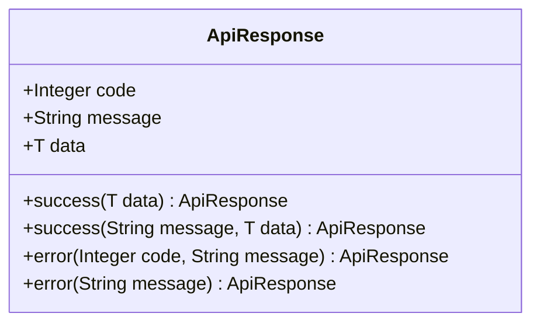
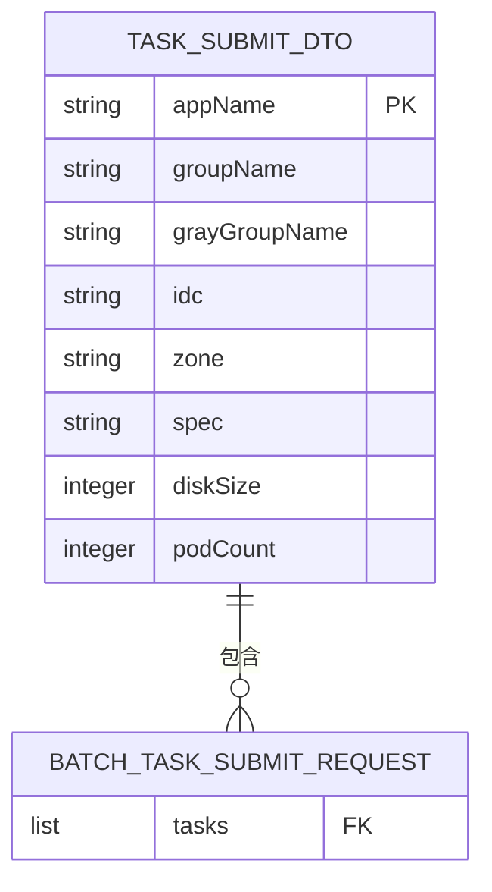

# API客户端模块

<cite>
**Referenced Files in This Document**   
- [index.js](file://frontend/src/api/index.js)
- [BatchSelectionPage.jsx](file://frontend/src/components/BatchSelectionPage.jsx)
- [BatchSelectionController.java](file://backend/src/main/java/com/example/batchselection/controller/BatchSelectionController.java)
- [TaskSubmitDTO.java](file://backend/src/main/java/com/example/batchselection/dto/TaskSubmitDTO.java)
- [TaskSubmitResponse.java](file://backend/src/main/java/com/example/batchselection/dto/TaskSubmitResponse.java)
- [ApiResponse.java](file://backend/src/main/java/com/example/batchselection/dto/ApiResponse.java)
- [BatchTaskSubmitRequest.java](file://backend/src/main/java/com/example/batchselection/dto/BatchTaskSubmitRequest.java)
</cite>

## 目录
1. [API客户端概述](#api客户端概述)
2. [HTTP实例配置](#http实例配置)
3. [核心API方法](#核心api方法)
4. [请求拦截与响应处理](#请求拦截与响应处理)
5. [实际调用场景](#实际调用场景)
6. [错误处理机制](#错误处理机制)
7. [扩展新API接口](#扩展新api接口)

## API客户端概述

API客户端模块封装了前端与后端服务的通信逻辑，通过Axios库提供统一的HTTP请求接口。该模块位于`frontend/src/api/index.js`，为前端组件提供简洁的API调用方式，隐藏底层网络请求的复杂性。

**Section sources**
- [index.js](file://frontend/src/api/index.js#L1-L40)

## HTTP实例配置

API客户端通过Axios的`create`方法创建了一个独立的HTTP实例，该实例具有统一的配置参数，确保所有请求遵循相同的规则。

```mermaid
classDiagram
class apiClient {
+baseURL : string
+timeout : number
+headers : object
}
note right of apiClient
Axios实例配置
baseURL : '/api'
timeout : 10000
headers : {'Content-Type' : 'application/json'}
end note
```

**Diagram sources**
- [index.js](file://frontend/src/api/index.js#L3-L9)

**Section sources**
- [index.js](file://frontend/src/api/index.js#L3-L9)

### 配置参数说明
- **基础URL**：设置为`/api`，所有请求将自动在此基础上构建完整URL
- **超时时间**：设置为10秒，防止请求无限期挂起
- **请求头**：默认设置`Content-Type`为`application/json`，确保后端正确解析JSON格式数据

## 核心API方法

API客户端暴露了两个核心方法：`getApplications`和`submitTasks`，分别用于获取应用数据和提交批量任务。

### 获取应用数据

`getApplications`方法用于从后端获取所有应用的配置信息。



**Diagram sources**
- [index.js](file://frontend/src/api/index.js#L24-L25)
- [BatchSelectionController.java](file://backend/src/main/java/com/example/batchselection/controller/BatchSelectionController.java#L32-L42)

**Section sources**
- [index.js](file://frontend/src/api/index.js#L24-L25)

### 提交批量任务

`submitTasks`方法用于向后端提交批量任务请求，包含多个任务的详细信息。



**Diagram sources**
- [index.js](file://frontend/src/api/index.js#L32-L33)
- [BatchSelectionController.java](file://backend/src/main/java/com/example/batchselection/controller/BatchSelectionController.java#L49-L61)

**Section sources**
- [index.js](file://frontend/src/api/index.js#L32-L33)

## 请求拦截与响应处理

API客户端配置了响应拦截器，用于统一处理响应数据和错误情况。

### 响应数据处理

响应拦截器自动提取响应体中的`data`字段，使前端代码无需每次都访问`response.data`。



**Diagram sources**
- [index.js](file://frontend/src/api/index.js#L13-L18)

**Section sources**
- [index.js](file://frontend/src/api/index.js#L13-L18)

## 实际调用场景

在`BatchSelectionPage`组件中，API客户端的方法被直接导入并使用，展示了典型的调用模式。

### 数据加载流程



**Diagram sources**
- [BatchSelectionPage.jsx](file://frontend/src/components/BatchSelectionPage.jsx#L24-L37)
- [index.js](file://frontend/src/api/index.js#L24-L25)

**Section sources**
- [BatchSelectionPage.jsx](file://frontend/src/components/BatchSelectionPage.jsx#L24-L37)

### 任务提交流程



**Diagram sources**
- [BatchSelectionPage.jsx](file://frontend/src/components/BatchSelectionPage.jsx#L251-L302)
- [index.js](file://frontend/src/api/index.js#L32-L33)

**Section sources**
- [BatchSelectionPage.jsx](file://frontend/src/components/BatchSelectionPage.jsx#L251-L302)

## 错误处理机制

系统实现了多层次的错误处理机制，确保用户能够获得清晰的反馈。

### 后端统一响应格式

后端通过`ApiResponse`类统一封装所有响应，包含状态码、消息和数据。



**Diagram sources**
- [ApiResponse.java](file://backend/src/main/java/com/example/batchselection/dto/ApiResponse.java#L13-L34)

**Section sources**
- [ApiResponse.java](file://backend/src/main/java/com/example/batchselection/dto/ApiResponse.java#L13-L34)

### 常见错误码解析

| 错误码 | 含义 | 处理建议 |
|-------|------|---------|
| 200 | 请求成功 | 正常处理响应数据 |
| 400 | 参数错误 | 检查请求参数格式和必填项 |
| 500 | 服务器错误 | 重试请求或联系管理员 |

### 重试策略建议

1. **网络超时**：最多重试2次，每次间隔1秒
2. **服务器错误**：立即重试1次，若仍失败则提示用户
3. **参数错误**：不重试，直接提示用户修正输入

## 扩展新API接口

当需要添加新的API接口时，遵循以下步骤可以确保代码的一致性和可维护性。

### 添加新方法的步骤

1. 在`index.js`中导入必要的依赖
2. 根据业务需求创建新的API方法
3. 遵循现有的命名规范和错误处理模式
4. 在默认导出对象中添加新方法

### 请求参数组织

新接口的请求参数应按照后端DTO的结构进行组织，确保数据格式的一致性。



**Diagram sources**
- [TaskSubmitDTO.java](file://backend/src/main/java/com/example/batchselection/dto/TaskSubmitDTO.java#L12-L38)
- [BatchTaskSubmitRequest.java](file://backend/src/main/java/com/example/batchselection/dto/BatchTaskSubmitRequest.java#L12-L17)

**Section sources**
- [TaskSubmitDTO.java](file://backend/src/main/java/com/example/batchselection/dto/TaskSubmitDTO.java#L12-L38)
- [BatchTaskSubmitRequest.java](file://backend/src/main/java/com/example/batchselection/dto/BatchTaskSubmitRequest.java#L12-L17)