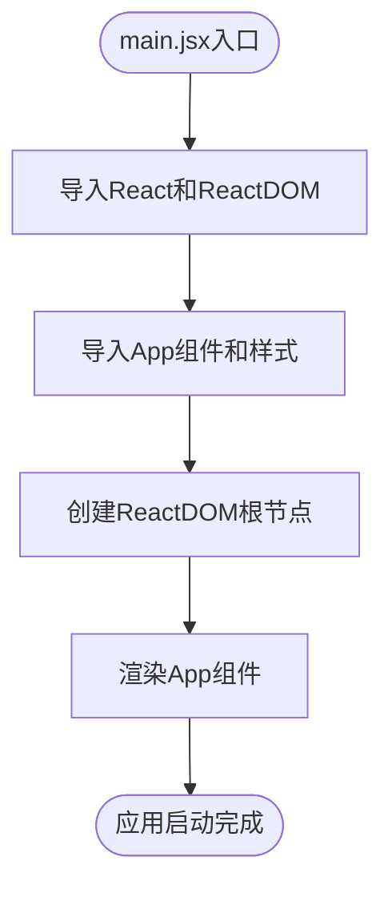

# 前端目录结构

<cite>
**Referenced Files in This Document**   
- [main.jsx](file://frontend/src/main.jsx)
- [App.jsx](file://frontend/src/App.jsx)
- [BatchSelectionPage.jsx](file://frontend/src/components/BatchSelectionPage.jsx)
- [EditableCell.jsx](file://frontend/src/components/EditableCell.jsx)
- [index.js](file://frontend/src/api/index.js)
- [index.css](file://frontend/src/index.css)
- [vite.config.js](file://frontend/vite.config.js)
- [BatchSelectionController.java](file://backend/src/main/java/com/example/batchselection/controller/BatchSelectionController.java)
</cite>

## 目录结构

前端项目采用标准的React应用目录结构，主要包含以下核心组件：

- `src/` - 源代码目录
  - `api/` - API接口封装
  - `components/` - 可复用UI组件
  - `App.jsx` - 根组件
  - `main.jsx` - 应用入口
  - `index.css` - 全局样式
- `vite.config.js` - 构建配置文件

这种组织方式遵循了React最佳实践，将组件、API调用和样式分离，提高了代码的可维护性和可读性。

**Section sources**
- [main.jsx](file://frontend/src/main.jsx#L1-L11)
- [App.jsx](file://frontend/src/App.jsx#L1-L15)

## 应用初始化流程

### 入口文件分析

`main.jsx`作为应用的入口点，负责初始化React应用并挂载到DOM中。该文件首先导入React和ReactDOM库，然后引入根组件App和全局样式文件index.css。

**Diagram sources**
- [main.jsx](file://frontend/src/main.jsx#L1-L11)

**Section sources**
- [main.jsx](file://frontend/src/main.jsx#L1-L11)

## 组件架构与关系

### 根组件作用

`App.jsx`作为应用的根组件，主要职责是提供全局配置和渲染主页面组件。该组件使用Ant Design的ConfigProvider来设置中文语言环境，并将BatchSelectionPage作为子组件进行渲染。

**Diagram sources**
- [App.jsx](file://frontend/src/App.jsx#L6-L14)
- [BatchSelectionPage.jsx](file://frontend/src/components/BatchSelectionPage.jsx#L12-L350)

**Section sources**
- [App.jsx](file://frontend/src/App.jsx#L6-L14)

### 主页面组件分析

`BatchSelectionPage`是应用的核心功能组件，实现了批量勾选信息管理的所有功能。该组件采用函数式组件和Hooks的方式构建，使用了useState、useEffect和useMemo等React Hooks来管理状态和性能优化。

#### 组件树结构

**Diagram sources**
- [BatchSelectionPage.jsx](file://frontend/src/components/BatchSelectionPage.jsx#L312-L347)
- [EditableCell.jsx](file://frontend/src/components/EditableCell.jsx#L90-L105)

#### 状态管理

组件维护了多个状态变量：
- `loading`: 控制数据加载状态
- `submitting`: 控制提交按钮加载状态
- `applications`: 存储从API获取的应用数据
- `selectedRowKeys`: 存储用户勾选的行键
- `editedData`: 存储用户编辑但未提交的数据

**Section sources**
- [BatchSelectionPage.jsx](file://frontend/src/components/BatchSelectionPage.jsx#L13-L18)

### 可编辑单元格组件

`EditableCell`是一个通用的可编辑单元格组件，支持文本和数字类型的编辑。用户可以通过双击进入编辑模式，通过回车键保存或ESC键取消编辑。

#### 编辑流程

**Diagram sources**
- [EditableCell.jsx](file://frontend/src/components/EditableCell.jsx#L20-L58)

**Section sources**
- [EditableCell.jsx](file://frontend/src/components/EditableCell.jsx#L16-L58)

## API接口封装

### API客户端配置

`api/index.js`文件封装了与后端REST API的通信逻辑。通过axios创建了一个API客户端实例，配置了基础URL为'/api'，设置了请求超时时间和默认的Content-Type头部。

**Diagram sources**
- [index.js](file://frontend/src/api/index.js#L4-L10)
- [index.js](file://frontend/src/api/index.js#L24-L33)

### 接口调用关系

前端组件通过API模块与后端进行数据交互，具体调用关系如下：

**Diagram sources**
- [BatchSelectionPage.jsx](file://frontend/src/components/BatchSelectionPage.jsx#L27-L33)
- [index.js](file://frontend/src/api/index.js#L24-L33)
- [BatchSelectionController.java](file://backend/src/main/java/com/example/batchselection/controller/BatchSelectionController.java#L32-L61)

**Section sources**
- [index.js](file://frontend/src/api/index.js#L23-L39)
- [BatchSelectionPage.jsx](file://frontend/src/components/BatchSelectionPage.jsx#L24-L38)

## 样式与构建配置

### 全局样式作用域

`index.css`文件定义了应用的全局样式，主要包括：
- 重置默认的margin和padding
- 设置盒模型为border-box
- 定义全局字体和抗锯齿
- 设置根元素的尺寸

这些样式通过main.jsx中的import语句引入，作用于整个应用。

**Section sources**
- [index.css](file://frontend/src/index.css#L1-L19)

### 开发服务器代理配置

`vite.config.js`文件中的代理配置解决了前后端联调时的跨域问题。配置将所有以'/api'开头的请求代理到后端服务地址http://localhost:8080。

**Diagram sources**
- [vite.config.js](file://frontend/vite.config.js#L6-L13)

**Section sources**
- [vite.config.js](file://frontend/vite.config.js#L6-L13)

## 组件调用关系总结

通过分析各组件之间的关系，可以得出以下结论：

1. **层级关系**：App组件是根组件，包含BatchSelectionPage组件，后者又包含多个EditableCell组件。
2. **数据流**：数据从API层获取后，由BatchSelectionPage组件管理状态，并通过props传递给子组件。
3. **事件流**：用户交互产生的事件由子组件触发，通过回调函数向上传递给父组件处理。
4. **样式作用域**：全局样式影响所有组件，组件特定样式通过CSS文件局部作用。

这种组件化开发模式提高了代码的复用性和可维护性，每个组件都有明确的职责划分。

**Section sources**
- [main.jsx](file://frontend/src/main.jsx#L1-L11)
- [App.jsx](file://frontend/src/App.jsx#L1-L15)
- [BatchSelectionPage.jsx](file://frontend/src/components/BatchSelectionPage.jsx#L1-L351)
- [EditableCell.jsx](file://frontend/src/components/EditableCell.jsx#L1-L109)
- [index.js](file://frontend/src/api/index.js#L1-L40)
- [index.css](file://frontend/src/index.css#L1-L19)
- [vite.config.js](file://frontend/vite.config.js#L1-L16)