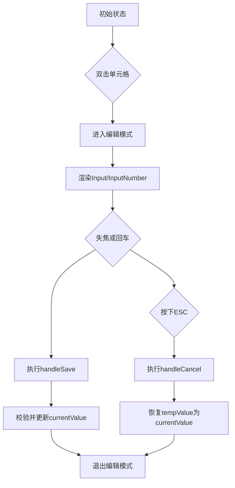
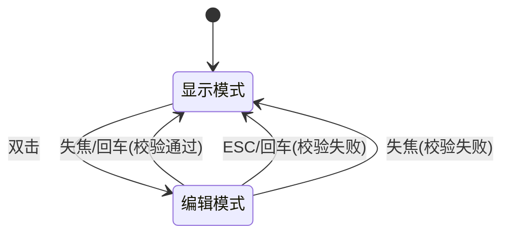
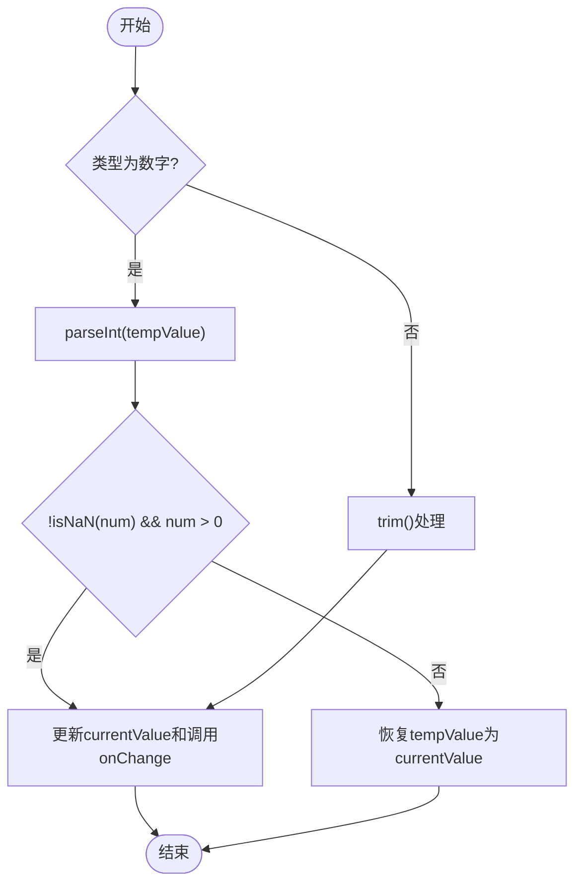
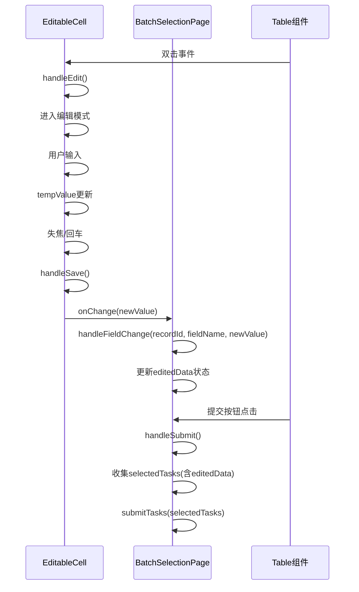

# 可编辑单元格组件

<cite>
**Referenced Files in This Document**   
- [EditableCell.jsx](file://frontend/src/components/EditableCell.jsx)
- [BatchSelectionPage.jsx](file://frontend/src/components/BatchSelectionPage.jsx)
- [index.js](file://frontend/src/api/index.js)
</cite>

## 目录
1. [简介](#简介)
2. [核心功能与设计](#核心功能与设计)
3. [状态管理与生命周期](#状态管理与生命周期)
4. [输入类型与验证机制](#输入类型与验证机制)
5. [与父组件的状态同步](#与父组件的状态同步)
6. [使用示例与最佳实践](#使用示例与最佳实践)
7. [边界情况处理](#边界情况处理)
8. [可复用性与扩展性](#可复用性与扩展性)

## 简介

`EditableCell` 是一个功能完整的可编辑单元格组件，专为表格场景设计，支持双击进入编辑模式、失焦或回车提交变更。该组件作为受控组件，通过 `value` 和 `onChange` 属性与父组件进行数据同步，确保编辑状态的集中管理。组件在 `BatchSelectionPage` 中被广泛使用，用于编辑分组信息的各项字段，如分组名、机房、硬盘大小等。

**Section sources**
- [EditableCell.jsx](file://frontend/src/components/EditableCell.jsx#L1-L109)
- [BatchSelectionPage.jsx](file://frontend/src/components/BatchSelectionPage.jsx#L1-L351)

## 核心功能与设计

`EditableCell` 组件的核心设计围绕双模式切换：显示模式和编辑模式。通过双击触发 `handleEdit` 函数进入编辑模式，此时组件根据 `type` 属性渲染 `Input` 或 `InputNumber` 组件。编辑完成后，通过失焦（`onBlur`）或回车（`Enter` 键）触发 `handleSave` 函数保存变更，ESC 键则触发 `handleCancel` 函数取消编辑并恢复原值。

组件通过 `useState` 钩子管理三个关键状态：
- `editing`：布尔值，标识当前是否处于编辑模式
- `currentValue`：存储当前显示的最终值
- `tempValue`：存储编辑过程中的临时值

这种设计确保了编辑过程的隔离性，避免了未完成的编辑影响最终数据。

**Diagram sources**
- [EditableCell.jsx](file://frontend/src/components/EditableCell.jsx#L16-L59)

**Section sources**
- [EditableCell.jsx](file://frontend/src/components/EditableCell.jsx#L8-L108)

## 状态管理与生命周期

组件的状态管理遵循清晰的生命周期流程。当组件首次渲染时，`currentValue` 和 `tempValue` 均初始化为传入的 `value` 属性。进入编辑模式时，`tempValue` 被重置为 `currentValue`，确保取消编辑时能恢复到最新保存的值。

保存流程中，`handleSave` 函数首先将 `editing` 状态设为 `false` 以退出编辑模式，然后根据 `type` 进行类型特定的校验。校验通过后，通过 `onChange` 回调通知父组件值已变更，并更新 `currentValue`。若校验失败，则将 `tempValue` 恢复为 `currentValue`，实现数据回滚。

**Diagram sources**
- [EditableCell.jsx](file://frontend/src/components/EditableCell.jsx#L16-L59)

**Section sources**
- [EditableCell.jsx](file://frontend/src/components/EditableCell.jsx#L16-L59)

## 输入类型与验证机制

组件通过 `type` 属性支持两种输入类型：文本（`text`）和数字（`number`）。对于文本类型，组件使用 `Input` 组件，并在保存时进行空值和空白字符的修剪处理。对于数字类型，组件使用 `InputNumber` 组件，提供原生的数值输入体验，并内置了最小值（`min`）和最大值（`max`）的限制。

数字类型的验证在 `handleSave` 函数中实现，通过 `parseInt` 将输入值转换为整数，并检查其是否为有效数字且大于零。若验证失败，组件会自动恢复原值，防止非法数据进入系统。

**Diagram sources**
- [EditableCell.jsx](file://frontend/src/components/EditableCell.jsx#L31-L43)

**Section sources**
- [EditableCell.jsx](file://frontend/src/components/EditableCell.jsx#L11-L15)
- [EditableCell.jsx](file://frontend/src/components/EditableCell.jsx#L31-L43)

## 与父组件的状态同步

`EditableCell` 作为受控组件，其状态完全由父组件 `BatchSelectionPage` 管理。`BatchSelectionPage` 通过 `columns` 配置中的 `render` 函数为每个可编辑字段创建 `EditableCell` 实例，并传递 `value` 和 `onChange` 属性。

`BatchSelectionPage` 使用 `editedData` 状态对象来收集所有编辑过的字段值。`handleFieldChange` 函数作为 `onChange` 回调，接收字段ID、字段名和新值，然后更新 `editedData` 对象。当数据提交时，`treeData` 通过 `useMemo` 重新计算，将 `editedData` 中的值合并到原始数据中，确保提交的数据包含所有编辑变更。

**Diagram sources**
- [BatchSelectionPage.jsx](file://frontend/src/components/BatchSelectionPage.jsx#L78-L86)
- [BatchSelectionPage.jsx](file://frontend/src/components/BatchSelectionPage.jsx#L40-L74)
- [BatchSelectionPage.jsx](file://frontend/src/components/BatchSelectionPage.jsx#L251-L302)

**Section sources**
- [BatchSelectionPage.jsx](file://frontend/src/components/BatchSelectionPage.jsx#L78-L86)
- [BatchSelectionPage.jsx](file://frontend/src/components/BatchSelectionPage.jsx#L40-L74)
- [BatchSelectionPage.jsx](file://frontend/src/components/BatchSelectionPage.jsx#L251-L302)

## 使用示例与最佳实践

在 `BatchSelectionPage` 中，`EditableCell` 被用于多个字段的编辑。对于文本字段（如分组名、机房），组件配置 `placeholder` 属性提供输入提示。对于数字字段（如硬盘大小、Pod数量），组件配置 `type="number"` 和 `min={1}` 确保输入为正整数。

最佳实践包括：
- 始终为 `onChange` 回调提供有效的处理函数
- 为数字类型设置合理的 `min` 和 `max` 值
- 为文本类型提供有意义的 `placeholder`
- 在父组件中妥善管理编辑状态，避免状态丢失

**Section sources**
- [BatchSelectionPage.jsx](file://frontend/src/components/BatchSelectionPage.jsx#L105-L110)
- [BatchSelectionPage.jsx](file://frontend/src/components/BatchSelectionPage.jsx#L185-L191)

## 边界情况处理

组件在设计时考虑了多种边界情况：
- **空值处理**：文本类型使用 `String(tempValue || '').trim()` 确保空值被正确处理
- **非法输入**：数字类型通过 `isNaN` 和范围检查拦截非法输入
- **状态同步**：通过 `tempValue` 和 `currentValue` 的分离，确保编辑过程不影响最终数据
- **用户取消**：ESC 键提供快速取消编辑的途径，提升用户体验

**Section sources**
- [EditableCell.jsx](file://frontend/src/components/EditableCell.jsx#L40-L43)
- [EditableCell.jsx](file://frontend/src/components/EditableCell.jsx#L31-L38)

## 可复用性与扩展性

`EditableCell` 组件具有高度的可复用性和扩展性。其设计不依赖于特定业务逻辑，仅关注编辑交互本身。通过 `type`、`min`、`max`、`placeholder` 等属性，组件可以轻松适配不同类型的输入需求。

未来扩展可包括：
- 支持更多输入类型（如日期、下拉框）
- 添加自定义验证规则
- 支持异步保存和加载状态
- 增加编辑历史和撤销功能

**Section sources**
- [EditableCell.jsx](file://frontend/src/components/EditableCell.jsx#L8-L15)
- [EditableCell.jsx](file://frontend/src/components/EditableCell.jsx#L63-L87)