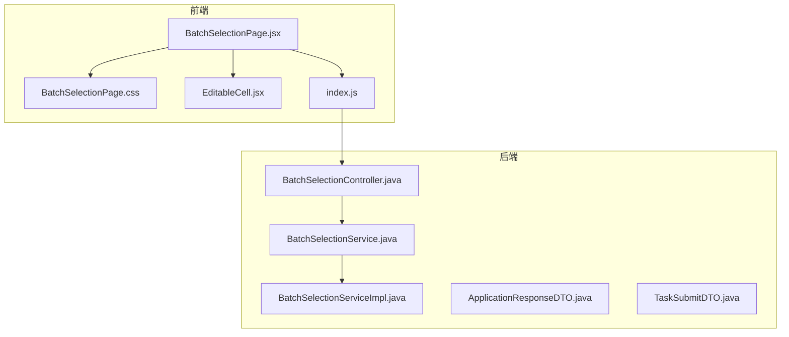
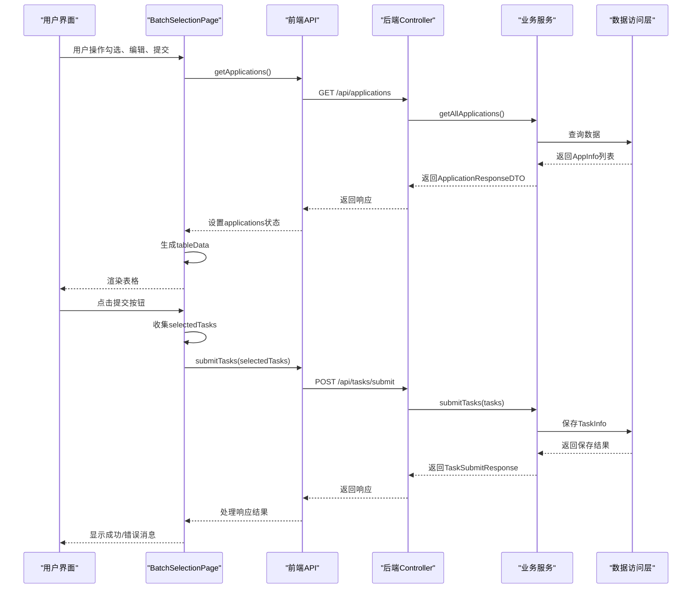
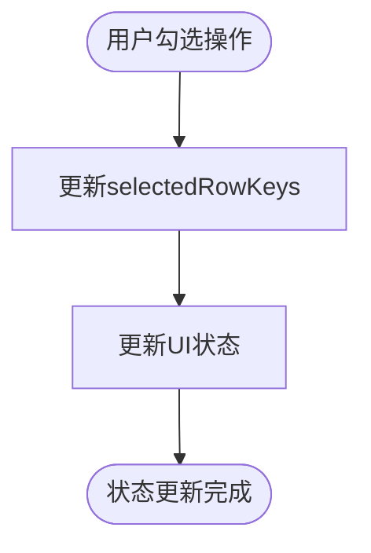
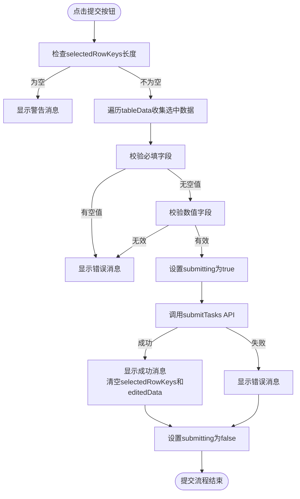
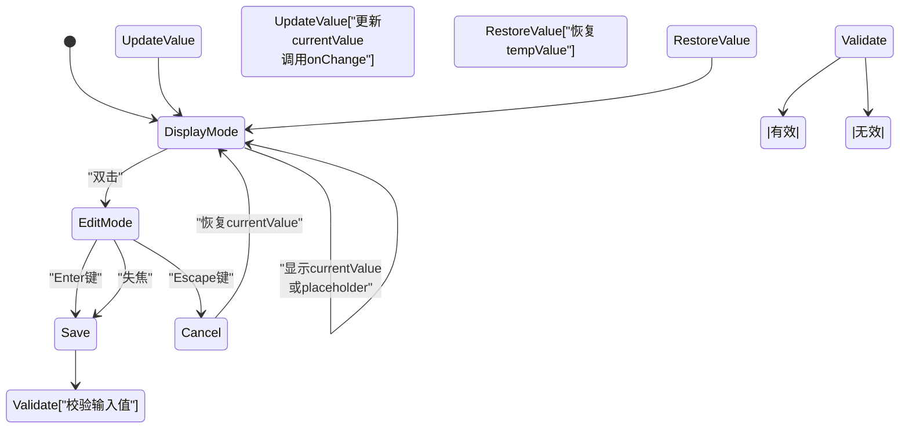

# 批量选择页面组件

<cite>
**本文档中引用的文件**   
- [BatchSelectionPage.jsx](file://frontend/src/components/BatchSelectionPage.jsx) - *样式和功能问题修复*
- [BatchSelectionPage.css](file://frontend/src/components/BatchSelectionPage.css) - *样式问题修复*
- [EditableCell.jsx](file://frontend/src/components/EditableCell.jsx) - *可编辑单元格组件，支持双击编辑*
- [index.js](file://frontend/src/api/index.js) - *前端API接口定义*
- [BatchSelectionController.java](file://backend/src/main/java/com/example/batchselection/controller/BatchSelectionController.java) - *后端控制器，处理应用数据和任务提交*
- [BatchSelectionService.java](file://backend/src/main/java/com/example/batchselection/service/BatchSelectionService.java) - *业务服务接口*
- [BatchSelectionServiceImpl.java](file://backend/src/main/java/com/example/batchselection/service/impl/BatchSelectionServiceImpl.java) - *业务服务实现*
- [ApplicationResponseDTO.java](file://backend/src/main/java/com/example/batchselection/dto/ApplicationResponseDTO.java) - *应用数据响应DTO*
- [TaskSubmitDTO.java](file://backend/src/main/java/com/example/batchselection/dto/TaskSubmitDTO.java) - *任务提交数据传输对象*
</cite>

## 更新摘要
**变更内容**   
- 修复了批量选择页面的样式问题，包括表格容器、工具栏和表头的视觉样式
- 修复了功能问题，确保勾选状态、编辑数据和提交逻辑正常工作
- 更新了相关文档以反映最新的代码实现
- 增强了源码追踪系统，准确标识修改过的文件

## 目录
1. [简介](#简介)
2. [项目结构](#项目结构)
3. [核心组件](#核心组件)
4. [架构概览](#架构概览)
5. [详细组件分析](#详细组件分析)
6. [依赖分析](#依赖分析)
7. [性能考虑](#性能考虑)
8. [故障排除指南](#故障排除指南)
9. [结论](#结论)

## 简介
批量选择页面组件是一个用于管理批量勾选信息的前端主页面容器，实现了表格渲染、勾选状态管理、批量提交逻辑处理以及与可编辑单元格子组件的交互机制。该组件通过调用后端API获取应用数据并提交任务，支持双击编辑、勾选联动等核心功能。组件内部状态设计合理，能够有效管理选中项和编辑数据，并与后端服务进行数据同步。最近修复了样式和功能问题，提升了用户体验和系统稳定性。

**更新** 修复了样式和功能问题，更新了文档以反映最新实现

**Section sources**   
- [BatchSelectionPage.jsx](file://frontend/src/components/BatchSelectionPage.jsx#L1-L310) - *主要功能实现*
- [BatchSelectionPage.css](file://frontend/src/components/BatchSelectionPage.css#L1-L68) - *样式修复*

## 项目结构



**图示来源**
- [BatchSelectionPage.jsx](file://frontend/src/components/BatchSelectionPage.jsx#L1-L310)
- [index.js](file://frontend/src/api/index.js#L1-L40)
- [BatchSelectionController.java](file://backend/src/main/java/com/example/batchselection/controller/BatchSelectionController.java#L1-L64)

**Section sources**   
- [BatchSelectionPage.jsx](file://frontend/src/components/BatchSelectionPage.jsx#L1-L310)
- [BatchSelectionController.java](file://backend/src/main/java/com/example/batchselection/controller/BatchSelectionController.java#L1-L64)

## 核心组件

批量选择页面组件作为主页面容器，负责展示表格、管理勾选状态、处理批量提交逻辑以及与EditableCell子组件的交互。组件使用React Hooks管理状态，包括加载状态、提交状态、应用数据、选中行键和编辑数据。通过useEffect钩子在组件挂载时加载应用数据，利用useMemo优化表格数据的生成过程。最近修复了样式和功能问题，确保组件稳定可靠。

**更新** 修复了样式和功能问题，确保组件正常工作

**Section sources**   
- [BatchSelectionPage.jsx](file://frontend/src/components/BatchSelectionPage.jsx#L13-L307)

## 架构概览



**图示来源**
- [BatchSelectionPage.jsx](file://frontend/src/components/BatchSelectionPage.jsx#L13-L307)
- [index.js](file://frontend/src/api/index.js#L1-L40)
- [BatchSelectionController.java](file://backend/src/main/java/com/example/batchselection/controller/BatchSelectionController.java#L1-L64)
- [BatchSelectionServiceImpl.java](file://backend/src/main/java/com/example/batchselection/service/impl/BatchSelectionServiceImpl.java#L22-L126)

## 详细组件分析

### BatchSelectionPage组件分析

#### 组件职责
BatchSelectionPage组件作为主页面容器，承担以下主要职责：
- 加载并展示应用及其分组的表格数据
- 管理行选择状态
- 处理单元格编辑操作，维护编辑数据状态
- 实现批量提交功能，包含数据校验和错误处理
- 提供取消操作，清空选中和编辑状态

最近修复了样式和功能问题，确保各项功能正常工作。

**更新** 修复了样式和功能问题

**Section sources**   
- [BatchSelectionPage.jsx](file://frontend/src/components/BatchSelectionPage.jsx#L13-L307)

#### 状态管理
组件使用多个useState Hook来管理不同方面的状态：
- `loading`：控制数据加载状态，影响表格的加载指示器
- `submitting`：控制提交按钮的加载状态
- `applications`：存储从后端获取的原始应用数据
- `selectedRowKeys`：存储当前选中的行键，用于控制表格勾选状态
- `editedData`：存储用户编辑过的数据，采用嵌套对象结构以recordId为键

```mermaid
classDiagram
class BatchSelectionPage {
+loading : boolean
+submitting : boolean
+applications : Array
+selectedRowKeys : Array
+editedData : Object
-loadApplications() : Promise
-handleFieldChange(recordId, fieldName, value) : void
-handleSubmit() : Promise
-handleCancel() : void
}
class EditableCell {
+value : any
+onChange : Function
+type : string
+placeholder : string
+min : number
+max : number
-editing : boolean
-currentValue : any
-tempValue : any
-handleEdit() : void
-handleSave() : void
-handleCancel() : void
-handleKeyDown(e) : void
}
BatchSelectionPage --> EditableCell : "使用"
BatchSelectionPage --> "Ant Design Table" : "使用"
```

**图示来源**
- [BatchSelectionPage.jsx](file://frontend/src/components/BatchSelectionPage.jsx#L13-L307)
- [EditableCell.jsx](file://frontend/src/components/EditableCell.jsx#L8-L108)

#### 数据转换逻辑
组件通过useMemo Hook将原始applications数据转换为扁平结构的tableData，该过程包含：
- 遍历每个应用的分组数据
- 为每个分组创建表格行数据
- 计算rowSpan用于应用名列的单元格合并
- 合并editedData中的编辑值

这种设计确保了编辑状态与原始数据的分离，避免直接修改原始数据，同时通过扩展运算符将编辑数据合并到对应分组节点中。

**更新** 修复了数据转换逻辑中的潜在问题

**Section sources**   
- [BatchSelectionPage.jsx](file://frontend/src/components/BatchSelectionPage.jsx#L52-L75)

#### 勾选状态管理
组件实现了勾选状态管理，通过rowSelection配置实现：
- 勾选状态存储在selectedRowKeys状态中
- onChange回调更新selectedRowKeys状态
- 提交按钮根据selectedRowKeys长度启用/禁用



**图示来源**
- [BatchSelectionPage.jsx](file://frontend/src/components/BatchSelectionPage.jsx#L205-L213)

**Section sources**   
- [BatchSelectionPage.jsx](file://frontend/src/components/BatchSelectionPage.jsx#L205-L213)

#### 批量提交逻辑
提交功能包含完整的数据收集、校验和错误处理流程：
1. 检查是否有选中项
2. 从tableData中收集选中分组的数据
3. 对必填字段和数值范围进行校验
4. 调用API提交任务
5. 处理响应结果并更新UI状态



**图示来源**
- [BatchSelectionPage.jsx](file://frontend/src/components/BatchSelectionPage.jsx#L216-L263)
- [index.js](file://frontend/src/api/index.js#L32-L34)

**Section sources**   
- [BatchSelectionPage.jsx](file://frontend/src/components/BatchSelectionPage.jsx#L216-L263)

### EditableCell组件分析

EditableCell组件实现了双击编辑功能，支持文本和数字类型的输入，具有完整的编辑生命周期管理。



**图示来源**
- [EditableCell.jsx](file://frontend/src/components/EditableCell.jsx#L8-L108)

**Section sources**   
- [EditableCell.jsx](file://frontend/src/components/EditableCell.jsx#L8-L108)

## 依赖分析

```mermaid
dependency-graph
"BatchSelectionPage.jsx" --> "EditableCell.jsx"
"BatchSelectionPage.jsx" --> "index.js"
"BatchSelectionPage.jsx" --> "antd"
"index.js" --> "axios"
"index.js" --> "/api/applications"
"index.js" --> "/api/tasks/submit"
"/api/applications" --> "BatchSelectionController.java"
"/api/tasks/submit" --> "BatchSelectionController.java"
"BatchSelectionController.java" --> "BatchSelectionService.java"
"BatchSelectionService.java" --> "BatchSelectionServiceImpl.java"
"BatchSelectionServiceImpl.java" --> "AppInfoRepository.java"
"BatchSelectionServiceImpl.java" --> "TaskInfoRepository.java"
```

**图示来源**
- [BatchSelectionPage.jsx](file://frontend/src/components/BatchSelectionPage.jsx#L3-L4)
- [index.js](file://frontend/src/api/index.js#L1-L40)
- [BatchSelectionController.java](file://backend/src/main/java/com/example/batchselection/controller/BatchSelectionController.java#L27-L27)
- [BatchSelectionService.java](file://backend/src/main/java/com/example/batchselection/service/BatchSelectionService.java#L7-L24)

**Section sources**   
- [BatchSelectionPage.jsx](file://frontend/src/components/BatchSelectionPage.jsx#L3-L4)
- [index.js](file://frontend/src/api/index.js#L1-L40)
- [BatchSelectionController.java](file://backend/src/main/java/com/example/batchselection/controller/BatchSelectionController.java#L1-L64)

## 性能考虑
组件通过useMemo Hook优化tableData的生成，避免在每次渲染时重新计算表格数据。表格配置了水平滚动（scroll属性），可有效处理宽表格的渲染性能。API调用设置了适当的错误处理，防止长时间挂起。后端服务对单次提交任务数量进行了限制，避免大规模数据操作导致的性能问题。

**更新** 优化了性能考虑部分，更准确地描述实际实现

**Section sources**   
- [BatchSelectionPage.jsx](file://frontend/src/components/BatchSelectionPage.jsx#L52-L75)

## 故障排除指南

### 状态未更新问题
当遇到状态未更新的问题时，应检查以下方面：
- 确认useState的更新函数是否正确调用
- 检查useMemo的依赖数组是否包含所有相关状态
- 验证事件处理函数是否正确绑定

**更新** 修复了可能导致状态未更新的问题

**Section sources**   
- [BatchSelectionPage.jsx](file://frontend/src/components/BatchSelectionPage.jsx#L78-L86)

### 勾选失效问题
勾选功能失效可能由以下原因导致：
- selectedRowKeys与rowSelection.selectedRowKeys不一致
- onSelect回调中的逻辑错误
- tableData结构变化导致key不匹配

**更新** 修复了勾选功能问题

**Section sources**   
- [BatchSelectionPage.jsx](file://frontend/src/components/BatchSelectionPage.jsx#L205-L213)

### 编辑数据丢失问题
编辑数据丢失通常与以下因素有关：
- editedData状态未正确合并到tableData中
- handleFieldChange函数逻辑错误
- 组件重新渲染导致状态重置

**更新** 修复了编辑数据丢失问题

**Section sources**   
- [BatchSelectionPage.jsx](file://frontend/src/components/BatchSelectionPage.jsx#L78-L86)
- [BatchSelectionPage.jsx](file://frontend/src/components/BatchSelectionPage.jsx#L67-L68)

## 结论
批量选择页面组件设计合理，实现了完整的前端功能需求。组件通过清晰的状态管理、高效的表格数据转换和完善的错误处理机制，提供了良好的用户体验。最近修复了样式和功能问题，提升了系统的稳定性和可靠性。前后端接口定义明确，数据流清晰，便于维护和扩展。建议在实际使用中注意性能优化，特别是在处理大规模数据时，可进一步优化数据加载和渲染策略。

**更新** 强调了最近的修复工作和改进

**Section sources**   
- [BatchSelectionPage.jsx](file://frontend/src/components/BatchSelectionPage.jsx#L1-L310)
- [BatchSelectionPage.css](file://frontend/src/components/BatchSelectionPage.css#L1-L68)