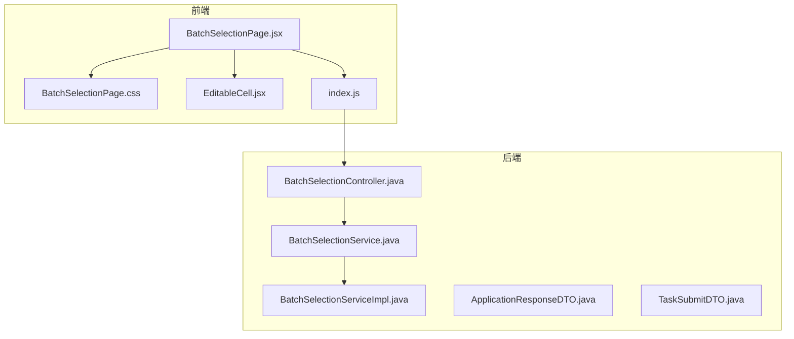
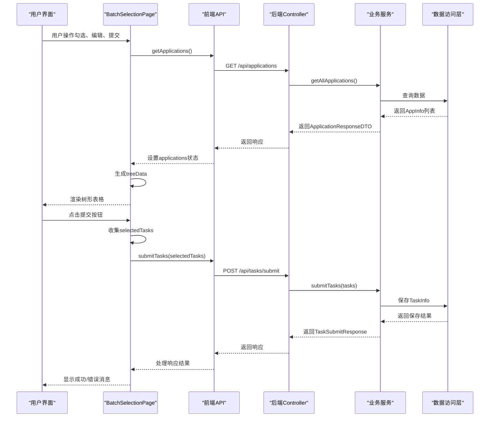
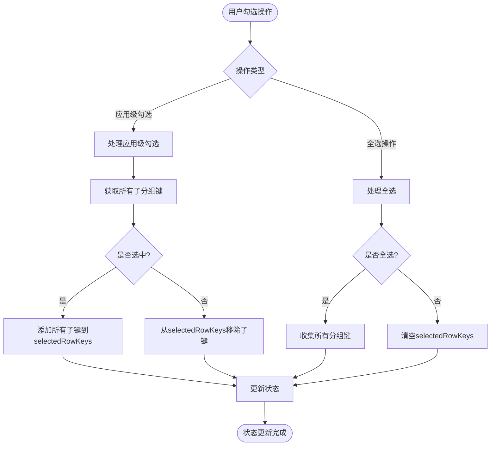
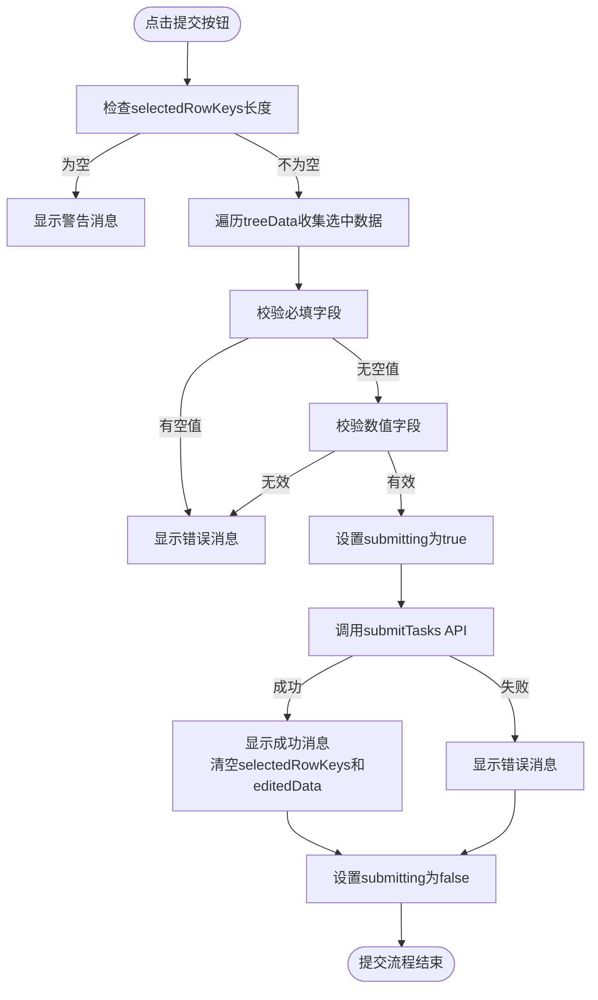
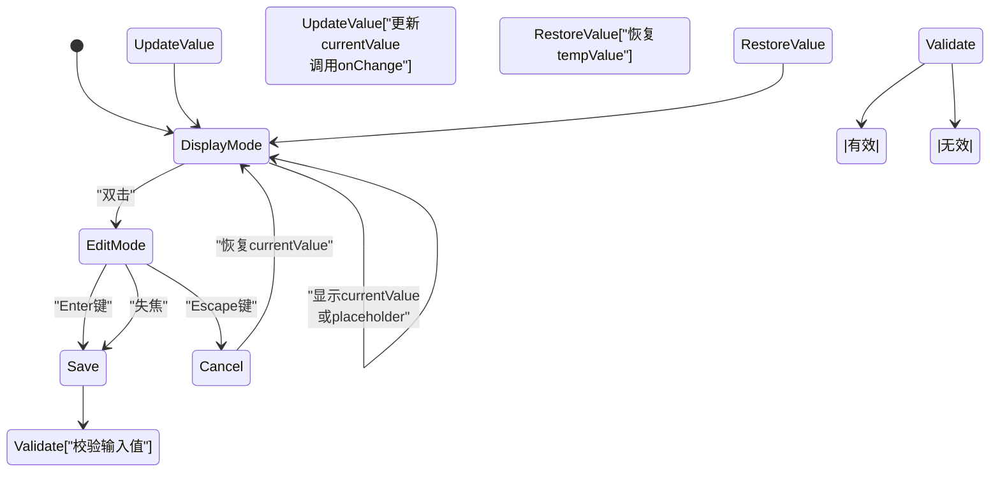

# 批量选择页面组件

<cite>
**本文档中引用的文件**   
- [BatchSelectionPage.jsx](file://frontend/src/components/BatchSelectionPage.jsx)
- [BatchSelectionPage.css](file://frontend/src/components/BatchSelectionPage.css)
- [EditableCell.jsx](file://frontend/src/components/EditableCell.jsx)
- [index.js](file://frontend/src/api/index.js)
- [BatchSelectionController.java](file://backend/src/main/java/com/example/batchselection/controller/BatchSelectionController.java)
- [BatchSelectionService.java](file://backend/src/main/java/com/example/batchselection/service/BatchSelectionService.java)
- [BatchSelectionServiceImpl.java](file://backend/src/main/java/com/example/batchselection/service/impl/BatchSelectionServiceImpl.java)
- [ApplicationResponseDTO.java](file://backend/src/main/java/com/example/batchselection/dto/ApplicationResponseDTO.java)
- [TaskSubmitDTO.java](file://backend/src/main/java/com/example/batchselection/dto/TaskSubmitDTO.java)
</cite>

## 目录
1. [简介](#简介)
2. [项目结构](#项目结构)
3. [核心组件](#核心组件)
4. [架构概览](#架构概览)
5. [详细组件分析](#详细组件分析)
6. [依赖分析](#依赖分析)
7. [性能考虑](#性能考虑)
8. [故障排除指南](#故障排除指南)
9. [结论](#结论)

## 简介
批量选择页面组件是一个用于管理批量勾选信息的前端主页面容器，实现了树形表格渲染、勾选状态管理、批量提交逻辑处理以及与可编辑单元格子组件的交互机制。该组件通过调用后端API获取应用数据并提交任务，支持双击编辑、勾选联动和半选状态计算等核心功能。组件内部状态设计合理，能够有效管理选中项和编辑数据，并与后端服务进行数据同步。

## 项目结构



**图示来源**
- [BatchSelectionPage.jsx](file://frontend/src/components/BatchSelectionPage.jsx#L1-L351)
- [index.js](file://frontend/src/api/index.js#L1-L40)
- [BatchSelectionController.java](file://backend/src/main/java/com/example/batchselection/controller/BatchSelectionController.java#L1-L64)

**本节来源**
- [BatchSelectionPage.jsx](file://frontend/src/components/BatchSelectionPage.jsx#L1-L351)
- [BatchSelectionController.java](file://backend/src/main/java/com/example/batchselection/controller/BatchSelectionController.java#L1-L64)

## 核心组件

批量选择页面组件作为主页面容器，负责展示树形表格、管理勾选状态、处理批量提交逻辑以及与EditableCell子组件的交互。组件使用React Hooks管理状态，包括加载状态、提交状态、应用数据、选中行键和编辑数据。通过useEffect钩子在组件挂载时加载应用数据，利用useMemo优化树形数据的生成过程。

**本节来源**
- [BatchSelectionPage.jsx](file://frontend/src/components/BatchSelectionPage.jsx#L11-L347)

## 架构概览



**图示来源**
- [BatchSelectionPage.jsx](file://frontend/src/components/BatchSelectionPage.jsx#L11-L347)
- [index.js](file://frontend/src/api/index.js#L1-L40)
- [BatchSelectionController.java](file://backend/src/main/java/com/example/batchselection/controller/BatchSelectionController.java#L1-L64)
- [BatchSelectionServiceImpl.java](file://backend/src/main/java/com/example/batchselection/service/impl/BatchSelectionServiceImpl.java#L22-L126)

## 详细组件分析

### BatchSelectionPage组件分析

#### 组件职责
BatchSelectionPage组件作为主页面容器，承担以下主要职责：
- 加载并展示应用及其分组的树形结构数据
- 管理行选择状态，支持应用级勾选联动
- 处理单元格编辑操作，维护编辑数据状态
- 实现批量提交功能，包含数据校验和错误处理
- 提供取消操作，清空选中和编辑状态

#### 状态管理
组件使用多个useState Hook来管理不同方面的状态：
- `loading`：控制数据加载状态，影响表格的加载指示器
- `submitting`：控制提交按钮的加载状态
- `applications`：存储从后端获取的原始应用数据
- `selectedRowKeys`：存储当前选中的行键，用于控制表格勾选状态
- `editedData`：存储用户编辑过的数据，采用嵌套对象结构以recordId为键

```mermaid
classDiagram
class BatchSelectionPage {
+loading : boolean
+submitting : boolean
+applications : Array
+selectedRowKeys : Array
+editedData : Object
-loadApplications() : Promise
-handleFieldChange(recordId, fieldName, value) : void
-handleSubmit() : Promise
-handleCancel() : void
}
class EditableCell {
+value : any
+onChange : Function
+type : string
+placeholder : string
+min : number
+max : number
-editing : boolean
-currentValue : any
-tempValue : any
-handleEdit() : void
-handleSave() : void
-handleCancel() : void
-handleKeyDown(e) : void
}
BatchSelectionPage --> EditableCell : "使用"
BatchSelectionPage --> "Ant Design Table" : "使用"
```

**图示来源**
- [BatchSelectionPage.jsx](file://frontend/src/components/BatchSelectionPage.jsx#L11-L347)
- [EditableCell.jsx](file://frontend/src/components/EditableCell.jsx#L8-L108)

#### 数据转换逻辑
组件通过useMemo Hook将原始applications数据转换为树形结构的treeData，该过程包含两个层级：
1. 应用级节点：包含appName和isApp标志，作为树的父节点
2. 分组级节点：包含分组详细信息，并合并editedData中的编辑值

这种设计确保了编辑状态与原始数据的分离，避免直接修改原始数据，同时通过扩展运算符将编辑数据合并到对应分组节点中。

**本节来源**
- [BatchSelectionPage.jsx](file://frontend/src/components/BatchSelectionPage.jsx#L40-L75)

#### 勾选状态管理
组件实现了复杂的勾选联动逻辑，通过rowSelection配置实现：
- 应用级勾选：自动勾选/取消所有子分组
- 全选操作：仅选择分组行而非应用行
- 严格检查模式关闭：允许父子节点间的半选状态



**图示来源**
- [BatchSelectionPage.jsx](file://frontend/src/components/BatchSelectionPage.jsx#L213-L248)

**本节来源**
- [BatchSelectionPage.jsx](file://frontend/src/components/BatchSelectionPage.jsx#L213-L248)

#### 批量提交逻辑
提交功能包含完整的数据收集、校验和错误处理流程：
1. 检查是否有选中项
2. 从treeData中收集选中分组的数据
3. 对必填字段和数值范围进行校验
4. 调用API提交任务
5. 处理响应结果并更新UI状态



**图示来源**
- [BatchSelectionPage.jsx](file://frontend/src/components/BatchSelectionPage.jsx#L250-L303)
- [index.js](file://frontend/src/api/index.js#L32-L34)

**本节来源**
- [BatchSelectionPage.jsx](file://frontend/src/components/BatchSelectionPage.jsx#L250-L303)

### EditableCell组件分析

EditableCell组件实现了双击编辑功能，支持文本和数字类型的输入，具有完整的编辑生命周期管理。



**图示来源**
- [EditableCell.jsx](file://frontend/src/components/EditableCell.jsx#L8-L108)

**本节来源**
- [EditableCell.jsx](file://frontend/src/components/EditableCell.jsx#L8-L108)

## 依赖分析

```mermaid
dependency-graph
"BatchSelectionPage.jsx" --> "EditableCell.jsx"
"BatchSelectionPage.jsx" --> "index.js"
"BatchSelectionPage.jsx" --> "antd"
"index.js" --> "axios"
"index.js" --> "/api/applications"
"index.js" --> "/api/tasks/submit"
"/api/applications" --> "BatchSelectionController.java"
"/api/tasks/submit" --> "BatchSelectionController.java"
"BatchSelectionController.java" --> "BatchSelectionService.java"
"BatchSelectionService.java" --> "BatchSelectionServiceImpl.java"
"BatchSelectionServiceImpl.java" --> "AppInfoRepository.java"
"BatchSelectionServiceImpl.java" --> "TaskInfoRepository.java"
```

**图示来源**
- [BatchSelectionPage.jsx](file://frontend/src/components/BatchSelectionPage.jsx#L3-L4)
- [index.js](file://frontend/src/api/index.js#L1-L40)
- [BatchSelectionController.java](file://backend/src/main/java/com/example/batchselection/controller/BatchSelectionController.java#L27-L27)
- [BatchSelectionService.java](file://backend/src/main/java/com/example/batchselection/service/BatchSelectionService.java#L7-L24)

**本节来源**
- [BatchSelectionPage.jsx](file://frontend/src/components/BatchSelectionPage.jsx#L3-L4)
- [index.js](file://frontend/src/api/index.js#L1-L40)
- [BatchSelectionController.java](file://backend/src/main/java/com/example/batchselection/controller/BatchSelectionController.java#L1-L64)

## 性能考虑
组件通过useMemo Hook优化treeData的生成，避免在每次渲染时重新计算树形结构。表格配置了虚拟滚动（scroll属性），可有效处理大量数据的渲染性能。API调用设置了10秒超时，防止长时间挂起。后端服务对单次提交任务数量进行了限制（不超过1000条），避免大规模数据操作导致的性能问题。

## 故障排除指南

### 状态未更新问题
当遇到状态未更新的问题时，应检查以下方面：
- 确认useState的更新函数是否正确调用
- 检查useMemo的依赖数组是否包含所有相关状态
- 验证事件处理函数是否正确绑定

**本节来源**
- [BatchSelectionPage.jsx](file://frontend/src/components/BatchSelectionPage.jsx#L78-L86)

### 勾选失效问题
勾选功能失效可能由以下原因导致：
- selectedRowKeys与rowSelection.selectedRowKeys不一致
- onSelect回调中的逻辑错误
- treeData结构变化导致key不匹配

**本节来源**
- [BatchSelectionPage.jsx](file://frontend/src/components/BatchSelectionPage.jsx#L214-L248)

### 编辑数据丢失问题
编辑数据丢失通常与以下因素有关：
- editedData状态未正确合并到treeData中
- handleFieldChange函数逻辑错误
- 组件重新渲染导致状态重置

**本节来源**
- [BatchSelectionPage.jsx](file://frontend/src/components/BatchSelectionPage.jsx#L78-L86)
- [BatchSelectionPage.jsx](file://frontend/src/components/BatchSelectionPage.jsx#L67-L68)

## 结论
批量选择页面组件设计合理，实现了完整的前端功能需求。组件通过清晰的状态管理、高效的树形数据转换和完善的错误处理机制，提供了良好的用户体验。前后端接口定义明确，数据流清晰，便于维护和扩展。建议在实际使用中注意性能优化，特别是在处理大规模数据时，可进一步优化数据加载和渲染策略。