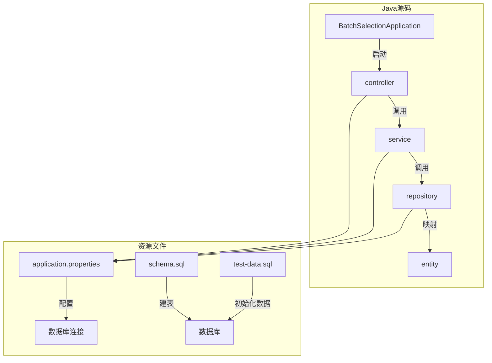
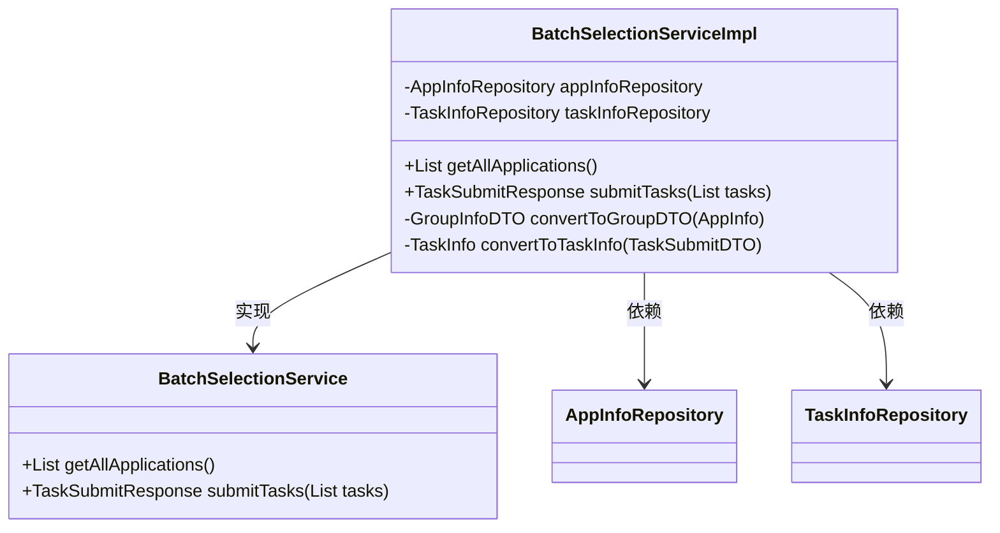
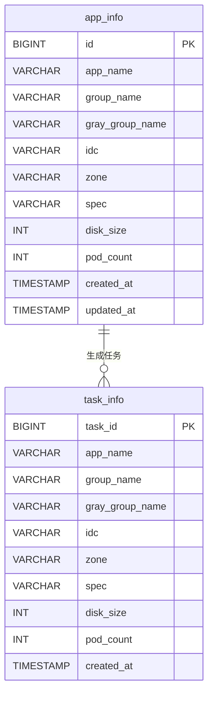
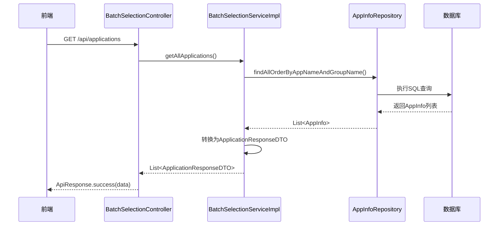
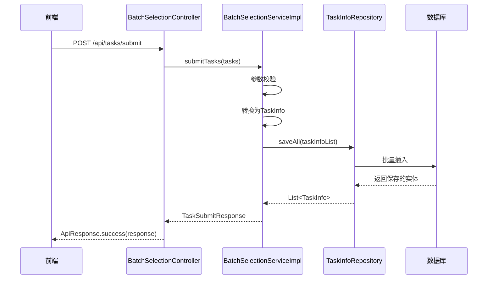

# 后端目录结构

<cite>
**本文档中引用的文件**  
- [BatchSelectionApplication.java](file://backend/src/main/java/com/example/batchselection/BatchSelectionApplication.java)
- [BatchSelectionController.java](file://backend/src/main/java/com/example/batchselection/controller/BatchSelectionController.java)
- [BatchSelectionService.java](file://backend/src/main/java/com/example/batchselection/service/BatchSelectionService.java)
- [BatchSelectionServiceImpl.java](file://backend/src/main/java/com/example/batchselection/service/impl/BatchSelectionServiceImpl.java)
- [AppInfoRepository.java](file://backend/src/main/java/com/example/batchselection/repository/AppInfoRepository.java)
- [TaskInfoRepository.java](file://backend/src/main/java/com/example/batchselection/repository/TaskInfoRepository.java)
- [AppInfo.java](file://backend/src/main/java/com/example/batchselection/entity/AppInfo.java)
- [TaskInfo.java](file://backend/src/main/java/com/example/batchselection/entity/TaskInfo.java)
- [ApiResponse.java](file://backend/src/main/java/com/example/batchselection/dto/ApiResponse.java)
- [ApplicationResponseDTO.java](file://backend/src/main/java/com/example/batchselection/dto/ApplicationResponseDTO.java)
- [BatchTaskSubmitRequest.java](file://backend/src/main/java/com/example/batchselection/dto/BatchTaskSubmitRequest.java)
- [GroupInfoDTO.java](file://backend/src/main/java/com/example/batchselection/dto/GroupInfoDTO.java)
- [TaskSubmitDTO.java](file://backend/src/main/java/com/example/batchselection/dto/TaskSubmitDTO.java)
- [TaskSubmitResponse.java](file://backend/src/main/java/com/example/batchselection/dto/TaskSubmitResponse.java)
- [application.properties](file://backend/src/main/resources/application.properties)
- [schema.sql](file://backend/src/main/resources/schema.sql)
- [test-data.sql](file://backend/src/main/resources/test-data.sql)
</cite>

## 目录

1. [项目结构](#项目结构)  
2. [核心组件分析](#核心组件分析)  
3. [MVC分层架构详解](#mvc分层架构详解)  
4. [资源文件解析](#资源文件解析)  
5. [调用链路示例](#调用链路示例)  
6. [总结](#总结)

## 项目结构

本项目采用标准的Spring Boot多层架构，后端代码位于`backend/src/main`目录下，主要分为Java源码和资源文件两大部分。

**图示来源**  
- [BatchSelectionApplication.java](file://backend/src/main/java/com/example/batchselection/BatchSelectionApplication.java)
- [BatchSelectionController.java](file://backend/src/main/java/com/example/batchselection/controller/BatchSelectionController.java)
- [BatchSelectionService.java](file://backend/src/main/java/com/example/batchselection/service/BatchSelectionService.java)
- [BatchSelectionServiceImpl.java](file://backend/src/main/java/com/example/batchselection/service/impl/BatchSelectionServiceImpl.java)
- [AppInfoRepository.java](file://backend/src/main/java/com/example/batchselection/repository/AppInfoRepository.java)
- [TaskInfoRepository.java](file://backend/src/main/java/com/example/batchselection/repository/TaskInfoRepository.java)

**本节来源**  
- [project_structure](file://project_structure)

## 核心组件分析

### 启动类
`BatchSelectionApplication.java`是Spring Boot应用的入口，使用`@SpringBootApplication`注解自动配置Spring容器和组件扫描。

**本节来源**  
- [BatchSelectionApplication.java](file://backend/src/main/java/com/example/batchselection/BatchSelectionApplication.java)

### 统一响应封装
`ApiResponse.java`定义了统一的API响应格式，包含状态码、消息和数据体，便于前后端交互。

**本节来源**  
- [ApiResponse.java](file://backend/src/main/java/com/example/batchselection/dto/ApiResponse.java)

## MVC分层架构详解

### 控制层（Controller）
`BatchSelectionController.java`负责处理HTTP请求，定义了两个核心接口：
- `GET /api/applications`：查询所有应用数据
- `POST /api/tasks/submit`：批量提交任务

控制器通过`@RequiredArgsConstructor`注入服务层，实现依赖注入，避免了显式@Autowired。

**本节来源**  
- [BatchSelectionController.java](file://backend/src/main/java/com/example/batchselection/controller/BatchSelectionController.java)

### 服务层（Service）
服务层采用接口与实现分离的设计模式：
- `BatchSelectionService.java`：定义业务接口
- `BatchSelectionServiceImpl.java`：实现具体逻辑

这种设计实现了松耦合，便于单元测试和未来扩展。

**图示来源**  
- [BatchSelectionService.java](file://backend/src/main/java/com/example/batchselection/service/BatchSelectionService.java)
- [BatchSelectionServiceImpl.java](file://backend/src/main/java/com/example/batchselection/service/impl/BatchSelectionServiceImpl.java)
- [AppInfoRepository.java](file://backend/src/main/java/com/example/batchselection/repository/AppInfoRepository.java)
- [TaskInfoRepository.java](file://backend/src/main/java/com/example/batchselection/repository/TaskInfoRepository.java)

**本节来源**  
- [BatchSelectionService.java](file://backend/src/main/java/com/example/batchselection/service/BatchSelectionService.java)
- [BatchSelectionServiceImpl.java](file://backend/src/main/java/com/example/batchselection/service/impl/BatchSelectionServiceImpl.java)

### 数据访问层（Repository）
基于Spring Data JPA实现数据访问：
- `AppInfoRepository.java`：提供应用数据的CRUD操作
- `TaskInfoRepository.java`：提供任务数据的持久化

通过自定义JPQL查询`findAllOrderByAppNameAndGroupName()`实现排序查询。

**本节来源**  
- [AppInfoRepository.java](file://backend/src/main/java/com/example/batchselection/repository/AppInfoRepository.java)
- [TaskInfoRepository.java](file://backend/src/main/java/com/example/batchselection/repository/TaskInfoRepository.java)

### 实体层（Entity）
实体类与数据库表一一映射：
- `AppInfo.java`：对应`app_info`表
- `TaskInfo.java`：对应`task_info`表

使用JPA注解如`@Entity`、`@Table`、`@Column`等进行映射配置，并通过`@PrePersist`和`@PreUpdate`自动管理时间戳。

**图示来源**  
- [AppInfo.java](file://backend/src/main/java/com/example/batchselection/entity/AppInfo.java)
- [TaskInfo.java](file://backend/src/main/java/com/example/batchselection/entity/TaskInfo.java)
- [schema.sql](file://backend/src/main/resources/schema.sql)

**本节来源**  
- [AppInfo.java](file://backend/src/main/java/com/example/batchselection/entity/AppInfo.java)
- [TaskInfo.java](file://backend/src/main/java/com/example/batchselection/entity/TaskInfo.java)

### 数据传输对象（DTO）
DTO用于前后端数据交互，避免直接暴露实体类：
- `ApplicationResponseDTO`：应用响应结构
- `TaskSubmitDTO`：任务提交请求参数
- `BatchTaskSubmitRequest`：批量任务请求包装
- `TaskSubmitResponse`：任务提交结果返回

DTO通过Lombok的`@Data`简化POJO定义，并使用JSR-303注解进行参数校验。

**本节来源**  
- [ApplicationResponseDTO.java](file://backend/src/main/java/com/example/batchselection/dto/ApplicationResponseDTO.java)
- [TaskSubmitDTO.java](file://backend/src/main/java/com/example/batchselection/dto/TaskSubmitDTO.java)
- [BatchTaskSubmitRequest.java](file://backend/src/main/java/com/example/batchselection/dto/BatchTaskSubmitRequest.java)
- [TaskSubmitResponse.java](file://backend/src/main/java/com/example/batchselection/dto/TaskSubmitResponse.java)

## 资源文件解析

### application.properties
Spring Boot配置文件，主要配置项包括：
- 服务端口：`server.port=8080`
- 数据库连接：MySQL地址、用户名、密码
- JPA配置：自动建表策略、显示SQL
- 初始化配置：自动执行`test-data.sql`

**本节来源**  
- [application.properties](file://backend/src/main/resources/application.properties)

### schema.sql
数据库初始化脚本，定义了两张核心表：
- `app_info`：应用信息表，包含索引`idx_app_group`
- `task_info`：任务信息表，包含索引`idx_created_at`

脚本使用`IF NOT EXISTS`确保幂等性。

**本节来源**  
- [schema.sql](file://backend/src/main/resources/schema.sql)

### test-data.sql
测试数据脚本，插入9条应用数据用于开发测试，并包含验证查询语句。

**本节来源**  
- [test-data.sql](file://backend/src/main/resources/test-data.sql)

## 调用链路示例

### 查询应用数据链路

**图示来源**  
- [BatchSelectionController.java](file://backend/src/main/java/com/example/batchselection/controller/BatchSelectionController.java#L33-L39)
- [BatchSelectionServiceImpl.java](file://backend/src/main/java/com/example/batchselection/service/impl/BatchSelectionServiceImpl.java#L34-L62)
- [AppInfoRepository.java](file://backend/src/main/java/com/example/batchselection/repository/AppInfoRepository.java#L18-L19)

### 提交任务链路

**图示来源**  
- [BatchSelectionController.java](file://backend/src/main/java/com/example/batchselection/controller/BatchSelectionController.java#L49-L54)
- [BatchSelectionServiceImpl.java](file://backend/src/main/java/com/example/batchselection/service/impl/BatchSelectionServiceImpl.java#L66-L93)
- [TaskInfoRepository.java](file://backend/src/main/java/com/example/batchselection/repository/TaskInfoRepository.java#L11)

## 总结

本系统采用标准的Spring Boot MVC分层架构，各层职责清晰：
- **Controller层**：处理HTTP请求，返回统一响应
- **Service层**：实现业务逻辑，服务接口与实现分离
- **Repository层**：基于JPA实现数据访问，简化CRUD
- **Entity层**：实体类与数据库表映射
- **DTO层**：前后端数据传输对象，保障数据安全

通过合理的分层设计和依赖注入，系统具有良好的可维护性和扩展性。