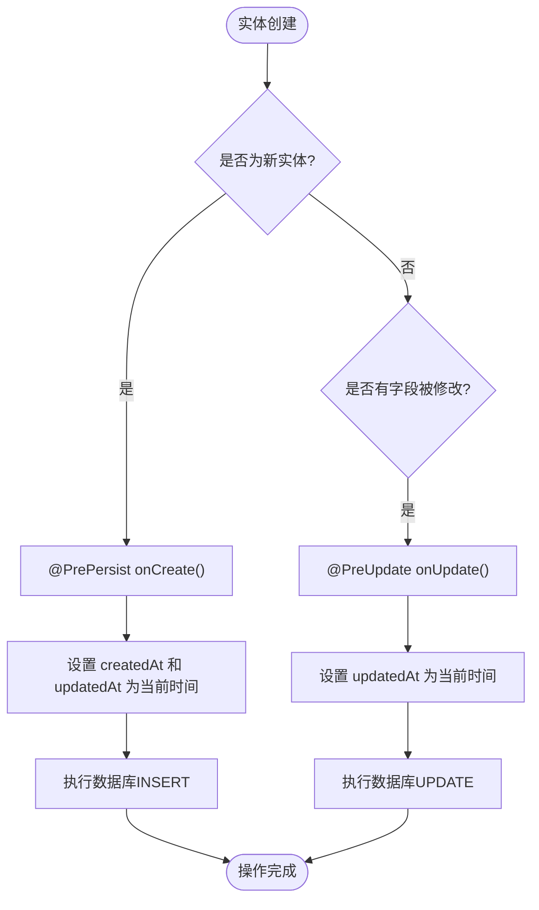
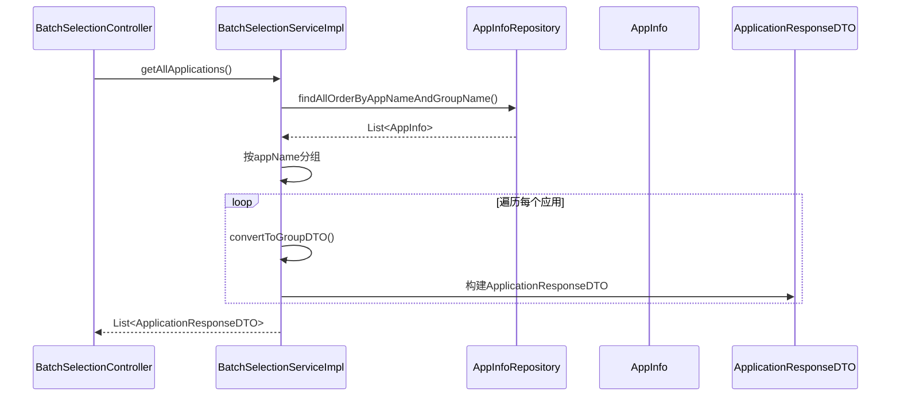
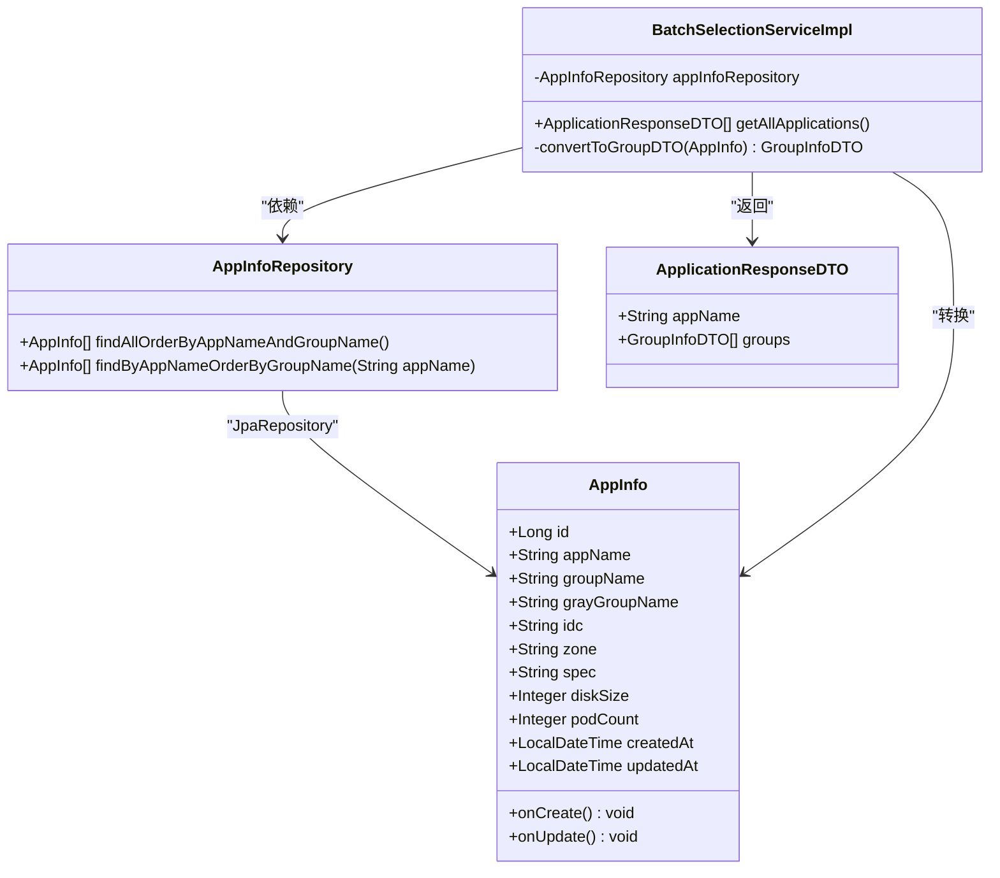

# AppInfo实体类

<cite>
**Referenced Files in This Document**   
- [AppInfo.java](file://backend/src/main/java/com/example/batchselection/entity/AppInfo.java)
- [schema.sql](file://backend/src/main/resources/schema.sql)
- [ApplicationResponseDTO.java](file://backend/src/main/java/com/example/batchselection/dto/ApplicationResponseDTO.java)
- [BatchSelectionServiceImpl.java](file://backend/src/main/java/com/example/batchselection/service/impl/BatchSelectionServiceImpl.java)
- [AppInfoRepository.java](file://backend/src/main/java/com/example/batchselection/repository/AppInfoRepository.java)
</cite>

## 目录
1. [AppInfo实体类概述](#appinfo实体类概述)
2. [字段属性与数据库映射](#字段属性与数据库映射)
3. [JPA注解详解](#jpa注解详解)
4. [Lombok注解应用](#lombok注解应用)
5. [生命周期回调方法](#生命周期回调方法)
6. [与task_info表的对比分析](#与task_info表的对比分析)
7. [服务层使用模式](#服务层使用模式)
8. [实体关系图](#实体关系图)

## AppInfo实体类概述

`AppInfo`实体类是系统中用于存储应用基础配置数据的核心数据模型，位于`com.example.batchselection.entity`包中。该类通过JPA注解与数据库中的`app_info`表进行映射，承载了应用的静态配置信息，包括应用名称、分组、机房、规格等关键属性。作为可编辑的配置数据，`AppInfo`支持数据的增删改查操作，并通过时间戳字段追踪数据的创建和更新状态。

**Section sources**
- [AppInfo.java](file://backend/src/main/java/com/example/batchselection/entity/AppInfo.java#L1-L62)

## 字段属性与数据库映射

`AppInfo`实体类的每个字段都与`schema.sql`中的`app_info`表结构精确对应，实现了Java对象与数据库表的双向映射。

### 字段详细说明

| 字段名 | Java类型 | 数据库类型 | 约束条件 | 业务含义 |
|--------|---------|-----------|----------|----------|
| id | Long | BIGINT | 主键，自增 | 唯一标识符，主键ID |
| appName | String | VARCHAR(64) | NOT NULL | 应用名称，用于标识应用系统 |
| groupName | String | VARCHAR(64) | NOT NULL | 分组名称，表示应用的部署分组 |
| grayGroupName | String | VARCHAR(64) | NULL | 灰度分组名称，用于灰度发布场景 |
| idc | String | VARCHAR(32) | NOT NULL | 机房标识，表示物理部署位置 |
| zone | String | VARCHAR(32) | NOT NULL | 分区标识，表示逻辑分区 |
| spec | String | VARCHAR(64) | NOT NULL | 参数规格，定义应用的资源配置 |
| diskSize | Integer | INT | NOT NULL | 硬盘大小(GB)，表示存储容量 |
| podCount | Integer | INT | NOT NULL | Pod数量，表示应用实例数 |
| createdAt | LocalDateTime | TIMESTAMP | NOT NULL, DEFAULT CURRENT_TIMESTAMP | 创建时间，记录数据创建时刻 |
| updatedAt | LocalDateTime | TIMESTAMP | NOT NULL, DEFAULT CURRENT_TIMESTAMP ON UPDATE CURRENT_TIMESTAMP | 更新时间，记录数据最后修改时刻 |

**Section sources**
- [AppInfo.java](file://backend/src/main/java/com/example/batchselection/entity/AppInfo.java#L17-L49)
- [schema.sql](file://backend/src/main/resources/schema.sql#L10-L20)

## JPA注解详解

`AppInfo`实体类使用了多种JPA注解来定义其与数据库的映射关系和行为特性。

### @Entity与@Table注解

`@Entity`注解标识`AppInfo`类为一个JPA实体，使其能够被持久化框架管理。`@Table`注解进一步指定了该实体映射到的数据库表名`app_info`，并定义了联合索引`idx_app_group`，该索引基于`app_name`和`group_name`两个字段，显著提升了按应用和分组查询的性能。

```mermaid
erDiagram
app_info {
BIGINT id PK
VARCHAR(64) app_name NOT NULL
VARCHAR(64) group_name NOT NULL
VARCHAR(64) gray_group_name
VARCHAR(32) idc NOT NULL
VARCHAR(32) zone NOT NULL
VARCHAR(64) spec NOT NULL
INT disk_size NOT NULL
INT pod_count NOT NULL
TIMESTAMP created_at NOT NULL
TIMESTAMP updated_at NOT NULL
}
INDEX idx_app_group ON app_info(app_name, group_name)
```

**Diagram sources**
- [AppInfo.java](file://backend/src/main/java/com/example/batchselection/entity/AppInfo.java#L11-L14)
- [schema.sql](file://backend/src/main/resources/schema.sql#L21)

### @Id与@GeneratedValue注解

`@Id`注解将`id`字段标记为主键，`@GeneratedValue(strategy = GenerationType.IDENTITY)`注解配置了主键的生成策略为自增（IDENTITY），这意味着数据库会自动为每条新记录生成唯一的递增ID，无需应用程序手动指定。

### @Column注解

`@Column`注解用于精细化配置每个字段的数据库映射属性：
- `name`：指定数据库列名，实现Java驼峰命名与数据库下划线命名的转换
- `nullable`：定义字段是否允许为空，`false`表示NOT NULL约束
- `length`：指定字符串字段的最大长度
- `updatable`：在`createdAt`字段上设置为`false`，确保创建时间在更新时不会被修改

**Section sources**
- [AppInfo.java](file://backend/src/main/java/com/example/batchselection/entity/AppInfo.java#L11-L49)

## Lombok注解应用

`@Data`注解是Lombok库提供的一个便捷注解，它自动为`AppInfo`类生成了以下样板代码：
- 所有字段的getter和setter方法
- `toString()`方法，便于调试和日志输出
- `equals()`和`hashCode()`方法，用于对象比较
- 所有非final字段的构造函数

这极大地减少了代码量，提高了开发效率，同时保持了代码的可读性和简洁性。

**Section sources**
- [AppInfo.java](file://backend/src/main/java/com/example/batchselection/entity/AppInfo.java#L10)

## 生命周期回调方法

`AppInfo`实体类通过JPA的生命周期回调注解实现了自动化的时间戳管理。

### @PrePersist注解

`@PrePersist`注解标记的`onCreate()`方法在实体首次被持久化（即插入数据库）之前自动执行。该方法将`createdAt`和`updatedAt`字段都设置为当前时间，确保新记录的创建时间被正确记录。

### @PreUpdate注解

`@PreUpdate`注解标记的`onUpdate()`方法在实体被更新（即执行UPDATE操作）之前自动执行。该方法仅更新`updatedAt`字段为当前时间，从而精确追踪数据的最后修改时间。

这种设计模式避免了在业务逻辑中手动管理时间戳的繁琐和潜在错误，保证了数据一致性。



**Diagram sources**
- [AppInfo.java](file://backend/src/main/java/com/example/batchselection/entity/AppInfo.java#L51-L60)

**Section sources**
- [AppInfo.java](file://backend/src/main/java/com/example/batchselection/entity/AppInfo.java#L51-L60)

## 与task_info表的对比分析

`app_info`表与`task_info`表在系统中扮演着不同的角色，体现了静态配置与动态任务的分离设计。

### 核心差异

| 特性 | app_info表 | task_info表 |
|------|-----------|------------|
| **数据性质** | 静态配置数据，可编辑 | 动态任务数据，只读（创建后不修改） |
| **时间追踪** | 支持`created_at`和`updated_at` | 仅支持`created_at` |
| **主键** | `id` (BIGINT) | `task_id` (BIGINT) |
| **索引** | 联合索引`idx_app_group` (app_name, group_name) | 单列索引`idx_created_at` (created_at) |
| **业务用途** | 存储应用的基础配置信息 | 记录批量任务的提交历史 |

`app_info`表的设计强调了数据的可维护性和查询效率，支持对配置数据的更新操作，并通过`updated_at`字段追踪变更历史。而`task_info`表则更侧重于记录不可变的任务事件，其设计更简单，主要用于审计和历史查询。

**Section sources**
- [schema.sql](file://backend/src/main/resources/schema.sql#L9-L37)

## 服务层使用模式

`AppInfo`实体在服务层中被`AppInfoRepository`接口操作，并通过`BatchSelectionServiceImpl`类进行业务逻辑处理。

### 数据查询与转换

服务层通过`AppInfoRepository.findAllOrderByAppNameAndGroupName()`方法查询所有应用数据，并按应用名和分组名排序。查询结果随后被转换为前端友好的DTO结构。



**Diagram sources**
- [BatchSelectionServiceImpl.java](file://backend/src/main/java/com/example/batchselection/service/impl/BatchSelectionServiceImpl.java#L34-L62)
- [AppInfoRepository.java](file://backend/src/main/java/com/example/batchselection/repository/AppInfoRepository.java#L17-L18)

### DTO映射关系

`AppInfo`实体与`ApplicationResponseDTO`之间存在明确的映射关系。服务层的`convertToGroupDTO()`方法负责将`AppInfo`实体转换为`GroupInfoDTO`，最终构建成包含应用名和分组列表的`ApplicationResponseDTO`，实现了领域模型与传输模型的分离。

**Section sources**
- [BatchSelectionServiceImpl.java](file://backend/src/main/java/com/example/batchselection/service/impl/BatchSelectionServiceImpl.java#L98-L109)
- [ApplicationResponseDTO.java](file://backend/src/main/java/com/example/batchselection/dto/ApplicationResponseDTO.java#L10-L14)

## 实体关系图



**Diagram sources**
- [AppInfo.java](file://backend/src/main/java/com/example/batchselection/entity/AppInfo.java#L15-L60)
- [AppInfoRepository.java](file://backend/src/main/java/com/example/batchselection/repository/AppInfoRepository.java#L8-L24)
- [BatchSelectionServiceImpl.java](file://backend/src/main/java/com/example/batchselection/service/impl/BatchSelectionServiceImpl.java#L30-L32)
- [ApplicationResponseDTO.java](file://backend/src/main/java/com/example/batchselection/dto/ApplicationResponseDTO.java#L10-L14)