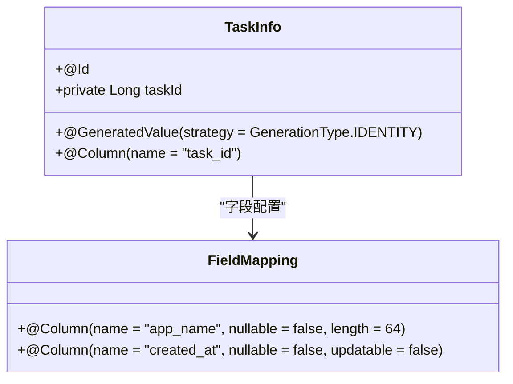
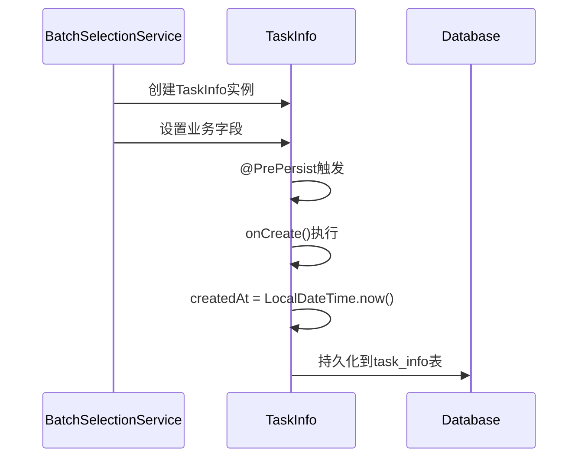
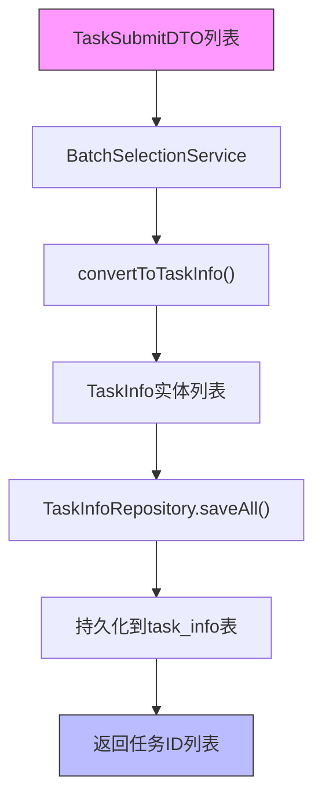

# TaskInfo实体类

<cite>
**Referenced Files in This Document**   
- [TaskInfo.java](file://backend/src/main/java/com/example/batchselection/entity/TaskInfo.java)
- [schema.sql](file://backend/src/main/resources/schema.sql)
- [TaskSubmitDTO.java](file://backend/src/main/java/com/example/batchselection/dto/TaskSubmitDTO.java)
- [TaskInfoRepository.java](file://backend/src/main/java/com/example/batchselection/repository/TaskInfoRepository.java)
- [AppInfo.java](file://backend/src/main/java/com/example/batchselection/entity/AppInfo.java)
- [BatchSelectionServiceImpl.java](file://backend/src/main/java/com/example/batchselection/service/impl/BatchSelectionServiceImpl.java)
</cite>

## 目录
1. [简介](#简介)
2. [字段定义与数据库映射](#字段定义与数据库映射)
3. [JPA注解配置](#jpa注解配置)
4. [生命周期回调方法](#生命周期回调方法)
5. [与AppInfo实体的对比](#与appinfo实体的对比)
6. [在批量提交流程中的应用](#在批量提交流程中的应用)
7. [总结](#总结)

## 简介
`TaskInfo`实体类是批量勾选信息管理系统中用于记录任务提交历史的核心数据载体。该实体设计为只写的历史记录，用于持久化用户提交的批量任务数据。每个任务记录包含应用名称、分组信息、部署规格、资源需求等关键属性，并通过JPA注解精确映射到数据库表`task_info`。实体采用Lombok注解简化代码，并通过`@PrePersist`生命周期回调确保创建时间的准确性。

**Section sources**
- [TaskInfo.java](file://backend/src/main/java/com/example/batchselection/entity/TaskInfo.java#L7-L52)

## 字段定义与数据库映射
`TaskInfo`实体的每个字段都经过精心设计，确保与数据库表结构精确对应，并满足业务约束要求。

### 核心字段映射表
| 字段名 | 数据库类型 | Java类型 | 约束规则 | 业务语义 |
|--------|-----------|---------|---------|---------|
| task_id | BIGINT AUTO_INCREMENT | Long | 主键，自增 | 任务唯一标识符 |
| app_name | VARCHAR(64) | String | 非空，长度64 | 应用名称 |
| group_name | VARCHAR(64) | String | 非空，长度64 | 分组名称 |
| gray_group_name | VARCHAR(64) | String | 可为空，长度64 | 灰度分组名称 |
| idc | VARCHAR(32) | String | 非空，长度32 | 机房位置 |
| zone | VARCHAR(32) | String | 非空，长度32 | 分区信息 |
| spec | VARCHAR(64) | String | 非空，长度64 | 参数规格 |
| disk_size | INT | Integer | 非空 | 硬盘大小（GB） |
| pod_count | INT | Integer | 非空 | Pod数量 |
| created_at | TIMESTAMP | LocalDateTime | 非空，不可更新 | 任务创建时间 |

**Section sources**
- [TaskInfo.java](file://backend/src/main/java/com/example/batchselection/entity/TaskInfo.java#L16-L47)
- [schema.sql](file://backend/src/main/resources/schema.sql#L24-L37)

## JPA注解配置
`TaskInfo`实体通过一系列JPA注解实现与数据库的精确映射和优化。

### 实体与表配置
```mermaid
classDiagram
class TaskInfo {
+Long taskId
+String appName
+String groupName
+String grayGroupName
+String idc
+String zone
+String spec
+Integer diskSize
+Integer podCount
+LocalDateTime createdAt
+onCreate() void
}
note right of TaskInfo
@Entity
@Table(name = "task_info")
@Index(name = "idx_created_at")
end note
```

**Diagram sources**
- [TaskInfo.java](file://backend/src/main/java/com/example/batchselection/entity/TaskInfo.java#L11-L14)

#### @Entity与@Table注解
- `@Entity`：声明`TaskInfo`为JPA实体类，使其可被Hibernate管理
- `@Table(name = "task_info")`：指定实体映射的数据库表名为`task_info`
- `@Index(name = "idx_created_at", columnList = "created_at")`：在`created_at`字段上创建名为`idx_created_at`的索引，显著优化基于时间范围的查询性能

#### 主键与字段映射


**Diagram sources**
- [TaskInfo.java](file://backend/src/main/java/com/example/batchselection/entity/TaskInfo.java#L17-L47)

- `@Id`与`@GeneratedValue(strategy = GenerationType.IDENTITY)`：联合使用实现数据库自增主键策略，由数据库自动生成`task_id`
- `@Column`注解：精确控制每个字段的数据库映射，包括列名、可空性、长度等约束
- `updatable = false`：特别应用于`created_at`字段，确保创建时间一旦设置便不可更改，保证数据完整性

**Section sources**
- [TaskInfo.java](file://backend/src/main/java/com/example/batchselection/entity/TaskInfo.java#L17-L47)

## 生命周期回调方法
`TaskInfo`实体通过JPA生命周期回调机制确保数据的准确性和一致性。

### @PrePersist回调机制


**Diagram sources**
- [TaskInfo.java](file://backend/src/main/java/com/example/batchselection/entity/TaskInfo.java#L49-L51)
- [BatchSelectionServiceImpl.java](file://backend/src/main/java/com/example/batchselection/service/impl/BatchSelectionServiceImpl.java#L80-L84)

- `@PrePersist`：JPA生命周期注解，在实体首次持久化到数据库之前自动调用
- `onCreate()`方法：被`@PrePersist`注解标记的保护方法，在保存前自动填充`createdAt`字段为当前时间
- 优势：确保任务提交时间的准确性，避免依赖客户端时间或手动设置，实现服务端时间统一

**Section sources**
- [TaskInfo.java](file://backend/src/main/java/com/example/batchselection/entity/TaskInfo.java#L49-L51)

## 与AppInfo实体的对比
`TaskInfo`与`AppInfo`实体在设计上存在显著差异，反映了不同的业务用途。

### 实体对比分析
```mermaid
classDiagram
class TaskInfo {
+Long taskId
+String appName
+String groupName
+String grayGroupName
+String idc
+String zone
+String spec
+Integer diskSize
+Integer podCount
+LocalDateTime createdAt
}
class AppInfo {
+Long id
+String appName
+String groupName
+String grayGroupName
+String idc
+String zone
+String spec
+Integer diskSize
+Integer podCount
+LocalDateTime createdAt
+LocalDateTime updatedAt
}
note right of TaskInfo
只写历史记录
无更新时间
无更新回调
end note
note left of AppInfo
可读写配置
有更新时间
有@PreUpdate回调
end note
```

**Diagram sources**
- [TaskInfo.java](file://backend/src/main/java/com/example/batchselection/entity/TaskInfo.java#L7-L52)
- [AppInfo.java](file://backend/src/main/java/com/example/batchselection/entity/AppInfo.java#L7-L62)

| 特性 | TaskInfo | AppInfo |
|------|--------|--------|
| **用途** | 任务提交历史记录 | 应用配置数据 |
| **写模式** | 只写（一次写入） | 可读写（可更新） |
| **更新时间** | 无 | 有`updated_at`字段 |
| **生命周期回调** | 仅`@PrePersist` | `@PrePersist`和`@PreUpdate` |
| **数据特性** | 不可变历史记录 | 可变配置数据 |

**Section sources**
- [TaskInfo.java](file://backend/src/main/java/com/example/batchselection/entity/TaskInfo.java#L7-L52)
- [AppInfo.java](file://backend/src/main/java/com/example/batchselection/entity/AppInfo.java#L7-L62)

## 在批量提交流程中的应用
`TaskInfo`实体在批量任务提交流程中扮演着核心角色，从DTO转换到数据持久化。

### 批量提交流程


**Diagram sources**
- [TaskSubmitDTO.java](file://backend/src/main/java/com/example/batchselection/dto/TaskSubmitDTO.java#L11-L38)
- [BatchSelectionServiceImpl.java](file://backend/src/main/java/com/example/batchselection/service/impl/BatchSelectionServiceImpl.java#L114-L125)
- [TaskInfoRepository.java](file://backend/src/main/java/com/example/batchselection/repository/TaskInfoRepository.java#L10-L12)

#### DTO到实体的转换
- `TaskSubmitDTO`：前端提交任务的传输对象，包含验证注解确保数据合法性
- `convertToTaskInfo()`方法：服务层的私有方法，将DTO逐字段映射到`TaskInfo`实体
- 转换过程：创建新的`TaskInfo`实例，并通过setter方法复制所有业务字段

#### 数据持久化
- `TaskInfoRepository`：继承`JpaRepository`，提供`saveAll()`方法实现批量保存
- 批量操作：使用`saveAll()`一次性持久化多个`TaskInfo`实体，提高性能
- 主键生成：数据库自动生成`task_id`，并返回包含新ID的实体列表

**Section sources**
- [TaskSubmitDTO.java](file://backend/src/main/java/com/example/batchselection/dto/TaskSubmitDTO.java#L11-L38)
- [BatchSelectionServiceImpl.java](file://backend/src/main/java/com/example/batchselection/service/impl/BatchSelectionServiceImpl.java#L80-L84)
- [TaskInfoRepository.java](file://backend/src/main/java/com/example/batchselection/repository/TaskInfoRepository.java#L10-L12)

## 总结
`TaskInfo`实体类是批量任务提交系统的关键组成部分，其设计体现了清晰的职责分离和数据完整性原则。作为只写的历史记录实体，它通过JPA注解精确映射到`task_info`表，利用`@PrePersist`回调确保创建时间的准确性。与可变的`AppInfo`实体相比，`TaskInfo`专注于记录不可变的任务提交事实，为系统提供了可靠的操作审计和历史追溯能力。在批量提交流程中，它作为DTO与数据库之间的桥梁，通过`TaskInfoRepository`实现高效的数据持久化，构成了系统数据流的核心环节。

**Section sources**
- [TaskInfo.java](file://backend/src/main/java/com/example/batchselection/entity/TaskInfo.java#L7-L52)
- [schema.sql](file://backend/src/main/resources/schema.sql#L24-L37)