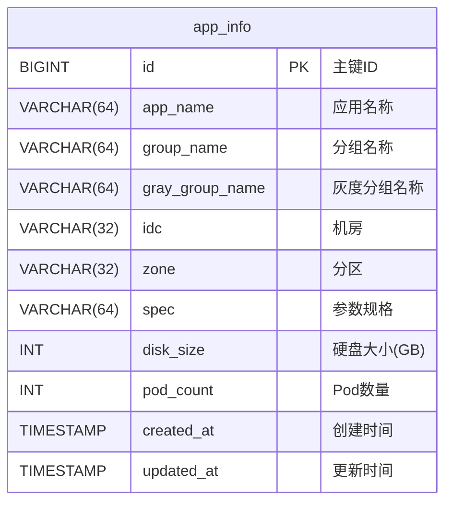
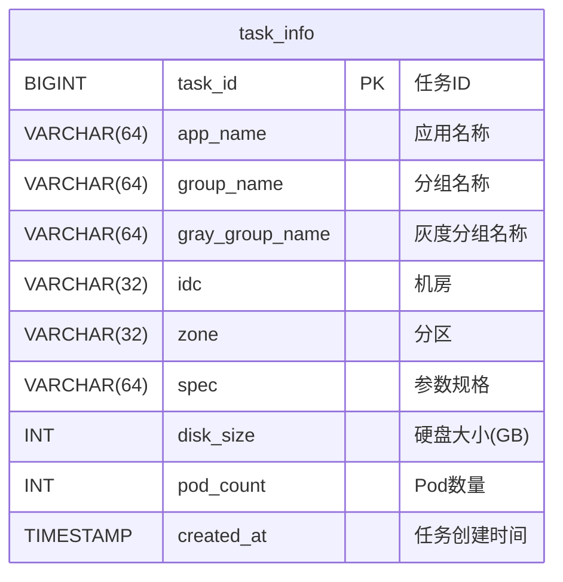
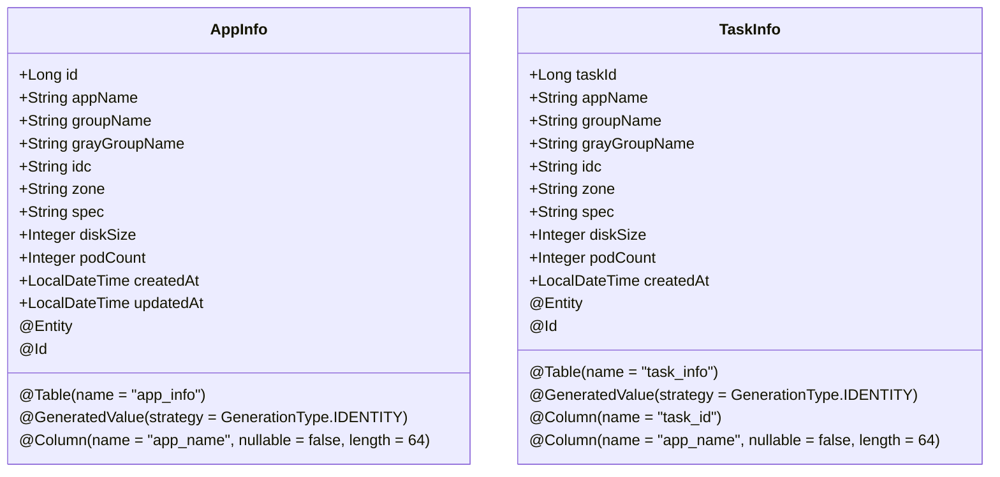
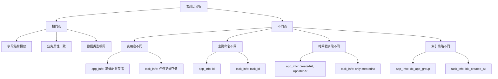
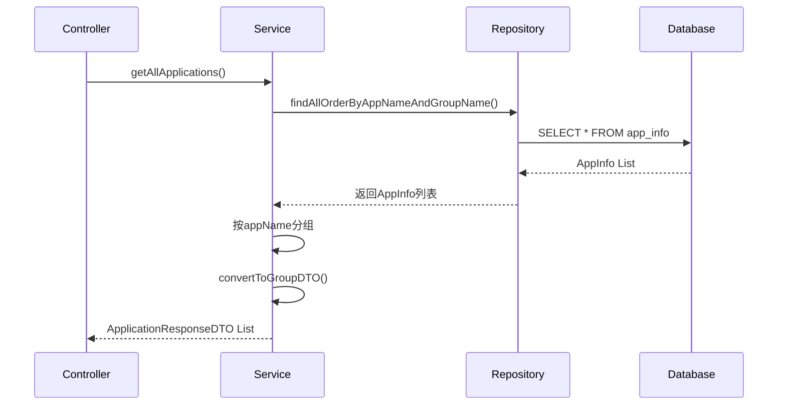
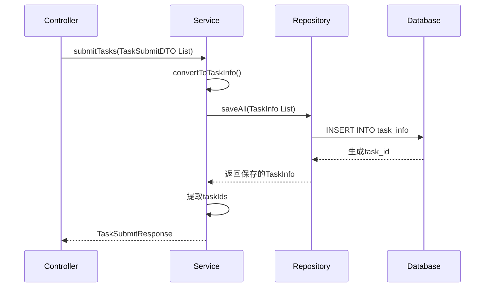

# 实体模型

<cite>
**Referenced Files in This Document**   
- [AppInfo.java](file://backend/src/main/java/com/example/batchselection/entity/AppInfo.java)
- [TaskInfo.java](file://backend/src/main/java/com/example/batchselection/entity/TaskInfo.java)
- [schema.sql](file://backend/src/main/resources/schema.sql)
- [AppInfoRepository.java](file://backend/src/main/java/com/example/batchselection/repository/AppInfoRepository.java)
- [TaskInfoRepository.java](file://backend/src/main/java/com/example/batchselection/repository/TaskInfoRepository.java)
- [BatchSelectionServiceImpl.java](file://backend/src/main/java/com/example/batchselection/service/impl/BatchSelectionServiceImpl.java)
</cite>

## 目录
1. [AppInfo实体类详解](#appinfo实体类详解)
2. [TaskInfo实体类详解](#taskinfo实体类详解)
3. [数据库表结构映射](#数据库表结构映射)
4. [JPA注解使用说明](#jpa注解使用说明)
5. [Lombok注解便利性](#lombok注解便利性)
6. [app_info与task_info表对比](#app_info与task_info表对比)
7. [服务层数据转换](#服务层数据转换)
8. [实体类设计最佳实践](#实体类设计最佳实践)

## AppInfo实体类详解

`AppInfo`实体类用于表示应用配置信息，是系统中存储基础配置数据的核心实体。该类通过JPA注解与数据库中的`app_info`表进行映射，包含了应用的完整配置信息。

实体类中定义了多个字段，包括主键`id`、应用名称`appName`、分组名称`groupName`、灰度分组名称`grayGroupName`、机房`idc`、分区`zone`、参数规格`spec`、硬盘大小`diskSize`和Pod数量`podCount`等业务属性。特别地，`AppInfo`类还包含两个时间戳字段：`createdAt`和`updatedAt`，分别记录了记录的创建时间和最后更新时间。

该实体类实现了自动时间戳管理功能，通过`@PrePersist`和`@PreUpdate`注解方法，在实体持久化和更新时自动设置相应的时间戳值，确保了数据的时效性和可追溯性。

**Section sources**
- [AppInfo.java](file://backend/src/main/java/com/example/batchselection/entity/AppInfo.java#L1-L62)

## TaskInfo实体类详解

`TaskInfo`实体类用于表示提交的任务信息，是系统中记录任务提交的核心实体。该类通过JPA注解与数据库中的`task_info`表进行映射，用于存储用户提交的批量选择任务。

实体类中定义了与`AppInfo`相似的业务字段，包括任务ID`taskId`、应用名称`appName`、分组名称`groupName`、灰度分组名称`grayGroupName`、机房`idc`、分区`zone`、参数规格`spec`、硬盘大小`diskSize`和Pod数量`podCount`等。与`AppInfo`不同的是，`TaskInfo`的主键字段命名为`taskId`而非`id`，并在数据库中对应`task_id`列。

`TaskInfo`类仅包含`createdAt`时间戳字段，用于记录任务的创建时间。该实体类通过`@PrePersist`注解方法，在任务创建时自动设置创建时间，简化了时间管理逻辑。

**Section sources**
- [TaskInfo.java](file://backend/src/main/java/com/example/batchselection/entity/TaskInfo.java#L1-L54)

## 数据库表结构映射

### app_info表结构

`app_info`表是系统的基础配置表，用于存储应用的静态配置信息。表结构设计遵循规范化原则，各字段具有明确的业务含义和数据约束。

**Diagram sources**
- [schema.sql](file://backend/src/main/resources/schema.sql#L9-L22)

### task_info表结构

`task_info`表是系统的任务记录表，用于存储用户提交的批量选择任务。表结构设计侧重于任务的创建和追踪，支持高效的任务查询和管理。

**Diagram sources**
- [schema.sql](file://backend/src/main/resources/schema.sql#L24-L37)

## JPA注解使用说明

### 核心JPA注解

实体类中使用了多种JPA注解来定义与数据库的映射关系：

- `@Entity`：标识类为JPA实体，将被持久化到数据库
- `@Table`：指定实体对应的数据库表名和索引配置
- `@Id`：标识主键字段
- `@GeneratedValue`：定义主键生成策略
- `@Column`：配置字段与数据库列的映射关系

**Diagram sources**
- [AppInfo.java](file://backend/src/main/java/com/example/batchselection/entity/AppInfo.java#L7-L62)
- [TaskInfo.java](file://backend/src/main/java/com/example/batchselection/entity/TaskInfo.java#L7-L54)

### 主键生成策略

两个实体类均使用`GenerationType.IDENTITY`策略生成主键，这意味着主键值由数据库自动生成。这种策略适用于支持自增主键的数据库（如MySQL），确保了主键的唯一性和连续性。

### 字段映射配置

`@Column`注解用于精细化控制字段与数据库列的映射关系，主要配置包括：
- `name`：指定数据库列名
- `nullable`：定义是否允许为空
- `length`：设置字符串字段的最大长度
- `updatable`：控制字段是否可更新

**Section sources**
- [AppInfo.java](file://backend/src/main/java/com/example/batchselection/entity/AppInfo.java#L7-L62)
- [TaskInfo.java](file://backend/src/main/java/com/example/batchselection/entity/TaskInfo.java#L7-L54)

## Lombok注解便利性

实体类使用了Lombok的`@Data`注解，极大地简化了代码编写。该注解自动生成了以下方法：
- 所有字段的getter方法
- 所有字段的setter方法
- `toString()`方法
- `equals()`和`hashCode()`方法

通过使用`@Data`注解，避免了大量样板代码的编写，使实体类代码更加简洁和易读。同时，减少了手动编写这些方法可能引入的错误，提高了代码质量和开发效率。

**Section sources**
- [AppInfo.java](file://backend/src/main/java/com/example/batchselection/entity/AppInfo.java#L10)
- [TaskInfo.java](file://backend/src/main/java/com/example/batchselection/entity/TaskInfo.java#L10)

## app_info与task_info表对比

### 主要异同点

**Diagram sources**
- [AppInfo.java](file://backend/src/main/java/com/example/batchselection/entity/AppInfo.java#L1-L62)
- [TaskInfo.java](file://backend/src/main/java/com/example/batchselection/entity/TaskInfo.java#L1-L54)
- [schema.sql](file://backend/src/main/resources/schema.sql#L9-L37)

### 详细对比分析

| 对比维度 | app_info表 | task_info表 |
|---------|-----------|-----------|
| **用途** | 存储基础配置数据 | 记录提交的任务 |
| **主键** | id (自增) | task_id (自增) |
| **时间戳** | createdAt, updatedAt | createdAt |
| **索引** | idx_app_group (app_name, group_name) | idx_created_at (created_at) |
| **更新频率** | 相对稳定，偶尔更新 | 频繁插入，基本不更新 |
| **数据量** | 相对较小，稳定 | 可能较大，持续增长 |

**Section sources**
- [AppInfo.java](file://backend/src/main/java/com/example/batchselection/entity/AppInfo.java#L1-L62)
- [TaskInfo.java](file://backend/src/main/java/com/example/batchselection/entity/TaskInfo.java#L1-L54)
- [schema.sql](file://backend/src/main/resources/schema.sql#L9-L37)

## 服务层数据转换

实体类在服务层的数据转换中扮演着重要角色，作为DTO（数据传输对象）与数据库之间的桥梁。

### 数据查询转换

在查询应用数据时，`AppInfo`实体从数据库中读取数据，然后在`BatchSelectionServiceImpl`中被转换为`ApplicationResponseDTO`和`GroupInfoDTO`，以适应前端的展示需求。

**Diagram sources**
- [BatchSelectionServiceImpl.java](file://backend/src/main/java/com/example/batchselection/service/impl/BatchSelectionServiceImpl.java#L33-L62)
- [AppInfo.java](file://backend/src/main/java/com/example/batchselection/entity/AppInfo.java#L1-L62)

### 数据提交转换

在提交任务时，`TaskSubmitDTO`从API接收数据，然后在服务层被转换为`TaskInfo`实体，最后通过JPA实现持久化。

**Diagram sources**
- [BatchSelectionServiceImpl.java](file://backend/src/main/java/com/example/batchselection/service/impl/BatchSelectionServiceImpl.java#L64-L93)
- [TaskInfo.java](file://backend/src/main/java/com/example/batchselection/entity/TaskInfo.java#L1-L54)

### 自动化持久化

通过JPA的`JpaRepository`接口，实体类实现了自动化的CRUD操作。`AppInfoRepository`和`TaskInfoRepository`继承了`JpaRepository`，获得了基本的增删改查功能，同时还可以定义自定义查询方法。

**Section sources**
- [AppInfoRepository.java](file://backend/src/main/java/com/example/batchselection/repository/AppInfoRepository.java#L1-L26)
- [TaskInfoRepository.java](file://backend/src/main/java/com/example/batchselection/repository/TaskInfoRepository.java#L1-L13)
- [BatchSelectionServiceImpl.java](file://backend/src/main/java/com/example/batchselection/service/impl/BatchSelectionServiceImpl.java#L31-L32)

## 实体类设计最佳实践

### 字段命名规范

实体类字段命名应遵循以下规范：
- 使用驼峰命名法（camelCase）
- 字段名应具有明确的业务含义
- 避免使用缩写，除非是广泛认可的术语
- 保持命名一致性，相似概念使用相似的命名模式

### 数据类型选择

数据类型选择应考虑以下因素：
- **精度需求**：根据业务需求选择合适的数据类型
- **存储效率**：在满足需求的前提下选择最小的数据类型
- **可读性**：选择易于理解和维护的数据类型
- **扩展性**：考虑未来可能的业务扩展需求

### 索引优化

索引设计应遵循以下原则：
- 为频繁查询的字段创建索引
- 考虑复合索引的使用场景
- 避免过度索引，因为索引会增加写操作的开销
- 定期评估索引的有效性，移除不必要的索引

### 时间戳管理

时间戳字段的设计建议：
- 对于需要追踪修改历史的实体，使用`createdAt`和`updatedAt`两个字段
- 使用数据库或实体生命周期回调自动管理时间戳
- 考虑时区问题，统一使用UTC时间或业务所在时区
- 对于只记录创建时间的场景，仅保留`createdAt`字段

### 注解使用建议

JPA注解使用建议：
- 明确指定表名和列名，避免依赖默认命名规则
- 合理设置字段约束（nullable、length等）
- 为频繁查询的字段组合创建复合索引
- 使用适当的主键生成策略

**Section sources**
- [AppInfo.java](file://backend/src/main/java/com/example/batchselection/entity/AppInfo.java#L1-L62)
- [TaskInfo.java](file://backend/src/main/java/com/example/batchselection/entity/TaskInfo.java#L1-L54)
- [schema.sql](file://backend/src/main/resources/schema.sql#L9-L37)