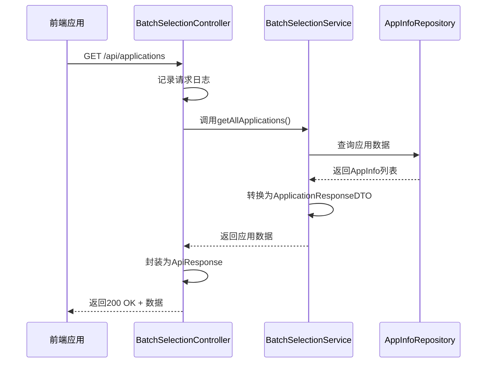
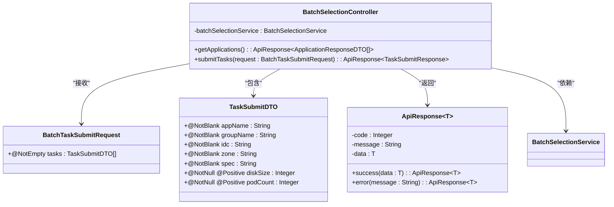
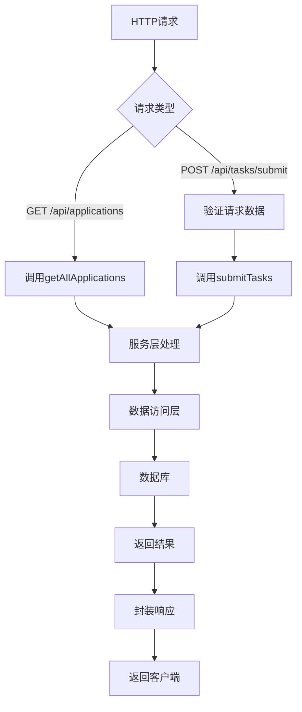
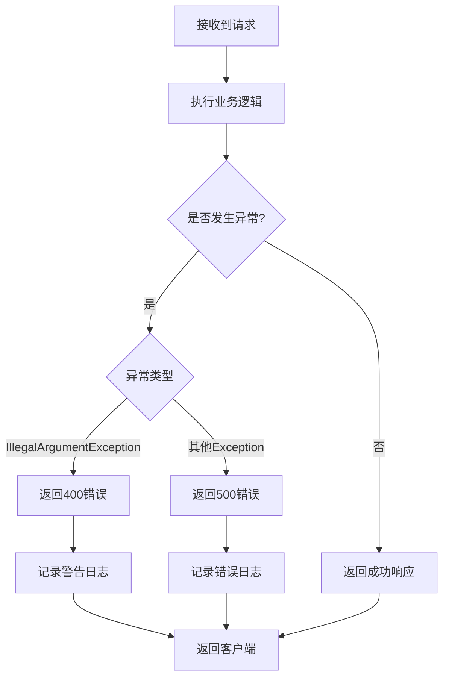
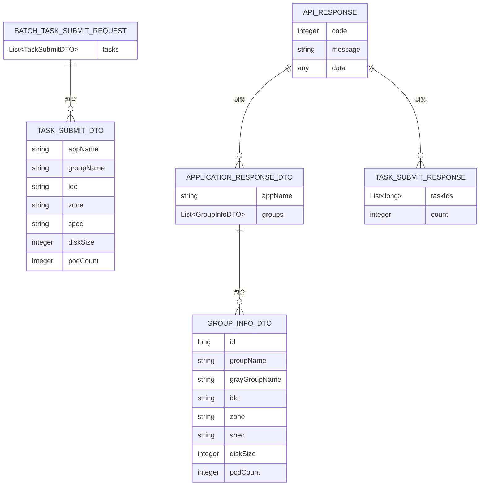

# 控制层

<cite>
**Referenced Files in This Document**   
- [BatchSelectionController.java](file://backend/src/main/java/com/example/batchselection/controller/BatchSelectionController.java)
- [BatchSelectionServiceImpl.java](file://backend/src/main/java/com/example/batchselection/service/impl/BatchSelectionServiceImpl.java)
- [ApiResponse.java](file://backend/src/main/java/com/example/batchselection/dto/ApiResponse.java)
- [BatchTaskSubmitRequest.java](file://backend/src/main/java/com/example/batchselection/dto/BatchTaskSubmitRequest.java)
- [ApplicationResponseDTO.java](file://backend/src/main/java/com/example/batchselection/dto/ApplicationResponseDTO.java)
- [TaskSubmitResponse.java](file://backend/src/main/java/com/example/batchselection/dto/TaskSubmitResponse.java)
- [TaskSubmitDTO.java](file://backend/src/main/java/com/example/batchselection/dto/TaskSubmitDTO.java)
- [GroupInfoDTO.java](file://backend/src/main/java/com/example/batchselection/dto/GroupInfoDTO.java)
- [AppInfoRepository.java](file://backend/src/main/java/com/example/batchselection/repository/AppInfoRepository.java)
- [TaskInfoRepository.java](file://backend/src/main/java/com/example/batchselection/repository/TaskInfoRepository.java)
- [AppInfo.java](file://backend/src/main/java/com/example/batchselection/entity/AppInfo.java)
- [TaskInfo.java](file://backend/src/main/java/com/example/batchselection/entity/TaskInfo.java)
</cite>

## Table of Contents
1. [控制器概述](#控制器概述)
2. [核心注解解析](#核心注解解析)
3. [接口功能详解](#接口功能详解)
4. [数据流与依赖关系](#数据流与依赖关系)
5. [异常处理机制](#异常处理机制)
6. [数据传输对象(DTO)设计](#数据传输对象dto设计)
7. [API调用示例](#api调用示例)
8. [最佳实践总结](#最佳实践总结)

## 控制器概述

`BatchSelectionController`类作为系统的核心RESTful API入口，负责处理前端应用的HTTP请求并协调后端服务层的业务逻辑。该控制器采用Spring MVC框架的标准设计模式，通过注解驱动的方式定义了两个核心接口：获取应用数据和提交批量任务。控制器通过依赖注入机制与`BatchSelectionService`服务层进行交互，实现了关注点分离的设计原则。

**Section sources**
- [BatchSelectionController.java](file://backend/src/main/java/com/example/batchselection/controller/BatchSelectionController.java#L15-L62)

## 核心注解解析

### @RestController
`@RestController`是Spring MVC中的复合注解，等同于`@Controller`和`@ResponseBody`的组合。它标识`BatchSelectionController`类为一个REST控制器，意味着该类中所有处理请求的方法返回值将直接作为HTTP响应体的内容，而不需要额外的视图解析过程。

### @RequestMapping
`@RequestMapping("/api")`注解定义了控制器的全局请求映射前缀。所有在该控制器中定义的端点都将继承此基础路径，确保API的统一性和组织性。例如，`/applications`端点的实际访问路径为`/api/applications`。

### @GetMapping和@PostMapping
`@GetMapping`和`@PostMapping`分别用于映射HTTP GET和POST请求到特定的处理方法。`@GetMapping("/applications")`将GET请求映射到`getApplications()`方法，而`@PostMapping("/tasks/submit")`将POST请求映射到`submitTasks()`方法。

### @CrossOrigin
`@CrossOrigin(origins = "*")`注解启用了跨域资源共享(CORS)支持，允许来自任何源的前端应用访问该API。这在前后端分离的架构中至关重要，解决了浏览器的同源策略限制。

### @Validated
`@Validated`注解启用了Spring的验证机制，使得控制器能够对请求参数进行校验。当与`@Valid`结合使用时，可以确保传入的数据符合预定义的约束条件。

**Section sources**
- [BatchSelectionController.java](file://backend/src/main/java/com/example/batchselection/controller/BatchSelectionController.java#L20-L24)

## 接口功能详解

### GET /api/applications 接口

该接口用于获取系统中的所有应用数据。当客户端发起GET请求时，控制器会调用服务层的`getAllApplications()`方法，获取应用信息并封装成统一的响应格式。



**Diagram sources**
- [BatchSelectionController.java](file://backend/src/main/java/com/example/batchselection/controller/BatchSelectionController.java#L33-L42)
- [BatchSelectionServiceImpl.java](file://backend/src/main/java/com/example/batchselection/service/impl/BatchSelectionServiceImpl.java#L35-L62)
- [AppInfoRepository.java](file://backend/src/main/java/com/example/batchselection/repository/AppInfoRepository.java#L18-L19)

### POST /api/tasks/submit 接口

该接口用于接收批量任务提交请求。通过`@Valid @RequestBody`注解，实现了请求体的数据校验功能。控制器接收`BatchTaskSubmitRequest`对象，验证其有效性后调用服务层的`submitTasks()`方法处理任务提交。



**Diagram sources**
- [BatchSelectionController.java](file://backend/src/main/java/com/example/batchselection/controller/BatchSelectionController.java#L49-L61)
- [BatchTaskSubmitRequest.java](file://backend/src/main/java/com/example/batchselection/dto/BatchTaskSubmitRequest.java#L14-L16)
- [TaskSubmitDTO.java](file://backend/src/main/java/com/example/batchselection/dto/TaskSubmitDTO.java#L14-L37)
- [ApiResponse.java](file://backend/src/main/java/com/example/batchselection/dto/ApiResponse.java#L13-L34)

## 数据流与依赖关系

控制器与服务层之间通过构造函数注入的方式建立依赖关系。`@RequiredArgsConstructor`注解由Lombok提供，自动生成包含所有final字段的构造函数，实现了依赖注入的简洁表达。



**Diagram sources**
- [BatchSelectionController.java](file://backend/src/main/java/com/example/batchselection/controller/BatchSelectionController.java#L27-L28)
- [BatchSelectionServiceImpl.java](file://backend/src/main/java/com/example/batchselection/service/impl/BatchSelectionServiceImpl.java#L31-L32)

## 异常处理机制

控制器实现了分层的异常处理策略，通过try-catch块捕获不同类型的异常并返回相应的错误响应。



**Diagram sources**
- [BatchSelectionController.java](file://backend/src/main/java/com/example/batchselection/controller/BatchSelectionController.java#L36-L42)
- [BatchSelectionController.java](file://backend/src/main/java/com/example/batchselection/controller/BatchSelectionController.java#L52-L60)

## 数据传输对象(DTO)设计

系统采用DTO模式在不同层之间传输数据，确保了数据的安全性和灵活性。



**Diagram sources**
- [BatchTaskSubmitRequest.java](file://backend/src/main/java/com/example/batchselection/dto/BatchTaskSubmitRequest.java#L12-L17)
- [TaskSubmitDTO.java](file://backend/src/main/java/com/example/batchselection/dto/TaskSubmitDTO.java#L12-L38)
- [ApplicationResponseDTO.java](file://backend/src/main/java/com/example/batchselection/dto/ApplicationResponseDTO.java#L10-L13)
- [GroupInfoDTO.java](file://backend/src/main/java/com/example/batchselection/dto/GroupInfoDTO.java#L9-L18)
- [ApiResponse.java](file://backend/src/main/java/com/example/batchselection/dto/ApiResponse.java#L13-L17)
- [TaskSubmitResponse.java](file://backend/src/main/java/com/example/batchselection/dto/TaskSubmitResponse.java#L14-L17)

## API调用示例

### 获取应用数据请求
```http
GET /api/applications HTTP/1.1
Host: localhost:8080
Accept: application/json
```

### 获取应用数据响应
```json
{
  "code": 200,
  "message": "success",
  "data": [
    {
      "appName": "订单服务",
      "groups": [
        {
          "id": 1,
          "groupName": "order-group-1",
          "grayGroupName": "order-gray-1",
          "idc": "北京",
          "zone": "A区",
          "spec": "4核8G",
          "diskSize": 100,
          "podCount": 3
        }
      ]
    }
  ]
}
```

### 提交批量任务请求
```http
POST /api/tasks/submit HTTP/1.1
Host: localhost:8080
Content-Type: application/json
Accept: application/json

{
  "tasks": [
    {
      "appName": "订单服务",
      "groupName": "order-group-1",
      "idc": "北京",
      "zone": "A区",
      "spec": "4核8G",
      "diskSize": 100,
      "podCount": 3
    }
  ]
}
```

### 提交批量任务响应
```json
{
  "code": 200,
  "message": "任务提交成功",
  "data": {
    "taskIds": [1, 2, 3],
    "count": 3
  }
}
```

**Section sources**
- [BatchSelectionController.java](file://backend/src/main/java/com/example/batchselection/controller/BatchSelectionController.java#L49-L61)
- [BatchSelectionController.java](file://backend/src/main/java/com/example/batchselection/controller/BatchSelectionController.java#L33-L42)

## 最佳实践总结

`BatchSelectionController`体现了现代Spring Boot应用开发的多个最佳实践：

1. **关注点分离**: 控制器仅负责请求处理和响应封装，业务逻辑委托给服务层。
2. **统一响应格式**: 使用`ApiResponse`类确保所有接口返回一致的响应结构。
3. **数据校验**: 在控制器层进行输入验证，防止无效数据进入业务逻辑。
4. **异常处理**: 实现了细粒度的异常处理，提供有意义的错误信息。
5. **日志记录**: 使用SLF4J记录关键操作日志，便于问题排查和系统监控。
6. **依赖注入**: 采用构造函数注入，提高代码的可测试性和可维护性。
7. **DTO模式**: 使用专门的数据传输对象，避免直接暴露实体类。

**Section sources**
- [BatchSelectionController.java](file://backend/src/main/java/com/example/batchselection/controller/BatchSelectionController.java#L15-L62)
- [ApiResponse.java](file://backend/src/main/java/com/example/batchselection/dto/ApiResponse.java#L13-L34)