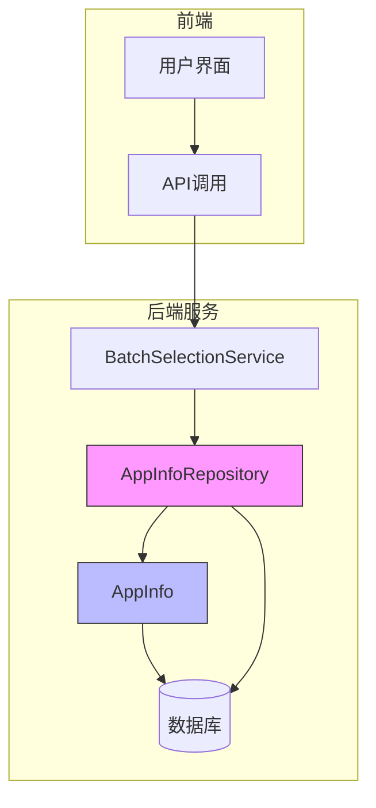
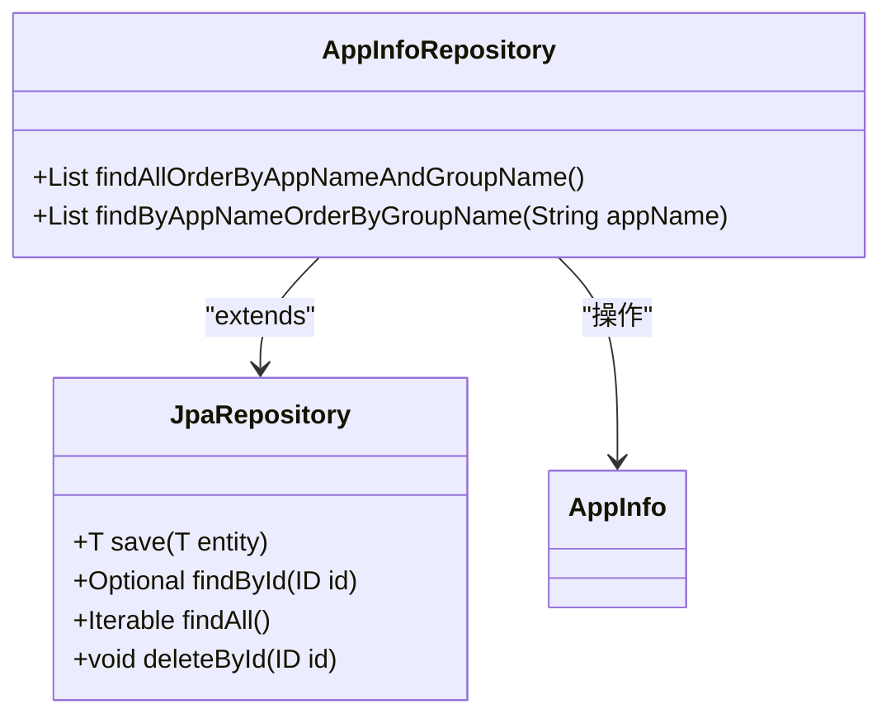
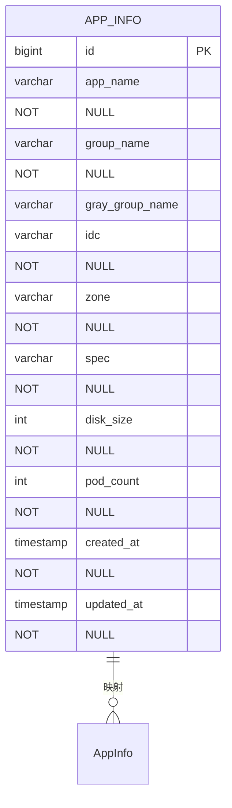
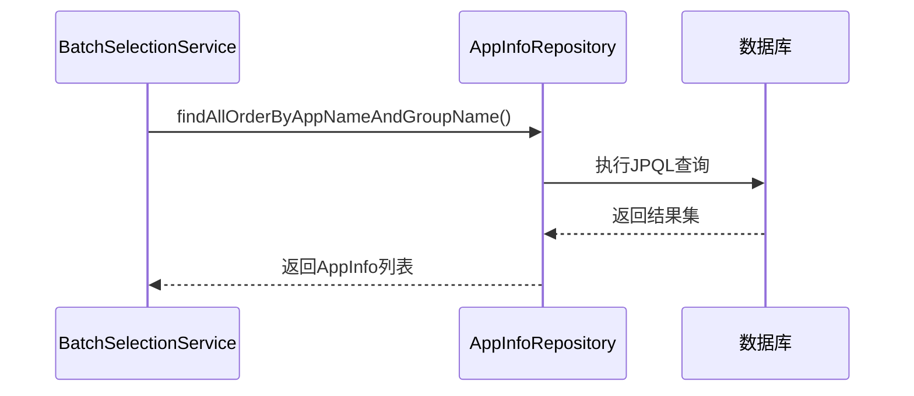
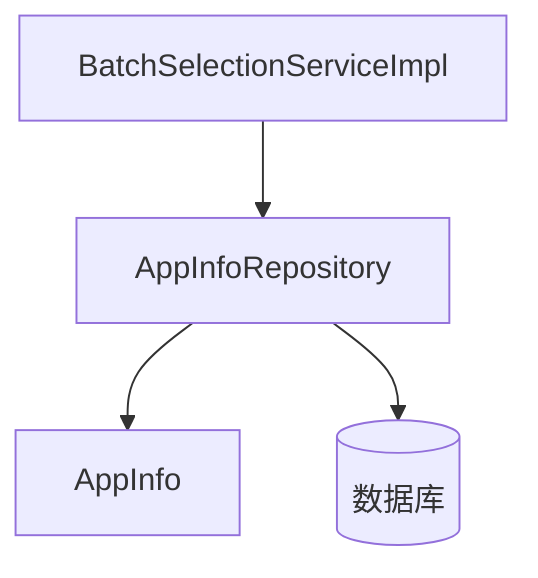

# 数据访问层

<cite>
**Referenced Files in This Document**   
- [AppInfoRepository.java](file://backend/src/main/java/com/example/batchselection/repository/AppInfoRepository.java)
- [AppInfo.java](file://backend/src/main/java/com/example/batchselection/entity/AppInfo.java)
- [schema.sql](file://backend/src/main/resources/schema.sql)
- [BatchSelectionServiceImpl.java](file://backend/src/main/java/com/example/batchselection/service/impl/BatchSelectionServiceImpl.java)
</cite>

## 目录
1. [引言](#引言)
2. [核心组件分析](#核心组件分析)
3. [架构概览](#架构概览)
4. [详细组件分析](#详细组件分析)
5. [依赖分析](#依赖分析)
6. [性能考虑](#性能考虑)
7. [结论](#结论)

## 引言
本文档深入解析基于Spring Data JPA的Repository层设计，重点阐述AppInfoRepository接口如何通过继承JpaRepository获得完整的CRUD能力。文档将详细解释自定义查询方法的实现机制，分析实体类与数据库表的映射关系，并提供数据访问层的性能优化建议，帮助开发者全面理解系统数据持久化的工作原理。

## 核心组件分析
AppInfoRepository作为数据访问层的核心组件，通过继承JpaRepository接口获得了完整的数据访问能力。该接口定义了两个关键的自定义查询方法：findAllOrderByAppNameAndGroupName用于获取所有应用数据并按名称排序，findByAppNameOrderByGroupName则支持根据应用名查询分组信息。这些方法与AppInfo实体类共同构成了数据访问的基础，实现了对象关系映射的核心功能。

**Section sources**
- [AppInfoRepository.java](file://backend/src/main/java/com/example/batchselection/repository/AppInfoRepository.java#L12-L24)
- [AppInfo.java](file://backend/src/main/java/com/example/batchselection/entity/AppInfo.java#L10-L61)

## 架构概览

**Diagram sources **
- [AppInfoRepository.java](file://backend/src/main/java/com/example/batchselection/repository/AppInfoRepository.java)
- [AppInfo.java](file://backend/src/main/java/com/example/batchselection/entity/AppInfo.java)
- [BatchSelectionServiceImpl.java](file://backend/src/main/java/com/example/batchselection/service/impl/BatchSelectionServiceImpl.java)

## 详细组件分析

### Repository层设计分析
AppInfoRepository接口通过继承JpaRepository<AppInfo, Long>获得了完整的CRUD操作能力，包括save、findById、findAll、delete等基本方法。这种设计模式遵循了Spring Data JPA的规范，使得开发者无需编写繁琐的数据访问代码即可实现基本的数据操作功能。

#### 自定义查询方法实现

**Diagram sources **
- [AppInfoRepository.java](file://backend/src/main/java/com/example/batchselection/repository/AppInfoRepository.java#L13-L24)

#### JPQL查询注解分析
findAllOrderByAppNameAndGroupName方法使用@Query注解定义了JPQL查询语句"SELECT a FROM AppInfo a ORDER BY a.appName, a.groupName"。该JPQL语句遵循Java Persistence Query Language规范，通过实体类名而非数据库表名进行查询，实现了面向对象的查询方式。查询结果将按应用名和分组名进行排序，确保数据的有序性。

**Section sources**
- [AppInfoRepository.java](file://backend/src/main/java/com/example/batchselection/repository/AppInfoRepository.java#L18-L19)

### 实体类与数据库映射分析
AppInfo实体类通过JPA注解实现了与数据库表的精确映射。@Entity注解标识该类为JPA实体，@Table注解指定了对应的数据库表名为"app_info"，并定义了名为"idx_app_group"的联合索引。

#### 对象关系映射实现

**Diagram sources **
- [AppInfo.java](file://backend/src/main/java/com/example/batchselection/entity/AppInfo.java#L12-L14)
- [schema.sql](file://backend/src/main/resources/schema.sql#L9-L22)

#### 字段映射规范
实体类中的每个字段都通过@Column注解与数据库表的列进行映射。例如，appName字段映射到数据库的app_name列，idc字段映射到idc列。@Id和@GeneratedValue注解共同定义了主键生成策略，采用数据库自增方式。@PrePersist和@PreUpdate注解确保了createdAt和updatedAt字段的自动更新，实现了数据创建和修改时间的自动管理。

**Section sources**
- [AppInfo.java](file://backend/src/main/java/com/example/batchselection/entity/AppInfo.java#L17-L60)

### Repository注解与异常处理机制
@Repository注解将AppInfoRepository标识为Spring的数据访问组件，使其能够被Spring容器自动扫描和管理。该注解还启用了数据访问异常的自动转换机制，将底层的JDBC异常转换为Spring统一的数据访问异常体系，简化了异常处理逻辑。

#### 数据访问流程分析

**Diagram sources **
- [AppInfoRepository.java](file://backend/src/main/java/com/example/batchselection/repository/AppInfoRepository.java#L18-L19)
- [BatchSelectionServiceImpl.java](file://backend/src/main/java/com/example/batchselection/service/impl/BatchSelectionServiceImpl.java#L39-L39)

## 依赖分析
AppInfoRepository与系统其他组件存在明确的依赖关系。服务层的BatchSelectionServiceImpl通过依赖注入使用AppInfoRepository实例进行数据访问。实体类AppInfo作为数据载体，被Repository层用于数据的持久化和查询操作。

**Diagram sources **
- [AppInfoRepository.java](file://backend/src/main/java/com/example/batchselection/repository/AppInfoRepository.java)
- [BatchSelectionServiceImpl.java](file://backend/src/main/java/com/example/batchselection/service/impl/BatchSelectionServiceImpl.java#L31-L31)

**Section sources**
- [AppInfoRepository.java](file://backend/src/main/java/com/example/batchselection/repository/AppInfoRepository.java)
- [BatchSelectionServiceImpl.java](file://backend/src/main/java/com/example/batchselection/service/impl/BatchSelectionServiceImpl.java)

## 性能考虑
系统在设计时已考虑了性能优化因素。schema.sql中定义的idx_app_group索引（app_name, group_name）能够显著提升按应用名和分组名查询的性能。对于findAllOrderByAppNameAndGroupName方法，该索引也能优化排序操作的效率。

### 性能优化建议
1. **索引优化**：当前的联合索引已针对主要查询场景进行了优化，建议定期监控查询性能，根据实际查询模式调整索引策略。
2. **分页查询扩展**：虽然当前接口未实现分页，但可通过扩展JpaRepository的Pageable支持来实现分页查询，避免一次性加载大量数据。
3. **查询优化**：对于findByAppNameOrderByGroupName方法，由于appName字段已包含在联合索引中，查询性能良好，但在应用数量极大时仍建议考虑缓存策略。

**Section sources**
- [schema.sql](file://backend/src/main/resources/schema.sql#L21-L21)
- [AppInfo.java](file://backend/src/main/java/com/example/batchselection/entity/AppInfo.java#L13-L13)

## 结论
AppInfoRepository的设计充分体现了Spring Data JPA的优势，通过继承JpaRepository接口获得了完整的CRUD能力，同时通过自定义查询方法满足了特定业务需求。实体类与数据库表的精确映射确保了数据的一致性和完整性。系统通过合理的索引设计和面向对象的查询方式，实现了高效的数据访问。建议在后续开发中考虑引入分页查询和缓存机制，以进一步提升系统性能和可扩展性。