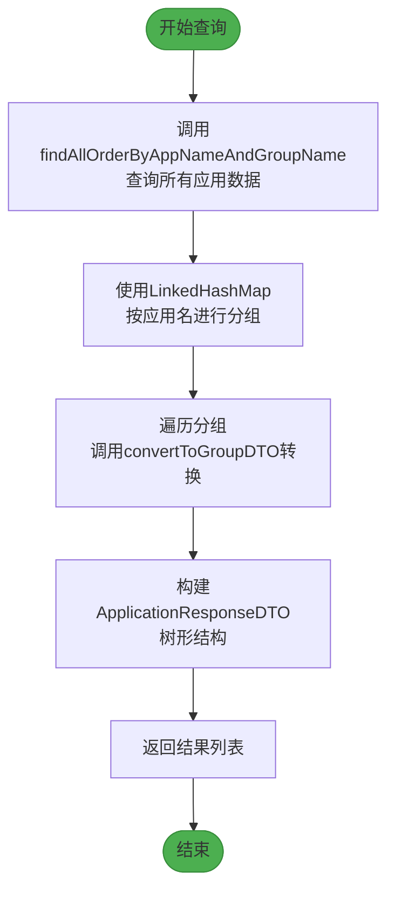
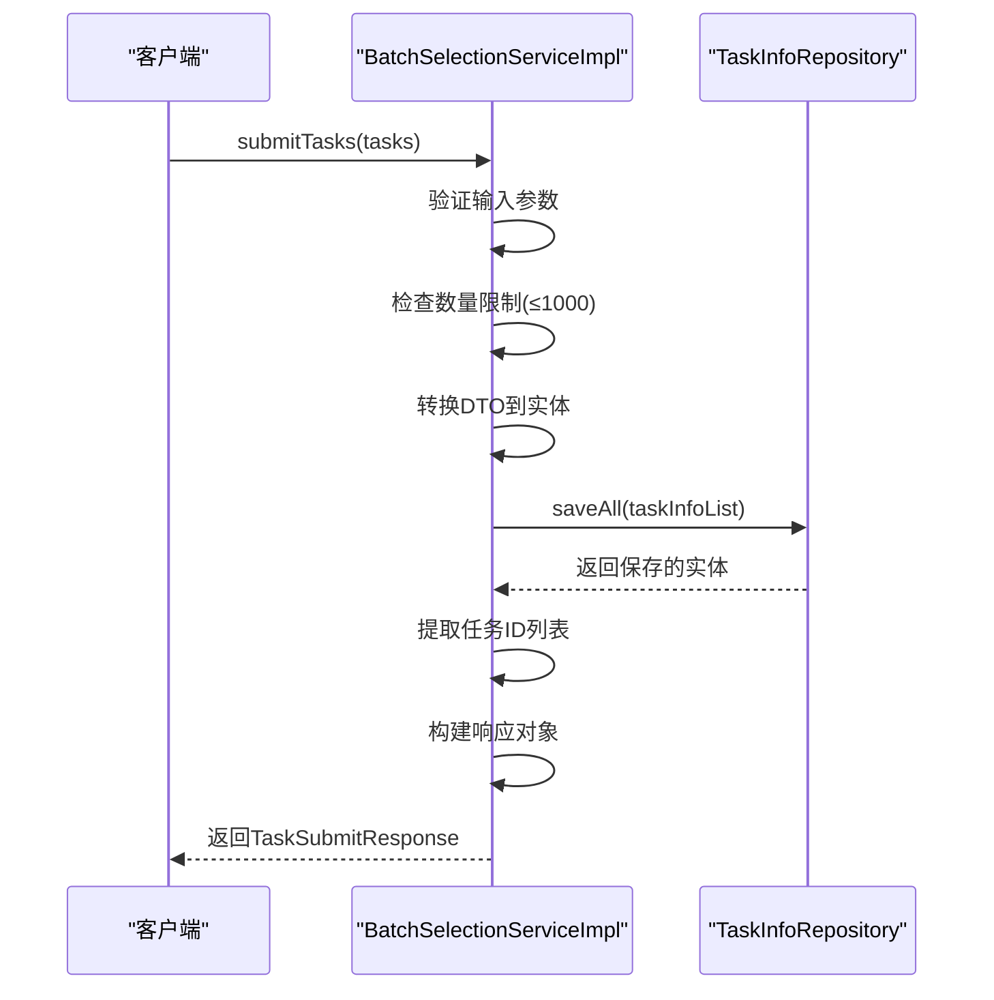
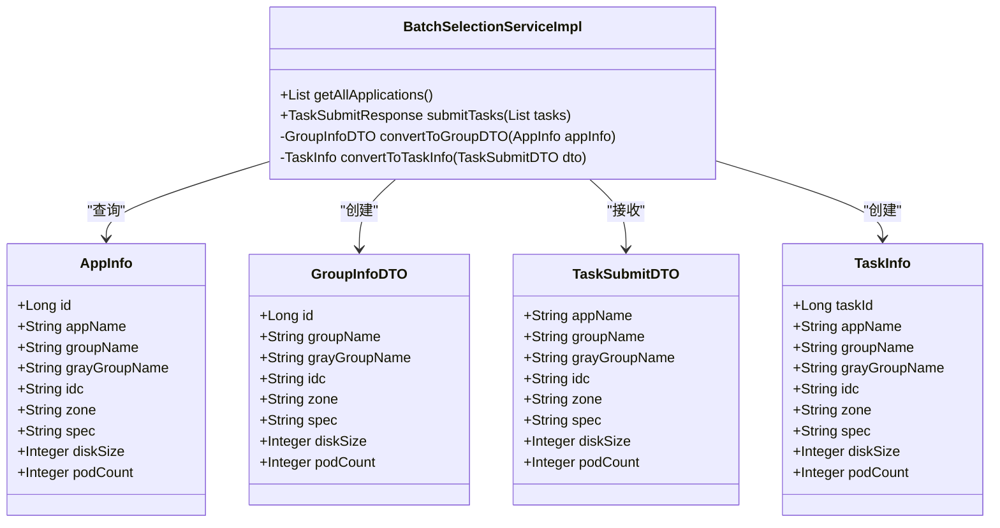

# 服务实现逻辑

<cite>
**Referenced Files in This Document**   
- [BatchSelectionServiceImpl.java](file://backend/src/main/java/com/example/batchselection/service/impl/BatchSelectionServiceImpl.java)
- [AppInfoRepository.java](file://backend/src/main/java/com/example/batchselection/repository/AppInfoRepository.java)
- [TaskInfoRepository.java](file://backend/src/main/java/com/example/batchselection/repository/TaskInfoRepository.java)
- [ApplicationResponseDTO.java](file://backend/src/main/java/com/example/batchselection/dto/ApplicationResponseDTO.java)
- [GroupInfoDTO.java](file://backend/src/main/java/com/example/batchselection/dto/GroupInfoDTO.java)
- [TaskSubmitDTO.java](file://backend/src/main/java/com/example/batchselection/dto/TaskSubmitDTO.java)
- [TaskSubmitResponse.java](file://backend/src/main/java/com/example/batchselection/dto/TaskSubmitResponse.java)
- [AppInfo.java](file://backend/src/main/java/com/example/batchselection/entity/AppInfo.java)
- [TaskInfo.java](file://backend/src/main/java/com/example/batchselection/entity/TaskInfo.java)
- [BatchSelectionService.java](file://backend/src/main/java/com/example/batchselection/service/BatchSelectionService.java)
</cite>

## 目录
1. [依赖注入与构造机制](#依赖注入与构造机制)
2. [应用数据查询流程](#应用数据查询流程)
3. [任务提交处理机制](#任务提交处理机制)
4. [数据转换方法设计](#数据转换方法设计)
5. [日志监控策略](#日志监控策略)
6. [性能优化建议](#性能优化建议)

## 依赖注入与构造机制

`BatchSelectionServiceImpl`类通过`@RequiredArgsConstructor`注解实现了依赖注入的简化配置。该注解由Lombok提供，会自动生成一个包含所有`final`字段的构造函数，Spring框架利用此构造函数完成依赖注入。

类中定义了两个`final`类型的仓库依赖：
- `AppInfoRepository`：用于访问应用信息数据
- `TaskInfoRepository`：用于访问任务信息数据

这种基于构造函数的依赖注入方式确保了服务实例化时所有必需的依赖都已正确初始化，避免了空指针异常的风险，同时使代码更加简洁和可测试。

**Section sources**
- [BatchSelectionServiceImpl.java](file://backend/src/main/java/com/example/batchselection/service/impl/BatchSelectionServiceImpl.java#L28-L32)

## 应用数据查询流程

`getAllApplications`方法实现了从数据库查询应用数据并构建成树形DTO结构的完整流程。

首先，通过`AppInfoRepository`的`findAllOrderByAppNameAndGroupName`方法查询所有应用数据，并按应用名和分组名排序。然后，使用`LinkedHashMap`对查询结果进行分组，保持插入顺序，确保应用列表的有序性。

分组完成后，遍历每个应用分组，将其转换为`ApplicationResponseDTO`对象。每个应用DTO包含应用名称和其下的分组列表，分组信息通过`convertToGroupDTO`私有方法转换而来。

**Diagram sources**
- [BatchSelectionServiceImpl.java](file://backend/src/main/java/com/example/batchselection/service/impl/BatchSelectionServiceImpl.java#L35-L62)
- [AppInfoRepository.java](file://backend/src/main/java/com/example/batchselection/repository/AppInfoRepository.java#L18-L19)

**Section sources**
- [BatchSelectionServiceImpl.java](file://backend/src/main/java/com/example/batchselection/service/impl/BatchSelectionServiceImpl.java#L35-L62)
- [AppInfoRepository.java](file://backend/src/main/java/com/example/batchselection/repository/AppInfoRepository.java#L18-L19)
- [ApplicationResponseDTO.java](file://backend/src/main/java/com/example/batchselection/dto/ApplicationResponseDTO.java)
- [GroupInfoDTO.java](file://backend/src/main/java/com/example/batchselection/dto/GroupInfoDTO.java)

## 任务提交处理机制

`submitTasks`方法通过`@Transactional`注解实现了事务管理，确保任务提交操作的原子性。当方法执行过程中发生异常时，事务将回滚，保证数据一致性。

方法首先进行输入验证，检查任务列表是否为空。然后实施业务规则：单次提交任务数量不能超过1000条，防止系统过载。

核心处理流程包括：
1. 将`TaskSubmitDTO`列表转换为`TaskInfo`实体列表
2. 调用`TaskInfoRepository`的`saveAll`方法批量保存
3. 从保存后的实体中提取生成的任务ID
4. 构建并返回`TaskSubmitResponse`

**Diagram sources**
- [BatchSelectionServiceImpl.java](file://backend/src/main/java/com/example/batchselection/service/impl/BatchSelectionServiceImpl.java#L66-L93)
- [TaskInfoRepository.java](file://backend/src/main/java/com/example/batchselection/repository/TaskInfoRepository.java)

**Section sources**
- [BatchSelectionServiceImpl.java](file://backend/src/main/java/com/example/batchselection/service/impl/BatchSelectionServiceImpl.java#L66-L93)
- [TaskInfoRepository.java](file://backend/src/main/java/com/example/batchselection/repository/TaskInfoRepository.java)
- [TaskSubmitDTO.java](file://backend/src/main/java/com/example/batchselection/dto/TaskSubmitDTO.java)
- [TaskSubmitResponse.java](file://backend/src/main/java/com/example/batchselection/dto/TaskSubmitResponse.java)
- [TaskInfo.java](file://backend/src/main/java/com/example/batchselection/entity/TaskInfo.java)

## 数据转换方法设计

类中定义了两个私有转换方法，体现了单一职责原则和代码复用的设计思想。

`convertToGroupDTO`方法负责将`AppInfo`实体转换为`GroupInfoDTO`，仅包含展示所需的数据字段，隐藏了实体的持久化细节。这种方法封装了转换逻辑，便于维护和测试。

`convertToTaskInfo`方法将`TaskSubmitDTO`转换为`TaskInfo`实体，用于持久化存储。该方法实现了从请求数据到领域模型的映射，确保了数据的一致性和完整性。

**Diagram sources**
- [BatchSelectionServiceImpl.java](file://backend/src/main/java/com/example/batchselection/service/impl/BatchSelectionServiceImpl.java#L98-L125)
- [AppInfo.java](file://backend/src/main/java/com/example/batchselection/entity/AppInfo.java)
- [GroupInfoDTO.java](file://backend/src/main/java/com/example/batchselection/dto/GroupInfoDTO.java)
- [TaskSubmitDTO.java](file://backend/src/main/java/com/example/batchselection/dto/TaskSubmitDTO.java)
- [TaskInfo.java](file://backend/src/main/java/com/example/batchselection/entity/TaskInfo.java)

**Section sources**
- [BatchSelectionServiceImpl.java](file://backend/src/main/java/com/example/batchselection/service/impl/BatchSelectionServiceImpl.java#L98-L125)

## 日志监控策略

服务通过`@Slf4j`注解集成了日志功能，在关键执行节点记录了详细的运行信息。

在`getAllApplications`方法中，记录了查询开始和完成的信息，包括找到的应用数量，便于监控查询性能和结果规模。

在`submitTasks`方法中，记录了提交任务的数量和成功后的任务ID列表，为操作审计和问题排查提供了重要信息。

这些日志记录不仅有助于生产环境的问题诊断，也为性能分析和系统优化提供了数据支持。

**Section sources**
- [BatchSelectionServiceImpl.java](file://backend/src/main/java/com/example/batchselection/service/impl/BatchSelectionServiceImpl.java#L26-L62)

## 性能优化建议

基于当前实现，可考虑以下性能优化策略：

1. **查询结果缓存**：`getAllApplications`方法的查询结果可以缓存，特别是当应用数据不频繁变化时，可显著减少数据库压力。

2. **异步任务提交**：对于大量任务提交场景，可采用异步处理模式，立即返回响应，后台处理保存操作，提高响应速度。

3. **分页查询支持**：当应用数据量较大时，应实现分页查询，避免一次性加载过多数据导致内存溢出。

4. **批量操作优化**：`saveAll`操作可结合`JPA`的批量插入特性进行优化，设置合适的批量大小，提高插入性能。

5. **索引优化**：确保数据库表上有适当的索引，如`app_info`表上的`idx_app_group`索引，可加速查询操作。

这些优化措施可根据实际业务场景和性能需求逐步实施。

**Section sources**
- [BatchSelectionServiceImpl.java](file://backend/src/main/java/com/example/batchselection/service/impl/BatchSelectionServiceImpl.java)
- [AppInfoRepository.java](file://backend/src/main/java/com/example/batchselection/repository/AppInfoRepository.java)
- [TaskInfoRepository.java](file://backend/src/main/java/com/example/batchselection/repository/TaskInfoRepository.java)