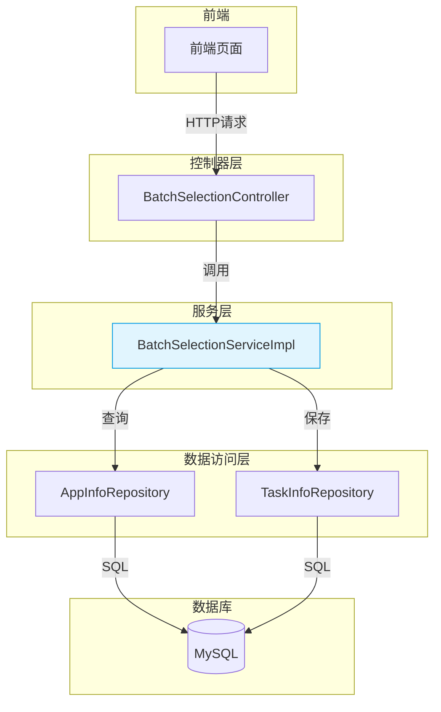

# 服务层

<cite>
**本文档中引用的文件**  
- [BatchSelectionService.java](file://backend/src/main/java/com/example/batchselection/service/BatchSelectionService.java)
- [BatchSelectionServiceImpl.java](file://backend/src/main/java/com/example/batchselection/service/impl/BatchSelectionServiceImpl.java)
- [AppInfoRepository.java](file://backend/src/main/java/com/example/batchselection/repository/AppInfoRepository.java)
- [TaskInfoRepository.java](file://backend/src/main/java/com/example/batchselection/repository/TaskInfoRepository.java)
- [ApplicationResponseDTO.java](file://backend/src/main/java/com/example/batchselection/dto/ApplicationResponseDTO.java)
- [GroupInfoDTO.java](file://backend/src/main/java/com/example/batchselection/dto/GroupInfoDTO.java)
- [TaskSubmitDTO.java](file://backend/src/main/java/com/example/batchselection/dto/TaskSubmitDTO.java)
- [TaskSubmitResponse.java](file://backend/src/main/java/com/example/batchselection/dto/TaskSubmitResponse.java)
- [BatchSelectionController.java](file://backend/src/main/java/com/example/batchselection/controller/BatchSelectionController.java)
</cite>

## 目录
1. [简介](#简介)
2. [接口与实现分离的设计思想](#接口与实现分离的设计思想)
3. [getAllApplications 方法详解](#getallapplications-方法详解)
4. [submitTasks 方法深入分析](#submittasks-方法深入分析)
5. [私有转换方法解析](#私有转换方法解析)
6. [日志记录实践](#日志记录实践)
7. [服务层调用关系图示](#服务层调用关系图示)
8. [异常传播机制说明](#异常传播机制说明)
9. [总结](#总结)

## 简介
本服务层实现了批量勾选功能的核心业务逻辑，包含应用数据查询和任务提交两大核心功能。通过 `BatchSelectionService` 接口定义契约，并由 `BatchSelectionServiceImpl` 实现具体逻辑，遵循了接口与实现分离的设计原则。该服务与控制器层和数据访问层紧密协作，完成从前端请求到数据库持久化的完整流程。

## 接口与实现分离的设计思想
服务层采用接口与实现分离的设计模式，定义了 `BatchSelectionService` 接口并由 `BatchSelectionServiceImpl` 类实现。这种设计具有以下优势：

- **解耦性**：接口定义了服务契约，实现类负责具体逻辑，便于替换或扩展实现。
- **可测试性**：可通过接口进行Mock测试，提升单元测试的灵活性。
- **依赖注入支持**：Spring框架可通过接口类型注入实现类，增强代码的可维护性。

`@Service` 注解用于将 `BatchSelectionServiceImpl` 声明为Spring管理的Bean，使其能够被自动扫描并注入到控制器中。

**Section sources**
- [BatchSelectionService.java](file://backend/src/main/java/com/example/batchselection/service/BatchSelectionService.java#L11-L24)
- [BatchSelectionServiceImpl.java](file://backend/src/main/java/com/example/batchselection/service/impl/BatchSelectionServiceImpl.java#L29-L126)

## getAllApplications 方法详解
该方法用于查询所有应用及其分组信息，并以树形结构返回。

### 执行流程
1. 调用 `AppInfoRepository.findAllOrderByAppNameAndGroupName()` 从数据库获取排序后的应用数据。
2. 使用 `LinkedHashMap` 按 `appName` 对数据进行分组，保持插入顺序。
3. 遍历分组结果，将每个应用下的 `AppInfo` 列表转换为 `GroupInfoDTO` 列表。
4. 构造 `ApplicationResponseDTO` 对象，设置应用名和分组列表，最终形成树形结构响应。

### 数据转换过程
- **实体到DTO映射**：通过 `convertToGroupDTO` 私有方法完成 `AppInfo` 到 `GroupInfoDTO` 的字段映射。
- **结构重组**：原始数据为扁平列表，通过Java流和集合操作重组为“应用→分组”的层级结构。

**Section sources**
- [BatchSelectionServiceImpl.java](file://backend/src/main/java/com/example/batchselection/service/impl/BatchSelectionServiceImpl.java#L35-L62)
- [AppInfoRepository.java](file://backend/src/main/java/com/example/batchselection/repository/AppInfoRepository.java#L18-L19)

## submitTasks 方法深入分析
此方法处理批量任务提交请求，包含完整的业务校验与事务管理机制。

### 核心逻辑步骤
1. **参数校验**：
   - 检查任务列表是否为空。
   - 限制单次提交数量不超过1000条，防止系统过载。
2. **事务管理**：
   - 使用 `@Transactional(rollbackFor = Exception.class)` 注解确保操作的原子性。
   - 若保存过程中发生异常，自动回滚已插入的数据。
3. **数据转换与持久化**：
   - 将 `TaskSubmitDTO` 列表转换为 `TaskInfo` 实体列表。
   - 调用 `TaskInfoRepository.saveAll()` 批量保存至数据库。
4. **结果封装**：
   - 提取生成的 `taskId` 列表，构造 `TaskSubmitResponse` 返回。

### 批量保存机制
利用Spring Data JPA的 `saveAll()` 方法实现高效批量插入，底层通常会优化为批处理SQL语句，显著提升性能。

**Section sources**
- [BatchSelectionServiceImpl.java](file://backend/src/main/java/com/example/batchselection/service/impl/BatchSelectionServiceImpl.java#L66-L93)
- [TaskInfoRepository.java](file://backend/src/main/java/com/example/batchselection/repository/TaskInfoRepository.java#L11)

## 私有转换方法解析
服务类中定义了两个私有转换方法，用于在不同数据结构间进行映射。

### convertToGroupDTO
将 `AppInfo` 实体转换为 `GroupInfoDTO`，用于构建响应数据中的分组信息。该方法仅复制必要字段，隐藏实体中的元数据（如创建时间）。

### convertToTaskInfo
将 `TaskSubmitDTO` 请求对象转换为 `TaskInfo` 持久化实体。此方法确保前端提交的数据能正确映射到数据库表结构。

这两个方法体现了关注点分离原则，将数据转换逻辑封装在服务层内部，避免在业务流程中混杂映射代码。

**Section sources**
- [BatchSelectionServiceImpl.java](file://backend/src/main/java/com/example/batchselection/service/impl/BatchSelectionServiceImpl.java#L99-L126)

## 日志记录实践
服务层广泛使用 `@Slf4j` 注解（Lombok提供）进行日志输出，遵循以下最佳实践：

- **操作开始记录**：如“开始查询所有应用数据”，便于追踪请求入口。
- **关键参数输出**：如“任务数量: {}”，帮助定位问题上下文。
- **结果统计信息**：如“共找到 {} 个应用”，提供执行结果概览。
- **成功提示**：明确标识操作成功及生成的关键信息（如任务ID）。

这些日志信息对于系统监控、故障排查和性能分析具有重要意义。

**Section sources**
- [BatchSelectionServiceImpl.java](file://backend/src/main/java/com/example/batchselection/service/impl/BatchSelectionServiceImpl.java#L26)

## 服务层调用关系图示

**Diagram sources**
- [BatchSelectionController.java](file://backend/src/main/java/com/example/batchselection/controller/BatchSelectionController.java#L27)
- [BatchSelectionServiceImpl.java](file://backend/src/main/java/com/example/batchselection/service/impl/BatchSelectionServiceImpl.java#L31-L32)
- [AppInfoRepository.java](file://backend/src/main/java/com/example/batchselection/repository/AppInfoRepository.java)
- [TaskInfoRepository.java](file://backend/src/main/java/com/example/batchselection/repository/TaskInfoRepository.java)

## 异常传播机制说明
服务层的异常处理遵循分层传播原则：

- **非法参数异常**：在 `submitTasks` 中主动抛出 `IllegalArgumentException`，由控制器捕获并返回400错误。
- **运行时异常**：其他未预期异常由控制器统一捕获，记录错误日志并返回500错误。
- **事务回滚**：`@Transactional` 注解确保任何异常都会触发数据回滚，保障数据一致性。

控制器层通过多个 `catch` 块实现精细化异常处理，既保证系统稳定性，又向客户端提供有意义的错误信息。

**Section sources**
- [BatchSelectionController.java](file://backend/src/main/java/com/example/batchselection/controller/BatchSelectionController.java#L55-L60)

## 总结
`BatchSelectionService` 及其实现类构成了系统的核心业务处理单元，具备良好的设计结构和健壮的执行逻辑。通过接口抽象、事务控制、数据转换和日志记录等手段，实现了高内聚、低耦合的服务模块。其与控制器和仓库层的清晰协作，为系统的可维护性和可扩展性奠定了坚实基础。