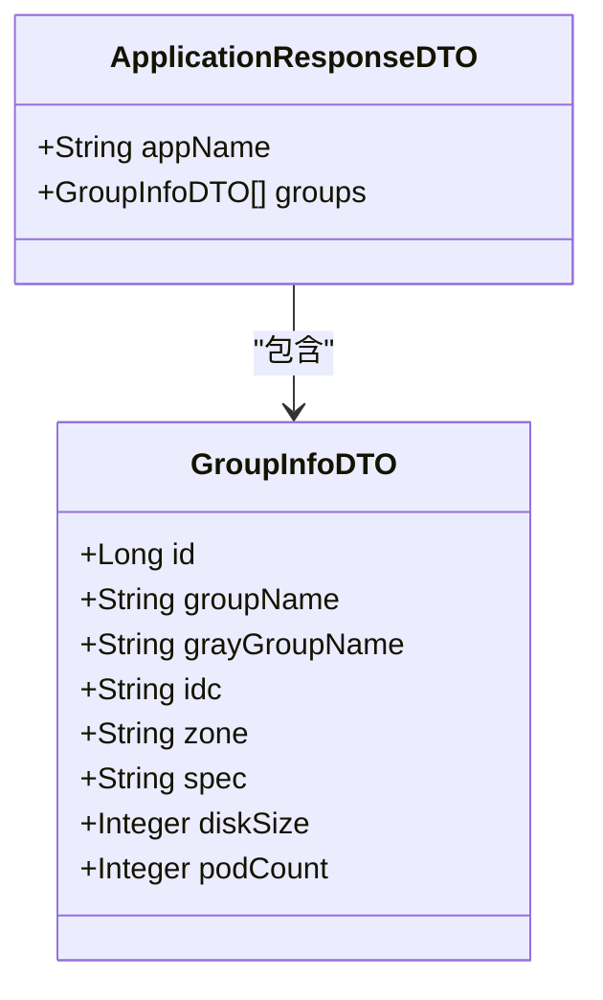
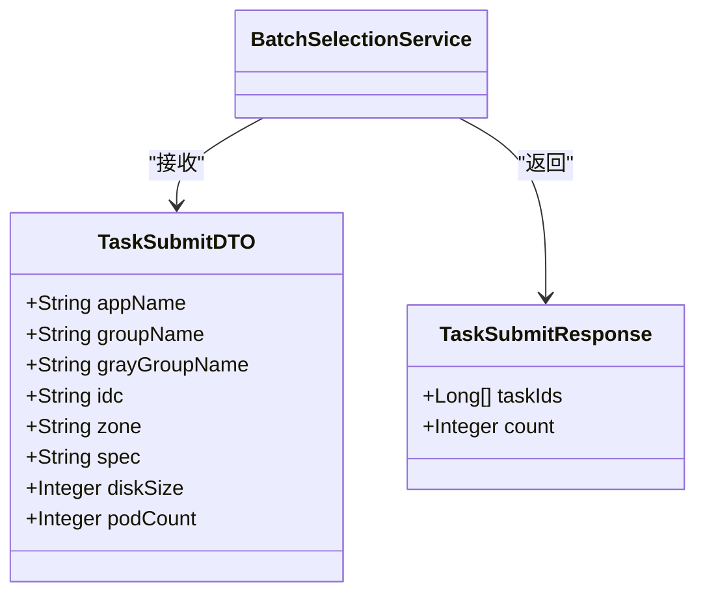
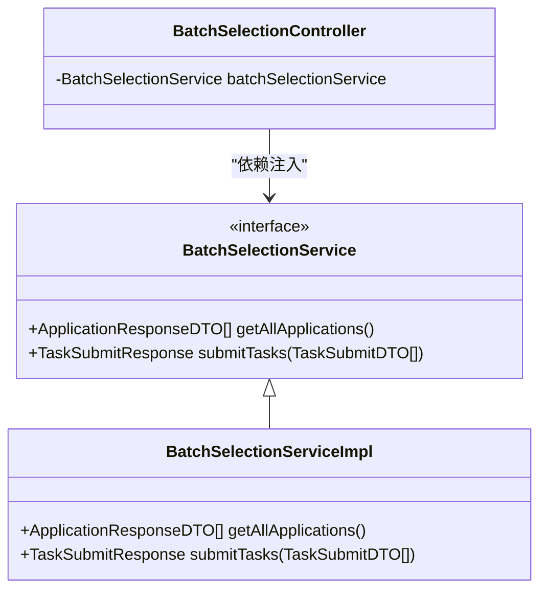
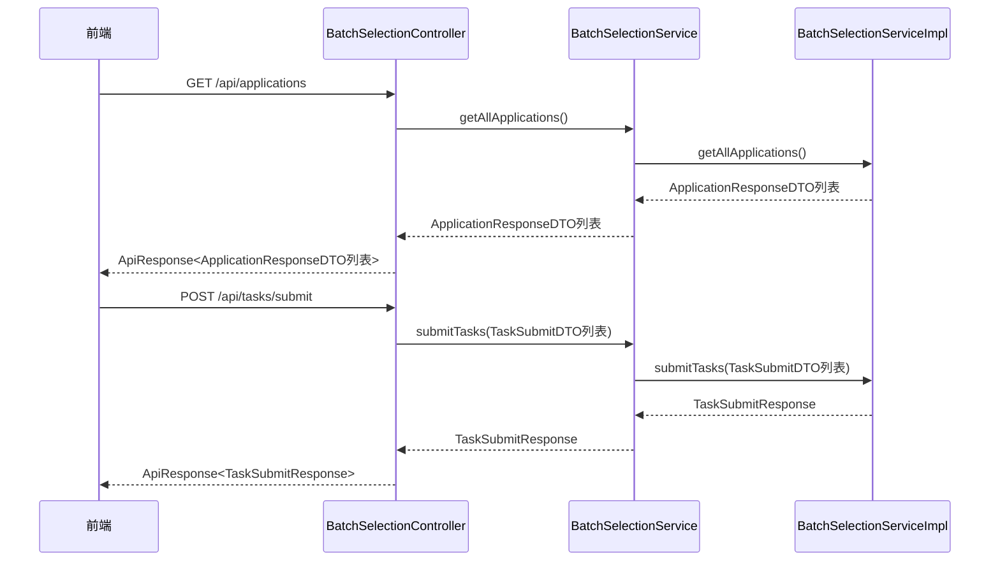

# 服务接口定义

<cite>
**本文档引用文件**  
- [BatchSelectionService.java](file://backend/src/main/java/com/example/batchselection/service/BatchSelectionService.java)
- [ApplicationResponseDTO.java](file://backend/src/main/java/com/example/batchselection/dto/ApplicationResponseDTO.java)
- [TaskSubmitDTO.java](file://backend/src/main/java/com/example/batchselection/dto/TaskSubmitDTO.java)
- [TaskSubmitResponse.java](file://backend/src/main/java/com/example/batchselection/dto/TaskSubmitResponse.java)
- [BatchSelectionServiceImpl.java](file://backend/src/main/java/com/example/batchselection/service/impl/BatchSelectionServiceImpl.java)
- [BatchSelectionController.java](file://backend/src/main/java/com/example/batchselection/controller/BatchSelectionController.java)
</cite>

## 目录
1. [接口设计与职责概述](#接口设计与职责概述)
2. [getAllApplications方法详解](#getallapplications方法详解)
3. [submitTasks方法深入分析](#submittasks方法深入分析)
4. [接口与实现分离的优势](#接口与实现分离的优势)
5. [控制器层注入使用示例](#控制器层注入使用示例)
6. [常见实现错误排查指南](#常见实现错误排查指南)

## 接口设计与职责概述

`BatchSelectionService` 接口作为批量勾选功能的核心业务逻辑抽象层，定义了系统中两个关键业务操作的契约：获取所有应用数据和批量提交任务。该接口通过清晰的方法签名和数据传输对象（DTO）设计，实现了前后端之间的解耦，确保了业务逻辑的可维护性和可扩展性。

作为服务层接口，它不仅明确了功能边界，还通过方法命名和参数设计传达了业务语义，使开发者能够快速理解其用途。接口的设计遵循了单一职责原则，专注于批量选择场景下的数据查询与任务提交，避免了功能的过度集中。

**Section sources**
- [BatchSelectionService.java](file://backend/src/main/java/com/example/batchselection/service/BatchSelectionService.java#L11-L24)

## getAllApplications方法详解

`getAllApplications` 方法定义了查询所有应用及其分组信息的契约，返回类型为 `List<ApplicationResponseDTO>`。该方法的设计意图是为前端提供一个结构化的应用树形视图，便于展示和选择。

`ApplicationResponseDTO` 类采用树形结构设计，包含 `appName`（应用名称）和 `groups`（分组列表）两个核心字段。其中 `groups` 字段为 `GroupInfoDTO` 对象的列表，实现了应用与分组之间的层级关系表达。这种设计使得前端可以轻松构建树形控件或级联选择器，无需额外的数据处理。

该方法在实现中通过 `AppInfoRepository` 查询数据库，并按应用名称进行分组，最终将实体对象转换为响应DTO，确保了数据访问层与表现层的分离。

**Diagram sources**
- [ApplicationResponseDTO.java](file://backend/src/main/java/com/example/batchselection/dto/ApplicationResponseDTO.java#L9-L13)

**Section sources**
- [BatchSelectionService.java](file://backend/src/main/java/com/example/batchselection/service/BatchSelectionService.java#L17)
- [ApplicationResponseDTO.java](file://backend/src/main/java/com/example/batchselection/dto/ApplicationResponseDTO.java#L9-L13)
- [BatchSelectionServiceImpl.java](file://backend/src/main/java/com/example/batchselection/service/impl/BatchSelectionServiceImpl.java#L35-L62)

## submitTasks方法深入分析

`submitTasks` 方法负责处理批量任务提交的业务逻辑，其参数为 `List<TaskSubmitDTO>`，表示待提交的任务列表，返回值为 `TaskSubmitResponse`，包含生成的任务ID列表和提交数量。

`TaskSubmitDTO` 类作为任务提交请求的数据载体，包含了应用名称、分组名称、机房、分区、参数规格、硬盘大小和Pod数量等必要字段。每个字段均配有JSR-303验证注解（如 `@NotBlank`、`@NotNull`、`@Positive`），确保了输入数据的合法性，防止无效数据进入业务处理流程。

`TaskSubmitResponse` 类设计简洁，包含 `taskIds`（任务ID列表）和 `count`（提交数量）两个字段，为前端提供了明确的提交结果反馈。该设计便于前端展示成功提交的任务数量和具体ID，支持后续的查询和跟踪操作。

**Diagram sources**
- [TaskSubmitDTO.java](file://backend/src/main/java/com/example/batchselection/dto/TaskSubmitDTO.java#L12-L38)
- [TaskSubmitResponse.java](file://backend/src/main/java/com/example/batchselection/dto/TaskSubmitResponse.java#L14-L17)

**Section sources**
- [BatchSelectionService.java](file://backend/src/main/java/com/example/batchselection/service/BatchSelectionService.java#L24)
- [TaskSubmitDTO.java](file://backend/src/main/java/com/example/batchselection/dto/TaskSubmitDTO.java#L12-L38)
- [TaskSubmitResponse.java](file://backend/src/main/java/com/example/batchselection/dto/TaskSubmitResponse.java#L14-L17)
- [BatchSelectionServiceImpl.java](file://backend/src/main/java/com/example/batchselection/service/impl/BatchSelectionServiceImpl.java#L67-L93)

## 接口与实现分离的优势

通过 `@Service` 注解机制，`BatchSelectionServiceImpl` 实现了 `BatchSelectionService` 接口，体现了Spring框架中接口与实现分离的设计理念。这种设计带来了显著的可维护性与可测试性优势。

在可维护性方面，接口定义了稳定的契约，即使实现类发生重构或优化，只要接口不变，调用方（如控制器）无需修改代码。这降低了系统各模块间的耦合度，支持独立演进。

在可测试性方面，接口的使用使得单元测试和集成测试更加便捷。可以通过Mock框架（如Mockito）轻松模拟 `BatchSelectionService` 的行为，验证控制器逻辑的正确性，而无需依赖真实的数据库或外部服务。同时，实现类中的业务逻辑也可以独立测试，确保核心功能的可靠性。

**Diagram sources**
- [BatchSelectionService.java](file://backend/src/main/java/com/example/batchselection/service/BatchSelectionService.java#L11-L24)
- [BatchSelectionServiceImpl.java](file://backend/src/main/java/com/example/batchselection/service/impl/BatchSelectionServiceImpl.java#L29)
- [BatchSelectionController.java](file://backend/src/main/java/com/example/batchselection/controller/BatchSelectionController.java#L27)

**Section sources**
- [BatchSelectionService.java](file://backend/src/main/java/com/example/batchselection/service/BatchSelectionService.java#L11-L24)
- [BatchSelectionServiceImpl.java](file://backend/src/main/java/com/example/batchselection/service/impl/BatchSelectionServiceImpl.java#L27-L29)
- [BatchSelectionController.java](file://backend/src/main/java/com/example/batchselection/controller/BatchSelectionController.java#L27)

## 控制器层注入使用示例

在 `BatchSelectionController` 中，`BatchSelectionService` 通过构造函数注入的方式被使用，体现了依赖注入（DI）的最佳实践。控制器通过调用服务接口的方法来处理HTTP请求，实现了请求处理与业务逻辑的完全解耦。

例如，`getApplications` 方法处理GET请求，调用 `getAllApplications` 获取应用数据，并封装为统一的API响应格式返回给前端。同样，`submitTasks` 方法处理POST请求，接收 `BatchTaskSubmitRequest` 对象，提取其中的任务列表并调用 `submitTasks` 方法，最终返回提交结果。

这种设计使得控制器代码简洁明了，仅负责请求映射、参数验证和响应封装，而复杂的业务逻辑则完全交由服务层处理，符合关注点分离原则。

**Diagram sources**
- [BatchSelectionController.java](file://backend/src/main/java/com/example/batchselection/controller/BatchSelectionController.java#L27)
- [BatchSelectionService.java](file://backend/src/main/java/com/example/batchselection/service/BatchSelectionService.java#L17-L24)
- [BatchSelectionServiceImpl.java](file://backend/src/main/java/com/example/batchselection/service/impl/BatchSelectionServiceImpl.java#L35-L93)

**Section sources**
- [BatchSelectionController.java](file://backend/src/main/java/com/example/batchselection/controller/BatchSelectionController.java#L27-L63)

## 常见实现错误排查指南

在实现 `BatchSelectionService` 接口时，常见的错误包括方法签名不匹配和异常处理不当。

**方法签名不匹配**：确保实现类中的方法签名（返回类型、方法名、参数列表）与接口完全一致。例如，`submitTasks` 方法必须接收 `List<TaskSubmitDTO>` 参数并返回 `TaskSubmitResponse` 对象。任何偏差都会导致编译错误或运行时异常。

**异常处理不当**：在 `submitTasks` 方法中，已对空任务列表和超量提交（>1000条）进行了校验并抛出 `IllegalArgumentException`。在控制器中，应通过特定的异常处理器捕获此类业务异常，并返回400状态码及友好提示。若未正确处理，可能导致500内部服务器错误，影响用户体验。

**事务管理缺失**：`submitTasks` 方法使用了 `@Transactional` 注解，确保批量保存操作的原子性。若遗漏此注解，当部分任务保存失败时，已保存的数据可能无法回滚，导致数据不一致。

**DTO转换错误**：在 `convertToTaskInfo` 方法中，需确保 `TaskSubmitDTO` 的所有字段正确映射到 `TaskInfo` 实体。字段遗漏或类型不匹配可能导致数据丢失或持久化失败。

**Section sources**
- [BatchSelectionServiceImpl.java](file://backend/src/main/java/com/example/batchselection/service/impl/BatchSelectionServiceImpl.java#L67-L93)
- [BatchSelectionController.java](file://backend/src/main/java/com/example/batchselection/controller/BatchSelectionController.java#L55-L60)