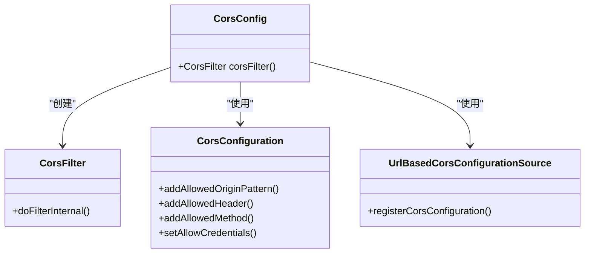
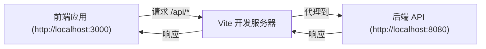
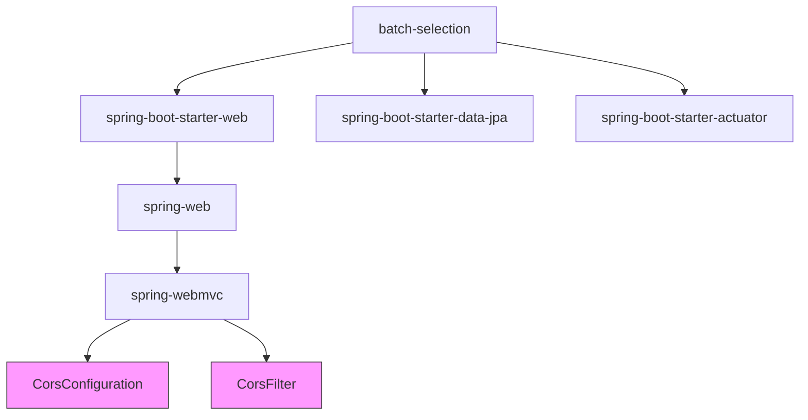
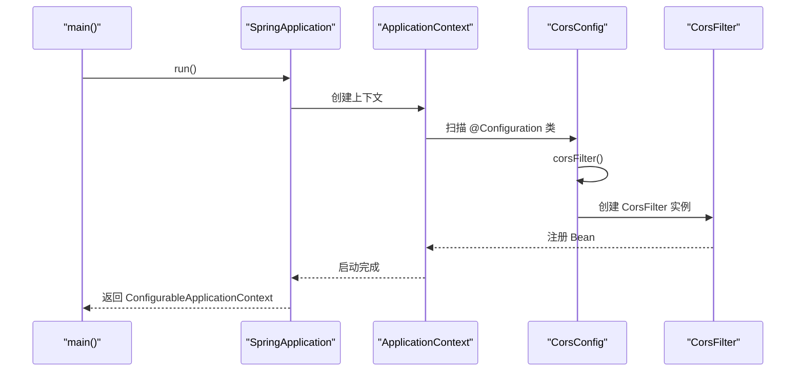

# CORS 配置

<cite>
**Referenced Files in This Document**   
- [CorsConfig.java](file://backend/src/main/java/com/example/batchselection/config/CorsConfig.java)
- [application.properties](file://backend/src/main/resources/application.properties)
- [vite.config.js](file://frontend/vite.config.js)
- [pom.xml](file://backend/pom.xml)
- [BatchSelectionApplication.java](file://backend/src/main/java/com/example/batchselection/BatchSelectionApplication.java)
</cite>

## 目录
1. [CORS 配置概述](#cors-配置概述)
2. [后端 CORS 配置](#后端-cors-配置)
3. [前端开发服务器配置](#前端开发服务器配置)
4. [项目依赖分析](#项目依赖分析)
5. [应用启动类分析](#应用启动类分析)
6. [配置总结](#配置总结)

## CORS 配置概述

本文档详细分析了批量勾选信息管理系统中的跨域资源共享（CORS）配置。系统采用前后端分离架构，前端运行在 Vite 开发服务器上（端口 3000），后端为 Spring Boot 应用（端口 8080），因此需要适当的 CORS 配置来确保前后端能够正常通信。

## 后端 CORS 配置

系统通过专门的 `CorsConfig` 类进行 CORS 配置，该配置类提供了全面的跨域支持，确保前端应用能够顺利访问后端 API。

**Diagram sources**
- [CorsConfig.java](file://backend/src/main/java/com/example/batchselection/config/CorsConfig.java#L12-L35)

**Section sources**
- [CorsConfig.java](file://backend/src/main/java/com/example/batchselection/config/CorsConfig.java#L1-L37)

### CORS 配置详情

后端 CORS 配置具有以下特点：

- **允许所有来源**：使用 `addAllowedOriginPattern("*")` 允许来自任何源的请求，包括 `file://` 协议
- **允许所有请求头**：通过 `addAllowedHeader("*")` 支持所有请求头
- **允许所有请求方法**：`addAllowedMethod("*")` 支持 GET、POST、PUT、DELETE 等所有 HTTP 方法
- **支持凭证传输**：`setAllowCredentials(true)` 允许携带 Cookie 和认证信息
- **全局应用**：配置通过 `/**` 路径模式应用于所有端点

该配置通过 Spring 的 `@Configuration` 注解注册为配置类，并通过 `@Bean` 注解将 `CorsFilter` 注册到 Spring 容器中，从而在整个应用生命周期内生效。

## 前端开发服务器配置

前端项目使用 Vite 作为开发服务器，通过代理配置来处理跨域问题，这与后端的 CORS 配置相辅相成。

**Diagram sources**
- [vite.config.js](file://frontend/vite.config.js#L4-L15)

**Section sources**
- [vite.config.js](file://frontend/vite.config.js#L1-L16)

### 代理配置说明

前端的 `vite.config.js` 文件中配置了代理规则：

- **开发服务器端口**：3000
- **代理规则**：所有以 `/api` 开头的请求都被代理到 `http://localhost:8080`
- **跨域处理**：`changeOrigin: true` 确保请求的 origin 被正确修改

这种配置在开发环境中有效避免了浏览器的同源策略限制，同时保持了生产环境部署的灵活性。

## 项目依赖分析

CORS 功能的实现依赖于 Spring Boot 的相关模块，这些依赖在 `pom.xml` 文件中明确声明。

**Diagram sources**
- [pom.xml](file://backend/pom.xml#L30-L40)

**Section sources**
- [pom.xml](file://backend/pom.xml#L1-L99)

### 关键依赖说明

- **spring-boot-starter-web**：提供 Web MVC 功能，包含 Spring Web 和 Spring Web MVC 模块，其中包含了 CORS 相关的核心类
- **spring-boot-starter-data-jpa**：提供数据访问功能，虽然不直接涉及 CORS，但作为完整应用的一部分
- **spring-boot-starter-actuator**：提供应用监控功能，其端点也受 CORS 配置的影响

## 应用启动类分析

CORS 配置的生效依赖于 Spring Boot 的自动配置机制和应用的正确启动。

**Diagram sources**
- [BatchSelectionApplication.java](file://backend/src/main/java/com/example/batchselection/BatchSelectionApplication.java#L9-L14)

**Section sources**
- [BatchSelectionApplication.java](file://backend/src/main/java/com/example/batchselection/BatchSelectionApplication.java#L1-L16)

### 启动流程

1. **应用启动**：`BatchSelectionApplication` 类的 `main` 方法启动 Spring Boot 应用
2. **组件扫描**：Spring Boot 自动扫描带有 `@Configuration` 注解的类
3. **Bean 创建**：`CorsConfig` 类中的 `corsFilter()` 方法被调用，创建 `CorsFilter` Bean
4. **注册到容器**：创建的 `CorsFilter` 实例被注册到 Spring 应用上下文中
5. **过滤器链**：`CorsFilter` 被加入到 Spring Security 的过滤器链中，开始处理跨域请求

## 配置总结

本系统的 CORS 配置采用了前后端协同的方式，确保开发和生产环境都能正常工作。

### 配置特点对比

| 配置方面 | 后端配置 | 前端配置 |
|--------|---------|---------|
| **配置文件** | CorsConfig.java | vite.config.js |
| **主要功能** | 允许跨域请求 | 代理 API 请求 |
| **作用环境** | 生产和开发环境 | 仅开发环境 |
| **安全级别** | 较低（允许所有源） | 较高（通过代理） |
| **实现方式** | Spring Web MVC CORS | Vite 代理 |

### 最佳实践建议

1. **生产环境安全**：在生产环境中，建议将 `addAllowedOriginPattern("*")` 修改为具体的前端域名，提高安全性
2. **凭证安全**：当 `setAllowCredentials(true)` 时，`addAllowedOriginPattern` 不能使用通配符 `*`，需要指定具体域名
3. **性能考虑**：CORS 预检请求会增加额外的网络开销，合理设置 `maxAge` 可以缓存预检结果
4. **监控**：利用 Actuator 的监控功能，可以观察 CORS 相关的请求处理情况

当前配置适合开发环境快速迭代，在部署到生产环境时应根据实际安全需求进行调整。